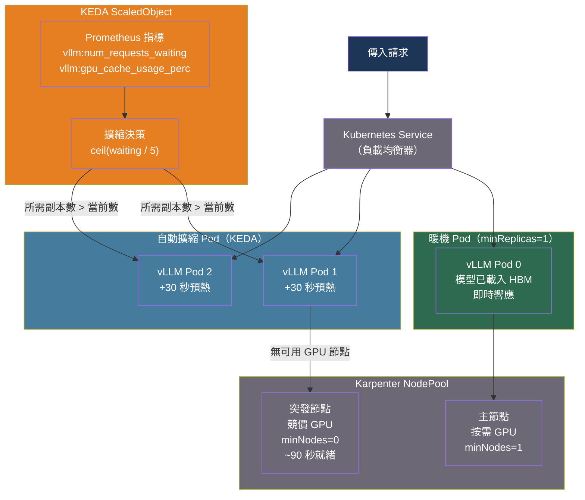

# [BEE-570] LLM 服務的自動擴縮與 GPU 叢集管理

:::info
LLM 服務的 GPU 自動擴縮與 CPU 自動擴縮有根本性差異：GPU 節點的預置需要數分鐘而非數秒，模型載入又額外增加 1–10 分鐘的冷啟動延遲，而閒置 GPU 的成本是閒置 CPU 的 3–10 倍。有效的 GPU 叢集管理需要專為此場景打造的工具棧——用 GPU Operator 管理運行時配置、Karpenter 快速預置節點、KEDA 根據佇列深度擴縮，並配合暖池策略使縮容至零在經濟上可行。
:::

## 背景

標準的 Kubernetes 自動擴縮是為無狀態 CPU 工作負載設計的——容器啟動僅需數秒。LLM 推論打破了這一切假設：GPU 節點可能需要 2–8 分鐘才能就緒（節點啟動 + CUDA 驅動初始化）；70B 參數模型的權重需要 140 GB 儲存空間，從物件儲存載入需要 1–10 分鐘；GPU 本身每小時費用高達 1–10 美元以上，而 CPU 核心僅 0.10–1 美元。

這造成了 CPU 服務中不存在的矛盾。縮容至零消除了閒置 GPU 成本，但帶來了違反任何實時 SLO 的冷啟動延遲；過度配置確保了低延遲，但會在閒置容量上燒掉 GPU 預算。工程挑戰在於系統性地管理這種取捨，而非依賴靜態配置。

三個 Kubernetes 生態系統工具分別解決了問題的不同層面：

- **NVIDIA GPU Operator** 自動化了 GPU 驅動安裝、容器運行時、設備插件注冊和 MIG 分區，消除了此前阻礙 GPU Kubernetes 普及的逐節點手動配置。
- **Karpenter** 通過直接調用雲端供應商 API 在數秒內預置 GPU 雲端實例，而舊版 Cluster Autoscaler 通過 Auto Scaling Group 運作需要數分鐘。
- **KEDA（Kubernetes 事件驅動自動擴縮）** 根據應用層指標——佇列深度、等待請求數、KV 快取壓力——而非對 LLM 服務負載預測能力較弱的 CPU/記憶體閾值來擴縮 Pod 副本數。

## GPU 叢集配置

### NVIDIA GPU Operator

GPU Operator 管理在 Kubernetes 上運行 GPU 工作負載所需的完整軟體棧。若沒有它，每個節點都必須手動安裝並同步 CUDA 驅動、NVIDIA Container Toolkit 和 Kubernetes 設備插件。Operator 以 Kubernetes DaemonSet 形式安裝和管理所有這些組件：

```bash
# 通過 Helm 安裝 GPU Operator
helm repo add nvidia https://helm.ngc.nvidia.com/nvidia
helm repo update
helm install --wait --generate-name \
  -n gpu-operator --create-namespace \
  nvidia/gpu-operator
```

安裝後，叢集中每個支持 GPU 的節點都會自動將 `nvidia.com/gpu` 作為可調度資源暴露出來。Operator 還會部署 DCGM（資料中心 GPU 管理器）導出器，向 Prometheus 發布每個 GPU 的指標（SM 利用率、記憶體頻寬、溫度）。

### MIG 和 GPU 時間切片（小型模型）

在服務多個小型模型（7B–13B 參數）時，單張 A100 或 H100 可以通過**多實例 GPU（MIG）** 分區技術托管多個工作負載。MIG 將一個 GPU 最多分割為 7 個硬體隔離的實例，每個實例擁有專屬的計算切片、L2 快取和 HBM 頻寬分配。隔離由硬體強制執行——一個工作負載的 OOM 或 CUDA 錯誤不會影響其他實例。

```yaml
# 通過 ConfigMap 配置 GPU Operator MIG
apiVersion: v1
kind: ConfigMap
metadata:
  name: mig-parted-config
  namespace: gpu-operator
data:
  config.yaml: |
    version: v1
    mig-configs:
      # H100 80GB 上的 7 個等分 1g.10gb 實例（每個約 10GB HBM）
      all-1g.10gb:
        - devices: all
          mig-enabled: true
          mig-devices:
            "1g.10gb": 7
      # 2 大 + 4 小（異構配置）
      mixed-2g.20gb:
        - devices: all
          mig-enabled: true
          mig-devices:
            "2g.20gb": 2
            "1g.10gb": 4
```

**MIG vs 時間切片**：MIG 以要求 A100/H100 硬體和靜態分區為代價，提供有保障的記憶體和計算隔離。時間切片通過上下文切換在多個工作負載間共享一個 GPU，適用於所有 NVIDIA GPU，但不提供記憶體隔離——單一 OOM 會殺死所有租戶。

| | MIG | 時間切片 |
|---|---|---|
| 硬體要求 | 僅 A100/H100 | 任何 NVIDIA GPU |
| 記憶體隔離 | 硬體強制 | 無 |
| 延遲可預測性 | 有保障 | 不穩定 |
| 分區變更 | 需要節點驅逐 | 動態可調 |
| 適用場景 | 生產、有 SLO 約束 | 開發/測試、成本敏感 |

## 使用 Karpenter 進行節點自動擴縮

Karpenter 監視不可調度的 Pod，直接調用雲端供應商 API 來預置實例，繞過了使舊版 Cluster Autoscaler 緩慢的 Auto Scaling Group 層。GPU 實例的節點預置延遲從 3–5 分鐘降至 30–90 秒。

```yaml
# GPU 工作負載的 NodePool
apiVersion: karpenter.sh/v1
kind: NodePool
metadata:
  name: gpu-pool
spec:
  template:
    metadata:
      labels:
        workload-type: llm-inference
    spec:
      nodeClassRef:
        apiVersion: karpenter.k8s.aws/v1
        kind: EC2NodeClass
        name: gpu-nodeclass
      requirements:
        - key: karpenter.k8s.aws/instance-gpu-count
          operator: Gt
          values: ["0"]
        - key: karpenter.k8s.aws/instance-family
          operator: In
          values: [p4d, p4de, p5]    # A100 和 H100 系列
        - key: karpenter.sh/capacity-type
          operator: In
          values: [on-demand]        # 突發池使用 spot
  limits:
    nvidia.com/gpu: 64               # 叢集範圍 GPU 上限
  disruption:
    consolidationPolicy: WhenEmptyOrUnderutilized
    consolidateAfter: 5m             # 閒置 5 分鐘後回收 GPU 節點
---
apiVersion: karpenter.k8s.aws/v1
kind: EC2NodeClass
metadata:
  name: gpu-nodeclass
spec:
  amiFamily: AL2
  role: KarpenterNodeRole
  subnetSelectorTerms:
    - tags:
        karpenter.sh/discovery: my-cluster
  securityGroupSelectorTerms:
    - tags:
        karpenter.sh/discovery: my-cluster
  blockDeviceMappings:
    - deviceName: /dev/xvda
      ebs:
        volumeSize: 500Gi            # 大根磁碟區用於模型快取
        volumeType: gp3
        iops: 16000
```

**雙池拓撲**用於平衡成本與延遲：

| 節點池 | 容量類型 | `minNodes` | 用途 |
|---|---|---|---|
| 主池 | 按需實例 | 1 | 常駐暖機；處理所有基線流量 |
| 突發池 | 競價實例 | 0 | 吸收流量尖峰；接受冷啟動延遲 |

主池始終保持一個 GPU 節點運行，在記憶體中保存模型權重。突發池從零擴縮，對非交互式批次工作負載接受 3–8 分鐘的冷啟動。

## 使用 KEDA 進行 Pod 自動擴縮

HPA 根據 CPU/記憶體擴縮，這些指標對 LLM 服務而言是很差的信號。一個 GPU 快取 80% 已滿、50 個請求等待中的 vLLM Pod，CPU 使用率可能只有幾個百分點。KEDA 通過根據應用層 Prometheus 指標進行擴縮來解決這一問題。

```yaml
# 使用 vLLM 佇列深度的 KEDA ScaledObject
apiVersion: keda.sh/v1alpha1
kind: ScaledObject
metadata:
  name: vllm-scaler
  namespace: inference
spec:
  scaleTargetRef:
    name: vllm-deployment
  minReplicaCount: 1          # 永不縮容至零（暖池策略）
  maxReplicaCount: 8
  cooldownPeriod: 300         # 縮容前等待 5 分鐘（模型卸載成本）
  pollingInterval: 15
  triggers:
    # 有請求排隊時擴容
    - type: prometheus
      metadata:
        serverAddress: http://prometheus.monitoring:9090
        metricName: vllm_requests_waiting
        query: |
          sum(vllm:num_requests_waiting{namespace="inference"})
        threshold: "5"        # 每個 Pod 5+ 個等待請求時擴容
    # KV 快取壓力高時擴容
    - type: prometheus
      metadata:
        serverAddress: http://prometheus.monitoring:9090
        metricName: vllm_kv_cache_usage
        query: |
          max(vllm:gpu_cache_usage_perc{namespace="inference"})
        threshold: "0.85"     # KV 快取利用率 85% 時擴容
```

**擴縮決策邏輯**：KEDA 計算 `desired_replicas = ceil(metric_value / threshold)`。當 `threshold: "5"` 且 `sum(requests_waiting) = 23` 時，目標為 `ceil(23/5) = 5` 個副本。冷卻期防止抖動：在新模型副本完全預熱前縮容會導致請求尖峰，因為正在終止的副本的負載轉移到了剩餘 Pod。

## 最佳實踐

### 不得在沒有暖機備用的情況下將 LLM Pod 縮容至零

**MUST NOT**（不得）在沒有相應暖池機制的情況下，將生產 LLM 工作負載的 `minReplicaCount` 設為 0。完整的冷啟動序列——節點預置（60–120秒）+ 容器鏡像拉取（30–60秒）+ 從 S3 下載模型（60–180秒）+ CUDA 上下文初始化（5–30秒）+ 權重傳輸至 HBM（10–60秒）——共計 2–8 分鐘。任何交互式 SLO 都無法承受這一延遲。

**SHOULD**（應該）在 KEDA 配置中保持 `minReplicaCount: 1` 以維持一個暖機 Pod，並在 Karpenter 中設置 `minNodes: 1` 防止暖機 Pod 所在的 GPU 節點被回收。

### 根據佇列深度和 KV 快取壓力進行擴縮，而非 CPU

**MUST**（必須）使用應用層 LLM 指標——而非 CPU 利用率或記憶體使用量——作為主要的自動擴縮信號：

```
擴容觸發條件（任一滿足即觸發）：
  vllm:num_requests_waiting > 5（每 Pod 目標值）
  vllm:gpu_cache_usage_perc > 0.85
  vllm:time_to_first_token p95 > SLO 閾值

縮容條件（冷卻期內全部滿足）：
  vllm:num_requests_waiting == 0
  vllm:num_requests_running < target_batch_size / 2
  vllm:gpu_cache_usage_perc < 0.30
```

### 從暖快取層預載入模型權重

**SHOULD**（應該）在節點的本地 NVMe SSD 上快取模型權重，而非每次冷啟動都從物件儲存下載。70B 模型的 BF16 格式（140 GB）在 10 Gbps 鏈路上從 S3 傳輸需約 115 秒；從本地 SSD（GP3，16,000 IOPS，1 GB/s 持續速率）需約 140 秒——但 NVMe 全速（7 GB/s）可縮短至約 20 秒。

```yaml
# Init 容器在主容器啟動前將模型預載到 NVMe 掛載的 emptyDir
initContainers:
  - name: model-preloader
    image: aws-cli:latest
    command:
      - sh
      - -c
      - |
        # 檢查模型是否已快取到此節點
        if [ ! -f /model-cache/model.safetensors ]; then
          aws s3 cp s3://models/llama-3-70b/ /model-cache/ --recursive \
            --no-progress
        fi
    volumeMounts:
      - name: model-cache
        mountPath: /model-cache
volumes:
  - name: model-cache
    hostPath:
      path: /mnt/nvme/llm-model-cache   # 節點本地 NVMe 掛載點
      type: DirectoryOrCreate
```

**SHOULD NOT**（不應該）在大規模叢集中使用共享 NFS 卷存放模型權重。Pod 並發啟動時（例如同一節點上 4 個 Pod 同時啟動），NFS 爭用會導致讀取串行化，冷啟動時間線性增加。

### GPU 資源的 requests 必須等於 limits

**MUST**（必須）將 `resources.requests.nvidia.com/gpu` 設置為與 `resources.limits.nvidia.com/gpu` 相等。Kubernetes GPU 設備插件不支持 GPU 資源的分數分配——GPU 被排他性地分配給單個 Pod。requests 與 limits 不一致會導致調度失敗或資源過度承諾：

```yaml
resources:
  requests:
    nvidia.com/gpu: "1"
    memory: "160Gi"          # HBM + KV 快取溢出所需的系統 RAM
    cpu: "8"
  limits:
    nvidia.com/gpu: "1"      # 必須（MUST）等於 GPU 資源的 requests
    memory: "160Gi"
    cpu: "32"
```

### 為整合策略設置足夠的驅逐寬限期

**SHOULD**（應該）配置 Karpenter 的整合策略，設置足夠長的寬限期，確保在節點被回收前完成所有進行中的請求。對於 LLM 服務，30 秒的 Kubernetes 終止寬限期是不夠的——單個長上下文生成可能需要 60–120 秒。

```yaml
# 在 vLLM Deployment 中配置
spec:
  template:
    spec:
      terminationGracePeriodSeconds: 180  # 允許 3 分鐘完成進行中的請求
      containers:
        - name: vllm
          lifecycle:
            preStop:
              exec:
                command: ["sh", "-c", "sleep 5"]  # 讓就緒探針先失敗
```

## 示意圖



## 常見錯誤

**將 GPU 節點視為 CPU 節點進行自動擴縮策略配置。** 設置激進的縮容冷卻時間（例如 60 秒）會導致 GPU 節點在流量低谷期被反復回收和重新預置，每次擴縮事件都要承受雲端啟動延遲和模型重載時間。GPU 節點需要 5–15 分鐘的整合窗口來攤薄預置成本。

**對 LLM 工作負載使用 CPU/記憶體 HPA 觸發器。** 一個在繁重推論負載下的 vLLM 進程，CPU 利用率可能不足 30%，而 GPU 已飽和且有 100 個請求在排隊。基於 CPU 的 HPA 不會觸發擴容。務必使用 KEDA 配合指向 vLLM 指標的 Prometheus 採集器。

**每次 Pod 啟動都從 S3 拉取大型模型權重。** 若沒有節點本地快取，每次冷啟動都要通過網絡下載 14–140 GB。並發擴容時（例如 4 個 Pod 在 2 個新節點上同時啟動），S3 頻寬被分攤，每次下載耗時延長 2–4 倍。應在本地 NVMe 上快取模型權重，僅在快取未命中時才下載。

**在未正確配置 GPU Operator 的情況下在同一節點混用 MIG 和非 MIG 工作負載。** 在已有非 MIG 工作負載運行的節點上啟用 MIG 會中斷現有的 CUDA 上下文。GPU Operator MIG Manager 在更改 MIG 幾何配置前需要節點驅逐。應在節點加入叢集前規劃好 MIG 拓撲，並為 MIG 和非 MIG 工作負載使用獨立的 NodePool。

**`terminationGracePeriodSeconds` 設置過短。** Kubernetes 發送 SIGTERM 後會等待 `terminationGracePeriodSeconds` 才發送 SIGKILL。若這段時間短於最長的進行中 LLM 生成請求，請求會在中途被強制終止，客戶端收到連接錯誤。應將寬限期設為至少 p99 生成時間的 2 倍。

## 相關 BEE

- [BEE-567](567.md) -- 連續批次處理與迭代層級排程：KEDA 在叢集層面擴縮的正是 Pod 內部的調度機制
- [BEE-569](569.md) -- LLM 服務的預填充與解碼分離：預填充和解碼叢集具有不同的自動擴縮策略和節點類型
- [BEE-266](266.md) -- 速率限制與流量控制：API 閘道的佇列式速率限制為 KEDA 的佇列深度信號提供輸入
- [BEE-325](325.md) -- 健康檢查與就緒探針：就緒探針控制擴縮後的 Pod 在模型載入完成後才開始接收流量

## 參考資料

- [KEDA. Kubernetes Event-Driven Autoscaling — keda.sh](https://keda.sh/)
- [NVIDIA. GPU Operator — docs.nvidia.com](https://docs.nvidia.com/datacenter/cloud-native/gpu-operator/latest/index.html)
- [NVIDIA. MIG User Guide — docs.nvidia.com](https://docs.nvidia.com/datacenter/tesla/mig-user-guide/latest/)
- [Karpenter. Kubernetes Node Autoscaling — karpenter.sh](https://karpenter.sh/)
- [vLLM. Metrics — docs.vllm.ai](https://docs.vllm.ai/en/latest/design/metrics/)
- [kubernetes-sigs. Prometheus Adapter — github.com](https://github.com/kubernetes-sigs/prometheus-adapter)
- [Knative. Scale to Zero — knative.dev](https://knative.dev/docs/serving/autoscaling/scale-to-zero/)
