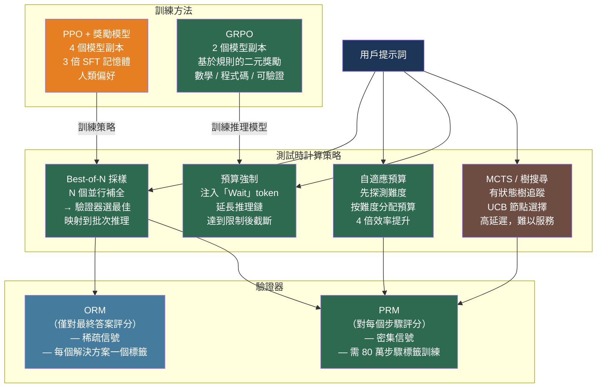

# [BEE-574] 過程獎勵模型與測試時計算縮放

:::info
縮放推理計算——生成更多候選解決方案並使用驗證器選擇最佳方案——能夠超越縮放訓練計算的效益。配備 64 倍推理預算的小模型可以超越大 14 倍的模型；關鍵瓶頸在於擁有可靠的驗證器來區分正確與錯誤的輸出。
:::

## 背景

LLM 能力提升傳統上依賴縮放訓練：更多參數、更多資料、更多計算。OpenAI 的 o1（2024 年）展示了一個正交軸：**測試時計算縮放（test-time compute scaling）**——訓練模型進行更長時間的思考並使用更多推理 token，性能隨 token 預算的增長而可預測地提升。DeepSeek-R1（arXiv:2501.12948，2025 年 1 月）以開放方案複現了這一成果，僅使用基於規則的驗證和無評論家 RL 演算法，在 AIME 2024（79.8% 對 79.2%）和 MATH-500（97.3% 對 96.4%）上達到了 o1 的性能水準。

核心技術問題是：模型如何知道哪個候選解決方案是正確的？兩類驗證器解決了這個問題：

**結果獎勵模型（Outcome Reward Model，ORM）** 對最終答案給出單一正確性標籤。對於可驗證的領域（數學、程式碼），這可以完全自動化：比較數值答案或執行單元測試。對於開放式文字，訓練好的 ORM 將完整回應打分為單一純量。

**過程獎勵模型（Process Reward Model，PRM）** 對每個中間推理步驟而非僅最終答案給出正確性標籤。Lightman 等人（「讓我們逐步驗證」，arXiv:2305.20050，ICLR 2024）證明 PRM 顯著優於 ORM：PRM 訓練的驗證器在 MATH 代表性子集上達到 78% 的準確率，超過 ORM 基線。為訓練該 PRM，OpenAI 收集了 **PRM800K** 資料集——跨越 12,000 道 MATH 問題的 75,000 個解決方案的 800,000 個步驟級人類反饋標籤，發布於 https://github.com/openai/prm800k。每個步驟獲得三種標籤之一：+1（正確且有幫助）、0（中性）或 −1（錯誤）。

從 ORM 到 PRM 的轉變類似於從結果監督到過程監督的轉變：密集的步驟級反饋使模型能夠準確識別推理出錯的位置，而不僅僅是接收最終的成功/失敗信號。

## ORM 與 PRM 訓練

**ORM 訓練**很直觀：在 LM 上添加純量輸出頭，僅在 EOS token 處以二元交叉熵訓練。損失稀疏——每個完整解決方案僅有一個標籤。

**PRM 訓練**需要步驟級監督。實作上在每個步驟邊界將詞彙表遮罩為僅獎勵 token（+/−），在每個步驟而非僅在 EOS 處傳播損失：

```python
import torch
import torch.nn as nn
from transformers import AutoModelForCausalLM

class ProcessRewardModel(nn.Module):
    def __init__(self, base_model_name: str):
        super().__init__()
        self.lm = AutoModelForCausalLM.from_pretrained(base_model_name)
        # 二分類輸出：好步驟（+1）vs 壞步驟（-1）
        self.reward_head = nn.Linear(self.lm.config.hidden_size, 2)

    def forward(self, input_ids, attention_mask, step_boundary_positions):
        outputs = self.lm(input_ids=input_ids,
                          attention_mask=attention_mask,
                          output_hidden_states=True)
        hidden = outputs.hidden_states[-1]          # (B, T, H)

        # 僅在步驟邊界處提取隱藏狀態
        step_hiddens = hidden[torch.arange(hidden.size(0)).unsqueeze(1),
                              step_boundary_positions]  # (B, num_steps, H)

        # 預測每個步驟的獎勵
        step_rewards = self.reward_head(step_hiddens)   # (B, num_steps, 2)
        return step_rewards

def prm_loss(step_logits, step_labels, valid_step_mask):
    """
    step_logits: (B, num_steps, 2)
    step_labels: (B, num_steps)  — 1 = 正確步驟, 0 = 錯誤步驟
    valid_step_mask: (B, num_steps)  — 遮罩填充步驟
    """
    B, S, _ = step_logits.shape
    loss = nn.CrossEntropyLoss(reduction='none')(
        step_logits.view(-1, 2),
        step_labels.view(-1)
    ).view(B, S)
    loss = (loss * valid_step_mask).sum() / valid_step_mask.sum()
    return loss
```

**蒙特卡洛估計（Monte Carlo estimation）** 在不需要人工標注的情況下近似步驟級標籤：對每個中間步驟採樣許多後續續寫，測量得到正確最終答案的比例。然而，Gu 等人（arXiv:2501.07301，2025）發現 MC 估計始終劣於人工標注和 LLM 評判方法，原因是策略依賴的噪音——某個錯誤步驟恰好產生正確答案（假陽性），或某個有效中間步驟恰好失敗（假陰性），兩者都會降低 PRM 品質。

## 測試時計算策略

給定驗證器（ORM 或 PRM），三種主要策略在推理時分配更多計算：

### N 選最優採樣（Best-of-N）

從策略生成 N 個獨立完整解決方案，以驗證器對所有解評分，返回分數最高的。Best-of-N 直接映射到標準批次推理——N 個補全是獨立且可並行的：

```python
from vllm import LLM, SamplingParams

def best_of_n(
    model: LLM,
    verifier,             # ORM 或 PRM 可調用物件
    prompt: str,
    n: int = 64,
    temperature: float = 0.8,
) -> str:
    sampling_params = SamplingParams(
        n=n,
        temperature=temperature,
        max_tokens=2048,
    )
    outputs = model.generate([prompt], sampling_params)
    candidates = [o.text for o in outputs[0].outputs]

    # 對所有候選評分；選擇最佳
    scores = [verifier(prompt, c) for c in candidates]
    best_idx = max(range(len(scores)), key=lambda i: scores[i])
    return candidates[best_idx]
```

Brown 等人（「大型語言猴子」，arXiv:2407.21787）證明**覆蓋率**（N 個樣本中任意一個解決問題的比例）在四個數量級範圍內與 N 呈對數線性縮放。在 SWE-bench Lite 上，DeepSeek-Coder-V2-Instruct 的覆蓋率從 N=1 時的 15.9% 增長到 **N=250 時的 56%**，超過了當時 43% 的單樣本最先進水準。

### 自適應預算分配

Snell 等人（arXiv:2408.03314，2024）表明，**難度自適應** Best-of-N 使用**少 4 倍的樣本**即可達到均勻 Best-of-N 的相同準確率。關鍵洞察：基礎模型 pass@1 接近 0% 或 100% 的問題從更多樣本中獲益甚少。計算縮放效益集中在 10%–90% 的難度範圍，應根據問題難度進行分配：

```python
def adaptive_best_of_n(model, verifier, prompt: str, total_budget: int) -> str:
    # 步驟一：用少量探針快速估計難度（4 個樣本）
    probe_params = SamplingParams(n=4, temperature=0.8, max_tokens=512)
    probe_outputs = model.generate([prompt], probe_params)
    probe_solutions = [o.text for o in probe_outputs[0].outputs]
    probe_scores = [verifier(prompt, s) for s in probe_solutions]
    pass_at_probe = sum(1 for s in probe_scores if s > 0.5) / len(probe_scores)

    # 步驟二：根據難度分配剩餘預算
    if pass_at_probe > 0.9 or pass_at_probe < 0.1:
        n = 4          # 容易或幾乎不可能的問題——使用最少樣本
    elif pass_at_probe > 0.7:
        n = total_budget // 4
    else:
        n = total_budget   # 困難問題獲得完整預算

    # 步驟三：使用分配的預算執行 Best-of-N
    return best_of_n(model, verifier, prompt, n=n)
```

### 預算強制（Budget Forcing）

Muennighoff 等人（「s1：簡單的測試時縮放」，arXiv:2501.19393）證明，在 1,000 個精心策劃的推理範例上微調的 32B 模型，使用**預算強制**可在 AIME 2024 上超越 o1-preview（57% 對 50%）：注入「Wait」token 防止模型過早結束推理鏈，並在達到 token 限制時強制截斷：

```python
def generate_with_budget_forcing(
    model,
    tokenizer,
    prompt: str,
    min_thinking_tokens: int = 1024,
    max_thinking_tokens: int = 8192,
) -> str:
    thinking_end = "<|end_of_thinking|>"
    inputs = tokenizer(prompt, return_tensors="pt")

    with torch.no_grad():
        output_ids = model.generate(
            **inputs,
            max_new_tokens=max_thinking_tokens,
        )

    generated = tokenizer.decode(output_ids[0], skip_special_tokens=False)

    # 如果模型嘗試過早結束思考，注入「Wait」以延長
    token_count = len(output_ids[0]) - len(inputs.input_ids[0])
    if token_count < min_thinking_tokens and thinking_end in generated:
        generated = generated.replace(thinking_end, "\nWait,", 1)

    return generated
```

## GRPO：無評論家的推理模型訓練

使用 PPO 訓練推理模型需要四個模型副本——演員、評論家、獎勵模型和參考模型——消耗比 SFT 多三倍的 GPU 記憶體（參見 BEE-573）。**GRPO（Group Relative Policy Optimization，群體相對策略優化）**，在 DeepSeekMath（arXiv:2402.03300）中引入並在 DeepSeek-R1（arXiv:2501.12948）中擴展，通過從採樣輸出組估計基準值來消除評論家：

```python
def grpo_loss(
    policy_logps: torch.Tensor,    # (G,) — G 個採樣輸出的對數概率
    ref_logps: torch.Tensor,       # (G,) — 參考模型下的對數概率
    rewards: torch.Tensor,         # (G,) — 基於規則的獎勵（0 或 1）
    epsilon: float = 0.2,          # PPO clip 範圍
    beta: float = 0.001,           # KL 懲罰係數
) -> torch.Tensor:
    # 在組內標準化獎勵（群體相對基準值）
    advantages = (rewards - rewards.mean()) / (rewards.std() + 1e-8)

    # 計算截斷的 PPO 式策略梯度
    ratios = torch.exp(policy_logps - policy_logps.detach())
    clipped = torch.clamp(ratios, 1 - epsilon, 1 + epsilon)
    policy_loss = -torch.min(ratios * advantages, clipped * advantages).mean()

    # KL 散度懲罰（加入損失，而非獎勵）
    kl = (policy_logps - ref_logps).mean()
    return policy_loss + beta * kl
```

DeepSeek-R1 的 GRPO 配置：每道題 G=16 個輸出樣本，每個輸出最多 32,768 個 token，基於規則的二元獎勵（最終答案正確為 1，否則為 0），KL 係數 β=0.001。這完全避免了訓練獨立的獎勵或值函數網路——數學和程式碼答案的二元正確性是可自動驗證的，使 ORM 變得不必要。

| 面向 | PPO | GRPO |
|---|---|---|
| 評論家模型 | 需要（與策略同等規模） | 不需要 |
| 記憶體開銷 | ~4 個模型副本 | ~2 個模型副本 |
| 獎勵類型 | 訓練的獎勵模型 | 基於規則 / 可驗證 |
| 優勢估計 | 值函數網路 V(s) | (r_i − 組均值) / 組標準差 |
| 最適用於 | 人類偏好對齊 | 可驗證的推理任務 |

## 最佳實踐

### 以 Best-of-N 作為預設的測試時計算策略

**應當（SHOULD）** 在生產部署中以 Best-of-N 為起點，而非 MCTS。Best-of-N 直接映射到批次推理——N 個並行請求是獨立的，不需要有狀態協調，並且能自然地與 vLLM 或 SGLang 中的連續批次處理配合使用。MCTS 需要跨部分 KV 快取追蹤有狀態的搜尋樹，規模化服務的難度高出數個數量級，且在相同 FLOPs 預算下相比調優的 Best-of-N 精度提升有限。

**不應當（SHOULD NOT）** 對推理任務使用集束搜尋（beam search）。研究表明，集束搜尋相比採樣可能因過度估計偏差（overestimation bias）而降低準確率——模型對自身的部分生成打分過於樂觀，導致集束收斂到局部合理但全局錯誤的路徑。

### 顯式控制 token 預算以約束推理成本

**必須（MUST）** 為推理模型部署設置硬性的 `max_tokens` 限制。若無顯式限制，推理模型可能生成任意長的思考鏈，耗盡 KV 快取容量和 GPU 記憶體。Token 預算感知推理（arXiv:2412.18547）表明，在提示詞中明確包含 token 預算可將輸出 token 數量減少 **67%**，而精度損失甚微：

```python
BUDGET_PROMPT = (
    "您的推理鏈 token 預算為 {budget} 個 token。"
    "請簡潔但完整。剩餘預算：{budget} 個 token。\n\n"
    "{original_prompt}"
)

def generate_with_budget(model, prompt: str, budget: int = 2048) -> str:
    budgeted_prompt = BUDGET_PROMPT.format(
        budget=budget, original_prompt=prompt
    )
    sampling_params = SamplingParams(max_tokens=budget, temperature=0.6)
    outputs = model.generate([budgeted_prompt], sampling_params)
    return outputs[0].outputs[0].text
```

### 對長推理模型服務使用預填充-解碼分離

**應當（SHOULD）** 在大規模服務推理模型時採用預填充與解碼硬體分離（參見 BEE-569）。推理模型表現出極端的預填充-解碼不對稱性：思考 token 的生成是純高吞吐量解碼階段，而可見回應生成是獨立且較短的階段。分離預填充 GPU 和解碼 GPU，可以為每個階段分配專業化硬體，並避免長 KV 快取與預填充計算競爭記憶體的問題。DistServe（arXiv:2401.09670）報告使用此方法能服務 7.4 倍更多請求並滿足同等 SLO。

### 訓練 PRM 時使用 LLM 評判而非 MC 估計進行步驟級標注

**應當（SHOULD）** 在訓練 PRM 時優先選擇 LLM 評判或人工標注，而非蒙特卡洛估計。MC 估計產生策略依賴的噪音：某個錯誤步驟恰好產生正確答案（假陽性），或某個有效中間步驟恰好失敗（假陰性），兩者都會降低 PRM 品質。ThinkPRM（arXiv:2504.16828）提供了實用的折衷方案：一個生成式 PRM，為每個步驟撰寫驗證思維鏈，僅需 8,000 個合成範例訓練，性能超過在完整 80 萬標籤 PRM800K 資料集上訓練的判別式 PRM。

## 視覺化



## 常見錯誤

**在生產中使用 MCTS 而沒有訓練好的值函數。** MCTS 需要可靠的值函數來評估部分解決方案——使用策略自身的對數概率作為代理會產生差劣的搜尋引導和高延遲，卻沒有精度提升。除非有經過良好校準的 PRM 作為值函數可用，否則在相同計算預算下 Best-of-N 優於朴素 MCTS。

**對容易或不可能的問題應用測試時縮放。** 計算效益集中在基礎 pass@1 難度範圍的 10%–90%。為模型第一次嘗試就能正確回答的問題生成 64 個樣本，會浪費 64 倍的推理計算。使用少量初始樣本（4 個補全）進行自適應難度探測，可根據分類難度分配預算。

**在不可驗證的獎勵上訓練 GRPO。** GRPO 的基於規則的二元獎勵（正確/錯誤）僅在正確性可自動驗證時才可靠——數學答案、單元測試通過/失敗、形式邏輯驗證器。將 GRPO 應用於沒有可靠驗證器的開放式文字生成，會產生嘈雜的優勢估計，使訓練不穩定。對不可驗證的任務應使用 PPO + 訓練的獎勵模型。

**不限制最大推理 token 預算。** 若不強制限制，推理模型可能生成任意長的思考鏈。沒有 `max_tokens`，單個長推理請求可能耗盡所有其他並發請求的 KV 快取，降低吞吐量。務必設置與生產中觀察到的 P99 推理追蹤長度相匹配的顯式硬性上限。

**使用策略自身的對數概率對 Best-of-N 候選評分。** 使用策略分配的概率對候選進行排名（等同於貪婪集束搜尋）會引入自我強化偏差——模型將其最可能的續寫排在最高位，但這些不一定是最正確的。務必使用獨立驗證器（ORM、PRM 或外部檢查器）對候選進行評分。

## 相關 BEE

- [BEE-573](573.md) -- RLHF 與對齊訓練基礎設施：GRPO 之於 RLHF，如同 DPO 之於 PPO——更簡單、更高效的替代方案；兩者都屬於對齊訓練家族
- [BEE-525](525.md) -- 思維鏈與延伸思考模式：思維鏈是推理機制；測試時計算縮放是分配更多推理預算的基礎設施策略
- [BEE-561](561.md) -- LLM 推論的投機解碼：投機解碼加速推理模型的解碼階段，降低長思考鏈的實際延遲
- [BEE-569](569.md) -- LLM 服務的預填充與解碼分離：推理模型的長推理 token 生成是分離架構所解決的解碼瓶頸的極端案例
- [BEE-543](543.md) -- LLM 自洽性與集成採樣：自洽性（多數投票）是使用一致性而非訓練驗證器的 Best-of-N 形式

## 參考資料

- [Lightman et al. Let's Verify Step by Step — arXiv:2305.20050, ICLR 2024](https://arxiv.org/abs/2305.20050)
- [OpenAI PRM800K 資料集 — github.com/openai/prm800k](https://github.com/openai/prm800k)
- [DeepSeek-AI. DeepSeek-R1: Incentivizing Reasoning Capability in LLMs via Reinforcement Learning — arXiv:2501.12948, 2025](https://arxiv.org/abs/2501.12948)
- [Shao et al. DeepSeekMath: Pushing the Limits of Mathematical Reasoning in Open Language Models（GRPO 起源）— arXiv:2402.03300, 2024](https://arxiv.org/abs/2402.03300)
- [Snell et al. Scaling LLM Test-Time Compute Optimally can be More Effective than Scaling Model Parameters — arXiv:2408.03314, 2024](https://arxiv.org/abs/2408.03314)
- [Brown et al. Large Language Monkeys: Scaling Inference Compute with Repeated Sampling — arXiv:2407.21787, 2024](https://arxiv.org/abs/2407.21787)
- [Muennighoff et al. s1: Simple Test-Time Scaling — arXiv:2501.19393, 2025](https://arxiv.org/abs/2501.19393)
- [Wu et al. Inference Scaling Laws: An Empirical Analysis of Compute-Optimal Inference for Problem-Solving with Language Models — arXiv:2408.00724, 2024](https://arxiv.org/abs/2408.00724)
- [OpenAI. Learning to Reason with LLMs（o1 部落格文章）— openai.com/index/learning-to-reason-with-llms](https://openai.com/index/learning-to-reason-with-llms/)
- [Gu et al. The Lessons of Developing Process Reward Models in Mathematical Reasoning — arXiv:2501.07301, 2025](https://arxiv.org/abs/2501.07301)
- [He et al. Token-Budget-Aware LLM Reasoning — arXiv:2412.18547, 2024](https://arxiv.org/abs/2412.18547)
- [Feng et al. AlphaZero-like Tree-Search can Guide Large Language Model Decoding and Training — arXiv:2309.17179, ICML 2024](https://arxiv.org/abs/2309.17179)
