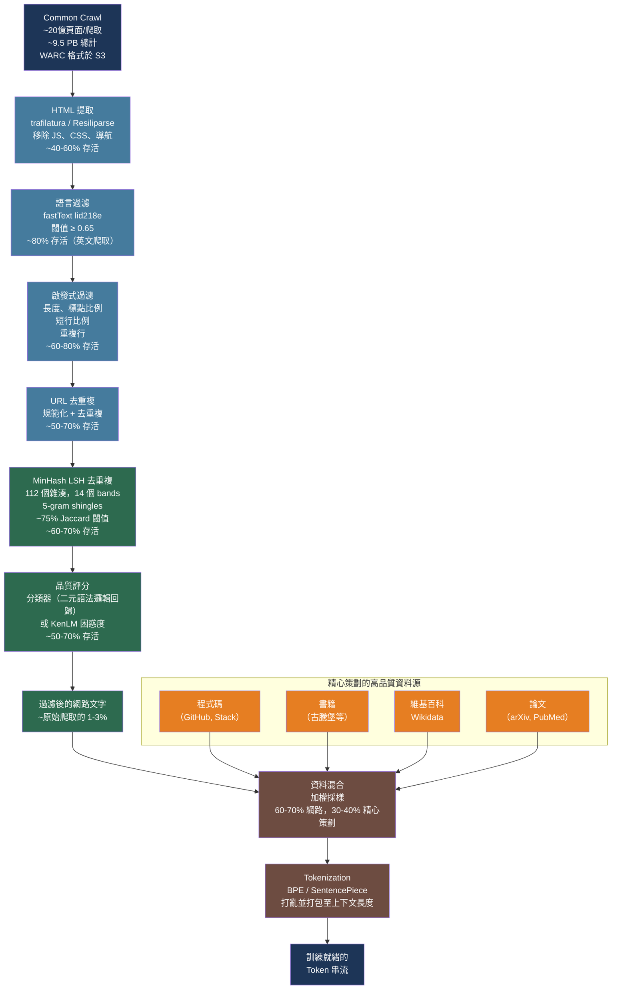

# [BEE-575] LLM 預訓練資料流水線與網路規模語料庫整理

:::info
預訓練語料庫的品質決定了任何 LLM 能夠學習的上限——這比模型架構甚至計算預算更為關鍵。將 PB 規模的網路爬取資料處理為訓練就緒的 token 串流，需要多階段流水線：HTML 提取、語言識別、啟發式過濾、模糊去重複，以及基於品質的選擇，每個階段都可能過濾掉 50–90% 的原始輸入。
:::

## 背景

每個大型語言模型都訓練於從網路爬取、精心策劃的書籍集合、程式碼儲存庫和學術論文中組裝的語料庫。幾乎所有公開 LLM 的原始材料都來自 **Common Crawl**——一個自 2008 年起持續爬取網路並發布月度快照的非營利組織，累積資料超過 9.5 PB。每月爬取約捕獲 20–25 億個頁面，存儲在約 60,000 個 WARC（Web ARChive）檔案中，每個約 1 GB（壓縮後），可從 `s3://commoncrawl/`（AWS `us-east-1`，無需認證）免費獲取。

原始網路資料無法直接用於訓練。典型的爬取包含跨域重複內容、非英文文字、垃圾郵件、樣板文字和低資訊量頁面（導航選單、Cookie 橫幅、自動生成文字）。GPT-3（Brown 等人，arXiv:2005.14165，2020）建立了第一個公開基準：使用分類器過濾 Common Crawl（分類器訓練以區分精心策劃的文字與隨機爬取內容），然後使用 MinHash LSH 去重複。從初始 45 TB 壓縮爬取資料中，GPT-3 的流水線產出了 570 GB 高品質文字——約為原始輸入的 1.3%。

HuggingFace 的 **FineWeb**（Penedo 等人，arXiv:2406.17557，NeurIPS 2024）在 96 個爬取快照上改進了這一方法，透過精心消融的過濾流水線產生了 15 兆個 token（約 44 TB）。FineWeb 目前是該領域最完整記錄的開放預訓練語料庫，作為實際參考實作。EleutherAI 的 **The Pile**（Gao 等人，arXiv:2101.00027）開創了將 Common Crawl 與 21 個精心策劃的領域結合的方法——維基百科、GitHub、arXiv、法律文件等——產生 825 GB 多樣化文字，確立了領域多樣性顯著改善下游泛化的原則。

## 預訓練資料流水線

生產級預訓練流水線有六個順序階段。每個階段按順序應用；後期階段假設前期階段已完成：

```
原始 WARC 檔案（Common Crawl）
    ↓  1. 文字提取      （HTML → 乾淨文字，~40–60% 的頁面存活）
    ↓  2. 語言過濾      （保留目標語言，英文爬取約 ~80% 存活）
    ↓  3. 啟發式過濾    （文件長度、標點、重複，~60–80% 存活）
    ↓  4. URL 去重複    （每個規範 URL 保留一份，~30–50% 存活）
    ↓  5. 模糊去重複    （MinHash LSH 近似重複移除，~60–70% 存活）
    ↓  6. 品質評分      （分類器或困惑度過濾，~50–70% 存活）
    ↓
整理後的語料庫（通常為原始爬取的 1–3%）
    ↓  與高品質資料源混合（維基百科、程式碼、書籍、論文）
    ↓
最終訓練資料集  →  Tokenization  →  訓練
```

### 第一階段：HTML 提取

原始 WARC 檔案包含完整的 HTTP 回應，包括 headers、JavaScript、CSS 和導航。Common Crawl 也提供含預提取文字的 WET 檔案，但這些保留了過多樣板文字，不推薦用於高品質流水線。

**trafilatura** 是目前最佳實踐的 HTML 提取器，在主要內容提取的基準精確率/召回率上持續優於 jusText 等替代工具，並整合於 HuggingFace 的 `datatrove` 流水線函式庫：

```python
import trafilatura
from datatrove.executor import LocalPipelineExecutor
from datatrove.pipeline.readers import WarcReader
from datatrove.pipeline.extractors import Trafilatura
from datatrove.pipeline.writers import JsonlWriter

# datatrove 流水線：WARC → 提取文字 → JSONL
pipeline = [
    WarcReader(
        data_folder="s3://commoncrawl/crawl-data/CC-MAIN-2024-10/segments/",
        compression="gz",
        glob_pattern="warc/*.warc.gz",
        default_metadata={"source": "CC-MAIN-2024-10"},
    ),
    Trafilatura(
        favour_precision=True,    # 偏好品質更高的較少文字
        timeout=0.1,              # 每份文件的超時（秒）
        deduplicate=False,        # 去重複另行處理
    ),
    JsonlWriter(output_folder="s3://my-bucket/extracted/"),
]

executor = LocalPipelineExecutor(pipeline=pipeline, workers=64)
executor.run()
```

**Resiliparse** 配合 **FastWARC** 是吞吐量比品質更優先時的更快替代方案。其 C++/Cython WARC 解析器比 Python-based warcio 快得多，且其 HTML 提取器對表格和程式碼塊的處理優於 jusText。

### 第二階段：語言識別

使用 **fastText 的語言識別模型**（217 種語言，lid218e）過濾到目標語言。模型為每份文件分配置信度分數；低於閾值的文件被丟棄：

```python
import fasttext

# 從 https://huggingface.co/facebook/fasttext-language-identification 下載
lid_model = fasttext.load_model("lid.218e.bin")

def is_english(text: str, threshold: float = 0.65) -> bool:
    # fasttext 期望單行輸入
    predictions = lid_model.predict(text.replace("\n", " "), k=1)
    lang, confidence = predictions[0][0].replace("__label__", ""), predictions[1][0]
    return lang == "en" and confidence >= threshold

# FineWeb 使用 0.65；Dolma 使用 0.50——閾值越高精確率越高，召回率越低
```

### 第三階段：啟發式過濾

在昂貴的操作之前應用廉價的文件級啟發式規則。FineWeb 的消融實驗確定這些最為有效：

```python
def passes_heuristics(text: str) -> bool:
    lines = [l for l in text.split("\n") if l.strip()]
    if len(lines) < 5:
        return False    # 太短

    # 以終止標點結尾的行的比例
    punct_endings = sum(1 for l in lines if l.rstrip()[-1:] in ".!?\"'")
    if punct_endings / len(lines) < 0.12:
        return False    # 導航/連結堆積頁面

    # 重複行中字元的比例（檢測模板內容）
    from collections import Counter
    line_counts = Counter(lines)
    dup_chars = sum(len(l) * (c - 1) for l, c in line_counts.items() if c > 1)
    total_chars = sum(len(l) for l in lines)
    if total_chars > 0 and dup_chars / total_chars >= 0.10:
        return False    # 重複的樣板文字

    # 短行（< 30 個字元）的比例——捕獲選單、列表、連結農場
    short_lines = sum(1 for l in lines if len(l.strip()) < 30)
    if short_lines / len(lines) >= 0.67:
        return False

    return True
```

### 第四和第五階段：去重複

去重複是計算成本最高的階段，必須在品質過濾之前進行，以避免品質分類器從冗餘的近似重複中選擇。

**URL 去重複**（快速且廉價）：規範化 URL（小寫，去除追蹤參數），每個規範 URL 保留一份文件。消除聯合發布的內容。

**MinHash LSH 模糊去重複**（Lee 等人，arXiv:2107.06499，ACL 2022）：捕獲出現在不同 URL 但文字差異細微的近似重複文件（交叉發布的文章、抓取鏡像）。去重複後，LM 逐字發出記憶訓練文字的頻率降低 10 倍，且以更少步驟達到相同的驗證損失：

```python
from datasketch import MinHash, MinHashLSH

def compute_minhash(text: str, num_perm: int = 112) -> MinHash:
    m = MinHash(num_perm=num_perm)
    # 5-gram 詞語 shingles（FineWeb 配置）
    words = text.lower().split()
    for i in range(len(words) - 4):
        shingle = " ".join(words[i:i+5])
        m.update(shingle.encode("utf-8"))
    return m

# LSH：14 個 bands × 8 行 = 112 個雜湊 → 目標 ~75% Jaccard 相似度閾值
lsh = MinHashLSH(threshold=0.75, num_perm=112)

# 索引：插入每份文件的 MinHash
for doc_id, text in corpus.items():
    mh = compute_minhash(text)
    lsh.insert(doc_id, mh)
```

### 第六階段：品質評分

**基於分類器的過濾**（根據 DCLM arXiv:2406.11794 最有效）：以高品質資料源（維基百科、精心策劃的書籍、學術論文）作為正例，隨機網路文字作為負例，訓練快速文字分類器。DCLM 發現簡單的**二元語法分類器**優於更複雜的替代方案：

```python
from sklearn.linear_model import LogisticRegression
from sklearn.feature_extraction.text import HashingVectorizer

vectorizer = HashingVectorizer(
    analyzer="word",
    ngram_range=(1, 2),     # 一元語法 + 二元語法
    n_features=2**18,
    norm="l2",
    alternate_sign=False,
)

classifier = LogisticRegression(max_iter=1000)
classifier.fit(vectorizer.transform(texts_train), labels_train)

def quality_score(text: str) -> float:
    features = vectorizer.transform([text])
    return classifier.predict_proba(features)[0][1]  # 「高品質」的概率
```

**KenLM 困惑度過濾**（Wenzek 等人，CCNet，arXiv:1911.00359）計算成本更低。在目標語言的維基百科上訓練 5-gram 語言模型，按困惑度對文件評分，保留中間段。困惑度極高 → 垃圾郵件/亂碼；困惑度極低 → 重複的樣板文字。

## 最佳實踐

### 直接處理 WARC 檔案；不要依賴 WET 檔案

**應當（SHOULD）** 使用 trafilatura 或 Resiliparse 下載並處理原始 WARC 檔案，而非使用 Common Crawl 的預提取 WET 檔案。WET 檔案保留了 trafilatura 會過濾的導航文字、樣板和 Cookie 通知。FineWeb 的消融實驗表明，基於 trafilatura 提取的文字流水線在相同 token 數量下產生的模型明顯優於基於 WET 的流水線。

### 在品質過濾之前執行去重複

**必須（MUST）** 在基於分類器的品質過濾之前應用去重複。重複文件會誇大分類器對重複內容的置信度並扭曲品質分佈。先執行去重複確保品質分類器從真正不同的文件中選擇。MinHash 去重複僅單獨就能將典型爬取減少 30–40%；與 URL 去重複結合，可移除 50% 或更多的 token。

### 在昂貴的分類器評分之前應用啟發式過濾

**應當（SHOULD）** 在調用訓練的品質分類器之前執行所有啟發式文件過濾器（語言識別、長度、標點比例、短行比例）。啟發式規則每份文件執行時間為微秒；訓練的分類器需要向量化和推理。在 100 億文件的爬取中，50% 的啟發式拒絕率可節省 50 億次分類器推理。

### 將網路爬取資料與精心策劃的高品質資料源混合

**應當（SHOULD）** 以高於其原始 token 量的採樣率，將過濾後的 Common Crawl 文字與較小的精心策劃語料庫混合。Dolma（arXiv:2402.00159）對維基百科、學術論文（peS2o）和程式碼（The Stack）進行了上採樣。The Pile（arXiv:2101.00027）證明接觸多樣化的文體——法律文字、數學、程式碼、科學——顯著改善了泛化性，遠超單純使用網路文字。通用目的模型的實用混合比例：

| 資料源 | 大約 token 佔比 |
|---|---|
| 過濾後的 Common Crawl | 60–70% |
| 程式碼（GitHub, The Stack） | 10–15% |
| 書籍和文學作品 | 5–10% |
| 維基百科和 Wikidata | 3–5% |
| 科學論文（arXiv, PubMed） | 3–5% |
| 其他精心策劃（法律、數學等） | 2–5% |

### 使用保留基準對過濾進行嚴格驗證

**必須（MUST）** 針對在樣本語料庫上訓練的小型語言模型評估每個過濾決策，而非僅依賴語料庫統計數據。DCLM 的基準基礎設施（arXiv:2406.11794）提供 53 個下游評估和標準化訓練方案。提高平均 token 困惑度或降低標點比例的過濾器可能改善也可能損害模型品質——只有下游任務性能才是最終標準。

## 視覺化



## 常見錯誤

**使用 WET 檔案而非直接處理 WARC 檔案。** Common Crawl 的預提取 WET 檔案雖然方便，但保留了 trafilatura 會過濾的導航選單、Cookie 橫幅和頁面框架樣板。FineWeb 的消融實驗表明，基於 WET 的流水線在相同 token 數量下產生的模型明顯較差。WARC 提取的額外處理成本是值得的。

**在所有爬取快照上同時進行全局 MinHash 去重複。** 對 96 個爬取快照進行全局去重複需要同時對數百億份文件建立 LSH 索引——在記憶體中不切實際。FineWeb 對每個爬取快照獨立應用去重複，然後再進行單獨的跨快照 URL 去重複。這在計算上是可行的，並且能捕獲大部分效益（出現在多個爬取中的內容共享 URL，可被 URL 去重複捕獲）。

**將語言識別閾值設得太低。** fastText 置信度閾值 0.50 會將許多多語言頁面和密切相關語言（例如蘇格蘭英語、南非荷蘭語）的文件納入以英語為目標的語料庫。FineWeb 的 0.65 閾值提供了更好的精確率-召回率平衡。對於非英語語料庫，通常需要更高的閾值（0.7–0.8），因為非英語語言的網路內容不如英語均勻。

**跳過評估並僅依賴語料庫統計數據。** 「平均文件長度」或「標點比例」等指標作為健全性檢查很有用，但不是模型品質的最終標準。改善語料庫統計數據的過濾步驟仍然可能降低下游性能，如果它移除了特定領域（例如，移除所有短於 200 個 token 的文件會刪除許多高品質的維基百科存根）。在全規模應用過濾器之前，始終在訓練 1–20 億 token 的小型模型上用標準基準進行驗證。

**不對高品質精心策劃的資料源進行上採樣。** 網路爬取文字廉價且豐富，但比精心策劃的資料源更嘈雜。以維基百科在網路中的自然比例（約 0.01%）納入，對於其對下游任務性能的價值而言，代表了不充分的結構良好的事實性文字。所有主要公開語料庫（GPT-3, LLaMA 2, Dolma, The Pile）都對高品質資料源——通常是維基百科、學術論文和精心策劃的書籍——應用顯式上採樣，通常為 3–10 倍。

## 相關 BEE

- [BEE-572](572.md) -- 大型語言模型的分散式訓練基礎設施：預訓練資料流水線為分散式訓練提供輸入——ZeRO 分片、梯度檢查點和混合精度是語料庫整理的訓練端對應部分
- [BEE-550](550.md) -- LLM 知識蒸餾與模型壓縮：在教師模型訓練資料的精心策劃子集上預訓練較小的學生模型，是一種資料高效蒸餾形式
- [BEE-534](534.md) -- AI 系統的合成資料生成：合成資料補充精心策劃的預訓練語料庫——特別是對數學推理、程式碼和自然網路資料稀少的低資源語言

## 參考資料

- [Penedo et al. The FineWeb Datasets: Decanting the Web for the Finest Text Data at Scale — arXiv:2406.17557, NeurIPS 2024](https://arxiv.org/abs/2406.17557)
- [Gao et al. The Pile: An 800GB Dataset of Diverse Text for Language Modeling — arXiv:2101.00027, EleutherAI 2021](https://arxiv.org/abs/2101.00027)
- [Lee et al. Deduplicating Training Data Makes Language Models Better — arXiv:2107.06499, ACL 2022](https://arxiv.org/abs/2107.06499)
- [Soldaini et al. Dolma: An Open Corpus of Three Trillion Tokens — arXiv:2402.00159, ACL 2024](https://arxiv.org/abs/2402.00159)
- [Li et al. DataComp-LM: In Search of the Next Generation of Training Sets for Language Models — arXiv:2406.11794, 2024](https://arxiv.org/abs/2406.11794)
- [Wenzek et al. CCNet: Extracting High Quality Monolingual Datasets from Web Crawl Data — arXiv:1911.00359, 2020](https://arxiv.org/abs/1911.00359)
- [Brown et al. Language Models are Few-Shot Learners（GPT-3）— arXiv:2005.14165, NeurIPS 2020](https://arxiv.org/abs/2005.14165)
- [Tirumala et al. D4: Improving LLM Pretraining via Document Deduplication and Diversification — arXiv:2308.12284, NeurIPS 2023](https://arxiv.org/abs/2308.12284)
- [HuggingFace. datatrove：大規模資料處理函式庫 — github.com/huggingface/datatrove](https://github.com/huggingface/datatrove)
- [Common Crawl. Navigating the WARC File Format — commoncrawl.org](https://commoncrawl.org/blog/navigating-the-warc-file-format)
- [Barbaresi. trafilatura：網頁抓取函式庫與命令列工具 — trafilatura.readthedocs.io](https://trafilatura.readthedocs.io/)
- [Heafield. KenLM: Faster and Smaller Language Model Queries — aclanthology.org/W11-2123](https://aclanthology.org/W11-2123.pdf)
