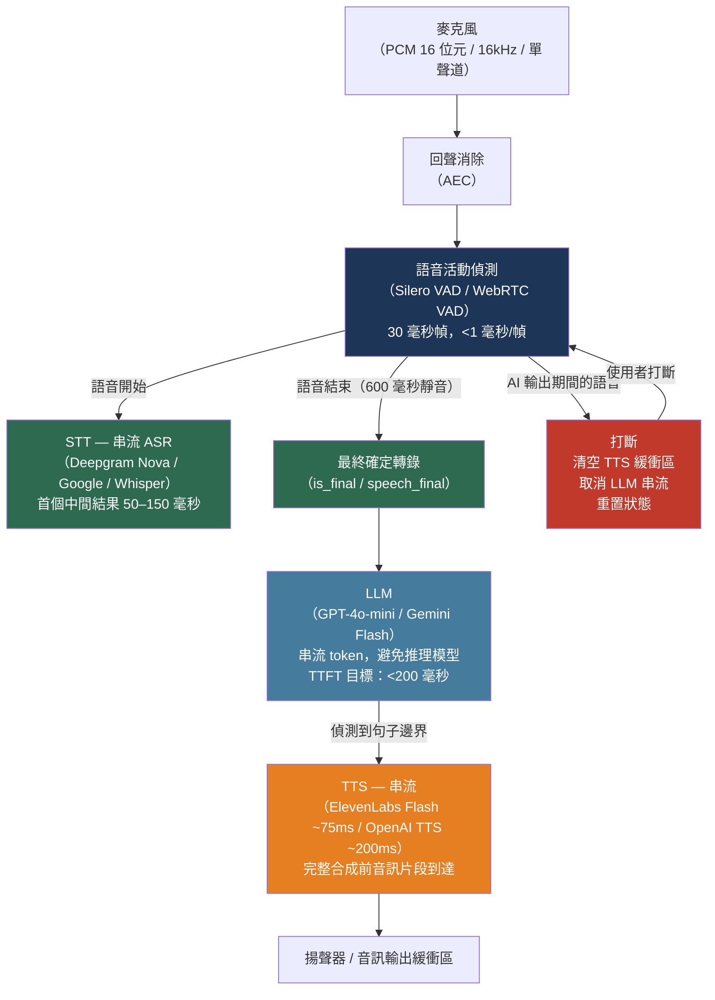

# [BEE-582] 即時語音 AI 整合模式

:::info
即時語音 AI 流水線將語音輸入轉換為文字、生成回應並合成語音——目標是將總往返延遲控制在 300 毫秒以內。主要的工程挑戰在於延遲：每個階段（VAD、STT、LLM、TTS）都會累積延遲，唯有在 LLM 完成輸出之前就開始 TTS 生成（流水線化），才能讓低於一秒的對話感覺自然。
:::

## 情境

語音 AI 的構建模組——自動語音識別、語言模型和語音合成——各自獨立成熟。三個層面的串流 API 的融合，使低延遲語音 AI 作為生產後端模式在 2023 年前後成為可行方案。

OpenAI 的 Whisper（Radford 等人，arXiv:2212.04356，《透過大規模弱監督的強健語音識別》，2022 年）建立了新的品質基準：一個在 680,000 小時多語言音訊上訓練的單一神經模型，其 large-v3 變體在 LibriSpeech clean 上達到 2.01 WER。Whisper 是一個批次模型，本身會引入 1–3 秒的延遲，不適合用於即時對話。串流 ASR 服務——Deepgram Nova、Google Speech-to-Text 和 AssemblyAI——通過在音訊到達時返回中間轉錄，將延遲控制在 50–150 毫秒。

語音合成品質也同步大幅提升。ElevenLabs 的 Flash v2.5 模型目標首個音訊位元組延遲（TTFAB）約 75 毫秒；OpenAI TTS 約 200 毫秒。兩者都支援串流：音訊片段在完整文字輸入被處理之前就開始到達。這實現了最重要的延遲最佳化：不等待 LLM 完成完整回應再送給 TTS，而是在 LLM 生成每個句子時立即送出。

對話的自然感幾乎完全取決於延遲。低於 200 毫秒的間隔感覺流暢；300–500 毫秒開始感覺遲緩；超過 1.5 秒，使用者會反覆打斷或放棄互動。在生產環境中，GPT-4o 平均首個 token 延遲（TTFT）約 700 毫秒，Gemini Flash 1.5 約 300 毫秒。即使有快速的 STT 和 TTS，LLM 階段仍是關鍵約束。流水線架構必須設計為最小化從語音結束到第一個音訊輸出的時間。

## 架構選擇

存在兩種基本架構：

### 級聯流水線（STT → LLM → TTS）

主流的生產架構。三個獨立的 API 服務依序組合：

```
[麥克風] → [VAD] → [STT] → [LLM] → [TTS] → [揚聲器]
```

**優點：** 模組化——每個元件可以獨立替換。可除錯——轉錄和回應都是文字，可以記錄日誌。成本效益——STT 和 TTS 服務比音訊 token 處理更便宜。

**延遲：** STT 最終確定（50–100 毫秒）、LLM TTFT（100–700 毫秒，取決於模型和基礎設施）和 TTS 首個音訊片段（50–200 毫秒）的總和。總計：300 毫秒到超過 1 秒。

### 端到端語音到語音（OpenAI Realtime API、Gemini Live）

模型直接接收音訊並直接輸出音訊。沒有明確的 STT 或 TTS 邊界。OpenAI 的 Realtime API（`wss://api.openai.com/v1/realtime?model=gpt-realtime`）和 Google 的 Gemini Live 實現了這一點。

**優點：** 更低的 TTFT（模型處理音訊 token，無 STT 延遲）。使用者聲音的情感和韻律自然傳遞。單一 API 端點。

**缺點：** 音訊 token 的費用約為文字 token 的 10 倍，使對話成本大約高出 10 倍。無法訪問中間轉錄以進行日誌記錄和合規。無法在不更改整合點的情況下替換底層模型。不適合高流量部署。

對於大多數生產部署，級聯流水線提供了更好的成本-品質-可觀測性權衡。端到端語音到語音適用於對話自然感優先於成本的消費端應用。

## 語音活動偵測

語音活動偵測（VAD，Voice Activity Detection）解決語音流水線中的三個問題：

1. **靜音過濾**：不將靜音幀送至 STT API。背景噪音和呼吸聲會增加成本並降低準確率。
2. **輪次結束偵測**：推斷使用者何時說完，流水線應觸發 STT 最終確定。
3. **打斷偵測**：在 AI 生成音訊時偵測使用者說話，以便 AI 停下來傾聽。

### Silero VAD

Silero VAD（https://github.com/snakers4/silero-vad，MIT 授權）是一個 2MB 的神經模型，在單個 CPU 執行緒上，在 1 毫秒以內將每個 30 毫秒的音訊幀分類為語音或非語音。它在嘈雜環境中持續優於基於 GMM 的傳統 VAD：

```python
import torch
import numpy as np

# 在啟動時載入一次（2MB 模型）
model, utils = torch.hub.load(
    repo_or_dir="snakers4/silero-vad",
    model="silero_vad",
    force_reload=False,
)
(get_speech_timestamps, _, read_audio, VADIterator, collect_chunks) = utils

vad_iterator = VADIterator(
    model,
    threshold=0.5,          # 語音概率閾值
    sampling_rate=16000,
    min_silence_duration_ms=600,  # 宣告輪次結束前的靜音毫秒數
    speech_pad_ms=100,           # 填充偵測到的語音邊緣
)

def process_audio_frame(pcm_bytes: bytes) -> dict | None:
    """
    處理一個 30 毫秒的 16kHz 16 位元單聲道 PCM 幀。
    在語音開始時返回 {"start": True}，在語音結束時返回 {"end": int}（毫秒偏移），
    或在無邊界事件時返回 None。
    """
    audio_float = np.frombuffer(pcm_bytes, dtype=np.int16).astype(np.float32) / 32768.0
    audio_tensor = torch.from_numpy(audio_float)
    return vad_iterator(audio_tensor, return_seconds=False)
```

### 全雙工 VAD 的打斷處理

在全雙工流水線中，VAD 持續在麥克風輸入上運行——包括 AI 說話時。聲學回聲消除（AEC，Acoustic Echo Cancellation）必須在 VAD 處理之前從麥克風訊號中減去 AI 的揚聲器輸出；否則，AI 自己的聲音會觸發虛假的打斷。

當 VAD 在 AI 輸出期間偵測到使用者說話時：
1. 取消正在進行的 TTS 串流
2. 清空音訊輸出緩衝區
3. 可選地取消待處理的 LLM 生成
4. 重置對話狀態
5. 開始新的 STT 捕獲

## STT：串流語音轉文字

### Deepgram Nova-2/3

Deepgram 的串流 WebSocket 在音訊傳送後約 150 毫秒內提供中間轉錄，以 `is_final` 事件（句子級，已鎖定）和 `speech_final` 事件（話語級）驅動流水線狀態：

```python
import asyncio
import websockets
import json

DEEPGRAM_WS = "wss://api.deepgram.com/v1/listen"
DEEPGRAM_PARAMS = (
    "model=nova-2-conversationalai"
    "&encoding=linear16"
    "&sample_rate=16000"
    "&channels=1"
    "&smart_format=true"
    "&interim_results=true"
    "&endpointing=600"   # 600 毫秒靜音 → speech_final 事件
)

async def stream_to_deepgram(
    audio_queue: asyncio.Queue,
    transcript_callback,
    api_key: str,
):
    uri = f"{DEEPGRAM_WS}?{DEEPGRAM_PARAMS}"
    headers = {"Authorization": f"Token {api_key}"}

    async with websockets.connect(uri, extra_headers=headers) as ws:
        async def sender():
            while True:
                chunk = await audio_queue.get()
                if chunk is None:
                    break
                await ws.send(chunk)  # 原始 PCM16 位元組，無 base64

        async def receiver():
            async for message in ws:
                data = json.loads(message)
                if data.get("type") == "Results":
                    alt = data["channel"]["alternatives"][0]
                    transcript = alt.get("transcript", "")
                    is_final = data.get("is_final", False)
                    speech_final = data.get("speech_final", False)
                    if transcript:
                        await transcript_callback(transcript, is_final, speech_final)

        await asyncio.gather(sender(), receiver())
```

### Google Cloud Speech-to-Text（串流）

Google STT 使用 gRPC 雙向串流，如果客戶端通過 WebSocket 連接，則需要伺服器端代理。gRPC 串流配置：

```python
from google.cloud import speech

def create_streaming_config() -> speech.StreamingRecognitionConfig:
    return speech.StreamingRecognitionConfig(
        config=speech.RecognitionConfig(
            encoding=speech.RecognitionConfig.AudioEncoding.LINEAR16,
            sample_rate_hertz=16000,
            language_code="zh-TW",
        ),
        interim_results=True,
    )
```

## LLM 到 TTS 的流水線化

最高影響的延遲最佳化是**不等待完整的 LLM 回應**就調用 TTS。一旦 LLM 輸出句子邊界（`.`、`!`、`?` 後跟空格），立即將該句子送至 TTS。TTS 在 LLM 生成第二個句子時開始為第一個句子生成音訊。

```python
import re
import asyncio
from openai import AsyncOpenAI

# 匹配後跟空格或結尾的句子終止標點的模式
SENTENCE_BOUNDARY = re.compile(r'(?<=[.!?])\s+')

async def stream_llm_to_tts(
    openai_client: AsyncOpenAI,
    messages: list[dict],
    tts_queue: asyncio.Queue,  # 接收 TTS 的句子字串
) -> str:
    """
    串流 LLM token；每個句子完成時推送至 TTS 佇列。
    返回完整回應文字以供日誌記錄。
    """
    buffer = ""
    full_response = ""

    stream = await openai_client.chat.completions.create(
        model="gpt-4o-mini",   # TTFT 最佳化；語音中避免使用推理模型
        messages=messages,
        stream=True,
        max_tokens=300,         # 保持語音回應簡短
        temperature=0.7,
    )

    async for chunk in stream:
        token = chunk.choices[0].delta.content or ""
        buffer += token
        full_response += token

        # 偵測句子邊界並清空至 TTS
        parts = SENTENCE_BOUNDARY.split(buffer, maxsplit=1)
        if len(parts) > 1:
            sentence = parts[0].strip()
            if sentence:
                await tts_queue.put(sentence)
            buffer = parts[1]

    # 串流結束後清空剩餘文字
    if buffer.strip():
        await tts_queue.put(buffer.strip())

    return full_response


async def stream_tts_elevenlabs(
    sentence: str,
    voice_id: str,
    xi_api_key: str,
    audio_output_queue: asyncio.Queue,
):
    """
    將一個句子送至 ElevenLabs Flash，並將 PCM 音訊片段串流
    至音訊輸出佇列以供播放。
    """
    uri = (
        f"wss://api.elevenlabs.io/v1/text-to-speech/{voice_id}"
        f"/stream-input?model_id=eleven_flash_v2_5"
        f"&output_format=pcm_16000"
    )
    headers = {"xi-api-key": xi_api_key}

    async with websockets.connect(uri, extra_headers=headers) as ws:
        # 發送文字
        await ws.send(json.dumps({
            "text": sentence,
            "voice_settings": {"stability": 0.5, "similarity_boost": 0.75},
        }))
        await ws.send(json.dumps({"text": ""}))  # 清空信號

        # 接收音訊片段
        async for message in ws:
            data = json.loads(message)
            if data.get("audio"):
                import base64
                pcm_chunk = base64.b64decode(data["audio"])
                await audio_output_queue.put(pcm_chunk)
```

## 最佳實踐

### 從一開始就設計 300 毫秒的延遲目標

**MUST**（必須）在選擇元件之前建立延遲預算。典型目標：

| 階段 | 預算 |
|---|---|
| 語音結束後的 STT 最終確定 | 80 毫秒 |
| LLM 首個 token 延遲 | 200 毫秒 |
| TTS 首個音訊片段 | 80 毫秒 |
| 傳輸和緩衝 | 40 毫秒 |
| 總計 | **400 毫秒**（可接受）；**< 300 毫秒**（目標） |

**MUST NOT**（不得）在即時語音流水線中使用推理模型（o1、o3、Claude 思考模式）。推理模型的 TTFT 達 5–30 秒，使即時對話不可能。將其保留給非同步任務。

### 使用句子級的 LLM 到 TTS 流水線化

**MUST** 以流水線方式處理 LLM 和 TTS 階段，而不是等待完整的 LLM 輸出。這是影響最大的最佳化，對於典型的二至四句回應，可減少 300–600 毫秒的感知延遲。TTS 在 LLM 生成第二句時開始為第一句生成音訊。

### 為所有 API 服務保持持久的 WebSocket 連接

**SHOULD**（建議）保持與 STT 和 TTS 提供者的長連接 WebSocket 連接，而不是每次對話輪次都建立新連接。DNS 解析加 TLS 握手每次新連接增加 50–200 毫秒。在啟動時建立連接池，遇到錯誤時採用指數退避重連。

### 使用至少 600 毫秒的靜音窗口進行輪次結束偵測

**SHOULD** 將 VAD 靜音閾值設置為至少 600 毫秒，然後再觸發 STT 最終確定和 LLM 調用。使用者在句子中間自然會停頓——在 200–300 毫秒靜音偵測時，系統會過早打斷使用者。在 600 毫秒時，大多數句中停頓會被吸收而不會切斷使用者，同時在真正的輪次結束後仍能快速回應。

**SHOULD** 用語義輪次偵測補充基於計時器的 VAD：如果轉錄以不完整的句子或開放式連詞（「然後...」、「但是...」）結尾，即使靜音計時器觸發，也要延遲 LLM 調用。

### 使用聲學回聲消除實現打斷功能

**MUST** 在任何全雙工部署中，在對麥克風輸入應用 VAD 之前使用聲學回聲消除（AEC）。沒有 AEC，AI 自己的揚聲器輸出會被麥克風拾取並觸發虛假的打斷，導致 AI 打斷自己。基於瀏覽器的流水線可以使用 Web Audio API 的內建 AEC（在 `getUserMedia` 約束中設置 `echoCancellation: true`）；伺服器端流水線需要專用的 AEC 函式庫。

### 在入口邊界標準化音訊格式

**SHOULD** 在流水線的第一個處理階段——VAD 和 STT 之前——將所有傳入音訊轉換為 PCM 16 位元有符號、16,000 Hz、單聲道。不同的客戶端（48kHz 的網頁瀏覽器、8kHz 的電話、44.1kHz 的行動應用程式）以不同的格式和採樣率傳送音訊。在一個點集中格式標準化可防止每個下游服務都需要自己的轉換邏輯。

## 視覺化



## 常見錯誤

**在調用 TTS 之前等待完整的 LLM 輸出。** 這是最常見的效能錯誤，會將完整的 LLM 生成時間（多句回應通常為 1–3 秒）加到感知延遲中。LLM 和 TTS 階段必須流水線化：一旦 LLM 輸出句子邊界，立即將每個句子送至 TTS。

**使用 Whisper 進行即時串流。** Whisper 是一個以 30 秒塊處理音訊的批次模型。它不適合串流轉錄——延遲至少為 1–3 秒。對於語音流水線，請使用專為串流設計的 STT 服務（Deepgram Nova、Google STT、AssemblyAI）。Whisper 適用於後處理和非同步錄音轉錄。

**將 VAD 靜音閾值設置過低。** 在 200 毫秒時，VAD 會在任何短暫停頓時打斷使用者說話中途。在 600 毫秒時，流水線能容忍自然停頓，同時仍能在真正的輪次結束後快速回應。為了感知上的響應性而調低閾值實際上會創造更差的對話體驗。

**在全雙工部署中跳過 AEC。** 在伺服器端流水線中，音訊輸出通過揚聲器而非耳機播放時，AI 的聲音會被麥克風拾取並觸發虛假的打斷。這導致 AI 打斷自己的回應，造成混亂的循環。始終在麥克風輸入的 VAD 之前應用 AEC。

**為成本敏感的部署選擇端到端語音到語音。** OpenAI Realtime API 和 Gemini Live 音訊模型按音訊 token 計費，費用約為文字 token 的 10 倍。五分鐘的 GPT-4o Realtime 語音對話可能花費 0.30–1.00 美元；通過級聯 STT → 文字 LLM → TTS 流水線的相同對話花費 0.01–0.05 美元。對於高流量客戶服務或呼叫中心應用，請使用級聯流水線。

## 相關 BEE

- [BEE-518](518.md) -- LLM 串流模式：LLM 到 TTS 流水線化中使用的逐 token 串流模式在此涵蓋
- [BEE-533](533.md) -- 對話式 AI 與多輪對話架構：輪次管理、上下文窗口處理和對話狀態直接適用於語音流水線
- [BEE-512](512.md) -- LLM 上下文窗口管理：語音對話快速積累上下文；需要修剪策略以防止長時間通話中的上下文耗盡
- [BEE-513](513.md) -- AI 成本最佳化與模型路由：級聯架構與端到端語音架構之間的成本差異是此處涵蓋的路由決策

## 參考資料

- [Radford 等人，「透過大規模弱監督的強健語音識別」（Whisper）— arXiv:2212.04356](https://arxiv.org/abs/2212.04356)
- [OpenAI Whisper large-v3 模型卡（WER 基準）— huggingface.co/openai/whisper-large-v3](https://huggingface.co/openai/whisper-large-v3)
- [Deepgram Nova-2 — deepgram.com/learn/nova-2-speech-to-text-api](https://deepgram.com/learn/nova-2-speech-to-text-api)
- [Deepgram 串流 API 參考 — developers.deepgram.com/reference/speech-to-text/listen-streaming](https://developers.deepgram.com/reference/speech-to-text/listen-streaming)
- [Google Cloud Speech-to-Text 串流 — docs.cloud.google.com/speech-to-text/docs/v1/transcribe-streaming-audio](https://docs.cloud.google.com/speech-to-text/docs/v1/transcribe-streaming-audio)
- [OpenAI Realtime API 指南 — platform.openai.com/docs/guides/realtime](https://platform.openai.com/docs/guides/realtime)
- [OpenAI Realtime WebSocket 架構（Azure 文件）— learn.microsoft.com/azure/foundry/openai/how-to/realtime-audio-websockets](https://learn.microsoft.com/en-us/azure/foundry/openai/how-to/realtime-audio-websockets)
- [OpenAI TTS API — developers.openai.com/api/docs/guides/text-to-speech](https://developers.openai.com/api/docs/guides/text-to-speech)
- [ElevenLabs TTS WebSocket 串流 — elevenlabs.io/docs/api-reference/text-to-speech/v-1-text-to-speech-voice-id-stream-input](https://elevenlabs.io/docs/api-reference/text-to-speech/v-1-text-to-speech-voice-id-stream-input)
- [Silero VAD — github.com/snakers4/silero-vad](https://github.com/snakers4/silero-vad)
- [WebRTC VAD Python — github.com/wiseman/py-webrtcvad](https://github.com/wiseman/py-webrtcvad)
- [語音代理中的打斷處理 — sayna.ai/blog/handling-barge-in](https://sayna.ai/blog/handling-barge-in-what-happens-when-users-interrupt-your-ai-mid-sentence)
- [即時語音代理延遲工程 — cresta.com/blog/engineering-for-real-time-voice-agent-latency](https://cresta.com/blog/engineering-for-real-time-voice-agent-latency)
- [語音 AI 流水線延遲預算 — channel.tel/blog/voice-ai-pipeline-stt-tts-latency-budget](https://www.channel.tel/blog/voice-ai-pipeline-stt-tts-latency-budget)
- [級聯與即時語音架構 — softcery.com/lab/ai-voice-agents-real-time-vs-turn-based-tts-stt-architecture](https://softcery.com/lab/ai-voice-agents-real-time-vs-turn-based-tts-stt-architecture)
