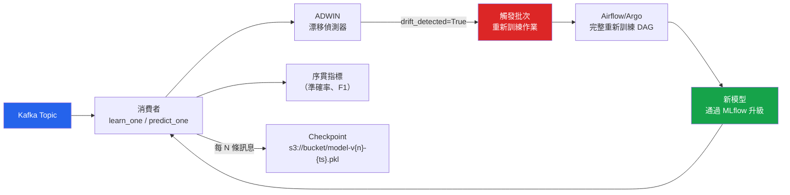

# [BEE-589] 線上學習與持續模型更新

:::info
線上學習在每個到來的資料點上增量更新模型權重，無需儲存或重新處理歷史資料。當資料到來的速度超過批次重新訓練週期的吸收能力、底層分佈持續移位，或歷史樣本的儲存不可行時，這是正確的方法。代價是對噪聲的敏感性，以及災難性遺忘的風險——當概念漂移改變分佈時，新的更新會覆蓋之前學到的模式。
:::

## 背景

批次重新訓練假設固定的、獨立同分佈（i.i.d.）的資料集和離散的訓練視窗。這對於任何世界在重新訓練週期之間會發生變化的系統都不適用：詐騙模式在幾分鐘內演化，推薦相關性在幾小時內移位，工業設備傳感器讀數反映漸進的機械磨損。過時模型的代價並非理論上的——每週重新訓練一次的信用卡詐騙模型，將會錯過在該週第二天引入的詐騙模式。

Python 線上 ML 的主要函式庫是 **River**（前身為 creme，Montiel et al., JMLR 2021, arXiv:2012.04740），它提供了流式原生 API：`learn_one(x, y)` 在單個標記樣本上更新模型，`predict_one(x)` 在無需歷史狀態的情況下生成預測。River 的 HoeffdingTreeClassifier、漂移偵測器（ADWIN、DDM、Page-Hinkley）和管道組合使其無需外部編排即可用於生產。

## Hoeffding 界

Hoeffding 樹（Domingos & Hulten, KDD 2000）是標準的線上決策樹。它們使用 Hoeffding 界生長分裂——這是一個與分佈無關的保證：以概率 1-δ，在 n 個樣本上選擇的屬性與在無限資料上選擇的屬性相同，當前兩個屬性之間的信息增益差超過以下值時：

```
ε = √(R² ln(1/δ) / 2n)
```

其中 R 是分裂標準的範圍（對於有 c 個類別的信息增益為 log c），n 是該節點看到的樣本數。樹只在滿足此界時分裂，因此它永遠不會添加一個在更多資料下會以高概率被逆轉的節點。這使得 Hoeffding 樹對於高速流是實用的：每個樣本只接觸從根到葉的路徑，而非整棵樹。

## River：生產環境中的流式 ML

```python
from river import compose, linear_model, preprocessing, drift, metrics, tree

# --- 管道組合 ---
model = compose.Pipeline(
    preprocessing.StandardScaler(),
    linear_model.LogisticRegression(optimizer=None),  # 預設使用 SGD
)

# ADWIN 漂移偵測器與模型並行運行
detector = drift.ADWIN(delta=0.002)  # 較低的 delta = 較不敏感，較少假陽性
accuracy = metrics.Accuracy()

def process_message(x: dict, y: int) -> dict:
    """處理一條 Kafka 訊息：預測、評估、更新、偵測漂移。"""
    prediction = model.predict_one(x)

    accuracy.update(y_true=y, y_pred=prediction)
    detector.update(int(prediction != y))  # 將錯誤率送入 ADWIN

    model.learn_one(x, y)  # 在此樣本上更新權重

    return {
        "prediction": prediction,
        "running_accuracy": accuracy.get(),
        "drift_detected": detector.drift_detected,
        "adwin_width": detector.width,  # 當前視窗大小
    }
```

**HoeffdingTreeClassifier** 用於非線性線上問題：

```python
from river import tree, drift

model = tree.HoeffdingTreeClassifier(
    grace_period=200,        # 考慮分裂前的最少樣本數
    delta=1e-7,              # Hoeffding 置信度（越低 = 越保守的分裂）
    tau=0.05,                # 平局打破閾值
    leaf_prediction="nba",   # 樸素貝葉斯自適應——混合 NB 與多數投票
    nb_threshold=0,          # 立即切換到 NB（無最少樣本要求）
)
```

## Kafka 整合

```python
from kafka import KafkaConsumer
from river import compose, preprocessing, linear_model, drift, metrics
import pickle
import boto3
import time

def run_online_learner(
    topic: str,
    bootstrap_servers: list[str],
    checkpoint_interval: int = 10_000,
    s3_bucket: str = "ml-models",
) -> None:
    consumer = KafkaConsumer(
        topic,
        bootstrap_servers=bootstrap_servers,
        value_deserializer=lambda b: json.loads(b.decode()),
        auto_offset_reset="earliest",
        enable_auto_commit=True,
    )

    model = compose.Pipeline(
        preprocessing.StandardScaler(),
        linear_model.LogisticRegression(),
    )
    detector = drift.ADWIN(delta=0.002)
    s3 = boto3.client("s3")
    n = 0

    for msg in consumer:
        payload = msg.value
        x, y = payload["features"], payload["label"]

        model.predict_one(x)       # 先評估再學習（序貫評估）
        model.learn_one(x, y)      # 更新模型
        detector.update(0 if ... else 1)  # 送入預測正確性

        n += 1

        if detector.drift_detected:
            trigger_batch_retrain(topic)   # 委託給 Airflow/Argo
            detector = drift.ADWIN(delta=0.002)  # 重置偵測器

        if n % checkpoint_interval == 0:
            version = n // checkpoint_interval
            key = f"online-model/v{version}-{int(time.time())}.pkl"
            s3.put_object(Bucket=s3_bucket, Key=key, Body=pickle.dumps(model))
```

Checkpoint 鍵同時包含邏輯版本（`v3`）和掛鐘時間戳。這既允許有序恢復（恢復最新版本），也允許時間審計（時刻 T 時哪個模型是活躍的）。

## ADWIN：自適應視窗

ADWIN（自適應視窗法，Bifet & Gavaldà, SIAM SDM 2007）維護最近觀察值的可變大小視窗。它持續將視窗分割為兩個子視窗，並測試它們的均值差異是否超過 Hoeffding 界。當差異超過時，它丟棄較舊的子視窗——舊分佈已經消失。

```
視窗：[---較舊---][---較新---]
如果 |mean(較舊) - mean(較新)| > ε_Hoeffding → 偵測到漂移，丟棄較舊的一半
```

ADWIN 的 delta 參數（`ADWIN(delta=0.002)`）控制假陽性率。較低的 delta 需要更大的均值差異才能觸發，減少自然噪聲引起的假報警。對於高噪聲領域（詐騙、點擊流），delta=0.002 是合理的起點。

## 暖啟動重新訓練 vs. `partial_fit()`

這是兩種不同的機制，常被混淆：

| 機制 | 作用 | 使用時機 |
|---|---|---|
| `warm_start=True`（RF/GBM） | 添加新樹；**不**更新現有樹 | 在不丟棄已學結構的情況下增加容量 |
| `partial_fit()`（SGDClassifier） | 通過 SGD 在新小批次上更新權重 | 線性模型的真正增量學習 |
| River `learn_one()` | 在單個樣本上更新權重 | 具有每訊息延遲預算的流式處理 |

```python
from sklearn.linear_model import SGDClassifier

clf = SGDClassifier(loss="log_loss", random_state=42)
clf.partial_fit(X_batch, y_batch, classes=[0, 1])   # 第一次呼叫必須包含 classes=

# 下一個視窗中有新資料到來
clf.partial_fit(X_new, y_new)   # 更新權重；不重新初始化
```

RandomForestClassifier 上的 `warm_start=True` 不更新現有樹的決策邊界。它在舊+新資料的組合上估計新樹——適用於增加容量，而非用於概念適應。

## 災難性遺忘與 EWC

非平穩分佈上的樸素線上學習會遭受災難性遺忘：適應新資料的梯度更新會覆蓋編碼了舊模式的權重。對於深度模型，彈性權重鞏固法（EWC，Kirkpatrick et al., PNAS 2017, arXiv:1612.00796）在損失函數中添加二次懲罰，減緩對先前任務重要的權重的學習速度：

```
L_EWC(θ) = L_new(θ) + (λ/2) Σᵢ Fᵢ (θᵢ - θ*ᵢ)²
```

其中 F_i 是 Fisher 信息矩陣的對角線（衡量權重 i 對先前任務的重要性），θ* 是先前任務後的權重。EWC 主要適用於使用梯度下降訓練的神經網路；River 的樹狀和線性模型改為使用顯式視窗（ADWIN）。

## 序貫評估

標準的訓練/測試分割評估對於流式資料無效，因為它洩露了時間信息。序貫（預測性序列）評估（Dawid & Vovk, Bernoulli, 1999）使用交錯的先測試後訓練：每個樣本在模型從中學習*之前*被評估，保留時間順序。

```python
from river import metrics

accuracy = metrics.Accuracy()
precision = metrics.Precision()
recall = metrics.Recall()

for x, y in data_stream:
    y_pred = model.predict_one(x)         # 先測試
    accuracy.update(y_true=y, y_pred=y_pred)
    precision.update(y_true=y, y_pred=y_pred)
    recall.update(y_true=y, y_pred=y_pred)

    model.learn_one(x, y)                 # 然後訓練
```

由於每個樣本按順序充當測試和訓練資料，序貫準確率即使對於非平穩分佈也會收斂到穩態時模型的真實準確率。



## 常見錯誤

**在流式資料上使用批次準確率指標。** 在漂移發生前的保留測試集上報告準確率是毫無意義的——分佈已經改變。始終使用序貫指標，反映模型在即時流上的當前性能。

**觸發重新訓練後忽略漂移。** 當 ADWIN 觸發完整重新訓練作業（Airflow DAG、Argo Workflow）時，線上模型會繼續在漂移的分佈上學習，直到新的批次訓練模型被升級。觸發後重置 ADWIN 偵測器以避免雙重觸發，但不要在重新訓練視窗期間停止線上學習。

**設定 ADWIN delta 過低。** `delta=1e-10` 將每個輕微波動都視為漂移。自然資料噪聲在錯誤率中產生方差。從 `delta=0.002` 開始，根據暫存環境中的假陽性率進行調整——計算那些未產生有意義準確率提升的觸發重新訓練次數。

**對深度神經網路使用 `learn_one()`。** River 設計用於具有線性或樹狀學習器的結構化表格資料。對於圖像或文字資料的深度模型，使用重放緩衝區、EWC 或漸進式網路——對單個樣本的 `learn_one()` 風格 SGD 會產生過大的梯度方差。

**不按時間戳對 Checkpoint 進行版本控制。** 僅由 `model-latest.pkl` 標識的 Checkpoint 無法將預測歸因於特定的模型狀態。始終在鍵中包含邏輯版本號和 Unix 時間戳。

## 相關 BEE

- [BEE-585 ML 監控與漂移偵測](585) — 群體級別的漂移偵測與 ADWIN 的逐預測偵測互補
- [BEE-584 ML 模型的影子模式與金絲雀部署](584) — 在升級以替換線上學習器之前驗證重新訓練的模型
- [BEE-586 ML 實驗追蹤與模型登錄庫](586) — 在 MLflow 中追蹤每個 Checkpoint 和批次重新訓練的模型以確保可審計性
- [BEE-529 AI 工作流程編排](529) — 由漂移偵測觸發的用於批次重新訓練的 Airflow/Argo DAG

## 參考資料

- Montiel, J., et al. (2021). River: machine learning for streaming data in Python. JMLR, 22(110). arXiv:2012.04740. https://arxiv.org/abs/2012.04740
- River 文件和 API 參考. https://riverml.xyz/
- Domingos, P., & Hulten, G. (2000). Mining high-speed data streams. KDD 2000. https://homes.cs.washington.edu/~pedrod/papers/kdd00.pdf
- Bifet, A., & Gavaldà, R. (2007). Learning from time-changing data with adaptive windowing. SIAM SDM 2007. https://epubs.siam.org/doi/10.1137/1.9781611972771.42
- Kirkpatrick, J., et al. (2017). Overcoming catastrophic forgetting in neural networks. PNAS, 114(13), 3521–3526. arXiv:1612.00796. https://www.pnas.org/doi/10.1073/pnas.1611835114
- Dawid, A. P., & Vovk, V. (1999). Prequential probability: principles and properties. Bernoulli, 5(1), 125–162. https://projecteuclid.org/journals/bernoulli/volume-5/issue-1/Prequential-probability-principles-and-properties/bj/1173707098.full
- scikit-learn: SGDClassifier partial_fit. https://scikit-learn.org/stable/modules/generated/sklearn.linear_model.SGDClassifier.html
- Waehner, K. (2025). Online model training and model drift with Apache Kafka and Flink. https://www.kai-waehner.de/blog/2025/02/23/online-model-training-and-model-drift-in-machine-learning-with-apache-kafka-and-flink/
