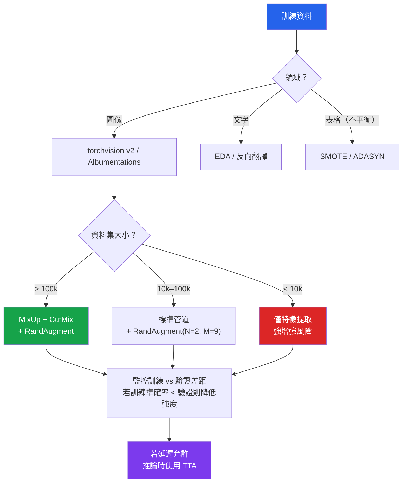

# [BEE-595] ML 訓練的資料增強策略

:::info
資料增強（Data Augmentation）透過套用保留標籤的轉換，合成擴充訓練資料集，在不收集新資料的情況下降低過擬合——但增強策略具有領域特定性，套用錯誤的轉換或過強的強度反而會降低效能。
:::

## 背景

監督式學習的核心問題是泛化：模型必須在從未見過的資料上表現良好。一個槓桿是更多資料；另一個是阻止記憶訓練樣本的正則化。資料增強占據兩者的交叉點——它透過以保留語義的方式轉換現有樣本來建立新的訓練樣本。一張水平翻轉的貓的圖像仍然是貓。用同義詞替換的句子仍然具有相同的情感。

增強的實際重要性隨資料稀缺程度而擴大。使用積極增強（MixUp、CutMix、RandAugment）訓練的 ImageNet 模型比沒有增強的相同架構高出 1–2% 的 top-1 準確率。在小型資料集（< 10 000 樣本）上，增強可以縮小資料集太小而無法訓練與足夠大之間的差距。對於表格資料，SMOTE（Chawla et al. 2002, JAIR 16:321–357）透過合成少數類別樣本來解決類別不平衡，而不是簡單地對現有樣本進行過採樣。

四個原則支配增強設計。首先，轉換必須（MUST）保留標籤：水平翻轉對大多數自然圖像任務有效，但對手寫數字分類無效，因為「6」和「9」是不同的類別。其次，增強強度必須（MUST）校準：太弱沒有好處；太強會建立不再代表原始分佈的樣本。第三，增強在訓練時應用，而非在推論時（測試時增強除外）。第四，線上增強（每批次在訓練期間應用）在各 epoch 引入多樣性，而不會爆炸性地增加儲存，代價是資料載入期間的 CPU 計算。

## 使用 torchvision v2 的經典圖像增強

Torchvision 的 v2 轉換 API（在 0.15 中引入）統一了圖像、邊界框、分割遮罩和視頻的轉換。V1 API 仍受支援，但新程式碼建議使用 V2：

```python
import torch
from torchvision.transforms import v2

# ImageNet 規模任務的標準增強管道
train_transforms = v2.Compose([
    v2.RandomResizedCrop(224, scale=(0.08, 1.0)),  # 裁剪後調整大小
    v2.RandomHorizontalFlip(p=0.5),
    v2.ColorJitter(brightness=0.4, contrast=0.4, saturation=0.4, hue=0.1),
    v2.RandomGrayscale(p=0.2),
    v2.ToImage(),
    v2.ToDtype(torch.float32, scale=True),
    v2.Normalize(mean=[0.485, 0.456, 0.406], std=[0.229, 0.224, 0.225]),
])

# 驗證轉換——無增強，僅調整大小 + 正規化
val_transforms = v2.Compose([
    v2.Resize(256),
    v2.CenterCrop(224),
    v2.ToImage(),
    v2.ToDtype(torch.float32, scale=True),
    v2.Normalize(mean=[0.485, 0.456, 0.406], std=[0.229, 0.224, 0.225]),
])

dataset = torchvision.datasets.ImageFolder(train_dir, transform=train_transforms)
loader = DataLoader(
    dataset,
    batch_size=256,
    num_workers=8,      # 並行增強的 CPU 工作程序
    pin_memory=True,    # 更快的主機到裝置傳輸
    persistent_workers=True,
)
```

`RandomResizedCrop` + `RandomHorizontalFlip` 組合是最低限度的有效基線。`ColorJitter` 引入光度不變性。`RandomGrayscale` 提高對色彩偏移的魯棒性。

## 進階增強：MixUp、CutMix 和 RandAugment

**MixUp**（Zhang et al., ICLR 2018, arXiv:1710.09412）在訓練樣本對的凸組合上訓練。輸入和標籤都被混合：

```python
import torch
import torch.nn.functional as F

def mixup_batch(x: torch.Tensor, y: torch.Tensor, alpha: float = 0.4):
    """對批次套用 MixUp。返回混合輸入和兩個標籤張量。"""
    lam = torch.distributions.Beta(alpha, alpha).sample().item()
    batch_size = x.size(0)
    idx = torch.randperm(batch_size, device=x.device)
    mixed_x = lam * x + (1 - lam) * x[idx]
    return mixed_x, y, y[idx], lam

def mixup_criterion(criterion, pred, y_a, y_b, lam):
    return lam * criterion(pred, y_a) + (1 - lam) * criterion(pred, y_b)

# 訓練循環用法
for x, y in loader:
    x, y_a, y_b, lam = mixup_batch(x.cuda(), y.cuda(), alpha=0.4)
    logits = model(x)
    loss = mixup_criterion(F.cross_entropy, logits, y_a, y_b, lam)
    loss.backward()
```

**CutMix**（Yun et al., ICCV 2019, arXiv:1905.04899）從一張圖像剪切矩形區塊並貼到另一張上，按區塊面積比例混合標籤。與混合整張圖像的 MixUp 不同，CutMix 保留局部特徵結構：

```python
def cutmix_batch(x: torch.Tensor, y: torch.Tensor, alpha: float = 1.0):
    lam = torch.distributions.Beta(alpha, alpha).sample().item()
    batch_size, _, H, W = x.shape
    idx = torch.randperm(batch_size, device=x.device)

    cut_ratio = (1 - lam) ** 0.5
    cut_h, cut_w = int(H * cut_ratio), int(W * cut_ratio)
    cy = torch.randint(H, (1,)).item()
    cx = torch.randint(W, (1,)).item()

    y1 = max(cy - cut_h // 2, 0)
    y2 = min(cy + cut_h // 2, H)
    x1 = max(cx - cut_w // 2, 0)
    x2 = min(cx + cut_w // 2, W)

    mixed_x = x.clone()
    mixed_x[:, :, y1:y2, x1:x2] = x[idx, :, y1:y2, x1:x2]
    lam_actual = 1 - (y2 - y1) * (x2 - x1) / (H * W)
    return mixed_x, y, y[idx], lam_actual
```

Torchvision v2 提供 `v2.MixUp` 和 `v2.CutMix` 作為官方轉換，在批次後應用：

```python
from torchvision.transforms import v2

cutmix = v2.CutMix(num_classes=1000)
mixup = v2.MixUp(num_classes=1000)
# 每批次隨機應用其中一個
cutmix_or_mixup = v2.RandomChoice([cutmix, mixup])

for x, y in loader:
    x, y = cutmix_or_mixup(x, y)  # y 現在是軟標籤張量
    loss = F.cross_entropy(model(x), y)
```

**RandAugment**（Cubuk et al., CVPR 2020 Workshop, arXiv:1909.13719）將自動增強搜索空間縮減為兩個參數：要應用的轉換數量（`N`）和幅度（`M`）：

```python
train_transforms = v2.Compose([
    v2.RandomResizedCrop(224),
    v2.RandAugment(num_ops=2, magnitude=9),  # N=2, M=9 是標準基線
    v2.ToImage(),
    v2.ToDtype(torch.float32, scale=True),
    v2.Normalize(mean=[0.485, 0.456, 0.406], std=[0.229, 0.224, 0.225]),
])
```

N=2, M=9 的 RandAugment 在 ResNet-50 上的 ImageNet top-1 達到 85.0%，比基線轉換提升 0.6%。

## 電腦視覺的 Albumentations

Albumentations（albumentations.ai）提供比 torchvision 更豐富的轉換集，在醫學影像、衛星影像和目標檢測方面特別深入。`A.Compose` API 自動處理邊界框、關鍵點和遮罩：

```python
import albumentations as A
from albumentations.pytorch import ToTensorV2
import cv2

train_transform = A.Compose([
    A.RandomResizedCrop(height=224, width=224, scale=(0.08, 1.0)),
    A.HorizontalFlip(p=0.5),
    A.OneOf([
        A.GaussNoise(var_limit=(10, 50)),
        A.ISONoise(color_shift=(0.01, 0.05), intensity=(0.1, 0.5)),
        A.MultiplicativeNoise(multiplier=(0.9, 1.1)),
    ], p=0.3),
    A.OneOf([
        A.MotionBlur(blur_limit=7),
        A.MedianBlur(blur_limit=5),
        A.GaussianBlur(blur_limit=5),
    ], p=0.2),
    A.ColorJitter(brightness=0.4, contrast=0.4, saturation=0.4, hue=0.1, p=0.8),
    A.CoarseDropout(max_holes=8, max_height=32, max_width=32, p=0.3),
    A.Normalize(mean=(0.485, 0.456, 0.406), std=(0.229, 0.224, 0.225)),
    ToTensorV2(),
], bbox_params=A.BboxParams(format="pascal_voc", label_fields=["class_labels"]))
```

`A.OneOf` 從群組中隨機選擇一個轉換——適用於應用相互排斥的效果（不會同時將 MotionBlur 和 GaussianBlur 應用於同一圖像）。外部 `OneOf` 上的 `p` 參數控制是否應用任何雜訊轉換。

## 文字資料增強

對於 NLP 任務，Wei & Zou（EMNLP-IJCNLP 2019, arXiv:1901.11196）引入了簡易資料增強（EDA（Easy Data Augmentation））：四種簡單操作，在小型文字分類資料集上實現統計顯著的準確率提升。

```python
import random
import nltk
from nltk.corpus import wordnet

nltk.download("wordnet", quiet=True)

def get_synonyms(word: str) -> list[str]:
    synonyms = set()
    for syn in wordnet.synsets(word):
        for lemma in syn.lemmas():
            name = lemma.name().replace("_", " ")
            if name.lower() != word.lower():
                synonyms.add(name)
    return list(synonyms)

def eda_augment(sentence: str, alpha_sr: float = 0.1, num_aug: int = 4) -> list[str]:
    """
    alpha_sr: 用同義詞替換的單詞比例
    返回 num_aug 個增強句子。
    """
    words = sentence.split()
    n = max(1, int(len(words) * alpha_sr))
    augmented = []

    for _ in range(num_aug):
        new_words = words[:]
        idxs = random.sample(range(len(new_words)), min(n, len(new_words)))
        for i in idxs:
            syns = get_synonyms(new_words[i])
            if syns:
                new_words[i] = random.choice(syns)
        augmented.append(" ".join(new_words))

    return augmented
```

EDA 在只使用 50% 資料時，對最多 11 000 個樣本的資料集達到與使用 100% 資料訓練相同的準確率。對於更大的資料集（> 50 000 個樣本），增益降至不足 0.5%。

## 表格增強：類別不平衡的 SMOTE

SMOTE（合成少數過採樣技術（Synthetic Minority Over-sampling Technique））透過在現有少數類別鄰居之間插值來建立合成少數類別樣本：

```python
from imblearn.over_sampling import SMOTE, ADASYN
from sklearn.model_selection import train_test_split

X_train, X_test, y_train, y_test = train_test_split(X, y, stratify=y)

# SMOTE：沿 k-NN 線段均勻合成
smote = SMOTE(k_neighbors=5, random_state=42)
X_resampled, y_resampled = smote.fit_resample(X_train, y_train)

# ADASYN：自適應合成——難以分類的樣本獲得更多合成鄰居
adasyn = ADASYN(n_neighbors=5, random_state=42)
X_resampled, y_resampled = adasyn.fit_resample(X_train, y_train)
```

SMOTE 不得（MUST NOT）應用於整個資料集（訓練 + 測試）。在訓練/測試分割之前應用會導致資料洩漏：從測試集鄰居衍生的合成樣本會污染評估。

ADASYN（He et al., ICDM 2008）透過在分類器表現較差的區域生成更多合成樣本來擴展 SMOTE，將增強工作集中在最需要的地方。

## 測試時增強

測試時增強（TTA（Test-Time Augmentation））在推論時應用增強以生成多個預測，然後對其進行平均：

```python
def predict_with_tta(model: torch.nn.Module, image: torch.Tensor, n_augments: int = 5) -> torch.Tensor:
    """
    image: (1, C, H, W) 張量，已正規化
    返回平均後的 softmax 機率。
    """
    tta_transforms = [
        v2.Compose([]),                              # 原始
        v2.RandomHorizontalFlip(p=1.0),              # 翻轉
        v2.RandomResizedCrop(image.shape[-2:], scale=(0.9, 1.0)),
        v2.ColorJitter(brightness=0.1, contrast=0.1),
    ]

    model.eval()
    probs = []
    with torch.no_grad():
        for transform in tta_transforms[:n_augments]:
            aug_image = transform(image)
            logits = model(aug_image)
            probs.append(F.softmax(logits, dim=-1))

    return torch.stack(probs).mean(dim=0)
```

TTA 在標準基準測試上以 n_augments × 推論時間為代價提高 0.2–0.5% 的準確率。

## 選擇增強強度

過強的增強會降低效能。信號是訓練和驗證損失之間的差距擴大——不是來自健康模型的通常訓練低於驗證差距，而是訓練損失異常高因為增強樣本太困難：

| 強度信號 | 可能原因 | 調整 |
|---|---|---|
| 訓練準確率遠低於驗證準確率 | 增強太強 | 降低幅度或概率 |
| 訓練和驗證準確率都低 | 增強 + 資料不匹配 | 檢查標籤保留假設 |
| 預熱後驗證準確率停滯 | 增強太弱 | 增加幅度 |
| 驗證準確率穩步提升 | 校準正確 | 保持當前設定 |



## 常見錯誤

**對驗證集應用增強。** 驗證轉換必須（MUST）排除隨機增強——只有確定性預處理（調整大小、中心裁剪、正規化）。增強驗證集會在指標中引入方差，使模型選擇不可靠。

**在訓練/測試分割前應用 SMOTE。** 合成鄰居從可能包含測試集資料的訓練樣本計算。合成樣本因此來自測試集信息，驗證準確率將被誇大。

**使用違反標籤語義的增強。** 垂直翻轉對航空影像（「上」具有語義意義）、OCR（「p」變成「b」）和方向是區分性特徵的細粒度任務無效。始終驗證每個轉換都為您的特定任務保留標籤。

**在可重現性測試中未對增強設定種子。** 線上增強使用每次運行之間變化的隨機轉換。檢查增強資料上模型行為的測試必須（MUST）對轉換的隨機狀態設定種子以生成可重現的樣本。

**將增強視為免費的正則化。** 增強增加有效資料集大小，但當基礎分佈狹窄時無法替代更多訓練資料。在 50 個真實少數類別樣本的 500 個 SMOTE 增強樣本上訓練的模型，在落在 50 個原始樣本凸包之外的真實少數類別樣本上仍可能失敗。

## 相關 BEE

- [BEE-587 ML 資料驗證與管道品質閘控](587) — 驗證增強樣本仍滿足 schema 和分佈約束
- [BEE-591 測試機器學習管道](591) — 增強管道的行為測試（不變性測試：預測應該（SHOULD）在保留標籤的增強下保持穩定）
- [BEE-593 ML 訓練成本最佳化](593) — 決定增強吞吐量的 DataLoader `num_workers`、`pin_memory` 和 `prefetch_factor` 設定
- [BEE-594 遷移學習與微調模式](594) — 微調時增強策略必須符合預訓練增強（使用主幹的 `weights.transforms()` 作為基礎）

## 參考文獻

- Zhang, H., Cisse, M., Dauphin, Y. N., & Lopez-Paz, D. (2018). MixUp: Beyond empirical risk minimization. ICLR 2018. arXiv:1710.09412. https://arxiv.org/abs/1710.09412
- Yun, S., Han, D., Oh, S. J., Chun, S., Choe, J., & Yoo, Y. (2019). CutMix: Regularization strategy to train strong classifiers with localizable features. ICCV 2019. arXiv:1905.04899. https://arxiv.org/abs/1905.04899
- Hendrycks, D., et al. (2020). AugMix: A simple data processing method to improve robustness and uncertainty. ICLR 2020. arXiv:1912.02781. https://arxiv.org/abs/1912.02781
- Cubuk, E. D., Zoph, B., Shlens, J., & Le, Q. V. (2020). RandAugment: Practical automated data augmentation with a reduced search space. CVPR 2020 Workshop. arXiv:1909.13719. https://arxiv.org/abs/1909.13719
- Wei, J., & Zou, K. (2019). EDA: Easy data augmentation techniques for boosting performance on text classification tasks. EMNLP-IJCNLP 2019. arXiv:1901.11196. https://arxiv.org/abs/1901.11196
- Chawla, N. V., Bowyer, K. W., Hall, L. O., & Kegelmeyer, W. P. (2002). SMOTE: Synthetic minority over-sampling technique. Journal of Artificial Intelligence Research, 16, 321–357. https://www.jair.org/index.php/jair/article/view/10302
- He, H., Bai, Y., Garcia, E. A., & Li, S. (2008). ADASYN: Adaptive synthetic sampling approach for imbalanced learning. ICDM 2008. https://ieeexplore.ieee.org/document/4633969/
- Buslaev, A., et al. (2020). Albumentations: Fast and flexible image augmentations. Information, 11(2), 125. https://www.mdpi.com/2078-2489/11/2/125
- torchvision transforms v2 documentation. https://docs.pytorch.org/vision/stable/transforms.html
