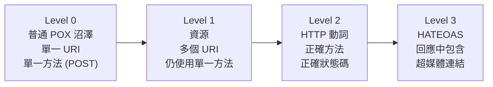
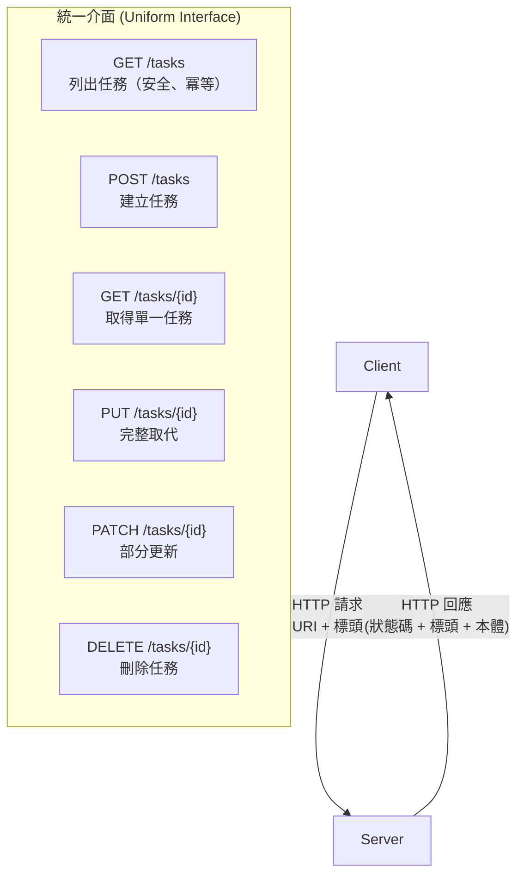

# [BEE-70] REST API 設計原則

:::info
REST 架構限制、以資源為中心的設計、HTTP 方法語意，以及狀態碼用法。
:::

:::tip Deep Dive
關於完整的 API 設計指南，包含命名慣例、錯誤設計與治理規範，請參閱 [ADP (API Design Principles)](https://alivedise.github.io/api-design-principle-beta/)。
:::

## 背景

REST（Representational State Transfer，表現層狀態轉移）是一種架構風格，由 Roy Fielding 於 2000 年的博士論文中定義。它不是協定或標準，而是一組限制條件（constraints）——當這些限制應用於分散式超媒體系統時，能產生可擴展性（scalability）、可見性（visibility）、可靠性（reliability）與可攜性（portability）等優良特性。

大多數現代 HTTP API 宣稱自己是「RESTful」，但許多都違反了賦予 REST 這些優點的限制條件。真正理解原始限制，而非只學習表面慣例，才是設計良好 API 的關鍵。

## 原則

### REST 架構限制

Fielding 定義了六項限制。同時滿足所有限制的 API 才是 RESTful。

**1. 客戶端-伺服器（Client-Server）**

客戶端與伺服器透過統一介面（uniform interface）分離。伺服器提供資源，客戶端消費資源，雙方不需了解對方的內部實作。這種分離提升了客戶端的可攜性與伺服器的可擴展性。

**2. 無狀態（Stateless）**

每個從客戶端到伺服器的請求，MUST 包含處理該請求所需的全部資訊。Session 狀態完全保存在客戶端。伺服器 MUST NOT 在請求之間儲存客戶端的 session 狀態。此限制提升了可見性（任何請求可獨立理解）、可靠性（部分失敗更容易恢復），以及可擴展性（任何伺服器都能處理任何請求）。

**3. 可快取（Cacheable）**

回應 MUST 宣告其是否可快取。當回應可快取時，客戶端與中間層 MAY 對等效的後續請求重用該回應。可快取性降低了伺服器負載並改善了感知延遲。

**4. 統一介面（Uniform Interface）**

這是區別 REST 與其他架構風格的核心限制，包含四個子限制：

- **資源的識別（Identification of resources）**：資源由穩定的 URI 識別。URI 識別資源本身，而非資源的表現形式。
- **透過表現形式操作（Manipulation through representations）**：客戶端透過表現形式（如 JSON、XML）與資源互動。表現形式加上元資料（metadata）足以修改或刪除資源。
- **自描述訊息（Self-descriptive messages）**：每條訊息包含足夠的資訊來描述如何處理它（例如 `Content-Type` 標頭）。
- **HATEOAS（Hypermedia as the Engine of Application State）**：客戶端透過回應中嵌入的超媒體連結發現可用操作，而不依賴帶外（out-of-band）文件。

**5. 分層系統（Layered System）**

客戶端 MUST NOT 能判斷自己是直接連接到最終伺服器，還是連接到中間層（負載平衡器、代理、CDN、閘道）。這使得透過分層快取實現可擴展性，並透過防火牆和閘道強化安全性成為可能。

**6. 按需程式碼（Code on Demand，選用）**

伺服器 MAY 傳送可執行程式碼（如 JavaScript）來擴展客戶端功能。這是唯一的選用限制。

---

### 以資源為中心的設計

資源是 REST API 的名詞。設計資源時應圍繞對客戶端有意義的領域實體（domain entities），而非操作或資料庫資料表。

**資源命名規則：**

- URI MUST 使用名詞識別資源，而非動詞。
- 集合資源 SHOULD 使用複數名詞：`/tasks`、`/users`、`/orders`。
- 子資源 SHOULD 表達層次結構：`/users/{userId}/orders`。
- URI SHOULD 使用小寫字母，以連字號（`-`）分隔單詞，而非底線或駝峰式命名。
- URI MUST NOT 使用副檔名（`.json`、`.xml`）表達格式；應使用 `Accept` 標頭。

| 正確 | 錯誤 |
|------|------|
| `GET /tasks` | `GET /getTasks` |
| `POST /tasks` | `POST /createTask` |
| `DELETE /tasks/{id}` | `POST /deleteTask` |
| `GET /users/{id}/orders` | `GET /getOrdersByUser?userId={id}` |

---

### HTTP 方法與語意

RFC 9110（HTTP Semantics）定義了方法屬性：**安全（safe）**方法沒有可觀察的副作用；**冪等（idempotent）**方法以相同輸入多次呼叫時，產生相同的伺服器狀態。

| 方法 | 語意 | 安全 | 冪等 | 常見用途 |
|------|------|------|------|----------|
| GET | 取得資源或集合 | 是 | 是 | 取得任務、列出任務 |
| HEAD | 同 GET 但無回應本體 | 是 | 是 | 確認存在性、取得元資料 |
| POST | 建立新資源（非冪等） | 否 | 否 | 建立任務 |
| PUT | 完整取代資源 | 否 | 是 | 完整更新 |
| PATCH | 部分更新資源 | 否 | 否* | 部分更新 |
| DELETE | 刪除資源 | 否 | 是 | 刪除任務 |
| OPTIONS | 描述通訊選項 | 是 | 是 | CORS 預檢請求 |

*PATCH 的冪等性取決於使用的 patch 文件格式。

**關鍵規則：**

- GET 請求 MUST NOT 有副作用。永遠不要在 GET 處理器中修改狀態。
- PUT MUST 取代整個資源。部分更新請使用 PATCH。
- DELETE SHOULD 是冪等的：刪除已不存在的資源 SHOULD 回傳 `404` 或 `204`，而非 `500`。
- POST MUST NOT 被作為萬用操作使用來取代其他更適合的方法。

---

### HTTP 狀態碼類別

| 範圍 | 類別 | 使用時機 |
|------|------|----------|
| 1xx | 資訊性 | 協定層級訊號（API 中極少使用） |
| 2xx | 成功 | 請求成功 |
| 3xx | 重新導向 | 資源已移動；客戶端需跟隨導向 |
| 4xx | 客戶端錯誤 | 客戶端發出錯誤請求 |
| 5xx | 伺服器錯誤 | 伺服器無法完成有效請求 |

**常用狀態碼：**

| 代碼 | 名稱 | 用途 |
|------|------|------|
| 200 | OK | 成功的 GET、PUT、PATCH、DELETE（含回應本體） |
| 201 | Created | 成功的 POST 建立資源；應包含 `Location` 標頭 |
| 204 | No Content | 成功的 DELETE 或 PUT/PATCH（無回應本體） |
| 400 | Bad Request | 請求語法錯誤、參數無效 |
| 401 | Unauthorized | 缺少或無效的認證憑證 |
| 403 | Forbidden | 已認證但無授權 |
| 404 | Not Found | 資源不存在 |
| 409 | Conflict | 請求與目前狀態衝突（如重複建立） |
| 422 | Unprocessable Entity | 語法正確但語意無效的請求 |
| 429 | Too Many Requests | 超過速率限制 |
| 500 | Internal Server Error | 非預期的伺服器端錯誤 |
| 503 | Service Unavailable | 伺服器暫時無法處理請求 |

---

### Richardson 成熟度模型

Richardson 成熟度模型（Richardson Maturity Model，RMM）是一個衡量 REST API 成熟度的框架，分為四個層級。



- **Level 0（普通 POX 沼澤）**：單一端點，所有操作都透過 POST 處理。許多 RPC 風格的 API 和早期 SOAP 服務運作在此層級。
- **Level 1（資源）**：不同資源使用不同 URI，但所有操作仍使用 POST（或所有操作都用 GET）。
- **Level 2（HTTP 動詞）**：使用適當的 HTTP 方法和狀態碼存取資源。這是大多數 API 應達到的最低層級。
- **Level 3（HATEOAS）**：回應包含超媒體連結，告訴客戶端接下來可以做什麼。客戶端不需要硬編碼 URL。

大多數生產環境的 REST API 運作在 Level 2。Level 3（HATEOAS）在理論上是「真正的 REST」，但由於客戶端實作複雜度，鮮少完整實作。

---

### HATEOAS

HATEOAS 意味著回應本體中包含指向相關操作和資源的連結。客戶端不需要預先知道 URL——它從根資源出發，跟隨連結導覽。

`GET /tasks/42` 的範例回應：

```json
{
  "id": 42,
  "title": "Write BEE-70",
  "status": "in_progress",
  "_links": {
    "self": { "href": "/tasks/42" },
    "complete": { "href": "/tasks/42/complete", "method": "POST" },
    "owner": { "href": "/users/7" },
    "collection": { "href": "/tasks" }
  }
}
```

---

### 內容協商（Content Negotiation）

客戶端 SHOULD 使用 `Accept` 標頭指定所需的回應格式。伺服器 SHOULD 使用 `Content-Type` 標頭指定回應格式。

```
GET /tasks/42
Accept: application/json

POST /tasks
Content-Type: application/json
Accept: application/json
```

若伺服器無法產生任何請求的格式，MUST 回傳 `406 Not Acceptable`。

---

## 視覺說明



---

## 範例

`tasks` 資源的 CRUD API，示範正確的 REST 用法：

### 列出任務

```
GET /tasks
Accept: application/json

HTTP/1.1 200 OK
Content-Type: application/json

{
  "data": [
    { "id": 1, "title": "Design schema", "status": "done" },
    { "id": 2, "title": "Write tests", "status": "pending" }
  ]
}
```

### 建立任務

```
POST /tasks
Content-Type: application/json

{
  "title": "Write BEE-70",
  "assignee_id": 7
}

HTTP/1.1 201 Created
Location: /tasks/42
Content-Type: application/json

{
  "id": 42,
  "title": "Write BEE-70",
  "assignee_id": 7,
  "status": "pending",
  "created_at": "2026-04-07T10:00:00Z"
}
```

### 取得任務

```
GET /tasks/42
Accept: application/json

HTTP/1.1 200 OK
Content-Type: application/json

{
  "id": 42,
  "title": "Write BEE-70",
  "assignee_id": 7,
  "status": "pending",
  "created_at": "2026-04-07T10:00:00Z"
}
```

### 部分更新

```
PATCH /tasks/42
Content-Type: application/json

{
  "status": "in_progress"
}

HTTP/1.1 200 OK
Content-Type: application/json

{
  "id": 42,
  "title": "Write BEE-70",
  "assignee_id": 7,
  "status": "in_progress",
  "created_at": "2026-04-07T10:00:00Z"
}
```

### 刪除任務

```
DELETE /tasks/42

HTTP/1.1 204 No Content
```

### 任務不存在

```
GET /tasks/999

HTTP/1.1 404 Not Found
Content-Type: application/json

{
  "type": "https://example.com/errors/not-found",
  "title": "Task not found",
  "status": 404,
  "detail": "No task with id 999 exists."
}
```

---

## 常見錯誤

**1. 在 URI 中使用動詞**

將操作嵌入 URI 是最常見的 REST 違規。HTTP 方法本身就是動詞。

```
# 錯誤
GET  /getTask/42
POST /deleteTask/42
POST /updateTaskStatus

# 正確
GET    /tasks/42
DELETE /tasks/42
PATCH  /tasks/42
```

**2. 對所有操作都使用 POST**

對所有操作預設使用 POST（RMM Level 0）會丟棄 HTTP 的語意，破壞快取、冪等性與工具整合。

```
# 錯誤
POST /api  { "action": "getTask", "id": 42 }

# 正確
GET /tasks/42
```

**3. 回傳 200 但本體含錯誤訊息**

這會破壞所有依賴狀態碼偵測失敗的 HTTP 感知工具、代理和監控系統。

```json
// 錯誤：狀態碼 200，但實際上是錯誤
HTTP/1.1 200 OK
{ "success": false, "error": "Task not found" }

// 正確
HTTP/1.1 404 Not Found
{ "status": 404, "title": "Task not found" }
```

**4. GET 請求有副作用**

RFC 9110 將 GET 定義為安全方法。瀏覽器、代理和爬蟲可能自由發出 GET 請求。會建立、修改或刪除資料的 GET 會產生非預期行為。

```
# 錯誤
GET /tasks/42/delete
GET /tasks/generateReport
```

**5. 過度使用 200 和 500**

對所有成功都回傳 `200`（忽略 `201`、`204`），對所有伺服器端問題都回傳 `500`（忽略 `503`、`409`、`422`），會讓客戶端失去做決策所需的資訊。

---

## 相關 BEPs

- [BEE-52](../Networking Fundamentals/52.md) HTTP 協定基礎
- [BEE-71](71.md) API 版本控制策略
- [BEE-72](72.md) API 冪等性
- [BEE-73](73.md) 分頁模式
- [BEE-75](75.md) API 錯誤處理與 Problem Details

---

## 參考資料

- Fielding, R.T. 2000. "Architectural Styles and the Design of Network-based Software Architectures". Chapter 5: Representational State Transfer (REST). https://ics.uci.edu/~fielding/pubs/dissertation/rest_arch_style.htm
- Fielding, R.T., and Reschke, J. 2022. "HTTP Semantics". RFC 9110. https://www.rfc-editor.org/rfc/rfc9110
- Microsoft. "Microsoft REST API Guidelines". https://github.com/microsoft/api-guidelines/blob/master/Guidelines.md
- Google. "Google API Design Guide: Resource-Oriented Design". https://docs.cloud.google.com/apis/design
- Richardson, L., and Ruby, S. 2007. "RESTful Web Services". O'Reilly Media.
