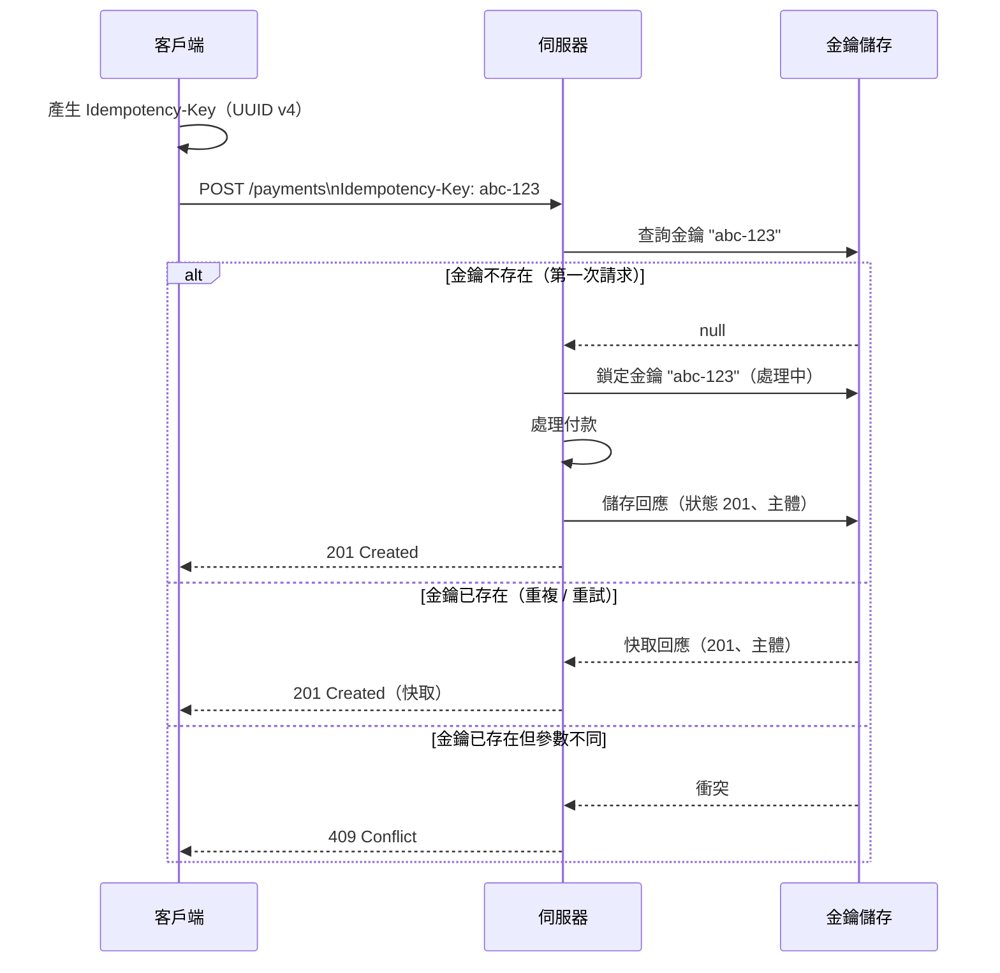

# [BEE-72] API 中的冪等性

:::info
冪等性金鑰、安全方法 vs 冪等方法，以及可安全重試的 API 設計。
:::

## 背景

分散式系統會失敗。網路連線可能在請求中途中斷，客戶端等待回應時可能超時，伺服器也可能在提交交易後、傳送回覆前崩潰。在這些情境下，客戶端面臨相同的困境：請求有被處理嗎？應該重試嗎？

若缺乏冪等性保證，重試非冪等操作（例如付款扣款）可能導致重複的副作用與資料損壞。冪等性賦予客戶端安全的重試契約：多次傳送相同請求，其可觀察的結果與傳送一次相同。

此原則已明載於 [RFC 9110 第 9.2.2 節](https://httpwg.org/specs/rfc9110.html#idempotent.methods)：

> "A request method is considered 'idempotent' if the intended effect on the server of multiple identical requests with that method is the same as the effect for a single such request."

:::tip 深入探討
關於 API 層級的冪等性設計模式與治理，請參閱 [ADE (API Design Essentials)](https://alivedise.github.io/api-design-essentials/)。
:::

## 原則

**為每個變更操作設計明確的冪等性契約。對於本質上不具冪等性的 POST 請求，要求客戶端提供冪等性金鑰。**

## 安全方法 vs 冪等方法

RFC 9110 區分了兩個相關但不同的屬性：

| 屬性 | 定義 | 範例 |
|---|---|---|
| **安全（Safe）** | 不修改伺服器狀態 | GET、HEAD、OPTIONS |
| **冪等（Idempotent）** | 重複呼叫產生相同效果 | GET、HEAD、PUT、DELETE |
| **兩者皆否** | 每次呼叫可能建立新狀態 | POST、PATCH |

所有安全方法也都是冪等的——讀取資源兩次與讀取一次效果相同。但冪等性並不意味著安全性：`DELETE /orders/123` 會修改狀態，但呼叫兩次最終讓伺服器處於相同的狀態（訂單不存在）。

**POST 預設既不安全也不冪等。** `POST /payments` 呼叫兩次會建立兩筆獨立的扣款。這正是冪等性金鑰所要解決的核心問題。

```
方法      安全？  冪等？   說明
GET       是      是      純讀取
HEAD      是      是      純讀取，無回應主體
OPTIONS   是      是      純讀取
DELETE    否      是      無論呼叫幾次，資源均不存在
PUT       否      是      完整替換；相同主體 = 相同狀態
POST      否      否      建立新資源；需要冪等性金鑰
PATCH     否      否*     取決於操作語意
```

*使用絕對值的 PATCH（將餘額設為 100）可以是冪等的；使用相對值的（餘額增加 10）則不能。

## 為 POST 請求使用冪等性金鑰

冪等性金鑰是由客戶端產生、附加於請求的唯一識別碼。伺服器利用它偵測重複提交，並回傳快取的回應，而非重新執行操作。

[Stripe 的冪等性金鑰設計](https://docs.stripe.com/api/idempotent_requests)為付款 API 奠定了此模式的基礎，至今仍是業界參考標準。Stripe 所建立的標頭慣例已被廣泛採用：

```http
POST /v1/payments HTTP/1.1
Content-Type: application/json
Idempotency-Key: 550e8400-e29b-41d4-a716-446655440000

{
  "amount": 5000,
  "currency": "usd",
  "customer_id": "cust_abc123"
}
```

### 金鑰產生規則

- 使用 V4 UUID 或其他具有足夠熵值的隨機字串（至少 128 位元）
- 在傳送前**由客戶端產生**——絕不從伺服器產生的 ID 衍生
- 金鑰應對應邏輯操作，而非 HTTP 請求（使重試能重用相同金鑰）
- 金鑰值中不應包含敏感資料（電子郵件地址、個人識別資訊）
- 最大長度：建議限制為 255 個字元

## 冪等性金鑰流程



## 伺服器端實作

### 儲存結構

將冪等性記錄存放在專用的資料庫表格，而非記憶體快取。記憶體儲存在重啟後會遺失，這會失去冪等性保護的意義。

```sql
CREATE TABLE idempotency_keys (
    key             VARCHAR(255) NOT NULL,
    user_id         BIGINT NOT NULL,
    request_hash    VARCHAR(64) NOT NULL,   -- 方法 + 路徑 + 主體的 SHA-256
    response_status SMALLINT,
    response_body   TEXT,
    created_at      TIMESTAMPTZ NOT NULL DEFAULT NOW(),
    locked_at       TIMESTAMPTZ,
    PRIMARY KEY (user_id, key)
);
```

### 處理邏輯

```
function handleRequest(userId, idempotencyKey, request):
    record = db.findIdempotencyKey(userId, idempotencyKey)

    if record exists:
        if record.requestHash != hash(request):
            return 409 Conflict  // 相同金鑰，不同參數

        if record.responseStatus is set:
            return cachedResponse(record)  // 已完成

        // 處理中：另一個執行緒正在處理
        return 409 Conflict 或 503 with Retry-After

    // 首次：原子性鎖定金鑰
    db.insertIdempotencyKey(userId, idempotencyKey, hash(request))

    try:
        result = processRequest(request)
        db.storeResponse(userId, idempotencyKey, result.status, result.body)
        return result
    catch error:
        db.deleteIdempotencyKey(userId, idempotencyKey)  // 允許重試
        raise error
```

`INSERT` 必須搭配 `(user_id, key)` 的唯一約束以確保原子性。若兩個並發請求嘗試插入相同金鑰，資料庫會拒絕其中一個，防止重複處理。

### 過期處理

冪等性記錄不應無限累積。[Stripe 在 24 小時後使金鑰過期](https://docs.stripe.com/api/idempotent_requests)；[Brandur Leach 建議保留 72 小時](https://brandur.org/idempotency-keys)以便除錯已部署的問題。選擇一個涵蓋客戶端重試超時加上緩衝時間的窗口。

執行排程清理任務：

```sql
DELETE FROM idempotency_keys
WHERE created_at < NOW() - INTERVAL '72 hours';
```

過期後，重用相同金鑰將發起新請求——客戶端必須為真正的新操作重新產生金鑰。

## 並發重複請求的競態條件

一個微妙的失敗模式：兩個相同請求在任一方儲存回應前同時到達。若缺乏適當鎖定，兩者會並行處理操作。

解決方法：

1. **插入時的唯一約束**：資料庫以衝突錯誤拒絕第二次插入。向第二個呼叫者回傳 `409 Conflict` 或 `503 Service Unavailable`。
2. **可序列化隔離**：對冪等性金鑰的查詢與插入使用 `SERIALIZABLE` 交易隔離。若 Postgres 發現兩個交易都未見到現有金鑰且都試圖插入，將中止其中一個。
3. **樂觀鎖定**：加入版本欄位；若版本已變更，第二個寫入者的更新將失敗。

安全規則：在任何時間點，**只有一個**請求可以持有特定金鑰的鎖定。其他所有請求收到非 2xx 回應，並在短暫延遲後重試。

## 付款 API 範例

### 第一次請求（正常處理）

```http
POST /v1/charges HTTP/1.1
Idempotency-Key: f47ac10b-58cc-4372-a567-0e02b2c3d479

{ "amount": 2000, "currency": "usd" }
```

```http
HTTP/1.1 201 Created
Idempotency-Key: f47ac10b-58cc-4372-a567-0e02b2c3d479

{ "id": "ch_abc", "amount": 2000, "status": "succeeded" }
```

### 使用相同金鑰重試（回傳快取回應）

```http
POST /v1/charges HTTP/1.1
Idempotency-Key: f47ac10b-58cc-4372-a567-0e02b2c3d479

{ "amount": 2000, "currency": "usd" }
```

```http
HTTP/1.1 201 Created                    ← 與原始請求相同的狀態碼
Idempotency-Key: f47ac10b-58cc-4372-a567-0e02b2c3d479

{ "id": "ch_abc", "amount": 2000, "status": "succeeded" }   ← 相同主體
```

不會建立第二筆扣款。伺服器識別了金鑰並回傳儲存的結果。

### 相同金鑰、不同參數（衝突）

```http
POST /v1/charges HTTP/1.1
Idempotency-Key: f47ac10b-58cc-4372-a567-0e02b2c3d479

{ "amount": 9999, "currency": "usd" }   ← 不同金額
```

```http
HTTP/1.1 409 Conflict

{
  "error": {
    "type": "idempotency_error",
    "message": "Idempotency key already used with different request parameters."
  }
}
```

## 常見錯誤

### 1. DELETE 未實作冪等性

常見的錯誤是刪除已不存在的資源時回傳 `404 Not Found`。這破壞了冪等性：重試成功的 DELETE 的客戶端會收到錯誤，可能錯誤地推斷刪除失敗。

```http
# 錯誤：第二次 DELETE 回傳 404
DELETE /orders/123 → 204 No Content
DELETE /orders/123 → 404 Not Found   ← 破壞冪等性

# 正確：無論呼叫幾次，第二次 DELETE 均回傳 204
DELETE /orders/123 → 204 No Content
DELETE /orders/123 → 204 No Content  ← 冪等
```

### 2. 使用伺服器產生的 ID 作為冪等性金鑰

使用資料庫指派的記錄 ID 作為冪等性金鑰是循環的：ID 在伺服器處理請求前不存在，因此第一次呼叫時沒有金鑰可以傳送。

```
# 錯誤：ID 只有在建立後才知道
POST /orders → { "id": "ord_123" }
# 現在用 "ord_123" 作為冪等性金鑰？太晚了。

# 正確：客戶端在傳送前產生金鑰
客戶端產生："idem_f47ac10b"
POST /orders
Idempotency-Key: idem_f47ac10b
```

### 3. 儲存的回應無過期機制

若沒有 TTL 或清理任務，冪等性金鑰表格將無限增長。請強制執行過期——對大多數 API 來說，24 至 72 小時是實際可行的範圍。

### 4. 金鑰太短或可預測

短數字金鑰（例如 6 位數 PIN）容易發生碰撞，無論是意外還是惡意行為者試圖取得另一位用戶的快取回應。最少使用 128 位元的熵值（UUID v4 包含 122 位元的隨機資料）。

### 5. 未處理並發重複請求

若你在兩個獨立步驟中檢查金鑰是否存在然後插入，而沒有使用交易，兩個同時到達的請求可能在任一方插入之前都通過存在性檢查。請務必使用原子性的 `INSERT ... ON CONFLICT` 或等效機制。

## 相關 BEE

- **BEE-70** — REST API 設計原則：HTTP 方法語意與資源建模
- **BEE-164** — 訊息傳遞中的冪等性：將相同保證應用於非同步訊息佇列
- **BEE-261** — 重試策略：指數退避、抖動與客戶端重試預算

## 參考資料

- [RFC 9110 第 9.2.2 節 — 冪等方法](https://httpwg.org/specs/rfc9110.html#idempotent.methods)
- [Stripe — Idempotent Requests](https://docs.stripe.com/api/idempotent_requests)
- [Brandur Leach — Implementing Stripe-like Idempotency Keys in Postgres](https://brandur.org/idempotency-keys)
