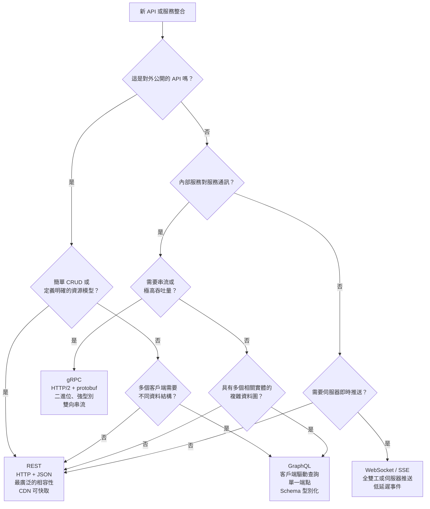

# [BEP-74] GraphQL vs REST vs gRPC

:::info
協定比較：REST、GraphQL 與 gRPC 的優勢、取捨，以及何時選擇各自的協定。
:::

## 背景

多數後端工程師從 REST 開始學習。隨著系統規模擴大——更多客戶端、更多服務、更嚴格的延遲預算——REST 的統一介面模型開始暴露出限制：行動裝置客戶端不需要的資料被過度傳輸（over-fetching）、需要多次往返才能取得足夠資料（under-fetching），以及高吞吐量內部服務中顯著的序列化負擔。

GraphQL 和 gRPC 分別被設計來解決上述不同的問題子集。兩者都不是 REST 的通用替代品。決策的關鍵在於將協定的特性與問題需求正確匹配。

第四個選項——WebSocket 與 Server-Sent Events（SSE）——將在本文末簡要介紹，適用於基於輪詢的協定難以處理的即時推送場景。

## 原則

### REST

REST（Representational State Transfer，表現層狀態轉移）是建立在 HTTP 之上的架構風格。其核心特性包含使用標準 HTTP 方法的統一介面（GET、POST、PUT、PATCH、DELETE）、無狀態請求、以資源為導向的 URI，以及充分利用現有 HTTP 基礎設施：快取、代理、CDN 與瀏覽器。

完整的 REST 架構限制與 HTTP 方法語意請參閱 [BEP-70](70.md)。

**優勢：**
- 通用工具支援：每個 HTTP 客戶端、瀏覽器與程式語言都能消費 REST API，無需程式碼生成步驟。
- 透明快取：GET 回應可透過標準 `Cache-Control` 標頭被 CDN 與瀏覽器快取。
- 人類可讀：HTTPS 上的 JSON 可用 `curl` 和任何網路檢查器直接除錯。
- 廣泛理解的契約：無需學習 schema 語言，無需解碼二進位格式。

**弱點：**
- 過度傳輸（over-fetching）：伺服器定義回應結構，客戶端取得端點回傳的全部內容，而非它所需要的。
- 傳輸不足（under-fetching）：複雜的資料圖可能需要 N 次循序請求（`/users/1`，接著 `/users/1/orders`，再接著 `/orders/42/items`）。
- 即時通訊沒有標準：輪詢與 webhook 是變通方案，不是原生能力。

---

### GraphQL

GraphQL 是一種 API 查詢語言，以及執行這些查詢的伺服器端執行時，最初由 Facebook 於 2012 年開發，2015 年開源。現由 GraphQL Foundation（Linux Foundation 旗下專案）治理。

核心概念：客戶端發送一個型別化查詢，精確描述所需資料，伺服器返回恰好符合該結構的資料——不多也不少。

**Schema 與型別系統**

每個 GraphQL API 都由以 Schema Definition Language（SDL）撰寫的 schema 定義：

```graphql
type User {
  id: ID!
  name: String!
  email: String!
  orders: [Order!]!
}

type Order {
  id: ID!
  total: Float!
  items: [OrderItem!]!
}

type Query {
  user(id: ID!): User
}
```

Schema 即是契約。客戶端與伺服器都可以獨立地對其進行驗證。

**客戶端驅動的查詢**

客戶端精確請求所需內容：

```graphql
query {
  user(id: "1") {
    name
    orders {
      id
      total
    }
  }
}
```

回應只包含請求的欄位。行動客戶端可請求最小化的 payload；儀表板可請求豐富的資料——相同的端點、相同的 schema、不同的查詢。

**Resolver 中的 N+1 問題**

GraphQL 的彈性將效能問題內移。當伺服器解析一組使用者及其訂單時，若採用天真的實作，每位使用者會觸發一次資料庫查詢——N 位使用者會產生 N+1 次查詢。解決方式是使用 DataLoader 模式（在單次請求執行範圍內進行請求批次處理與快取）。

**優勢：**
- 消除 over-fetching 與 under-fetching。
- 單一端點，所有查詢都發送至 `POST /graphql`。
- Schema 可供機器讀取；工具（GraphiQL、Codegen）可自動生成型別化客戶端。
- 強型別自省（introspection）：客戶端可在執行期發現完整的 API 介面。
- 非常適合包含多個相關實體的複雜資料圖。

**弱點：**
- Resolver 的 N+1 問題需要 DataLoader 或等效方案。
- 一個高成本查詢可能消耗不成比例的伺服器資源；針對個別查詢的速率限制需要查詢複雜度分析，而非單純的每請求速率限制。
- 無標準 HTTP 快取（POST 請求不被 CDN 快取）；快取需要持久化查詢（persisted queries）或支援 CDN 的 GraphQL 層。
- 對於只有 1–2 個實體型別的簡單 CRUD，使用 GraphQL 的額外負擔得不償失。

---

### gRPC

gRPC 是 Google 開發的開源遠端程序呼叫（Remote Procedure Call）框架，使用 Protocol Buffers（protobuf）作為介面定義語言，HTTP/2 作為傳輸層。

gRPC 依賴的 HTTP/2 基礎知識（包含多路復用與標頭壓縮）請參閱 [BEP-52](../Networking Fundamentals/52.md)。

**Protocol Buffers**

服務與訊息定義在 `.proto` 檔案中：

```protobuf
syntax = "proto3";

service UserService {
  rpc GetUser (GetUserRequest) returns (UserResponse);
  rpc ListUserOrders (GetUserRequest) returns (stream OrderResponse);
}

message GetUserRequest {
  string user_id = 1;
}

message UserResponse {
  string id = 1;
  string name = 2;
  string email = 3;
}

message OrderResponse {
  string id = 1;
  float total = 2;
}
```

`protoc` 編譯器可為 Go、Java、Python、TypeScript 等多種語言生成強型別的客戶端與伺服器 stub。Wire 格式為二進位——比 JSON 更緊湊，解析速度更快。

**通訊模式**

gRPC 支援四種通訊模式：

| 模式 | 描述 |
|------|------|
| Unary（一元） | 客戶端發送一個請求，接收一個回應 |
| Server streaming（伺服器串流） | 客戶端發送一個請求，伺服器串流傳回多個回應 |
| Client streaming（客戶端串流） | 客戶端串流傳送多個請求，伺服器回傳一個回應 |
| Bidirectional streaming（雙向串流） | 雙方同時串流 |

串流是透過 HTTP/2 原生支援的協定能力，不是後加的。

**優勢：**
- 透過 protobuf 進行二進位序列化：比 JSON 更小的 payload、更快的解析速度、更低的 CPU 負擔。
- 跨語言強型別契約與程式碼生成：消除整類整合 bug。
- HTTP/2 多路復用：單一連線上多個串流，無 head-of-line blocking。
- 即時場景的雙向串流（事件推送、遙測、聊天）。
- 內建 deadline 與取消傳播，跨服務邊界運作。

**弱點：**
- 二進位格式不可人類閱讀；除錯需要工具（`grpcurl`、支援 protobuf 插件的 Wireshark）。
- 瀏覽器客戶端無法直接透過 HTTP/2 呼叫 gRPC——需要 `grpc-web` 代理（如 Envoy）進行轉換。
- Proto schema 變更需要謹慎協調客戶端與伺服器的部署（雖然 protobuf 有向後相容的演進規則）。
- 初始建置成本較高：protobuf 工具鏈、程式碼生成、建置流水線整合。

---

### WebSocket 與 SSE（即時通訊第四選項）

對於需要低延遲伺服器到客戶端推送的場景（即時儀表板、協作編輯、通知、多人遊戲），REST 輪詢與 gRPC Unary 都不適合。

- **WebSocket**：全雙工、持久 TCP 連線。當客戶端也需要頻繁向伺服器發送訊息時使用（聊天、多人狀態同步）。
- **SSE（Server-Sent Events）**：基於 HTTP/1.1 或 HTTP/2 的單向伺服器到客戶端推送。當伺服器推送事件而客戶端很少發送資料時使用（即時資訊流、進度條、稽核日誌）。

這兩種協定都在 REST/GraphQL/gRPC 的決策範圍之外，但提及它們可避免團隊將輪詢視為唯一替代方案。

---

## 視覺說明

選擇正確協定的決策樹：



---

## 範例

相同的操作——「取得使用者 1 及其訂單」——在三種協定中的實作方式。

### REST

```
GET /users/1
Accept: application/json

HTTP/1.1 200 OK
Content-Type: application/json

{
  "id": "1",
  "name": "Alice",
  "email": "alice@example.com"
}
```

訂單需要第二次請求：

```
GET /users/1/orders
Accept: application/json

HTTP/1.1 200 OK
Content-Type: application/json

{
  "data": [
    { "id": "101", "total": 49.99, "items": [...] },
    { "id": "102", "total": 120.00, "items": [...] }
  ]
}
```

兩次往返。即使客戶端不需要 `email`，使用者回應也包含了它。

---

### GraphQL

```graphql
# 請求：POST /graphql
# Content-Type: application/json

{
  "query": "query GetUserWithOrders($id: ID!) {
    user(id: $id) {
      name
      orders {
        id
        total
      }
    }
  }",
  "variables": { "id": "1" }
}
```

```json
HTTP/1.1 200 OK
Content-Type: application/json

{
  "data": {
    "user": {
      "name": "Alice",
      "orders": [
        { "id": "101", "total": 49.99 },
        { "id": "102", "total": 120.00 }
      ]
    }
  }
}
```

一次往返。只回傳 `name`（不包含 `email`）。回應結構正好是客戶端請求的形式。

---

### gRPC

Proto 定義：

```protobuf
service UserService {
  rpc GetUserWithOrders (GetUserRequest) returns (UserWithOrdersResponse);
}

message GetUserRequest { string user_id = 1; }
message Order { string id = 1; float total = 2; }
message UserWithOrdersResponse {
  string name = 1;
  repeated Order orders = 2;
}
```

生成的客戶端呼叫（Go 範例）：

```go
resp, err := client.GetUserWithOrders(ctx, &pb.GetUserRequest{UserId: "1"})
// resp.Name == "Alice"
// resp.Orders == [{Id:"101", Total:49.99}, {Id:"102", Total:120.00}]
```

一次 RPC 呼叫。二進位 wire 格式。在編譯期即強型別。無需 JSON 解析。

---

## 常見錯誤

**1. 對簡單 CRUD 使用 GraphQL**

如果 API 只有 3–4 個扁平資源，且只有一種客戶端類型，GraphQL 增加了 schema 層、resolver 層、DataLoader 複雜度，以及自訂快取策略——卻沒有帶來任何收益。REST 更簡單。

**2. 直接將 gRPC 暴露給瀏覽器客戶端**

瀏覽器無法原生發起 HTTP/2 gRPC 呼叫。需要 `grpc-web` 代理（如 Envoy）將瀏覽器的 HTTP/1.1 請求轉換為 gRPC。在部署架構中需提前規劃。若瀏覽器是主要客戶端，REST 或 GraphQL 更簡單。

**3. 未對 GraphQL 查詢進行複雜度限制的速率管控**

單個 GraphQL 查詢可以跨多個 resolver 請求深度巢狀的資料。基於 IP 的請求速率限制無法防禦一個高成本查詢。應使用查詢深度限制與查詢複雜度評分（Apollo Server、Strawberry 及多數 GraphQL 框架均支援），拒絕超過成本閾值的查詢。

**4. 依據流行趨勢而非使用場景選擇協定**

gRPC 非常適合延遲預算嚴格的內部微服務通訊。GraphQL 非常適合具有多種消費者類型的產品 API。REST 非常適合公開 API、簡單 CRUD，以及任何能從 HTTP 快取獲益的場景。在單一服務邊界內無技術理由地混用三種協定，只會增加維護負擔而不帶來相應收益。

**5. 沒有閘道就混用多種協定**

若 REST、GraphQL 和 gRPC 端點來自不同服務，但沒有 API 閘道（如 Kong、Apigee、AWS API Gateway），則認證、速率限制、可觀測性和路由需要在每個服務中獨立實作。應在閘道層集中處理跨切面關注點（cross-cutting concerns）。

---

## 相關 BEPs

- [BEP-52](../Networking Fundamentals/52.md) HTTP/2 與傳輸層基礎（gRPC 的底層依賴）
- [BEP-70](70.md) REST API 設計原則
- [BEP-76](76.md) Webhook 與回呼模式（非同步通訊）

---

## 參考資料

- GraphQL Foundation. "GraphQL Specification". https://spec.graphql.org/October2021/
- GraphQL Foundation. "Introduction to GraphQL". https://graphql.org/learn/
- gRPC Authors. "Introduction to gRPC". https://grpc.io/docs/what-is-grpc/introduction/
- gRPC Authors. "Core concepts, architecture and lifecycle". https://grpc.io/docs/what-is-grpc/core-concepts/
- WunderGraph. "When to use GraphQL vs Federation vs tRPC vs REST vs gRPC vs AsyncAPI vs WebHooks — A 2024 Comparison". https://wundergraph.com/blog/graphql-vs-federation-vs-trpc-vs-rest-vs-grpc-vs-asyncapi-vs-webhooks
- Arora, V. "REST vs. gRPC vs. GraphQL: A Comparative Analysis with Real-World Company Data". https://medium.com/@reachvivek.arora/rest-vs-grpc-vs-graphql-a-comparative-analysis-with-real-world-company-data-33ee430b7619
- Java Code Geeks. "GraphQL vs. REST vs. gRPC: The 2026 API Architecture Decision". https://www.javacodegeeks.com/2026/02/graphql-vs-rest-vs-grpc-the-2026-api-architecture-decision.html
