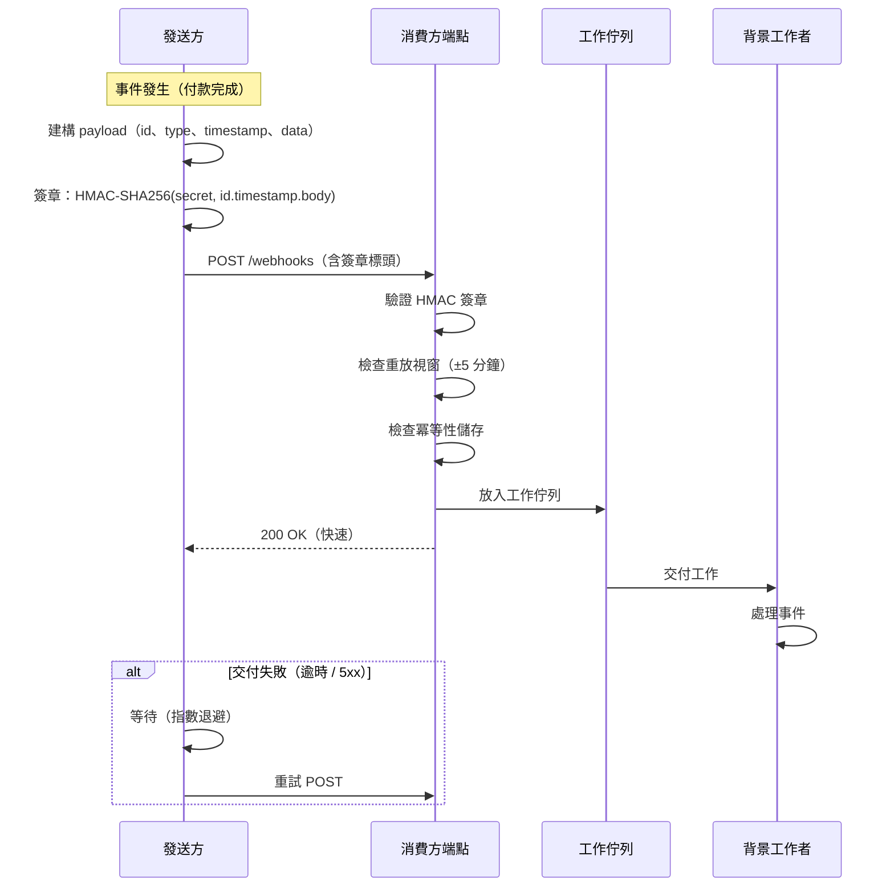

# [BEE-76] Webhook 與回呼模式

:::info
伺服器對伺服器的推送式整合：Payload 設計、簽章驗證、重試策略與交付保證。
:::

## 背景

現代分散式系統經常需要對外部服務發生的事件作出反應。最直接的做法是輪詢（polling）：定期詢問「有任何變動嗎？」然而，輪詢浪費資源、延遲受制於輪詢間隔，且當大量消費者監看大量資源時擴展性極差。

Webhook 以推送模型解決了這個問題。當來源系統發生事件時，它立即向已登記的消費者 URL 發送 HTTP POST。消費者無需持續查詢即可接收到近即時通知。

這個模式目前已十分普遍：支付處理（Stripe）、版本控制平台（GitHub、GitLab）、通訊平台（Twilio、SendGrid）以及數百個 SaaS 產品都透過 webhook 傳遞事件。由 Svix、Zapier、Twilio、Supabase、Kong 等公司共同支持的 [Standard Webhooks 倡議](https://www.standardwebhooks.com/)，制定了通用規格以減少各實作之間的碎片化。

## 原則

**將 webhook 設計為可靠、安全且冪等消費的系統。** 發送方必須為每次交付簽章，並在失敗時實作指數退避。接收方必須驗證簽章、迅速以 2xx 回應、非同步處理，並能無副作用地處理重複交付。

## Webhook 與輪詢的比較

| 維度 | Webhook（推送） | 輪詢（拉取） |
|---|---|---|
| 延遲 | 近即時 | 受輪詢間隔限制 |
| 發送方資源成本 | 低 — 僅在事件發生時傳送 | 高 — 必須回應所有輪詢 |
| 接收方資源成本 | 低 — 僅在事件發生時喚醒 | 高 — 持續輪詢 |
| 可靠性 | 需要重試邏輯 | 接收方自行控制重試 |
| 錯過事件 | 接收端停機時可能遺漏 | 只要間隔夠短通常不會 |
| 維運複雜度 | 較高（端點暴露、密鑰管理） | 較低 |

**建議：** 以 webhook 作為主要交付機制，並輔以輪詢或對帳端點，以便停機後補接事件。對於正確性關鍵的流程，切勿單獨依賴 webhook。

## Payload 設計

設計良好的 webhook payload 包含消費者理解並處理事件所需的一切資訊，無需額外的 API 呼叫。

### 必要欄位

```json
{
  "webhook-id": "msg_2NWaIqfQwBtaOvXOeRmkMN5G1A4",
  "type": "payment.completed",
  "timestamp": "2026-04-07T08:30:00Z",
  "data": {
    "payment_id": "pay_abc123",
    "amount": 9900,
    "currency": "USD",
    "status": "completed",
    "customer_id": "cus_xyz789"
  }
}
```

- **`webhook-id`** — 本次交付的唯一識別符，作為冪等鍵使用。若相同的 `webhook-id` 抵達兩次，消費者可安全地丟棄重複內容。
- **`type`** — 以點號分隔的事件名稱，遵循 `resource.action` 慣例（例如 `payment.completed`、`user.deleted`）。
- **`timestamp`** — 事件在來源系統發生的 ISO 8601 UTC 時間，與交付時間不同。
- **`data`** — 事件發生當下的資源快照。提供足夠的上下文，讓消費者鮮少需要回呼取得更多資料。

### 大小預算

Payload 應保持在 20 KB 以內。非常大的 payload 應包含參考 URL，讓消費者可呼叫以取得完整詳情，同時也避免不必要地傳輸敏感資料。

## 簽章驗證

若無簽章驗證，任何人只要發現 webhook 端點就能發送偽造事件。簽章驗證是不可妥協的必要措施。

### Standard Webhooks 標頭

遵循 [Standard Webhooks 規格](https://github.com/standard-webhooks/standard-webhooks/blob/main/spec/standard-webhooks.md)：

| 標頭 | 值 |
|---|---|
| `webhook-id` | 訊息唯一識別符 |
| `webhook-timestamp` | Unix 時間戳記（自 epoch 起的秒數） |
| `webhook-signature` | 以空格分隔的 `v1,<base64-signature>` 列表 |

### HMAC-SHA256 簽章（發送方）

```
signed_content = webhook-id + "." + webhook-timestamp + "." + raw_body
signature = base64(HMAC-SHA256(secret, signed_content))
header = "v1," + signature
```

密鑰是共享的對稱金鑰，透過帶外方式（例如密鑰管理系統）發送給消費者，絕不可放在原始碼或日誌中。

### 驗證（消費方）

```typescript
import { createHmac, timingSafeEqual } from "crypto";

function verifyWebhookSignature(
  rawBody: string,
  webhookId: string,
  webhookTimestamp: string,
  webhookSignature: string,
  secret: string // base64 編碼，不含 "whsec_" 前綴
): void {
  // 1. 防重放保護：若時間戳記超出 5 分鐘視窗則拒絕
  const tsSeconds = parseInt(webhookTimestamp, 10);
  const nowSeconds = Math.floor(Date.now() / 1000);
  if (Math.abs(nowSeconds - tsSeconds) > 300) {
    throw new Error("Webhook 時間戳記超出容許視窗");
  }

  // 2. 重建待簽章內容
  const signedContent = `${webhookId}.${webhookTimestamp}.${rawBody}`;

  // 3. 計算預期簽章
  const secretBytes = Buffer.from(secret, "base64");
  const expectedSig = createHmac("sha256", secretBytes)
    .update(signedContent)
    .digest("base64");

  // 4. 與標頭中每個簽章比對（支援金鑰輪換）
  const signatures = webhookSignature.split(" ");
  const verified = signatures.some((sig) => {
    const [scheme, value] = sig.split(",");
    if (scheme !== "v1") return false; // 忽略未知方案
    return timingSafeEqual(
      Buffer.from(expectedSig),
      Buffer.from(value)
    );
  });

  if (!verified) {
    throw new Error("Webhook 簽章驗證失敗");
  }
}
```

重點說明：
- 使用**常數時間比較**（`timingSafeEqual`）以防止時序攻擊。
- 拒絕未知方案的簽章以防止降級攻擊。
- 標頭可包含多個以空格分隔的簽章，支援**零停機金鑰輪換**：過渡期間發送方以舊金鑰和新金鑰同時簽章。

## 重試策略與交付保證

Webhook 採用**至少一次交付**語義。發送方持續重試直到收到 2xx 回應或耗盡重試額度。這意味著消費者必須實作冪等性（參見 [BEE-72](72.md)）。

### 建議重試排程

| 嘗試次數 | 距上次失敗的延遲 |
|---|---|
| 第 1 次（立即） | — |
| 第 2 次 | 5 分鐘 |
| 第 3 次 | 30 分鐘 |
| 第 4 次 | 2 小時 |
| 第 5 次 | 24 小時 |

最後一次嘗試後，將事件移至死信佇列（dead-letter queue）以供人工檢查，而非靜默丟棄。

### 視為失敗的情況

- HTTP 4xx 回應（429 Too Many Requests 除外，應觸發退避）
- HTTP 5xx 回應
- TCP 連線失敗或逾時
- 在逾時視窗內（通常 10–15 秒）未收到回應

對於表示永久性設定錯誤的 4xx 客戶端錯誤（例如 401 Unauthorized 搭配無效簽章），若非瞬時錯誤則不應重試。

## 消費方端點設計

### 快速回應，非同步處理

最重要的規則只有一條：**立即回應 2xx，之後再處理**。

```typescript
// Express 範例
app.post("/webhooks/payments", async (req, res) => {
  // 1. 優先驗證簽章 — 這很快
  try {
    verifyWebhookSignature(
      req.rawBody,
      req.headers["webhook-id"] as string,
      req.headers["webhook-timestamp"] as string,
      req.headers["webhook-signature"] as string,
      process.env.WEBHOOK_SECRET!
    );
  } catch {
    return res.status(401).json({ error: "簽章無效" });
  }

  // 2. 檢查冪等性 — 是否已處理過此交付？
  const webhookId = req.headers["webhook-id"] as string;
  if (await idempotencyStore.has(webhookId)) {
    return res.status(200).json({ status: "already_processed" });
  }

  // 3. 放入非同步佇列 — 不要在此阻塞
  await queue.enqueue("process-payment-event", req.body);

  // 4. 立即回應
  res.status(200).json({ status: "accepted" });
});
```

若處理超過 10 秒，發送方很可能逾時並重試，造成重複與負載放大。務必將工作卸載至佇列（參見 [BEE-220](220.md)）。

### 冪等鍵追蹤

將已處理的 `webhook-id` 值儲存在快速查詢的儲存庫（Redis、資料庫）中，TTL 設定為符合發送方最大重試視窗（例如 72 小時）。重複交付時回傳 200 而不重新處理。

### 豁免 CSRF 防護

Webhook 端點必須排除在 CSRF 中介層之外。Webhook 是機器對機器的通訊，永遠不會有瀏覽器 session cookie。

## Webhook 交付流程



## 安全性檢查清單

1. **每次請求都驗證簽章。** 在確認 HMAC 簽章相符之前，絕不處理 webhook payload。
2. **強制時間戳記容許視窗。** 拒絕時間戳記超過 5 分鐘的交付以防止重放攻擊。
3. **僅允許 HTTPS。** 絕不透過純 HTTP 接受 webhook 交付，強制使用 TLS 1.2+。
4. **追蹤冪等鍵。** 儲存已處理的 `webhook-id` 值以偵測並略過重複內容。
5. **IP 允許清單（縱深防禦）。** 當發送方公布來源 IP 範圍時（如 Stripe、GitHub），除了簽章驗證外，同時設定防火牆僅允許這些範圍。
6. **定期輪換密鑰。** Webhook 密鑰洩漏後，攻擊者可偽造任意事件。定期輪換密鑰，並在任何疑似洩漏後立即輪換。
7. **絕不將原始密鑰記錄至日誌。** 可記錄 `webhook-id` 和事件類型以便除錯，但絕不記錄簽章密鑰或完整的 `webhook-signature` 標頭明文值。

## 常見錯誤

### 1. 同步處理（阻塞回應）

**錯誤做法：** 在回應之前執行資料庫寫入、發送電子郵件或呼叫下游 API。

**影響：** 發送方在 10–15 秒後逾時並重試，造成重複事件與負載放大。

**修正：** 立即放入佇列，回應 2xx，在背景工作者中處理。

### 2. 未驗證 Webhook 簽章

**錯誤做法：** 不檢查簽章標頭，直接接受任何對 webhook URL 的 POST 請求。

**影響：** 攻擊者可偽造任意事件——假造付款、未授權的帳戶變更、資料外洩觸發。

**修正：** 在接觸 payload 之前，務必使用常數時間 HMAC 比較驗證 `webhook-signature`。

### 3. 未處理冪等性

**錯誤做法：** 處理每次交付時不檢查是否已處理過。

**影響：** 至少一次交付語義意味著在重試期間相同事件會多次抵達。可能導致重複扣款、發送重複電子郵件或重複記貸。

**修正：** 首次成功處理後記錄 `webhook-id`，處理前先檢查，重複收到時回傳 200。

### 4. 單獨依賴 Webhook 確保正確性

**錯誤做法：** 將 webhook 視為關鍵狀態的唯一事實來源。

**影響：** 若你的端點在交付期間停機且耗盡重試，事件就會遺失，沒有補接機制。

**修正：** 提供輪詢或對帳端點（例如 `GET /payments?updated_since=<timestamp>`），定期執行對帳作業。

### 5. 在日誌或錯誤回應中洩漏密鑰

**錯誤做法：** 逐字記錄 `req.headers`，或在錯誤訊息中包含簽章。

**影響：** 密鑰洩漏至日誌彙整系統，違反最小權限原則並允許偽造。

**修正：** 僅記錄 `webhook-id`、事件類型和消毒後的診斷欄位，絕不記錄含有密鑰的完整標頭。

## Standard Webhooks 倡議

[Standard Webhooks](https://www.standardwebhooks.com/) 是由 Svix、Zapier、Twilio、Supabase、Kong、Lob、Mux 和 ngrok 共同撰寫的開放規格，標準化了：

- 標頭名稱（`webhook-id`、`webhook-timestamp`、`webhook-signature`）
- 簽章演算法（`v1` 為 HMAC-SHA256，`v1a` 為 Ed25519）
- 待簽章內容格式（`id.timestamp.body`）
- 重放保護視窗
- 密鑰格式（對稱為 `whsec_<base64>`，非對稱為 `whpk_`/`whsk_`）

採用者包括 OpenAI、Brex、Clerk、Resend 及 25 個以上的其他平台。如果你正在建構新的 webhook 發送方，採用 Standard Webhooks 可降低消費者的整合複雜度，並允許跨語言共用驗證函式庫。

參考函式庫：Python、TypeScript/JavaScript、Go、Rust、Java/Kotlin、Ruby、PHP、C#、Elixir，皆可在 [github.com/standard-webhooks](https://github.com/standard-webhooks/standard-webhooks) 取得。

## 相關 BEE

- [BEE-34](34.md) — HMAC 密碼學基礎
- [BEE-72](72.md) — API 中的冪等性
- [BEE-220](220.md) — 訊息傳遞模式與非同步處理
- [BEE-261](261.md) — 重試策略與指數退避

## 參考資料

- Standard Webhooks 規格：[https://github.com/standard-webhooks/standard-webhooks/blob/main/spec/standard-webhooks.md](https://github.com/standard-webhooks/standard-webhooks/blob/main/spec/standard-webhooks.md)
- Standard Webhooks 倡議：[https://www.standardwebhooks.com/](https://www.standardwebhooks.com/)
- Stripe Webhook 文件：[https://docs.stripe.com/webhooks](https://docs.stripe.com/webhooks)
- GitHub Webhook 最佳實踐：[https://docs.github.com/en/webhooks/using-webhooks/best-practices-for-using-webhooks](https://docs.github.com/en/webhooks/using-webhooks/best-practices-for-using-webhooks)
- Svix 接收 Webhook 指南：[https://docs.svix.com/receiving/introduction](https://docs.svix.com/receiving/introduction)
