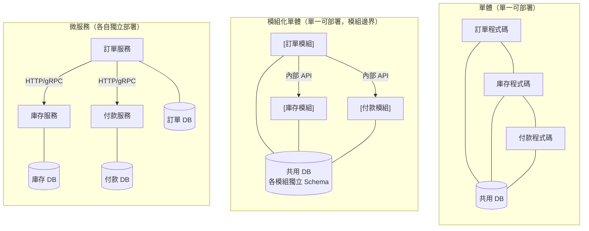

# [BEE-100] 單體 vs 微服務 vs 模組化單體

:::info
各部署方式的取捨、適用時機，以及彼此之間的遷移路徑。
:::

## 背景

後端系統最關鍵的架構決策之一，是如何切分並部署程式碼。目前有三種主流方式：**單體（Monolith）**（單一可部署單元）、**微服務（Microservices）**（多個可獨立部署的服務）、以及**模組化單體（Modular Monolith）**（單一可部署單元，但內部具有強固的模組邊界）。

每種方式都有真實的取捨。業界曾集體矯枉過正地轉向微服務，再擺回單體，再擺回去。正確的答案取決於團隊規模、領域成熟度，以及運維能力，而非流行趨勢。

Martin Fowler 觀察到，幾乎所有成功的微服務採用案例都是從單體出發的，而一開始就以微服務架構建立的系統則屢屢遭遇嚴重困難。DHH 的《Majestic Monolith》文章主張，結構良好的單體不是通往更好架構的跳板，對大多數團隊而言它本身就是正確的架構。Shopify 的工程部落格記錄了一條中間路線：將一個擁有 280 萬行 Ruby 程式碼的單體，演進為模組化單體，而非拆解成獨立服務。

## 原則

### 單體（Monolith）

單體將所有應用功能打包成單一可部署的產出物。所有模組共用執行環境、資料庫與部署流程。

**優點：**
- 早期開發、測試、部署簡單
- 模組間無需網路呼叫，函數呼叫快速且具事務性
- 跨模組重構與程式碼導覽較容易
- 單一 CI/CD 流程，單一可觀測目標
- ACID 交易可輕易跨越整個領域

**缺點：**
- 擴展時必須擴展整個應用程式，無法只擴展熱點
- 長期耦合風險：缺乏紀律時，模組間會互相糾纏（「大泥球」反模式）
- 大型團隊共用同一個程式碼庫，會產生合併衝突與協調成本
- 任何變更的部署都需要重新部署整個應用程式

新系統 SHOULD 以單體作為預設起點。團隊 MUST NOT 將「單體」等同於「糟糕的架構」。

### 微服務（Microservices）

微服務將系統拆解成多個小型、可獨立部署的服務。每個服務擁有自己的資料儲存、對外公開定義良好的 API，並由一支小型團隊負責部署。

**優點：**
- 獨立部署：一個團隊可以在不協調其他團隊的情況下發布變更
- 獨立擴展：高流量服務可獨立擴展，不影響其他服務
- 技術異質性：每個服務可選擇合適的語言與儲存方案
- 故障隔離：一個服務失敗不一定會拖垮整個系統

**缺點：**
- 分散式系統複雜度：網路分區、延遲與部分失敗成為一等公民問題
- 資料一致性需要最終一致性模式（Saga、Outbox 等），而非資料庫事務
- 運維負擔：每個服務都需要自己的 CI/CD 流程、健康檢查、可觀測性與值班輪替
- 服務發現、API 閘道與服務間認證增加了基礎設施負擔
- Conway's Law 依賴：微服務只有在團隊拓撲確實符合服務邊界時，才能發揮團隊自主的優勢

在充分理解領域邊界之前，團隊 MUST NOT 採用微服務。服務 MUST 擁有自己的資料——跨微服務共用資料庫會否定該架構的主要優點。

### 模組化單體（Modular Monolith）

模組化單體維持單一可部署單元，但在程式碼庫內部強制執行嚴格的模組邊界。各模組透過定義好的內部 API 進行溝通，且 MUST NOT 直接存取彼此的內部資料結構或資料庫資料表。

**優點：**
- 保留單體的運維簡單性（單一部署、單一資料庫、ACID 事務）
- 強制進行領域邊界思考，而不需要支付分散式系統的代價
- 相較於修改微服務 API 與資料所有權，模組邊界的重構更容易
- 遷移至微服務的路徑清晰：每個模組在邊界穩定後，可以帶著已知的 API 合約被抽取出來

**缺點：**
- 需要工具和團隊紀律來強制執行模組隔離（例如套件可見性規則、靜態分析、架構測試）
- 擴展仍然需要擴展整個部署單元
- 無法提供團隊部署自主性

模組化單體 SHOULD 作為大多數成長中系統的首選架構。它以極低的運維成本提供了微服務所具備的邊界紀律。

## 視覺化

以相同的電商領域（訂單、庫存、付款）展示三種架構：

各維度比較：

| 維度 | 單體 | 模組化單體 | 微服務 |
|---|---|---|---|
| 部署單元數 | 1 | 1 | N（每服務一個） |
| 資料庫 | 1 個共用 | 1 個共用，各模組有 Schema 邊界 | N 個（每服務一個） |
| 團隊自主性 | 低 | 中 | 高（組織結構需配合） |
| 運維複雜度 | 低 | 低 | 高 |
| 事務處理 | ACID 輕鬆達成 | ACID 輕鬆達成 | Saga / 最終一致 |
| 擴展粒度 | 整個應用 | 整個應用 | 逐服務 |
| 邊界強制方式 | 社交慣例 | 工具強制 | 網路邊界 |

## 範例

**相同領域，三種風格：**

*單體* -- `OrderService` 以行程內函數呼叫直接呼叫 `InventoryRepository` 與 `PaymentGateway`。所有東西都在同一個套件樹裡。第一天很容易理解；如果缺乏紀律，第二年就會成為耦合風險。

*模組化單體* -- `Orders` 模組將 `OrderService` 作為公開介面暴露。`Inventory` 與 `Payments` 模組各自暴露自己的介面。`Orders` 只依賴介面，不依賴實作。資料庫資料表以命名空間區分：`orders_*`、`inventory_*`、`payments_*`。靜態分析規則（例如 ArchUnit、Deptrac 或 Go 的 `internal` 套件規則）禁止跨模組直接存取。

*微服務* -- `orders-service` 透過 gRPC 呼叫 `inventory-service` 確認庫存，並透過非同步訊息呼叫 `payments-service` 處理付款。訂單確認使用 Saga 模式：若付款失敗，補償事務會釋放已保留的庫存。每個服務有自己的資料庫、自己的 Kubernetes 部署，以及自己的值班輪替。

Shopify 為他們的核心 Rails 應用選擇了模組化單體路線：他們沒有將 280 萬行 Ruby 程式碼拆解成服務，而是引入由工具強制執行的元件邊界，並保持單一部署。這讓他們獲得了領域邊界思考，卻不需要支付分散式系統的代價。

## 常見錯誤

1. **在理解領域之前就採用微服務。** 如果你不知道邊界在哪裡，你的服務就會切錯。錯誤的微服務邊界比單體內的錯誤模組邊界貴太多了。先建單體，找到接縫，再抽取服務。

2. **分散式單體（Distributed Monolith）。** 共用資料庫、需要協調部署、或無法獨立部署的服務，本質上是帶著網路開銷的單體，卻沒有微服務的任何好處。這是兩個世界最糟糕的結合。如果服務無法獨立部署，它們就不是微服務。

3. **跨微服務共用資料庫。** 當兩個服務共用同一張資料庫資料表，它們就在資料層耦合了。Schema 變更需要協調兩個團隊。這消除了服務自主性，並重新引入了微服務本來要解決的緊密耦合問題。

4. **單體中缺乏模組邊界（大泥球）。** 沒有強制邊界的單體會累積橫切依賴。每個模組直接呼叫其他所有模組。重構變得不可能。測試需要整個世界。這不是反對單體的論點，而是支持模組化單體的論點。

5. **過早拆解。** 在理解領域之前就將系統拆解成微服務，會迫使團隊做出事後會被證明是錯誤的服務邊界決策。當模組邊界已存在時，在理解領域後再抽取服務是直截了當的。過早拆解意味著隨著領域演進，需要不斷重寫服務間的合約。

## 遷移路徑

### 單體到模組化單體

1. 透過繪製呼叫關係圖與資料分佈圖，找出領域邊界。
2. 為每個預期模組引入命名空間慣例（套件結構、Schema 前綴）。
3. 加入架構測試（Deptrac、ArchUnit、Go `internal` 等），使跨模組直接存取的測試失敗。
4. 逐步將跨模組呼叫遷移至定義好的模組介面。
5. 驗證每個模組可以在不依賴其他模組的情況下獨立測試。

### 模組化單體到微服務

當某個特定模組需要獨立擴展、團隊自主性或技術異質性時，它就是抽取的候選對象。使用 Strangler Fig 模式（見 [BEE-104](104.md)）逐步抽取模組：

1. 定義模組的外部 API 合約（HTTP、gRPC 或非同步事件）。
2. 在 Strangler Facade 背後部署新服務。
3. 逐步遷移流量；同時執行兩個實作，直到舊模組閒置。
4. 將模組的資料庫資料表遷移至新服務的資料庫。
5. 從單體中移除該模組。

由於模組邊界已事先定義並強制執行，步驟 1 大部分只是記錄已存在的內容。

### 團隊規模作為決策因素

| 團隊規模 | 建議起點 |
|---|---|
| 1--5 位工程師 | 單體或模組化單體 |
| 5--20 位工程師 | 模組化單體 |
| 20+ 位工程師 | 模組化單體，在團隊邊界自然對齊時選擇性抽取服務 |
| 多個自主團隊 | 微服務，且團隊拓撲需與服務所有權對應 |

微服務只有在團隊結構與服務結構匹配時（Conway's Law）才能發揮自主性優勢。單一團隊運行多個微服務，會獲得分散式複雜度，卻得不到團隊自主性。

## 相關 BEE

- [BEE-101](101.md) -- Domain-Driven Design Essentials：使用限界上下文識別模組與服務邊界
- [BEE-104](104.md) -- Strangler Fig Pattern：從單體到服務的漸進式遷移
- [BEE-105](105.md) -- Sidecar and Service Mesh Concepts：微服務通訊的基礎設施

## 參考資料

- Fowler, M. 2015. "MonolithFirst". https://martinfowler.com/bliki/MonolithFirst.html
- Fowler, M. & Lewis, J. 2014. "Microservices". https://martinfowler.com/articles/microservices.html
- Shopify Engineering. 2019. "Deconstructing the Monolith". https://shopify.engineering/deconstructing-monolith-designing-software-maximizes-developer-productivity
- Shopify Engineering. 2020. "Under Deconstruction: The State of Shopify's Monolith". https://shopify.engineering/shopify-monolith
- Heinemeier Hansson, D. 2016. "The Majestic Monolith". https://signalvnoise.com/svn3/the-majestic-monolith/
- Newman, S. 2021. "Building Microservices" (2nd ed.). O'Reilly Media.
