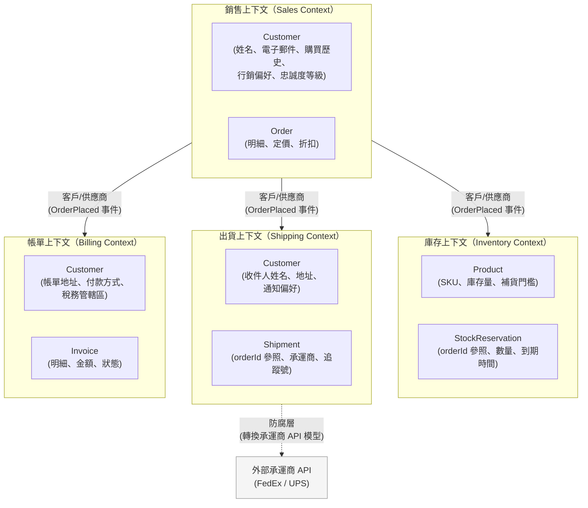

# [BEP-101] 領域驅動設計精要

:::info
限界上下文、通用語言與策略性 DDD 模式，用於劃定服務與模組邊界。
:::

## 背景

大多數系統一開始都使用單一的業務領域模型。隨著系統成長，這個單一模型會成為負擔：不同團隊用同一個詞描述不同的事，帳單團隊程式碼裡的「Customer」和出貨團隊程式碼裡的「Customer」根本不是同一件事，每一次變更都會在程式碼庫裡引發難以預期的漣漪。

領域驅動設計（DDD）由 Eric Evans 在其 2003 年的著作中提出，並由 Vaughn Vernon 的《Implementing Domain-Driven Design》（2013）加以延伸，提供了一套管理這種複雜性的詞彙與模式。它分為兩個層次：

- **策略性 DDD** -- 如何將大型系統切割成具有內聚性、可獨立建模的片段（限界上下文、上下文映射圖、通用語言）。這是 1--3 年經驗工程師最值得投資的層次。
- **戰術性 DDD** -- 如何建模每個片段的內部結構（實體、值物件、聚合、領域事件、儲存庫）。有用，但次要。

本文主要聚焦於策略性 DDD，它直接影響模組與服務邊界的劃定方式（見 BEP-100）。

## 原則

### 通用語言（Ubiquitous Language）

DDD 的第一個實踐看似簡單：在同一個限界上下文中工作的所有人，包含開發者與領域專家，同意一套共用的詞彙，並在所有地方使用它——對話、文件、程式碼、測試與資料庫 Schema。這套共用詞彙就是**通用語言**。

沒有通用語言，開發者和領域專家談論同一個系統時，實際上是在談論不同的東西。開發者說「user」；業務端說「customer」、「member」、「subscriber」、「account holder」——每個詞在不同情境下有著微妙差異。程式碼不反映業務詞彙，就迫使每個讀者翻譯，而翻譯會引入 bug。

通用語言的有效範圍永遠侷限於某個限界上下文之內。同一個詞在不同上下文中可以有不同意義——這是完全沒問題的。

### 限界上下文（Bounded Contexts）

**限界上下文**是一個明確的邊界，在這個邊界之內，特定的領域模型適用。邊界之內，每個術語都有唯一且精確的意義。邊界之外，同一個術語可能代表不同的東西。

Martin Fowler 將限界上下文描述為處理大型模型的主要工具：與其為整個業務建立一個統一的模型，不如讓每個上下文擁有一個針對其特定用途正確的模型。邊界通常依據以下因素劃定：

- 組織團隊的所有權（康威定律）
- 語言的轉換（當業務用語改變，一個新的上下文就開始了）
- 資料所有權與生命週期（由一個團隊建立、修改和刪除的實體）
- 變化速率（頻繁變化的子領域不應與穩定的子領域糾纏在一起）

限界上下文是思考部署邊界的主要單元。一個微服務（或模組化單體中的一個模組）SHOULD 對應一個限界上下文。

### 「Customer」問題：同一個概念，多個模型

限界上下文重要性的典型例子，就是「Customer」這個概念：

- 在**銷售（Sales）上下文**中，Customer 有姓名、電子郵件、電話、購買歷史、忠誠度等級和行銷偏好。銷售團隊關心的是客戶獲取、終身價值和成交/失敗原因。
- 在**出貨（Shipping）上下文**中，Customer 有收件人姓名、一組收件地址，以及出貨更新的通知偏好。出貨團隊關心的是將包裹成功送達正確地點。
- 在**帳單（Billing）上下文**中，Customer 有帳單地址、存檔的付款方式、發票歷史和稅務管轄區。帳單團隊關心的是收款與開立收據。

這三個是同一個現實世界實體的三個不同模型。如果你建立一個統一的 `Customer` 模型來服務所有三個上下文，它會變成一個擁有數十個欄位的臃腫物件，其中大多數欄位在任何特定操作中都是無關的。更糟糕的是，為帳單團隊需求所做的變更，可能會在不知不覺中破壞銷售團隊的假設。

DDD 的答案是：讓每個限界上下文擁有自己的 `Customer` 模型，並將其範圍限定於自身需求。當上下文之間需要溝通時，透過整合層（見下方的上下文映射）進行翻譯。

### 上下文映射（Context Mapping）

**上下文映射圖**記錄限界上下文之間的關係。主要的關係模式：

| 模式 | 意義 |
|---|---|
| **共享核心（Shared Kernel）** | 兩個上下文共用一小塊明確議定的領域模型子集。變更需要兩個團隊同意。謹慎使用。 |
| **客戶/供應商（Customer/Supplier）** | 一個上下文（供應商/上游）產生資料，由另一個（客戶/下游）使用。上游團隊發布穩定的介面；下游團隊適應它。 |
| **跟隨者（Conformist）** | 下游團隊直接採用上游模型，不做翻譯。當上游是第三方系統或成熟的平台團隊時可接受。 |
| **防腐層（Anti-Corruption Layer, ACL）** | 下游團隊建立一個翻譯層，將上游模型轉換為自己的模型。這保護下游上下文免受上游變更的影響，並防止建模不良的上游「感染」下游。 |
| **已發布語言（Published Language）** | 一種有完整文件的共用資料格式（例如標準事件 Schema），任何上下文都可以產生或消費。在事件驅動架構中很常見。 |

當與遺留系統或第三方 API 整合時，防腐層特別重要。與其讓外部模型的概念滲透到你的領域模型中，不如讓 ACL 在邊界處進行翻譯。

### 戰術性模式（概覽）

以下戰術模式適用於單一限界上下文的內部。

**實體（Entities）** 是具有獨特身份、且該身份在狀態變化中持續存在的物件。`id: 42` 的 `Order`，即使狀態從 `PENDING` 變為 `SHIPPED`，仍然是同一個 `Order`。身份是其定義性特徵。

**值物件（Value Objects）** 完全由其屬性定義，本身沒有身份。`USD 42.00` 的 `Money` 值可與任何其他 `USD 42.00` 的 `Money` 值互換。值物件 SHOULD 是不可變的。範例：`Money`、`Address`、`DateRange`、`EmailAddress`。

**聚合（Aggregates）** 是被視為資料變更單元的實體和值物件的叢集。聚合中有一個實體是**聚合根（Aggregate Root）**——外部程式碼唯一可以持有參照的物件。聚合根負責強制執行整個叢集的所有不變條件。

Vaughn Vernon 的「有效聚合設計」中的關鍵設計規則：
- 只能透過身份（ID）參照其他聚合，不能持有物件參照
- 交易（Transaction）MUST NOT 跨越聚合邊界
- 保持聚合小巧——大型聚合通常是缺少限界上下文邊界的訊號
- 以真實的一致性需求設計聚合，而非以物件圖的便利性

**領域事件（Domain Events）** 代表領域中發生的有意義的事。`OrderPlaced`、`PaymentReceived`、`ItemShipped` 都是領域事件。它們以過去式命名。領域事件是聚合之間和限界上下文之間溝通的主要機制，而不會造成直接依賴。

**儲存庫（Repositories）** 為載入和持久化聚合提供類似集合的介面。儲存庫介面屬於領域層；實作屬於基礎設施層。領域程式碼只依賴介面，不依賴任何特定的資料庫技術。這與使領域模型在沒有真實資料庫的情況下也可測試的依賴反轉原則相同。

**領域服務（Domain Services）** 封裝不自然屬於單一實體或值物件的領域邏輯。根據產品價格、適用折扣和稅規則計算訂單總額的 `PricingService` 就是領域服務。領域服務操作領域物件，並使用通用語言。

**應用程式服務（Application Services）** 協調使用案例。它們接收命令（例如 `PlaceOrderCommand`），透過儲存庫載入相關聚合，委託給領域物件和領域服務，持久化結果，並發布領域事件。應用程式服務是薄的——它們本身不包含領域邏輯。

### 策略性 vs. 戰術性：優先順序

對大多數團隊而言，策略性 DDD（限界上下文和通用語言）能帶來 80% 的價值。戰術性模式（聚合、領域事件）增加了精確性，但也增加了複雜性。不要對不值得的子領域套用戰術性 DDD。

DDD 文獻區分三種子領域類型：

| 子領域類型 | 定義 | DDD 投入程度 |
|---|---|---|
| **核心領域（Core Domain）** | 讓業務與眾不同的部分。這是你的競爭優勢所在。 | 完整的 DDD 處理 |
| **支撐子領域（Supporting Subdomain）** | 必要但非差異化。自行建置但非核心。 | 選擇性套用戰術模式 |
| **通用子領域（Generic Subdomain）** | 通用功能。購買或使用開源方案。 | 最少或不套用 |

只在領域複雜且業務高度關注正確性的地方套用完整的 DDD。

## 視覺化

電商平台的限界上下文映射圖：

同一個現實世界的「Customer」在三個上下文（Sales、Shipping、Billing）中各自擁有不同的模型。`OrderPlaced` 領域事件是跨越上下文邊界的已發布語言——它只攜帶每個下游上下文需要的資料，而非完整的 Sales 模型。

## 範例

**追蹤一筆訂單跨越多個限界上下文：**

1. 使用者下訂單。在**銷售（Sales）上下文**中，建立一個包含明細、套用折扣與顧客忠誠度等級的 `Order` 聚合。`Order` 聚合根驗證訂單總額是否在反詐欺限額內。發布 `OrderPlaced` 領域事件。

2. **庫存（Inventory）上下文**接收到 `OrderPlaced`。它對「忠誠度等級」或「折扣」沒有概念——它只關心 `productId` 和 `quantity`。它建立一個 `StockReservation` 聚合並減少可用庫存。若庫存不足，則發布 `ReservationFailed`。

3. **出貨（Shipping）上下文**接收到 `OrderPlaced`。它使用自己 `Customer` 模型中的收件地址（可能透過獨立整合從 Sales 同步，或按需查詢）建立一個 `Shipment` 聚合。它透過防腐層呼叫外部承運商 API，將承運商的 `consignment` 模型翻譯為 Shipping 上下文的 `Shipment` 模型。

4. **帳單（Billing）上下文**接收到 `OrderPlaced`。它使用自己 `Customer` 記錄中的帳單地址和付款方式建立一個 `Invoice`。它對承運商、庫存量或忠誠度等級一無所知。

每個上下文都用同一個 `orderId` 作為關聯鍵，但維護自己的模型。任何上下文都不持有指向其他上下文聚合的直接參照。

## 常見錯誤

1. **用一個模型統治所有人。** 建立一個跨整個程式碼庫共用的 `Customer`、`Product` 或 `Order` 物件。這個物件會無限增長、變得難以理解，並在團隊之間製造緊密耦合。限界上下文存在的意義正是為了避免這種情況。

2. **貧血領域模型（Anemic Domain Model）。** 實體只包含欄位和 getter/setter，所有邏輯都在服務類別中。這是披著物件導向外衣的程序式程式碼。一個知道如何套用折扣、驗證自身狀態、計算總額的 `Order` 是豐富的領域模型。一個只是資料容器、由 `OrderService` 做所有工作的 `Order` 就是貧血的。貧血模型違背了 DDD 的目的。

3. **聚合透過物件參照其他聚合。** 當 `Order` 持有對 `Customer` 物件的直接參照（而非 `customerId`），載入訂單就會載入顧客，可能進而載入地址…聚合邊界的目的是強制執行交易和一致性的範圍。只能透過身份參照其他聚合。

4. **跳過通用語言。** 當開發者使用技術術語（`UserRecord`、`DataObject`、`Manager`、`Processor`），而領域專家使用業務術語（`Member`、`Policy`、`Claim`、`Underwriter`），程式碼與業務之間的鴻溝每個 Sprint 都在加深。通用語言不是錦上添花；它是讓程式碼庫對理解業務的人可讀的主要工具。

5. **DDD 無處不在。** 對 CRUD 畫面、設定管理和稽核日誌套用完整的 DDD 戰術模式（聚合、領域事件、儲存庫）是過度工程化。DDD 是複雜領域與豐富業務規則的合適工具。對於簡單的使用者設定畫面，一張普通的資料表加上一個 REST 端點才是正確的工具。

## 相關 BEP

- [BEP-100](100.md) -- Architecture Patterns：限界上下文直接影響在單體或微服務架構中如何劃定模組與服務邊界
- [BEP-102](102.md) -- CQRS：DDD 的天然搭檔；領域事件在 CQRS 中用於驅動讀取模型
- [BEP-140](140.md) -- Data Modeling：限界上下文所有權如何對應到資料庫 Schema 設計

## 參考資料

- Evans, E. 2003. "Domain-Driven Design: Tackling Complexity in the Heart of Software." Addison-Wesley.
- Vernon, V. 2013. "Implementing Domain-Driven Design." Addison-Wesley. https://www.amazon.com/Implementing-Domain-Driven-Design-Vaughn-Vernon/dp/0321834577
- Fowler, M. 2014. "BoundedContext." https://martinfowler.com/bliki/BoundedContext.html
- Fowler, M. 2015. "DDD_Aggregate." https://martinfowler.com/bliki/DDD_Aggregate.html
- Fowler, M. 2006. "UbiquitousLanguage." https://martinfowler.com/bliki/UbiquitousLanguage.html
- Vernon, V. 2011. "Effective Aggregate Design" (Parts I--III). https://www.dddcommunity.org/library/vernon_2011/
- Evans, E. 2015. "Domain-Driven Design Reference." https://www.domainlanguage.com/wp-content/uploads/2016/05/DDD_Reference_2015-03.pdf
