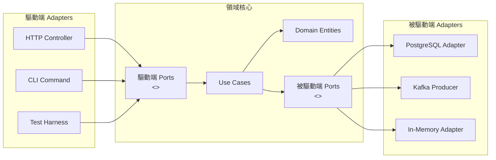

# [BEP-103] 六角形架構

:::info
Ports and Adapters -- 透過依賴反轉，實現可測試、可替換的基礎設施。
:::

## 背景

後端系統的業務邏輯與基礎設施之間，往往隨著時間累積大量耦合。一開始只連接單一 PostgreSQL 資料庫的服務，最終可能在領域程式碼中到處散落 SQL 查詢。切換資料來源、在 REST 之外新增 GraphQL 層、或是在不啟動真實資料庫的情況下執行快速單元測試，都會變得比預期困難許多。

**六角形架構（Hexagonal Architecture）**，又稱 **Ports and Adapters 模式**，由 Alistair Cockburn 於 2005 年提出，旨在從結構上消除這種耦合。Netflix 明確採用此模式來替換資料來源而不觸碰業務邏輯，並在數小時內完成從 JSON API 遷移至 GraphQL 的工作。

核心洞見：**應用程式存在的目的是實作業務規則**。其他一切 -- HTTP、資料庫、訊息佇列、CLI -- 都是基礎設施。六角形架構讓兩者之間的邊界明確且可強制執行。

## 原則

**領域核心不依賴任何東西。基礎設施依賴領域。**

這是依賴反轉原則（Dependency Inversion）在架構層面的應用。領域為所有對外部世界的需求定義抽象介面（Ports）；基礎設施提供這些介面的具體實作（Adapters）。領域永遠不匯入資料庫函式庫、HTTP 客戶端或訊息佇列 SDK。

### 結構

```
         [ 驅動端 Adapters ]            [ 被驅動端 Adapters ]
         HTTP Controller               PostgreSQL Repository
         CLI Command           ←→      Redis Cache
         Message Consumer      CORE    External API Client
         Test Harness                  In-Memory Repository（測試）
                 ↓                             ↑
         [ 驅動端 Ports ]              [ 被驅動端 Ports ]
         （輸入介面）                   （輸出介面）
```

- **領域核心（Domain Core）** -- 業務邏輯、領域實體、使用案例。零基礎設施匯入。
- **Ports** -- 由領域定義的介面，描述核心的需求（被驅動端 Port）或核心被呼叫的方式（驅動端 Port）。
- **Adapters** -- 在領域語言與特定技術之間進行翻譯的具體實作。

### 驅動端（Primary）Adapters

驅動端 Adapters 呼叫領域，將外部輸入翻譯成領域操作。

- HTTP 控制器（REST、GraphQL）
- CLI 命令處理器
- 訊息佇列消費者
- 排程任務執行器
- 測試驅動器

### 被驅動端（Secondary）Adapters

被驅動端 Adapters 由領域呼叫，滿足領域的輸出需求。

- 資料庫儲存庫（PostgreSQL、MongoDB）
- 外部 API 客戶端（金流、第三方服務）
- 訊息生產者（Kafka、SQS）
- Email / 通知發送器
- 測試用記憶體儲存

## 架構圖



領域核心內部所有箭頭指向內側。兩端的 Adapters 實作或呼叫由領域定義的介面，而非相反。

## 範例：訂單服務

### 領域定義 Port（介面）

```typescript
// domain/ports/OrderRepository.ts
// 純介面 -- 不匯入任何 DB 函式庫

export interface OrderRepository {
  findById(id: OrderId): Promise<Order | null>;
  save(order: Order): Promise<void>;
  findPendingOrders(): Promise<Order[]>;
}
```

```typescript
// domain/usecases/PlaceOrder.ts
// 只依賴介面，永遠不依賴 PostgreSQL 或任何 Adapter

import { OrderRepository } from '../ports/OrderRepository';
import { Order } from '../entities/Order';

export class PlaceOrder {
  constructor(private readonly orders: OrderRepository) {}

  async execute(customerId: string, items: OrderItem[]): Promise<Order> {
    const order = Order.create(customerId, items);
    order.validate(); // 純領域邏輯
    await this.orders.save(order);
    return order;
  }
}
```

### 生產環境 Adapter：PostgreSQL

```typescript
// infrastructure/adapters/PostgresOrderRepository.ts
import { Pool } from 'pg';
import { OrderRepository } from '../../domain/ports/OrderRepository';
import { Order } from '../../domain/entities/Order';

export class PostgresOrderRepository implements OrderRepository {
  constructor(private readonly pool: Pool) {}

  async findById(id: OrderId): Promise<Order | null> {
    const result = await this.pool.query(
      'SELECT * FROM orders WHERE id = $1',
      [id.value]
    );
    return result.rows[0] ? Order.fromRow(result.rows[0]) : null;
  }

  async save(order: Order): Promise<void> {
    await this.pool.query(
      'INSERT INTO orders (id, customer_id, status, items) VALUES ($1, $2, $3, $4) ON CONFLICT (id) DO UPDATE ...',
      [order.id.value, order.customerId, order.status, JSON.stringify(order.items)]
    );
  }

  async findPendingOrders(): Promise<Order[]> {
    const result = await this.pool.query(
      "SELECT * FROM orders WHERE status = 'PENDING'"
    );
    return result.rows.map(Order.fromRow);
  }
}
```

### 測試 Adapter：記憶體儲存

```typescript
// infrastructure/adapters/InMemoryOrderRepository.ts
import { OrderRepository } from '../../domain/ports/OrderRepository';
import { Order } from '../../domain/entities/Order';

export class InMemoryOrderRepository implements OrderRepository {
  private readonly store = new Map<string, Order>();

  async findById(id: OrderId): Promise<Order | null> {
    return this.store.get(id.value) ?? null;
  }

  async save(order: Order): Promise<void> {
    this.store.set(order.id.value, order);
  }

  async findPendingOrders(): Promise<Order[]> {
    return [...this.store.values()].filter(o => o.status === 'PENDING');
  }
}
```

### 相同的領域使用案例，兩種 Adapter 皆可運作

```typescript
// 單元測試 -- 無資料庫、無網路，毫秒內完成
describe('PlaceOrder', () => {
  it('儲存有效訂單', async () => {
    const repo = new InMemoryOrderRepository();
    const useCase = new PlaceOrder(repo);

    const order = await useCase.execute('customer-1', [
      { productId: 'prod-1', quantity: 2 }
    ]);

    expect(order.status).toBe('PENDING');
    expect(await repo.findById(order.id)).not.toBeNull();
  });
});

// 整合測試 -- 換入真實 Adapter
describe('PlaceOrder（整合）', () => {
  it('持久化至 PostgreSQL', async () => {
    const repo = new PostgresOrderRepository(testPool);
    const useCase = new PlaceOrder(repo);
    // 相同測試內容 -- 相同的使用案例，不同的 Adapter
  });
});
```

兩個測試的領域程式碼完全相同。替換 Adapter 只需改一行依賴注入設定。

## 常見錯誤

### 1. 領域依賴基礎設施

最常見的違規：在領域程式碼中直接匯入資料庫函式庫或 HTTP 客戶端。

```typescript
// 錯誤 -- 領域匯入 DB 函式庫
import { DataSource } from 'typeorm';

export class PlaceOrder {
  constructor(private readonly dataSource: DataSource) {} // 基礎設施滲透進來
}
```

```typescript
// 正確 -- 領域只依賴自己定義的介面
export class PlaceOrder {
  constructor(private readonly orders: OrderRepository) {} // 由領域定義的 Port
}
```

### 2. 將基礎設施概念洩漏至 Port

Port 必須使用領域的語言。SQL 型別、HTTP 狀態碼、ORM 實體 -- 這些都不屬於 Port 介面。

```typescript
// 錯誤 -- Port 使用 SQL/ORM 型別
export interface OrderRepository {
  findById(id: string): Promise<TypeORMOrder>; // TypeORMOrder 是基礎設施
  query(sql: string): Promise<any>;            // 原始 SQL 出現在介面中
}

// 正確 -- Port 只使用領域型別
export interface OrderRepository {
  findById(id: OrderId): Promise<Order | null>;
}
```

### 3. 過多 Port（過度抽象化簡單操作）

並非每個外部依賴都需要自己的 Port。為 `Math.random()` 或瑣碎的值查詢建立 Port，只會增加儀式感而沒有實際效益。Port 的價值在於：技術選型可能改變、可測試性需要替換、或是存在多個 Adapter 的情況。

### 4. Adapter 中包含業務邏輯

Adapter 的職責是翻譯，而不是決策。業務規則一旦出現在 HTTP 控制器或資料庫 Adapter 中，就無法在不依賴基礎設施的情況下測試，也無法被複用。

```typescript
// 錯誤 -- Adapter 中有業務邏輯
export class HttpOrderController {
  async placeOrder(req: Request): Promise<Response> {
    const items = req.body.items;
    if (items.length === 0) throw new Error('No items'); // 領域規則放在 Adapter 中
    const order = await this.orderRepo.save(new Order(items));
    // ...
  }
}

// 正確 -- Adapter 立即委派給使用案例
export class HttpOrderController {
  async placeOrder(req: Request): Promise<Response> {
    const result = await this.placeOrder.execute(req.body.customerId, req.body.items);
    return { status: 201, body: result.toDTO() };
  }
}
```

### 5. 將六角形架構與分層架構混淆

分層架構（展示層 → 業務層 → 資料層）仍然允許向上的依賴，並不強制基礎設施的匯入方向指向領域。六角形架構的重點在於**依賴方向**：所有基礎設施依賴領域，而非反過來。六角形不是「三層架構」的另一個名稱。

## 與其他模式的關係

六角形架構屬於一個共享相同依賴規則的模式家族：領域在中心，基礎設施在外層。

- **Clean Architecture**（Robert C. Martin）-- 以同心圓（Entities、Use Cases、Interface Adapters、Frameworks & Drivers）形式化相同的概念。依賴規則完全一致。
- **Onion Architecture**（Jeffrey Palermo）-- 類似的同心圓模型，包含領域模型、領域服務、應用服務和基礎設施的明確分層。
- **DDD**（參見 [BEP-101](./101.md)）-- 六角形架構是 DDD 的天然結構補充。領域聚合、實體和值物件存在於核心；Repository 是被驅動端 Port。
- **CQRS**（參見 [BEP-101](./101.md)）-- 命令與查詢處理器是領域核心的使用案例；讀模型 Adapter 和寫 Adapter 是被驅動端 Adapters。

這些模式與傳統分層架構的關鍵差異：**基礎設施層沒有特殊特權**。它位於外層並向內依賴，無論是資料庫、Web 伺服器還是事件匯流排皆如此。

## 參考資料

- [Hexagonal Architecture -- Alistair Cockburn（2005 原始文章）](https://alistair.cockburn.us/hexagonal-architecture/)
- [Ready for Changes with Hexagonal Architecture -- Netflix TechBlog](https://netflixtechblog.com/ready-for-changes-with-hexagonal-architecture-b315ec967749)
- [Hexagonal Architecture (software) -- Wikipedia](https://en.wikipedia.org/wiki/Hexagonal_architecture_(software))
- [AWS Prescriptive Guidance -- Hexagonal Architecture Pattern](https://docs.aws.amazon.com/prescriptive-guidance/latest/cloud-design-patterns/hexagonal-architecture.html)
- BEP-100：架構模式概覽
- BEP-101：領域驅動設計
- BEP-101：CQRS
- BEP-341：Test Doubles
