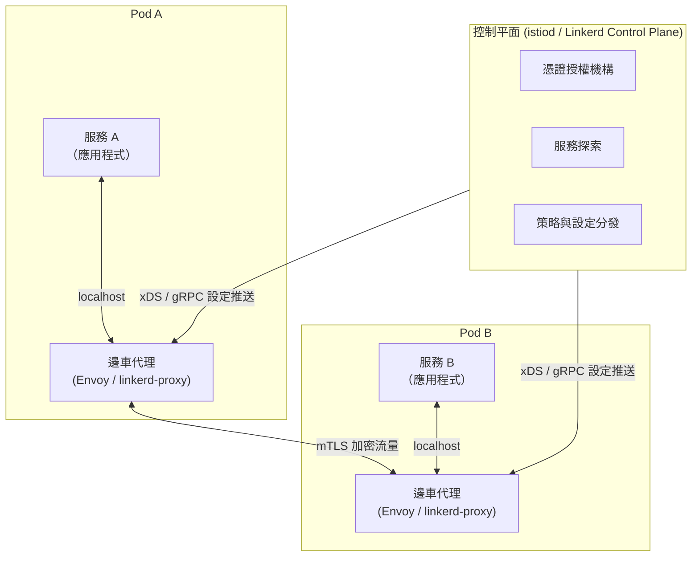

# [BEE-105] 邊車與服務網格概念

:::info
將橫切關注點從應用程式碼中分離出去。
:::

## 背景

當分散式系統從幾個服務成長到數十甚至數百個服務時，新的問題就會浮現：每個服務都需要重試、逾時、熔斷、雙向 TLS、分散式追蹤與負載均衡。在每個服務中以每種語言分別實作這些邏輯，會導致重複工作、行為不一致，以及業務邏輯與基礎設施關注點的緊密耦合。

**邊車模式（Sidecar Pattern）** 與 **服務網格（Service Mesh）** 是解決此問題的兩個相關方案。它們將橫切網路關注點從應用程式碼移出，放入專屬的基礎設施層。

## 原則

在每個服務實例旁部署一個共存的代理程序（邊車），用以處理網路橫切關注點，並透過集中式控制平面統一設定所有邊車。讓應用程式碼只專注於業務邏輯。

## 邊車模式

邊車是與主應用容器一同部署的獨立程序或容器，共享其網路命名空間與生命週期。這個名稱來自機車的邊車廂：主應用程式是機車，邊車緊靠其旁、擴充其能力，但不修改主體。

主要特性：
- **共存部署**：邊車在同一個 Pod（Kubernetes）或主機上執行，因此兩者之間的網路呼叫保持在本地端。
- **透明攔截**：所有進出的流量都透過 iptables 規則或等效機制經由邊車傳遞，應用程式對此毫不知情。
- **語言無關性**：一個邊車實作可服務以 Go、Java、Python、Node.js 撰寫的服務，無需各語言的函式庫。
- **生命週期耦合**：邊車隨其服務的應用程式一起啟動與停止。

Microsoft Azure Architecture Center 對此模式的描述為：*「將應用程式元件部署到獨立的程序或容器中，以提供隔離與封裝。」* ([Sidecar pattern – Azure Architecture Center](https://learn.microsoft.com/en-us/azure/architecture/patterns/sidecar))

## 什麼是服務網格？

服務網格是專門用於服務間通訊的基礎設施層。CNCF 將其定義為解答：*「我要如何觀察、控制或保護服務之間的通訊？」* 它攔截容器進出的流量，並在所有服務上統一執行策略。([CNCF Service Mesh Glossary](https://glossary.cncf.io/service-mesh/))

服務網格由兩個邏輯平面組成：

### 資料平面（Data Plane）

資料平面是在每個服務實例旁運行的一組邊車代理。每個代理負責：
- 攔截其應用程式的所有進出流量
- 執行路由規則、重試、逾時與熔斷
- 終止並建立 mTLS 連線
- 發送指標、日誌與追蹤資料

Istio 使用 Envoy 作為其資料平面代理——一個以 C++ 撰寫的高效能擴充代理。Linkerd 則使用自家以 Rust 撰寫的微型代理，專為輕量設計。([Istio Architecture](https://istio.io/latest/docs/ops/deployment/architecture/)、[Linkerd Overview](https://linkerd.io/2-edge/overview/))

### 控制平面（Control Plane）

控制平面負責管理並設定所有邊車代理，本身不位於資料路徑上。其職責包括：
- **服務探索**：維護可用服務端點的登錄表
- **設定分發**：將高層次策略轉換為代理專屬設定並推送至所有邊車
- **憑證管理**：扮演憑證授權機構，發行並輪換 mTLS 憑證
- **策略執行**：分發授權與流量管理規則

在 Istio 中，整個控制平面是名為 **istiod** 的單一二進位檔。在 Linkerd 中，這些功能分散在 Destination、Identity 和 Proxy Injector 元件中。

## 服務網格架構



流量路徑：服務 A 向服務 B 發出 HTTP 呼叫。Pod A 中的 iptables 規則將出站封包重導至本地邊車代理。邊車套用負載均衡、加入重試邏輯、以 mTLS 加密後轉發至 Pod B 的邊車。Pod B 的邊車終止 mTLS、套用入站策略，再將請求透過 localhost 送達服務 B。

## 服務網格提供什麼

| 能力 | 機制 |
|---|---|
| 雙向 TLS（mTLS） | 邊車處理憑證交換；應用程式不需要 TLS 程式碼 |
| 負載均衡 | 資料平面將流量分散至健康的端點 |
| 重試與逾時 | 在網格策略中設定，由邊車自動套用 |
| 熔斷 | 邊車追蹤失敗率，依策略開啟熔斷器 |
| 流量管理 | 加權路由、金絲雀部署、流量鏡像 |
| 分散式追蹤 | 邊車自動注入並傳播追蹤標頭 |
| 指標 | 每個服務自動發送 RED 指標（速率、錯誤率、延遲） |

## 前後對比：實際的差異

### 沒有服務網格——每個服務各自實作橫切邏輯

```python
# order_service.py — 業務邏輯被基礎設施關注點淹沒
import httpx
from tenacity import retry, stop_after_attempt, wait_exponential
from circuitbreaker import circuit
import ssl

# mTLS 設定——每個服務都必須管理自己的憑證
ssl_ctx = ssl.create_default_context(ssl.Purpose.CLIENT_AUTH)
ssl_ctx.load_cert_chain("certs/order-service.crt", "certs/order-service.key")
ssl_ctx.load_verify_locations("certs/ca.crt")

@circuit(failure_threshold=5, recovery_timeout=30)
@retry(stop=stop_after_attempt(3), wait=wait_exponential(multiplier=1, min=1, max=4))
def get_inventory(product_id: str) -> dict:
    # 手動傳播追蹤標頭
    response = httpx.get(
        f"https://inventory-service/products/{product_id}",
        verify=ssl_ctx,
        headers={"x-b3-traceid": current_trace_id(), "x-b3-spanid": new_span_id()},
        timeout=2.0,
    )
    response.raise_for_status()
    return response.json()
```

每個服務——以每種語言——都重新實作這一切。當重試策略改變時，你必須更新每個服務。

### 有服務網格——應用程式碼保持整潔

```python
# order_service.py — 只剩業務邏輯
import httpx

def get_inventory(product_id: str) -> dict:
    # 純 HTTP；邊車處理 mTLS、重試、熔斷與追蹤
    response = httpx.get(f"http://inventory-service/products/{product_id}")
    response.raise_for_status()
    return response.json()
```

```yaml
# 網格策略——透過控制平面統一套用至所有實例
apiVersion: networking.istio.io/v1alpha3
kind: VirtualService
metadata:
  name: inventory-service
spec:
  hosts:
    - inventory-service
  http:
    - retries:
        attempts: 3
        perTryTimeout: 2s
        retryOn: 5xx,connect-failure
      timeout: 10s
```

重試策略現在是一個 YAML 宣告。修改一次後立即傳播至所有服務。

## 無邊車 / 無代理方案

傳統邊車模式有真實的資源成本。較新的方案致力解決此問題：

- **Istio Ambient Mesh**：以節點層級的 **ztunnel**（第 4 層）和可選的命名空間層級 **waypoint**（第 7 層）取代每個 Pod 的 Envoy 邊車。研究顯示，Ambient Mesh 在 3,200 RPS 時只增加約 8% 的延遲，而完整邊車模式則增加 166%。
- **基於 eBPF 的網格**（Cilium）：使用 eBPF 程式將資料平面邏輯移入 Linux 核心，完全消除代理程序。
- **gRPC 無代理模式**：gRPC 的 xDS 支援讓服務直接與控制平面通訊，省去 gRPC 原生工作負載的邊車跳躍。

這些方案在 2024–2025 年已可用於生產環境，但會增加操作複雜度。請依團隊熟悉程度評估。

## 資源開銷：真實數字

基於 Istio 1.24 基準測試與獨立研究：

| 指標 | 傳統邊車（Envoy/Istio） | Linkerd 微型代理 | Istio Ambient（ztunnel） |
|---|---|---|---|
| 每個 Pod 記憶體 | 50–200 MB | 20–100 MB | 共用節點層級 |
| 1,000 RPS 的 CPU | 約 0.20 vCPU | 更低 | 大幅更低 |
| 額外延遲 | 每跳 2–5 ms | 約 1 ms | 約 0.5 ms |

在 100 個 Pod 的叢集中，邊車本身可能消耗 2–20 GB 的叢集記憶體。在 1,000 個 Pod 時，則為 20–200 GB。採用前務必將此納入容量規劃。

([Istio Performance and Scalability](https://istio.io/latest/docs/ops/deployment/performance-and-scalability/))

## 何時需要服務網格

服務網格在以下情況開始產生價值：

- 你的組織跨多個團隊運營 **20 個以上的服務**，各自對橫切關注點的實作不一致。
- 你有**嚴格的零信任安全要求**：全面的 mTLS、自動憑證輪換、每個服務的授權策略。
- 你需要**細粒度的流量控制**：金絲雀部署、流量鏡像、版本間的加權路由。
- 你需要**統一的可觀測性**，而不必個別為每個服務加入儀器程式碼。
- 你的組織正在大規模遷移至 Kubernetes，並需要平台層級的可靠性層。

## 何時不需要服務網格

在以下情況下，不應過早採用服務網格：

- 你只有 **3–10 個服務**——操作開銷（學習曲線、YAML 擴散、除錯複雜度）遠超過其帶來的效益。
- 你的團隊**缺乏 Kubernetes/Envoy 操作經驗**——設定錯誤的網格可能默默丟棄流量或導致 mTLS 協商失敗。
- 你的**效能預算有限**——額外的延遲和邊車記憶體消耗可能無法接受。
- 存在**更簡單的替代方案**：設定良好的 API 閘道、共享函式庫或反向代理（參見 [BEE-55](55.md)）可能以遠低的成本解決問題。

## 常見錯誤

**1. 只有 3–5 個服務就採用服務網格。**
網格會增加全新的操作面（控制平面、憑證授權機構、代理設定）。服務數量少、拓撲簡單時，工程時間與運算成本的開銷幾乎永遠得不到回報。

**2. 忽略邊車資源開銷。**
每個邊車都是一個完整的代理程序。以 Envoy 邊車每個 Pod 50–200 MB 計算，200 個 Pod 的叢集需要數 GB 的記憶體，卻不產生任何業務價值。務必針對叢集的容量和成本模型對開銷進行基準測試。

**3. 將網格視為安全的萬靈丹。**
mTLS 能證明服務 A 正在與服務 B 通訊。但它無法證明該請求已獲授權。你仍然需要應用層級的授權（RBAC、JWT 驗證、業務規則）。[BEE-53](53.md) 涵蓋 mTLS；不要將傳輸安全與應用程式安全混為一談。

**4. 低估邊車增加的延遲。**
每次服務呼叫都會經過兩個代理（客戶端邊車與伺服器端邊車）。在每跳 2–5 ms 的情況下，一個有 5 個跳躍的請求鏈會增加 10–25 ms 的純代理開銷。對延遲敏感的路徑，請在前後分別進行效能分析。

**5. 在缺乏足夠可觀測性的情況下建立複雜的網格設定。**
VirtualService、DestinationRule 和 AuthorizationPolicy 之間存在交互作用。設定錯誤可能默默影響流量。在推出進階網格功能之前，請確保已部署分散式追蹤（[BEE-321](321.md)）與指標儀表板，以便設定錯誤能快速浮現。

## 相關 BEE

- [BEE-53 — 雙向 TLS（mTLS）](53.md)：邊車執行的安全基礎
- [BEE-55 — 反向代理模式](55.md)：小型部署的更簡單替代方案
- [BEE-100 — 微服務架構](100.md)：服務網格變得必要的背景
- [BEE-260 — 熔斷器模式](260.md)：網格自動化的可靠性模式
- [BEE-321 — 分散式追蹤](321.md)：邊車自動啟用的可觀測性

## 參考資料

- [CNCF Service Mesh Glossary](https://glossary.cncf.io/service-mesh/)
- [Istio Architecture](https://istio.io/latest/docs/ops/deployment/architecture/)
- [Istio Sidecar or Ambient?](https://istio.io/latest/docs/overview/dataplane-modes/)
- [Istio Performance and Scalability](https://istio.io/latest/docs/ops/deployment/performance-and-scalability/)
- [Linkerd Overview](https://linkerd.io/2-edge/overview/)
- [Sidecar Pattern – Azure Architecture Center](https://learn.microsoft.com/en-us/azure/architecture/patterns/sidecar)
- [Dissecting Overheads of Service Mesh Sidecars (SoCC 2023)](https://dl.acm.org/doi/10.1145/3620678.3624652)
