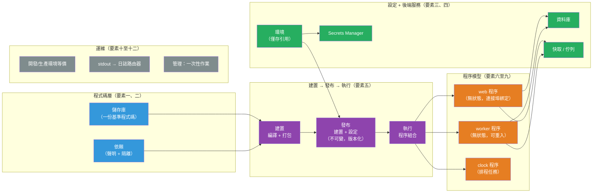

# [BEE-486] 十二要素應用程式方法論

:::info
十二要素應用程式（Twelve-Factor App）是一套建構軟體即服務（SaaS）應用程式的方法論，旨在讓應用程式可在各種執行環境中移植、無需伺服器管理即可部署，並能水平擴展——這套方法論是從 Heroku 平台上觀察數千個應用程式部署所總結出的模式。
:::

## 背景脈絡

Adam Wiggins 與 Heroku 工程團隊於 2011 年在 12factor.net 發布了十二要素應用程式方法論。Heroku 成立於 2007 年，彼時已運營數千個應用程式部署。工程師們反覆觀察到相同類型的失敗——設定混入程式碼、程序儲存本地狀態導致無法擴展、生產伺服器上的日誌檔案佔滿磁碟——以及相同的讓應用程式易於部署、擴展和運維的方法。該方法論將這些觀察總結為十二個命名原則。如網站所述：「本文件綜合了我們在各式各樣的軟體即服務應用程式中的全部經驗與觀察。」

該文件的格式明確仿照 Martin Fowler 的《企業應用架構模式》——其目的是為系統性問題建立共同詞彙，而非一份合規檢查清單。理解每個要素*為何存在*的團隊，在面對邊緣情況時比機械地打勾的團隊做出更好的判斷。

十二要素早於 Docker（2013）、Kubernetes（2014）和 CNCF 成立（2015），然而 Docker 與 Kubernetes 各自獨立收斂到相同的架構原則並將其付諸實踐：不可變映像實現了要素五，`ConfigMaps` 和 `Secrets` 實現了要素三，HorizontalPodAutoscaler 實現了要素八，容器標準輸出捕獲實現了要素十一。這套方法論的持久性來自於對應用程式程式碼與執行環境之間根本性張力的解決——這種張力在容器和協調器中被重新表述，但並未消除。

Kevin Hoffman 的《超越十二要素應用程式》（O'Reilly，2016）指出原方法論的三個缺口——API 優先設計、遙測以及身份驗證/授權——這些缺口在業界轉向微服務後變得顯而易見。2024 年 11 月，Heroku 在 GitHub 上開源了該方法論，使社群能夠推動標準演化。

## 十二個要素

### 程式碼與依賴（要素一、二）

**要素一——基準程式碼**：一份以版本控制系統追蹤的基準程式碼，多份部署。每個應用程式恰好對應一個儲存庫（或一個 monorepo 中的一個根提交）。多個運行環境——生產、預備（staging）、本地開發——都是該基準程式碼在不同版本下的*部署*。應用程式之間共享的程式碼存放在發布至套件登錄表的版本化函式庫中，而非複製貼上到各個儲存庫。

**要素二——依賴**：明確聲明並隔離所有依賴。十二要素應用程式從不依賴系統範圍套件的隱式存在。每個依賴都在清單中聲明（`requirements.txt`、`package.json`、`go.mod`、`Gemfile`），並在執行期間與系統套件隔離（`venv`、`node_modules`、Go 模組快取、Bundler）。聲明與隔離*兩者*都是必要的——沒有隔離的聲明允許系統套件靜默地滿足依賴，使建置無法重現。

2016 年的 npm `left-pad` 事件（單一 11 行套件被刪除，導致全球數千個建置失敗）證明光有聲明是不夠的：供應鏈完整性（帶有校驗和的鎖定檔案、私有登錄表、SBOM 生成）已成為要素二的必要延伸，而這是 2011 年文件未能預料到的。

### 設定與後端服務（要素三、四）

**要素三——設定**：將設定存放在環境中。設定是在各次部署之間可能變化的一切：資料庫 URL、外部服務憑證、每次部署特有的主機名稱、與環境相關的功能旗標。在各次部署之間不變的設定（應用程式路由、模組連線）不屬於要素三的範疇。

處方是從環境變數讀取設定——而非從提交至儲存庫的設定檔讀取，更明確地反對按環境分組的設定檔（`config/production.py`、`config/development.py`），因為這種方法隨著部署面擴大會造成組合爆炸。

**關鍵細節**：要素三規定應用程式*從何讀取*（環境），而非環境*包含什麼*。環境變數是儲存機密的不充分機制：它們在 `/proc/<PID>/environ` 中可見，常被錯誤報告框架（Sentry、Rollbar）完整捕獲，無論子程序是否需要都會被繼承，且沒有審計追蹤或輪換支援。現代協調模式：在環境變數中存放*引用*（ARN、Vault 路徑）；應用程式在啟動時使用平台身份（IAM 角色、工作負載身份）從 Secrets Manager 獲取實際值。應用程式仍從環境讀取；原始機密從不出現在環境中。

**要素四——後端服務**：將應用程式透過網路消費的所有外部服務視為附加資源。這包括資料庫、快取、佇列、SMTP 伺服器和第三方 API。程式碼對「本地」資料庫和「Amazon RDS」資料庫不做任何區分——兩者都透過設定中的 URL 訪問。將本地 PostgreSQL 換成託管雲端實例只需更改設定，不需更改程式碼。

### 建置、發布、執行（要素五）

**要素五——建置、發布、執行**：嚴格分離三個階段。*建置階段*將提交轉換為可執行產物（編譯的二進位文件、Docker 映像）。*發布階段*將建置產物與部署特定的設定結合，產生不可變的、唯一標識的發布。*執行階段*執行選定的發布。

發布是追加式且不可變的——發布一旦建立就不能修改。任何變更（程式碼或設定）都會產生新發布。回滾意味著將執行階段切換到之前的發布 ID。這意味著 CI/CD 自動化：一個生成產物、以提交 SHA 標記、並透過更新運行目標到新產物來部署的流水線。

違反這種分離——SSH 進入生產環境、編輯文件、重啟程序——使運行系統的狀態無法從版本控制中得知。

### 程序模型（要素六至九）

**要素六——程序**：以一個或多個無狀態、無共享的程序執行應用程式。任何必須在請求之間持久的資料都存放在後端服務（資料庫、Redis、S3）中。本地記憶體和磁碟可用作單次事務內的暫存空間，但這種狀態永遠不能假設在程序重啟後仍然存在。

黏性會話（Sticky Sessions）——因為實例在本地記憶體中快取了使用者的會話，而將後續請求路由到同一程序實例——違反了這個要素。會話狀態屬於所有程序實例都可訪問的、帶有過期時間的外部儲存（Redis、Memcached）。

**要素七——連接埠綁定**：透過連接埠綁定對外提供服務。應用程式是自包含的：它將 Web 伺服器函式庫作為聲明的依賴載入，並綁定到環境提供的連接埠（`$PORT`）。生產環境中，路由層（負載均衡器、Kubernetes Service + Ingress）將請求從公開主機名轉發到綁定的連接埠；應用程式對此層一無所知。

**要素八——並發**：透過程序模型實現擴展。工作被分類為程序類型：`web` 程序處理 HTTP，`worker` 程序處理後台作業，`clock` 程序執行排程任務。程序類型及實例數量的集合稱為*程序組合（process formation）*。擴展意味著增加適當類型的程序實例，而非在單一程序中增加執行緒，也非垂直擴展到更大的伺服器。

**要素九——可棄置性**：透過快速啟動和優雅關閉最大化健壯性。程序在收到 `SIGTERM` 時必須停止接受新工作，完成（或重新排隊）當前工作後再退出。Web 程序等待進行中的 HTTP 請求完成。Worker 程序在退出前將當前作業 NACK 回佇列。作業必須是可重入的：可安全執行多次，或在中斷後安全地從中間繼續。應用程式也必須能在非預期的突然終止後存活——崩潰即可恢復的設計，而非僅依賴優雅關閉的設計。

### 運維與環境（要素十至十二）

**要素十——開發/生產環境等價**：在三個維度上保持開發、預備和生產環境盡可能相似：時間（從提交到生產的時間為小時而非週）、人員（開發者參與部署和監控）、工具（各環境使用相同的後端服務及版本）。在本地使用 SQLite 而生產環境使用 PostgreSQL，會引入真實的 SQL 方言差異導致的 Bug。Docker Compose 讓工具等價以低成本成為可能。

**要素十一——日誌**：將日誌視為事件串流。應用程式將其事件串流無緩衝地寫入 `stdout`。它對自身輸出的路由或儲存沒有意見。執行環境捕獲這些串流並將其路由到目的地（日誌聚合器、資料倉庫、警報系統）。

這個要素對於生產環境可觀測性是必要但不充分的。僅靠日誌無法提供 RED 指標（速率、錯誤、延遲）或跨服務邊界的分散式追蹤。現代生產系統需要所有三個可觀測性支柱——日誌、指標和追蹤；要素十一只涵蓋第一個。

**要素十二——管理程序**：在與常規應用程式相同的環境中，以一次性程序執行管理和維護任務。資料庫遷移、資料修復腳本、對即時資料的 REPL 訪問——這些必須使用與已部署應用程式相同的基準程式碼、相同的依賴和相同的設定來執行。管理程式碼隨應用程式程式碼一起發布，並受到相同的發布流程約束。在 Kubernetes 中，這對應於 `kubectl exec` 進入運行中的 Pod，或更正確地對應於使用覆蓋命令的應用程式映像執行的 Kubernetes `Job`。

## 最佳實踐

**MUST（必須）將設定從程式碼中分離**——提交的文件中不得有憑證、資料庫 URL 或環境特定的值。十二要素應用程式必須能夠公開源碼而不洩露任何機密。一個簡單的測試：今天能否將程式碼庫公開而不洩露任何憑證？

**MUST（必須）處理 SIGTERM 並實作優雅關閉。** 這是實踐中最常被遺漏的要素。Kubernetes 在 SIGKILL 之前發送 SIGTERM（預設 30 秒的寬限期）；忽略 SIGTERM 的程序會被強制終止，可能丟棄進行中的請求、破壞作業狀態或留下未釋放的鎖。信號處理必須是明確的——大多數 Web 框架默認不實現優雅關閉。

**MUST NOT（不得）在本地程序記憶體中儲存會話狀態。** 黏性會話阻礙水平擴展，並在程序重啟時造成不可見的狀態丟失。使用 Redis 或帶有適當 TTL 的等效外部儲存。

**SHOULD（應該）使用 Secrets Manager 而非原始環境變數來處理敏感值。** 在環境變數中儲存引用；在啟動時從 Vault、AWS Secrets Manager 或雲端等效服務獲取實際機密。這在保持要素三合規的同時，增加了輪換、審計日誌和最小權限訪問控制。

**SHOULD（應該）使用 Docker Compose（或等效工具）在本地執行與生產等價的後端服務。** `postgres:16`、`redis:7-alpine` 和 `rabbitmq:3.13-management` 在本地以與生產相同的版本運行。開發用 SQLite / 生產用 PostgreSQL 是有據可查的 Bug 來源。

**SHOULD（應該）產生完全不可變的發布產物。** 以提交 SHA 標記的 Docker 映像，推送到登錄表，並透過更改 Deployment 規格中的映像標籤來部署，完整實現了要素五。產物不可變；部署歷史可審計；回滾是一條命令。

**MAY（可以）使用環境文件工具**（`direnv`、`docker-compose --env-file`）從本地文件填充環境而不提交這些文件。這些文件必須在 `.gitignore` 中。這符合要素三——要素規定應用程式從環境讀取；它不規定環境如何被填充。

## 視覺圖示



## 範例

**要素三——從環境讀取設定，使用 Secrets Manager 處理機密：**

```python
import os
import json
import boto3

# 十二要素：從環境讀取設定。
# 非敏感設定：環境變數中的原始值沒有問題。
PORT = int(os.environ["PORT"])
LOG_LEVEL = os.environ.get("LOG_LEVEL", "INFO")
REDIS_URL = os.environ["REDIS_URL"]  # 僅 URL，不嵌入憑證

# 敏感設定：環境中存放引用，而非原始機密。
# 應用程式在啟動時從 Secrets Manager 獲取實際值。
# 這符合要素三：應用程式仍從環境讀取。
_secret_arn = os.environ["DATABASE_SECRET_ARN"]
_sm = boto3.client("secretsmanager", region_name=os.environ["AWS_REGION"])
_secret = json.loads(_sm.get_secret_value(SecretId=_secret_arn)["SecretString"])
DATABASE_URL = (
    f"postgresql://{_secret['username']}:{_secret['password']}"
    f"@{_secret['host']}:{_secret['port']}/{_secret['dbname']}"
)
```

**要素六——在 Redis 中儲存無狀態會話：**

```python
import os, json, uuid, redis
from flask import Flask, request, jsonify

app = Flask(__name__)
# 後端服務：會話儲存在 Redis 中，而非程序記憶體中
_r = redis.from_url(os.environ["REDIS_URL"])
SESSION_TTL_SECONDS = 3600

@app.post("/login")
def login():
    user_id = authenticate(request.json)   # 驗證憑證
    token = str(uuid.uuid4())
    # 狀態存放在 Redis——任何程序實例都能處理後續請求
    _r.setex(f"session:{token}", SESSION_TTL_SECONDS, json.dumps({"user_id": user_id}))
    return jsonify({"token": token})

@app.get("/me")
def me():
    token = request.headers.get("Authorization", "").removeprefix("Bearer ")
    raw = _r.get(f"session:{token}")
    if not raw:
        return jsonify({"error": "unauthorized"}), 401
    return jsonify(json.loads(raw))
```

**要素九——收到 SIGTERM 時的優雅關閉：**

```python
import os, signal, sys, threading
from http.server import HTTPServer

server = HTTPServer(("0.0.0.0", int(os.environ["PORT"])), RequestHandler)
_shutdown_event = threading.Event()

def _handle_sigterm(signum, frame):
    # 停止接受新連線；讓進行中的請求完成。
    # Kubernetes 在 SIGKILL 之前等待 terminationGracePeriodSeconds（預設 30 秒）。
    print("收到 SIGTERM——開始優雅關閉", flush=True)
    threading.Thread(target=server.shutdown).start()  # 非阻塞
    _shutdown_event.set()

signal.signal(signal.SIGTERM, _handle_sigterm)
signal.signal(signal.SIGINT, _handle_sigterm)

server.serve_forever()
_shutdown_event.wait()
sys.exit(0)
```

**要素十一——結構化的 stdout 日誌（無日誌檔案）：**

```python
import logging, sys, json

class JSONFormatter(logging.Formatter):
    """每行向 stdout 輸出一個 JSON 物件——平台負責路由和聚合。"""
    def format(self, record):
        return json.dumps({
            "time": self.formatTime(record),
            "level": record.levelname,
            "logger": record.name,
            "message": record.getMessage(),
            **(record.__dict__.get("extra_fields", {})),
        })

handler = logging.StreamHandler(sys.stdout)   # stdout，而非文件
handler.setFormatter(JSONFormatter())
logging.basicConfig(handlers=[handler], level=logging.INFO)
# 程序不配置日誌輪換、文件路徑或日誌傳送。
# 容器執行時捕獲 stdout；節點代理（Fluentd/Filebeat）負責傳送。
```

**要素十二——作為 Kubernetes Job 的資料庫遷移（一次性程序）：**

```yaml
# migration-job.yaml — 使用與 Deployment 相同的映像，覆蓋命令
apiVersion: batch/v1
kind: Job
metadata:
  name: migrate-v2-42
spec:
  template:
    spec:
      restartPolicy: Never
      containers:
        - name: migrate
          image: myapp:v2.42           # 與運行中的 Deployment 相同的映像
          command: ["python", "manage.py", "migrate", "--no-input"]
          envFrom:
            - secretRef:
                name: myapp-secrets    # 與 Deployment 相同的設定
```

## 局限性與演化

**要素三與機密管理**：原始環境變數對於生產機密是不充分的。要素的處方必須以 Secrets Manager 加以延伸，用於任何敏感值。業界對此已普遍理解；引用加獲取的模式保留了要素的意圖（設定與程式碼分離，在執行時可讀）。

**要素十一與可觀測性**：僅靠日誌不構成完整的生產可觀測性。指標（Prometheus、Datadog）和分散式追蹤（OpenTelemetry、Jaeger）對於診斷延遲和跨服務故障是必要的。要素十一的處方仍然正確——寫入 stdout——但輸出應是可觀測性平台能以結構化資料形式攝取的結構化 JSON，而非自由格式文字。

**Kevin Hoffman 的三個補充**（《超越十二要素應用程式》，O'Reilly，2016）：要素 13——API 優先（在實作之前定義服務合約，對微服務至關重要）；要素 14——遙測（APM、領域指標和健康端點，除日誌之外）；要素 15——身份驗證與授權（每個端點的安全性，而非事後補救）。十二要素團隊自身的 2024 年演化提案包含一個身份（Identity）要素，驗證了這些缺口的存在。

**要素八與垂直擴展**：要素的純水平擴展立場方向正確但過於絕對。Kubernetes VerticalPodAutoscaler（VPA）專門存在於垂直擴展更合適的記憶體密集型有狀態元件中。水平與垂直擴展的混合是現代實踐。

## 相關 BEE

- [BEE-32](../Security/32.md) -- Secrets Management：要素三的現代延伸——Vault、AWS Secrets Manager 和引用加獲取模式
- [BEE-361](../CI-CD/361.md) -- 部署策略：要素五的不可變發布是金絲雀、藍綠和滾動部署模式的前提條件
- [BEE-164](../Transactions and Data Integrity/164.md) -- 冪等性與恰好一次語意：要素九（可棄置性）要求可重入的作業——冪等性是實作機制
- [BEE-320](../Observability/320.md) -- 三大支柱：日誌、指標、追蹤：要素十一單獨無法提供的完整可觀測性圖景
- [BEE-453](../Distributed Systems/453.md) -- 優雅關閉與連線排空：要素九在 Kubernetes 部署中的操作機制
- [BEE-364](../CI-CD/364.md) -- 容器基礎：Docker 直接實現了要素二、五、七和九；理解容器為整個方法論提供了背景

## 參考資料

- [十二要素應用程式 — Adam Wiggins 與 Heroku 工程團隊（2011）](https://12factor.net/)
- [超越十二要素應用程式 — Kevin Hoffman（O'Reilly，2016）](https://www.oreilly.com/library/view/beyond-the-twelve-factor/9781492042631/)
- [Heroku 開源十二要素應用程式定義（2024 年 11 月）](https://www.heroku.com/blog/heroku-open-sources-twelve-factor-app-definition/)
- [2022 年的十二要素應用程式 — CNCF 部落格（Anders Qvist）](https://www.cncf.io/blog/2022/04/28/twelve-factor-app-anno-2022/)
- [十二要素設定：誤解與建議 — Kristian Glass](https://blog.doismellburning.co.uk/twelve-factor-config-misunderstandings-and-advice/)
- [將機密存放在環境變數中被認為是有害的 — Arcjet](https://blog.arcjet.com/storing-secrets-in-env-vars-considered-harmful/)
