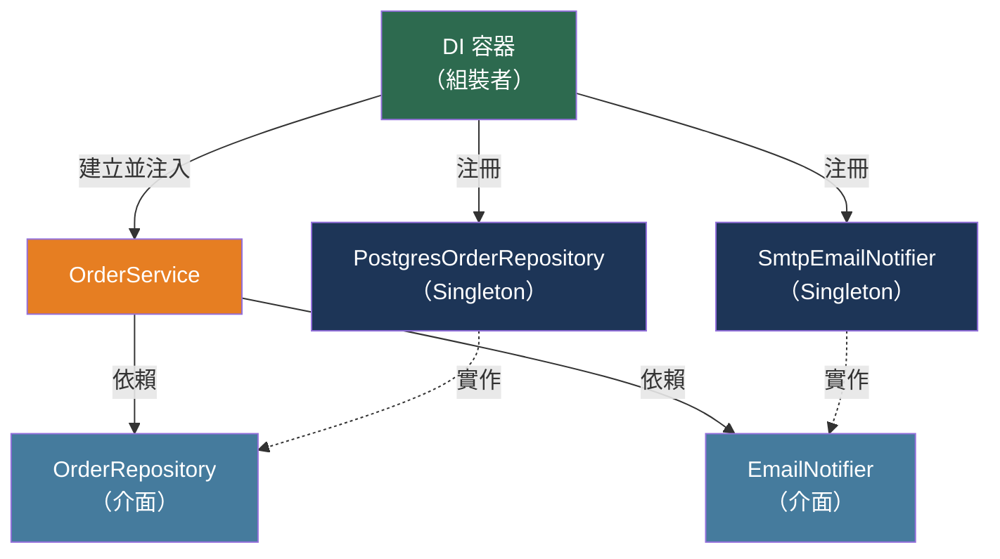

# [BEE-500] 依賴注入與控制反轉

:::info
依賴注入是一種技術，讓元件從外部接收其依賴，而非自行建立——使元件可測試、可設定，並與具體實作解耦。
:::

## 背景

「控制反轉」一詞最早出現在 1980 年代的軟體文獻中，但隨著物件導向系統規模的增長，它所解決的問題變得更加迫切。該模式描述了框架與應用程式碼之間控制流的反轉：不是應用程式碼呼叫函式庫程式碼，而是框架在定義的擴展點呼叫應用程式碼。Richard Sweet 在 1983 年關於互動式程式設計的 Mesa 論文中將此表達為好萊塢原則：「不要打電話給我們，我們會打給你。」

Martin Fowler 在 2004 年 1 月的文章《控制反轉容器與依賴注入模式》中，正式將依賴注入定義為 IoC 家族中的特定技術。當時，PicoContainer 和 Spring 等輕量級容器正在蓬勃發展，每個都以不同方式實現 IoC。Fowler 命名了三種變體——建構子注入、設定方法注入和介面注入——並將它們與服務定位器模式進行了對比。這篇文章為社群提供了共同詞彙，至今仍是該主題的標準參考。

DI 解決的實際問題是緊密耦合。一個自己實例化依賴的類別——`EmailService service = new SmtpEmailService(smtp.example.com, 587)`——與特定實作綁定。它無法在沒有真實 SMTP 伺服器的情況下進行測試。它無法在不重新編譯的情況下為不同環境重新設定。它無法被 Mock 或假物件替換。依賴注入將實例化責任從消費者類別中抽離，交給外部組裝者——大多數框架中的 DI 容器——由其在應用程式開始服務請求之前構建並連接物件圖。

SOLID 中的依賴反轉原則（D，由 Robert C. Martin 在 1990 年代中期提出）提供了設計依據：高層模組不應依賴低層模組；兩者都應依賴抽象。`OrderService` 應依賴 `EmailNotifier` 介面，而非 `SmtpEmailService`。DI 是讓 DIP 在規模上可行的機制。

## 設計思考

三個問題闡明了 DI 模型：

**誰建立物件？** 沒有 DI 時，消費者建立它：`this.db = new PostgresDatabase(connStr)`。有 DI 時，容器建立它並傳入：消費者宣告 `constructor(private db: Database)` 而根本不構建任何 `Database`。

**誰知道具體類型？** 沒有 DI 時，消費者知道。有 DI 時，容器知道——消費者只依賴介面或抽象類型。容器持有從抽象到具體實作的映射。

**物件圖何時構建？** DI 容器在啟動時（或第一次請求時）構建整個圖，驗證每個宣告的依賴都有對應的注冊，如果有任何缺失則快速失敗。這是相對於服務定位器模式的優勢——服務定位器在呼叫點解析依賴，當注冊缺失時在執行時失敗。

### 注入類型

**建構子注入**透過建構子傳入所有必要的依賴。這是推薦的預設方式：依賴明確宣告，構建後不可變，而一個需要十個建構子參數的類別表明它有太多責任——單一職責原則的違反，在程式碼審查中立即可見。

**設定方法/屬性注入**在構建後透過設定方法或公開屬性設置可選依賴。僅對具有合理預設值的真正可選依賴使用。它允許循環依賴，但犧牲了不可變性。

**欄位注入**（例如，Spring 中直接在欄位上使用 `@Autowired`）完全繞過建構子。它從類別的公開介面中隱藏了依賴，使類別在沒有容器的情況下無法實例化，並且使編譯器無法標記缺失的依賴。在新程式碼中避免使用它。

## 最佳實踐

### 在建構子中宣告依賴

**MUST（必須）將必要的依賴宣告為建構子參數，而非在建構子主體中分配的欄位。**建構子注入使依賴圖明確，啟用不可變欄位，並允許在單元測試中不使用容器實例化類別：

```java
// 偏好：依賴已宣告，所有必需，構建後不可變
@Service
public class OrderService {
    private final OrderRepository repository;
    private final EmailNotifier notifier;

    public OrderService(OrderRepository repository, EmailNotifier notifier) {
        this.repository = repository;
        this.notifier = notifier;
    }
}
```

```java
// 避免：欄位注入隱藏了依賴，需要 Spring 上下文才能測試
@Service
public class OrderService {
    @Autowired private OrderRepository repository;
    @Autowired private EmailNotifier notifier;
}
```

現代 Spring Boot 不需要在單建構子類別上使用 `@Autowired`。當只有一個建構子時，該注解是多餘的；框架按照慣例注入。

### 依賴抽象，而非具體

**MUST（必須）將依賴定義為介面或抽象類型**，當存在多個可能的實作或需要可測試性時。對 `EmailNotifier`（介面）的依賴允許在生產環境注入 `SmtpEmailNotifier`，在測試中注入 `FakeEmailNotifier`。對 `SmtpEmailNotifier` 的依賴無法被替換：

```python
# FastAPI：依賴抽象 Protocol，而非具體類別
from typing import Protocol

class EmailNotifier(Protocol):
    async def send(self, to: str, subject: str, body: str) -> None: ...

async def create_order(
    payload: OrderPayload,
    notifier: EmailNotifier = Depends(get_email_notifier),
    repo: OrderRepository = Depends(get_order_repo),
) -> Order:
    order = await repo.create(payload)
    await notifier.send(order.customer_email, "Order confirmed", ...)
    return order
```

`get_email_notifier` 依賴函式可以在生產環境返回真實的 SMTP Notifier，在測試中透過覆蓋依賴提供者返回無操作的假物件。

### 謹慎選擇生命週期

**MUST（必須）了解三種標準生命週期**並為每個注冊選擇正確的一種。生命週期錯誤會產生微妙的錯誤——通常是請求之間的資料洩漏或不必要的分配：

| 生命週期 | 建立時機 | 銷毀時機 | 用於 |
|---------|---------|---------|-----|
| **Singleton（單例）** | 容器啟動時一次 | 容器關閉 | 無狀態服務、連線池、設定 |
| **Scoped（範圍）** | 每個請求（HTTP）或工作單元一次 | 範圍結束 | 資料庫上下文、工作單元物件、每請求快取 |
| **Transient（暫時）** | 每次請求時 | 範圍結束 | 輕量、無狀態操作；每次呼叫唯一 |

**被捕獲的依賴問題：**將 Scoped 或 Transient 服務注入 Singleton 是常見錯誤。Singleton 在構建時捕獲依賴並在其生命週期內持有它——Scoped 服務實際上變成了 Singleton，失去了其注冊的目的，並導致跨請求的共享狀態：

```csharp
// 錯誤：UserContext 是 Scoped（每請求），但被 Singleton 捕獲
services.AddSingleton<OrderService>(); // singleton
services.AddScoped<UserContext>();     // scoped — 每個請求

// OrderService.constructor(UserContext ctx) — ctx 現在永遠被捕獲
// 每個請求都會看到第一個請求的 UserContext
```

ASP.NET Core 的容器在啟動時偵測到這種情況並拋出 `InvalidOperationException`。Spring 在上下文初始化時偵測。NestJS 拋出 `UnknownDependenciesException`。始終驗證 Singleton 的傳遞依賴也是 Singleton。

### 避免服務定位器模式

**MUST NOT（不得）使用全域注冊表或容器作為呼叫點解析器**（服務定位器模式）。服務定位器表面上與 DI 相似——兩者都將設定與使用分離——但它反轉了可見性：使用 DI，依賴在建構子中宣告，對任何閱讀類別的人都可見。使用服務定位器，依賴在方法主體內解析，從外部不可見：

```typescript
// 避免：服務定位器隱藏了對 EmailNotifier 的依賴
class OrderService {
    async createOrder(payload: OrderPayload) {
        const notifier = container.resolve<EmailNotifier>('EmailNotifier'); // 隱藏
        // ...
    }
}

// 偏好：依賴已宣告，可見，可注入
class OrderService {
    constructor(private notifier: EmailNotifier) {}

    async createOrder(payload: OrderPayload) {
        // notifier 在建構子簽名中可見
    }
}
```

服務定位器錯誤是執行時失敗（「找不到 'EmailNotifier' 的注冊」）。建構子注入錯誤在容器啟動時被捕獲——在第一個請求被服務之前。

### 將過度注入視為設計信號

**SHOULD（應該）當建構子接收超過四五個依賴時進行重構。**有八個依賴的建構子不是注入問題；而是單一職責原則的違反。該類別做了太多事情。補救措施：

- **提取領域服務：**將內聚的依賴分組為新的服務類別。
- **引入門面（Facade）：**建立一個聚合服務，為一組協作者提供更簡單的介面。
- **重新審視抽象：**兩個總是一起出現的獨立注入的 Repository，可能應該在一個更高層次的 Repository 後面。

不要嘗試將整個容器傳入類別（「容器注入」）作為太多依賴的解決方案。這會退化回服務定位器。

### 循環依賴表明設計問題

**SHOULD NOT（不應該）引入循環依賴。**A → B → A（A 依賴 B，B 依賴 A）表明抽象邊界是錯誤的。容器以不同方式處理這個問題：Spring 在啟動時對建構子注入的循環依賴拋出異常；NestJS 需要 `forwardRef()` 作為解決方案；Go 的 Wire 工具在程式碼生成時將其作為編譯錯誤偵測。正確的修復是重構：提取第三個類別 C，讓 A 和 B 都依賴它，或者反轉其中一個依賴使流程無循環。

## 視覺圖示



## 實作說明

### Spring Boot（Java/Kotlin）

Spring 的容器（ApplicationContext）掃描 `@Component`、`@Service`、`@Repository` 和 `@Controller` 注解並將其注冊為 Bean。單建構子類別的建構子注入不需要任何注解：

```java
@Service
public class OrderService {
    private final OrderRepository repo;
    private final EmailNotifier notifier;

    // 不需要 @Autowired — Spring 注入唯一的建構子
    public OrderService(OrderRepository repo, EmailNotifier notifier) {
        this.repo = repo;
        this.notifier = notifier;
    }
}
```

生命週期：`@Scope("singleton")`（預設）、`@Scope("prototype")`（Transient）、`@Scope("request")`（Web 應用的 HTTP 請求範圍）。Spring Boot 在上下文啟動時偵測建構子注入的循環依賴，並拋出 `BeanCurrentlyInCreationException`。

### ASP.NET Core（C#）

服務在 `Program.cs` 中注冊，並透過建構子注入：

```csharp
builder.Services.AddSingleton<IConnectionPool, NpgsqlConnectionPool>();
builder.Services.AddScoped<IOrderRepository, PostgresOrderRepository>();
builder.Services.AddTransient<IEmailNotifier, SmtpEmailNotifier>();

// 透過建構子注入使用（C# 12+ 主建構子語法）
public class OrderController(IOrderRepository repo, IEmailNotifier notifier)
{
    // repo 和 notifier 被注入
}
```

ASP.NET Core 在 `ValidateOnBuild = true` 時（開發環境預設）在啟動時驗證依賴圖。被捕獲的依賴違規在啟動時而非請求時拋出。

### NestJS（TypeScript）

NestJS 使用 TypeScript 裝飾器和反射元資料。提供者按模組注冊：

```typescript
@Injectable()
export class OrderService {
    constructor(
        private readonly repo: OrderRepository,
        private readonly notifier: EmailNotifier,
    ) {}
}

@Module({
    providers: [
        OrderService,
        { provide: EmailNotifier, useClass: SmtpEmailNotifier },
        { provide: OrderRepository, useClass: PostgresOrderRepository },
    ],
})
export class OrderModule {}
```

注入範圍：`DEFAULT`（每模組 Singleton）、`REQUEST`（每 HTTP 請求）、`TRANSIENT`（每次注入新實例）。循環依賴需要 `forwardRef(() => DependencyClass)` 作為解決方案，但始終是設計問題的信號。

### FastAPI（Python）

FastAPI 使用 `Depends()` 實現函式式 DI 系統——不需要類別裝飾器：

```python
from fastapi import Depends

def get_db() -> Generator[Session, None, None]:
    db = SessionLocal()
    try:
        yield db
    finally:
        db.close()

def get_order_repo(db: Session = Depends(get_db)) -> OrderRepository:
    return PostgresOrderRepository(db)

@router.post("/orders")
async def create_order(
    payload: OrderPayload,
    repo: OrderRepository = Depends(get_order_repo),
):
    return await repo.create(payload)
```

依賴可以在測試中透過 `app.dependency_overrides` 覆蓋：

```python
app.dependency_overrides[get_order_repo] = lambda: FakeOrderRepository()
```

### Wire（Go）

Go 沒有基於執行時反射的 DI。Google 的 Wire 在編譯時生成依賴注入程式碼：

```go
// 提供者宣告如何構建每個依賴
func NewOrderRepository(db *sql.DB) *PostgresOrderRepository { ... }
func NewEmailNotifier(cfg Config) *SmtpEmailNotifier { ... }
func NewOrderService(repo *PostgresOrderRepository, n *SmtpEmailNotifier) *OrderService { ... }

// Wire 注入器 — Wire 從此宣告生成連接程式碼
//go:build wireinject
func InitializeOrderService(cfg Config, db *sql.DB) (*OrderService, error) {
    wire.Build(NewOrderRepository, NewEmailNotifier, NewOrderService)
    return nil, nil
}
```

`wire gen` 生成一個按正確順序呼叫提供者的 `wire_gen.go` 檔案。循環依賴被偵測為編譯錯誤。沒有執行時開銷；沒有反射。

## 相關 BEE

- [BEE-103](103.md) -- 六角形架構：端口和適配器依賴 DI 在執行時為每個端口注入正確的適配器
- [BEE-101](101.md) -- 領域驅動設計基礎：DI 透過為領域聚合注入正確的儲存實作來啟用儲存庫模式
- [BEE-344](344.md) -- 測試替身：Mock、Stub、Fake：DI 是測試替身的前提——一個自己構建依賴的類別無法讓它們被假物件替換
- [BEE-102](102.md) -- CQRS：命令和查詢處理器通常在 DI 容器中注冊為 Scoped 服務，每個請求有獨立的處理器實例

## 參考資料

- [Martin Fowler. 控制反轉容器與依賴注入模式 — martinfowler.com, 2004年1月](https://martinfowler.com/articles/injection.html)
- [Martin Fowler. 控制反轉 — martinfowler.com, 2005年6月](https://martinfowler.com/bliki/InversionOfControl.html)
- [Martin Fowler. DIP 在實踐中 — martinfowler.com, 2013年5月](https://martinfowler.com/articles/dipInTheWild.html)
- [Mark Seemann. 服務定位器是反模式 — blog.ploeh.dk, 2010年2月](https://blog.ploeh.dk/2010/02/03/ServiceLocatorisanAnti-Pattern/)
- [Spring Framework. 依賴 — docs.spring.io](https://docs.spring.io/spring-framework/reference/core/beans/dependencies/factory-collaborators.html)
- [Spring Boot. 使用 Spring Beans 和依賴注入 — docs.spring.io](https://docs.spring.io/spring-boot/reference/using/spring-beans-and-dependency-injection.html)
- [Microsoft. ASP.NET Core 中的依賴注入 — learn.microsoft.com](https://learn.microsoft.com/en-us/aspnet/core/fundamentals/dependency-injection)
- [Microsoft. 服務生命週期 — learn.microsoft.com](https://learn.microsoft.com/en-us/dotnet/core/extensions/dependency-injection/service-lifetimes)
- [NestJS. 提供者 — docs.nestjs.com](https://docs.nestjs.com/providers)
- [NestJS. 注入範圍 — docs.nestjs.com](https://docs.nestjs.com/fundamentals/injection-scopes)
- [FastAPI. 依賴 — fastapi.tiangolo.com](https://fastapi.tiangolo.com/tutorial/dependencies/)
- [Google Wire. Go 的編譯時依賴注入 — go.dev](https://go.dev/blog/wire)
- [Fava 等. 軟體系統中依賴注入反模式的分類 — arXiv:2109.04256, 2021](https://arxiv.org/abs/2109.04256)
