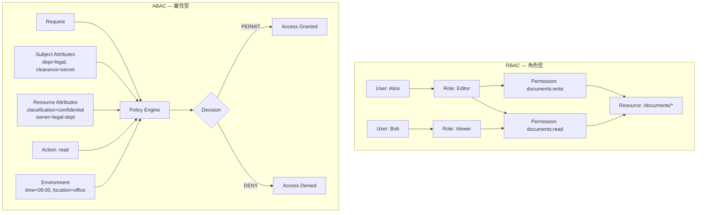

# [BEE-14] RBAC vs ABAC 存取控制模型

:::info
Role-Based Access Control（角色型存取控制）透過角色指派權限；Attribute-Based Access Control（屬性型存取控制）則根據 subject、resource、action 與 environment 的屬性評估政策。選錯模型，或在錯誤的層級執行檢查，是讓授權系統無法稽核、難以擴展、也無法變更的最可靠方式之一。
:::

## 背景

授權不只是一個有效的 token。確認身分之後（BEE-10），系統必須判斷已驗證的 principal 是否有權對目標資源執行所請求的操作。有兩個基礎模型決定這個判斷如何被編碼：

**Role-Based Access Control (RBAC)** 由 Ferraiolo 與 Kuhn 於 1992 年正式化，並標準化為 ANSI INCITS 359-2004（2012 年修訂）。RBAC 將權限分組至角色，再將角色指派給使用者。使用者繼承其所有角色的全部權限。此模型明確定義實體：users、roles、permissions、operations 與 objects，以及它們之間的關係。

**Attribute-Based Access Control (ABAC)** 定義於 NIST SP 800-162：「一種邏輯存取控制方法，透過評估與 subject、object、請求操作以及環境條件相關的屬性，對照描述特定屬性組合可執行操作的政策或規則，來判斷是否授予執行一組操作的授權。」ABAC 不對角色做任何結構性假設，它在決策當下評估任意屬性的組合。

兩種模型解決的是同一個根本問題：如何表達「principal P 在情境 C 下可對資源 R 執行操作 A」這條規則。它們的差異在於規則存放的位置、表達方式，以及擴展方式。

## 原則

**P1 — 在 RBAC 中，將 Users 對應到 Roles，再對應到 Permissions；絕不跳過 role 層。** 透過角色間接指派不是官僚程序，而是讓 RBAC 可稽核的機制。從角色移除一個權限，會自動套用到持有該角色的所有使用者。直接的 user-to-permission 對應消除了這個特性，重現了 RBAC 設計來解決的混亂。

**P2 — 在 ABAC 中，政策必須評估屬性，而非身分。** ABAC 政策以屬性表達規則：「department=legal 的使用者可在上班時間讀取 classification=confidential 的文件。」政策中不指名任何特定使用者或角色。這種解耦是 ABAC 的主要優勢：政策在組織改組後依然有效。

**P3 — 在單一、明確定義的層級執行授權。** OWASP Authorization Cheat Sheet 明確指出：「存取控制檢查必須在伺服器端、gateway，或透過 serverless function 執行。」無論請求來源為何（AJAX、背景工作、內部服務），對受保護資源的每個請求都必須經過評估。用戶端檢查只是 UI 提示，不是安全控制。

**P4 — 在兩種模型中都套用最小權限原則 (Principle of Least Privilege)。** 指派使用者涵蓋其職責所需的最少角色（RBAC），或撰寫政策只授予所需的最少屬性組合（ABAC）。定期稽核以識別 privilege creep。最小權限同時適用於水平（相同層級的使用者之間）與垂直（跨階層層級）。

**P5 — 在新增角色之前先使用 role hierarchy（角色階層）。** RBAC 支援繼承：`senior-editor` 角色可以繼承 `editor` 的全部權限並增加更多。在建立新角色之前，先確認現有角色加上一個額外權限是否能滿足需求。階層可減少角色數量，並讓權限矩陣保持清晰。

**P6 — 將政策評估外部化。** 硬編碼在應用程式 handler 中的授權邏輯無法被一致稽核、容易在新端點中被遺漏，且必須重新部署才能更新。無論實作是 RBAC 角色檢查還是 ABAC 政策引擎（OPA、Cedar、Casbin），評估呼叫必須通過單一介面。

## 視覺說明

以下圖示展示兩種模型在相同文件管理情境下的結構差異。



在 RBAC 中，權限被預先計算並以角色指派的方式儲存。在 ABAC 中，權限在請求當下透過評估屬性對照政策來計算。RBAC 回答「這個角色被允許做什麼？」；ABAC 回答「根據我們現在對這個請求所知的一切，這個操作是否被允許？」

## 範例

同一個文件管理系統——文件有分類等級，使用者有部門與授權層級——分別用兩種模型實作。

### RBAC 實作

定義對應職務功能的角色：

```
Roles:
  legal-viewer   → [documents:read]                            (classification ≤ internal)
  legal-editor   → [documents:read, documents:write]           (classification ≤ confidential)
  legal-admin    → [documents:read, documents:write,
                    documents:delete, documents:share]
  
  # legal-editor 透過 role hierarchy 繼承 legal-viewer
  legal-editor → inherits legal-viewer

User assignments:
  Alice → [legal-editor]
  Bob   → [legal-viewer]
  Carol → [legal-admin]
```

請求時的權限檢查：

```
function authorize_rbac(user, action, resource):
    roles = role_store.get_roles(user.id)                   # ["legal-editor"]
    permissions = expand_permissions(roles)                 # ["documents:read", "documents:write"]
    required = derive_required_permission(action, resource) # "documents:write"
    return required in permissions
```

### ABAC 實作

以屬性型政策表達相同情境：

```
# 政策 1：法務部門成員可在上班時間從核准地點讀取機密文件
Policy read-legal-confidential:
    effect: PERMIT
    condition:
        subject.department == "legal"
        AND subject.clearance IN ["confidential", "secret"]
        AND resource.classification == "confidential"
        AND action == "read"
        AND environment.time BETWEEN 08:00 AND 18:00

# 政策 2：法務編輯可寫入機密文件
Policy write-legal-confidential:
    effect: PERMIT
    condition:
        subject.department == "legal"
        AND subject.job_level >= 3
        AND resource.classification == "confidential"
        AND resource.owner_department == "legal"
        AND action IN ["write", "update"]

# 預設：拒絕所有未匹配的請求
Default: DENY
```

政策引擎呼叫：

```
function authorize_abac(request):
    context = {
        subject:     { department: user.dept, clearance: user.clearance,
                       job_level: user.level },
        resource:    { classification: doc.classification,
                       owner_department: doc.owner_dept },
        action:      request.method_to_action(),
        environment: { time: now(), location: request.origin_region }
    }
    return policy_engine.evaluate(context)   # PERMIT 或 DENY
```

### 相同操作的比較

Alice（legal-editor，clearance=confidential）請求寫入文件 D（classification=confidential，owner=legal）：

| 步驟 | RBAC | ABAC |
|---|---|---|
| 檢查內容 | Alice 的角色集合是否包含 `documents:write`？ | Alice 的屬性加上 D 的屬性，是否滿足 `write` 的 PERMIT 政策？ |
| 時間限制 | 無法直接表達，需另加一層 | 原生支援：在政策加入 `AND environment.time BETWEEN 08:00 AND 18:00` |
| 新增員工 | 將其指派至 `legal-editor` | 不需變更；其屬性自動符合條件 |
| 下班後撤銷 | 需要 session 失效或 token 到期 | 政策在 runtime 評估；限制立即生效 |

## 何時選擇 RBAC、ABAC 或混合模型

| 準則 | 偏向 RBAC | 偏向 ABAC |
|---|---|---|
| 團隊規模與穩定性 | 穩定團隊，職務功能明確 | 動態團隊，角色頻繁變動 |
| 權限可變性 | 權限清楚對應職務功能 | 權限取決於資料分類、情境或時間 |
| 法規要求 | 基於角色指派的稽核軌跡 | 需要細粒度的屬性稽核日誌 |
| 運維複雜度 | 簡單，易於操作與除錯 | 團隊有能力維護政策引擎 |
| 多租戶需求 | 單一組織部署 | 跨組織或多租戶 SaaS |

**混合方法：** 以 RBAC 做粗粒度存取控制（此使用者可存取 Documents 模組），再在模組內以 ABAC 做細粒度決策（哪些特定文件、在什麼條件下）。Gateway 的角色檢查以低成本過濾 99% 的未授權請求；service 層的屬性檢查則執行細緻的政策，不需讓每個請求都進入政策引擎。

## 權限執行點

授權必須在每個存取受保護資料的層級執行，不只是在邊界。

```
Inbound Request
      │
      ▼
┌─────────────────────────────────────────────────────────┐
│ API Gateway / Reverse Proxy                             │
│ 粗粒度檢查：此 route/scope 是否允許此角色？             │
│ 提早拒絕明顯未授權的請求。                              │
└─────────────────────┬───────────────────────────────────┘
                      │
                      ▼
┌─────────────────────────────────────────────────────────┐
│ Middleware / Interceptor                                │
│ 情境檢查：注入 principal，附加 tenant，                 │
│ 驗證 token scope 對應所請求的端點。                     │
└─────────────────────┬───────────────────────────────────┘
                      │
                      ▼
┌─────────────────────────────────────────────────────────┐
│ Service / Domain Layer                                  │
│ 細粒度檢查：此 principal 是否可對                       │
│ 這個特定資源實例執行此操作？                            │
│ 這是 ABAC 屬性評估應歸屬的層級。                        │
└─────────────────────────────────────────────────────────┘
```

Gateway 檢查成本低且粗略。Service 層檢查能存取完整的資源情境並套用特定政策。兩個檢查都是必要的：跳過 gateway 檢查代表 service 必須吸收所有流量；跳過 service 層檢查代表 gateway 的粗略規則是唯一的防線。

## 常見錯誤

**1. 每個使用者建立一個角色。**

當每個使用者都有專屬角色，RBAC 就失去了所有相對於 ACL 的優勢，也消除了角色分組的稽核好處。如果你發現自己在以人名命名角色（`alice-editor`、`bob-viewer`），這個系統並非在使用 RBAC，而是以多餘的步驟模擬 per-user 權限。依職務功能分組使用者，而非依身分。

**2. 在整個程式碼庫中硬編碼權限檢查。**

```
# 反模式 — 分散、無法稽核、不一致
if user.role == "admin":
    allow_delete()

if "legal" in user.groups and doc.classification != "top-secret":
    allow_read()
```

這些檢查無法在不搜尋每個檔案的情況下被安全稽核、在新端點中容易被悄悄遺漏，且必須修改應用程式碼才能更新。所有授權決策必須通過單一介面——一個 policy 模組、middleware 函式或外部引擎呼叫。

**3. 未考慮 role hierarchy（角色階層）。**

新增一個複製所有 `editor` 權限再多一個的 `senior-editor` 角色，會建立兩個必須保持同步的角色。任何新增到 `editor` 的權限都必須手動新增到 `senior-editor`。使用 hierarchical RBAC：`senior-editor inherits editor`。權限變更會自動傳播，角色圖也能反映實際的組織結構。

**4. 在 RBAC 已足夠時過度設計為 ABAC。**

ABAC 需要政策語言、政策引擎、subject 與 resource 的屬性儲存，以及 runtime 評估。對於一個有五種使用者類型且權限清楚對應職務功能的系統，這些基礎建設是成本而非效益。只在政策真正需要無法以角色表達的屬性組合時才套用 ABAC，而不是作為預設起點。

## 相關 BEE

- [BEE-10: Authentication vs Authorization](/zh-tw/Authentication%20and%20Authorization/10) — 所有權限模型的前置管線
- [BEE-12: OAuth 2.0 and OpenID Connect](/zh-tw/Authentication%20and%20Authorization/12) — scope 如何在協定層面對應粗粒度 RBAC
- [BEE-101: API Gateway Patterns](/zh-tw/API%20Design%20and%20Contracts/101) — gateway-first 架構中的執行點

## 參考資料

- Ferraiolo, D. and Kuhn, R., "Role-Based Access Controls" (1992). Proceedings of the 15th National Computer Security Conference. https://csrc.nist.gov/projects/role-based-access-control
- Sandhu, R., Ferraiolo, D., and Kuhn, R., "The NIST Model for Role-Based Access Control: Towards a Unified Standard" (2000). https://csrc.nist.gov/projects/role-based-access-control
- ANSI INCITS 359-2004 (revised as INCITS 359-2012), "Information Technology — Role Based Access Control." https://standards.incits.org/apps/group_public/project/details.php?project_id=506
- Hu, V. et al., "Guide to Attribute Based Access Control (ABAC) Definition and Considerations" NIST SP 800-162 (2014, updated 2019). https://csrc.nist.gov/pubs/sp/800/162/upd2/final
- OWASP, "Authorization Cheat Sheet" (2024). https://cheatsheetseries.owasp.org/cheatsheets/Authorization_Cheat_Sheet.html
- OWASP, "Access Control Cheat Sheet" (2024). https://cheatsheetseries.owasp.org/cheatsheets/Access_Control_Cheat_Sheet.html
