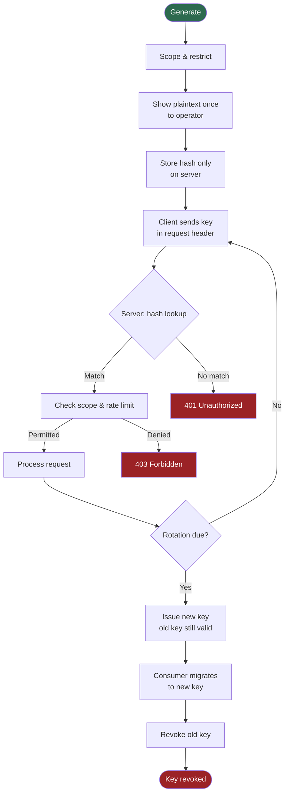

# [BEE-15] API 金鑰管理

:::info
API 金鑰（API key）是用來識別客戶端應用程式的長期憑證，而非識別使用者。應將其視同密碼對待：以密碼學安全的方式產生、雜湊（hash）後再存入資料庫、嚴格限縮權限範圍，並定期輪換。
:::

## 背景

API 金鑰是一段客戶端應用程式隨每個請求一起提交的秘密字串，讓伺服器得以辨識是哪個應用程式在呼叫 API。與 bearer token 不同——bearer token 通常代表委派的使用者 session——API 金鑰代表的是應用程式本身（或服務帳號）。這個區別至關重要：API 金鑰回答的是「這是哪個應用程式？」，而非「是哪位使用者在操作？」。

API 金鑰在各種開發者平台中無所不在。Stripe 發行 secret key 供伺服器對伺服器的金流處理；Google Cloud 將 API 金鑰綁定到專案以追蹤服務配額；GitHub personal access token 則作為自動化腳本的 API 金鑰。儘管普及，API 金鑰的使用方式卻常見失當：嵌入前端程式碼、提交至版本控制、從未輪換、以明文存放——這些行為都會讓方便性憑證演變成持久的安全隱患。

OWASP API Security Top 10（2023）將 Broken Authentication（API2:2023）列為第二大 API 風險，不當管理長期憑證（如 API 金鑰）正是直接成因之一。OWASP Secrets Management Cheat Sheet 與 REST Security Cheat Sheet 提供了憑證產生、儲存與傳輸的實務指引，本 BEE 將其具體應用於 API 金鑰管理。

## 原則

**P1 — API 金鑰必須（MUST）使用密碼學安全的隨機來源產生，最少具備 256 位元的熵值。**

金鑰的不可預測性取決於其產生器。金鑰不得（MUST NOT）從序號 ID、時間戳記、UUID（具有固定結構的位元）或可讀字串推導而來。請使用 `crypto/rand`（Go）、`secrets.token_bytes(32)`（Python）、`crypto.randomBytes(32)`（Node.js）或等效的 CSPRNG。256 位元的熵值確保即使具備相當算力，金鑰空間也過大到無法暴力枚舉。

**P2 — API 金鑰在存入資料庫前必須（MUST）使用密碼安全的雜湊演算法進行雜湊處理。**

伺服器從不需要還原明文金鑰——只需驗證提交的金鑰是否與核發時的金鑰相符。請僅儲存雜湊值（使用 bcrypt、Argon2 或 BLAKE3-HMAC）。明文金鑰必須（MUST）在核發時向使用者展示一次，之後永不再顯示。這與密碼的處理方式相同：即使資料庫外洩，雜湊值的資料庫也不會立即暴露有效憑證。（OWASP Cryptographic Storage Cheat Sheet）

**P3 — API 金鑰必須（MUST）僅透過 HTTPS 傳輸，且應當（SHOULD）放在請求標頭中，而非 query parameter。**

Query parameter 會出現在伺服器存取日誌、瀏覽器歷史、referrer 標頭與 CDN 日誌中。放在 URL 中的金鑰會悄無聲息且持久地外洩。標準做法是使用 `Authorization: Bearer <key>` 或自訂標頭如 `X-API-Key: <key>`。Google Cloud API 金鑰文件明確建議使用 `x-goog-api-key` 標頭，而非 URL 參數。

**P4 — API 金鑰必須（MUST）限縮至最小必要權限。**

每個金鑰應當（SHOULD）限制於：
- 特定環境（開發、測試、正式）
- 特定服務或端點集合
- 特定權限層級（唯讀 vs. 讀寫）
- 特定來源 IP 範圍（適用於具備穩定 IP 的服務）

Stripe 的 restricted API key（RAK）正是此模型的實作範例：每個金鑰僅具備整合所需的資源權限。即使唯讀金鑰被竊，也無法寫入資料；測試環境的金鑰洩漏也無法存取正式環境。

**P5 — API 金鑰必須（MUST）具備輪換策略，且在過渡期間應當（SHOULD）支援雙金鑰重疊機制。**

無輪換計畫的金鑰等同於永久性憑證。輪換應當（SHOULD）依固定週期執行（Google Cloud 建議以 90 天為基準），在疑似洩漏或成員異動時必須（MUST）立即輪換。計畫性輪換期間，核發新金鑰的同時讓舊金鑰保持有效（通常 24–72 小時的寬限期），待所有使用方完成遷移後再撤銷舊金鑰。這個雙金鑰重疊機制可避免服務中斷，同時消除舊憑證。

**P6 — 伺服器必須（MUST）對每個金鑰強制執行速率限制（rate limiting）。**

依 API 金鑰進行速率限制，能讓伺服器偵測濫用行為（某金鑰出現異常請求量）、保護後端容量，並執行分層用量配額。速率限制的狀態應當（SHOULD）透過回應標頭回傳（`X-RateLimit-Limit`、`X-RateLimit-Remaining`、`X-RateLimit-Reset`），讓行為良好的客戶端得以自動調整請求節奏。

**P7 — API 金鑰不得（MUST NOT）作為用戶敏感操作的唯一安全機制。**

API 金鑰識別的是呼叫端應用程式，不識別使用者、不承載同意授權範圍（consent scope），也不支援委派。任何代表使用者執行的操作（存取使用者資料、發起使用者可見的交易），都應在 API 金鑰之外額外使用 OAuth 2.0 短期 access token，或以 OAuth client credentials grant 取代 API 金鑰進行機器對機器的流程。（參見 BEE-11）

## 圖解

下圖展示 API 金鑰的完整生命週期，從產生到撤銷，包含輪換期間的雙金鑰重疊窗口。



驗證時的雜湊比對類似於密碼驗證：伺服器以相同的演算法對傳入的金鑰進行雜湊，再與資料庫中儲存的雜湊值比較。明文金鑰不會被儲存，也不會直接進行比較。

## 範例

### 核發金鑰（伺服器端）

```python
import secrets
import hashlib
import hmac
import base64

# P1：產生 32 bytes = 256 bits 的密碼學安全隨機值
raw_key_bytes = secrets.token_bytes(32)

# 編碼以供傳輸——前綴有助於在日誌/設定中辨識金鑰類型
prefix = "myapp_key_"
raw_key_b64 = base64.urlsafe_b64encode(raw_key_bytes).decode("ascii").rstrip("=")
plaintext_key = f"{prefix}{raw_key_b64}"
# 例如："myapp_key_example1234567890abcdefghijklmno"

# P2：存入前先進行雜湊——使用伺服器端 secret 的 HMAC-SHA256
# （Argon2/bcrypt 較適合用於使用者密碼；API 金鑰本身具備 256 位元的熵值，
#  HMAC-SHA256 在此場景下是可接受的）
SERVER_SIGNING_SECRET = b"<從環境變數載入，絕不寫死在程式碼中>"
key_hash = hmac.new(SERVER_SIGNING_SECRET, plaintext_key.encode(), hashlib.sha256).hexdigest()

# 將 key_hash、prefix、scopes、rate_limit、created_at 儲存至資料庫。
# 只將 plaintext_key 回傳給操作人員一次，不儲存 plaintext_key。
```

### 驗證傳入請求（伺服器端）

```python
def authenticate_request(request):
    # P3：從標頭讀取，而非 query parameter
    raw = request.headers.get("X-API-Key") or request.headers.get("Authorization", "").removeprefix("Bearer ")
    if not raw:
        return error(401, "API key required")

    # 以與核發時相同的方式對傳入金鑰進行雜湊
    inbound_hash = hmac.new(SERVER_SIGNING_SECRET, raw.encode(), hashlib.sha256).hexdigest()

    # 固定時間比較（constant-time comparison）防止時序攻擊
    record = db.lookup_by_prefix(raw[:len("myapp_key_") + 8])
    if record is None or not hmac.compare_digest(inbound_hash, record.key_hash):
        return error(401, "Invalid API key")

    # P4：檢查 scope
    if required_scope not in record.scopes:
        return error(403, "Insufficient key scope")

    # P6：檢查速率限制
    if rate_limiter.is_exceeded(record.id):
        return error(429, "Rate limit exceeded")

    return record  # 已驗證的應用程式身份
```

### 請求標頭中的金鑰 vs. query parameter

```
# 正確——金鑰放在標頭中，不在 URL 裡
GET /v1/reports/summary HTTP/1.1
Host: api.example.com
X-API-Key: myapp_key_example1234567890abcdefghijklmno

# 錯誤——金鑰出現在 URL 中，將被記錄在所有地方
GET /v1/reports/summary?api_key=myapp_key_example1234567890abcdefghijklmno HTTP/1.1
Host: api.example.com
```

### 雙金鑰重疊的輪換流程

```
第   0 天：金鑰 A 核發。客戶端使用金鑰 A。
           [A: 有效]

第  85 天：啟動輪換，核發金鑰 B。
           寬限期間兩個金鑰均可使用。
           [A: 有效, B: 有效]

第  87 天：使用方將設定更新為金鑰 B。
           確認完成——所有流量已轉至金鑰 B。
           [A: 有效, B: 有效]

第  88 天：撤銷金鑰 A。
           [A: 已撤銷, B: 有效]
```

## 常見錯誤

**1. 將 API 金鑰嵌入前端 JavaScript。**

任何隨網頁、行動應用程式二進位檔或公開儲存庫發布的金鑰都等同於已被洩漏。前端程式碼對任何人都是可讀的。API 金鑰應保存在伺服器端。若瀏覽器應用程式需要呼叫外部 API，應將請求路由至持有金鑰的自有後端。

**2. 將金鑰提交至版本控制。**

`.env` 檔、設定檔與寫死的字串一旦提交至 git，即使事後刪除，也會永久留存於歷史記錄中。各種 secret 掃描工具（GitHub secret scanning、GitGuardian）的存在正是因為這個錯誤極為普遍。應將金鑰存放於 secrets manager（AWS Secrets Manager、HashiCorp Vault、Azure Key Vault），並在執行期間注入至環境。

**3. 所有環境共用同一個金鑰。**

具備正式環境等級權限的開發金鑰就是正式環境的風險。開發環境的安全防護通常較低（共用筆電、CI pipeline、第三方工具），因此各環境應核發獨立的金鑰，避免開發環境的洩漏波及正式環境資料。

**4. 以明文儲存 API 金鑰。**

資料庫遭到入侵不應立即導致可用憑證外洩。在存入前應以與密碼相同的規範對金鑰進行雜湊。外洩一張由 256 位元隨機金鑰所產生的 HMAC-SHA256 雜湊資料表，對攻擊者而言沒有實際攻擊價值——無法從雜湊值反推金鑰。

**5. 沒有輪換策略，將金鑰視為永久憑證。**

沒有過期時間、沒有輪換計畫的金鑰，終將在某個時間點被洩漏、遺忘，或活過所有知道它部署位置的團隊成員。定期輪換是一種運營強制機制：它確認你知道每個使用方是誰、驗證 runbook 可以正常執行，並限縮歷史暴露窗口。

## 相關 BEE

- [BEE-10: Authentication vs Authorization](/en/Authentication%20and%20Authorization/10) — 身份識別與授權之間的概念邊界
- [BEE-11: Token-Based Authentication](/en/Authentication%20and%20Authorization/11) — 用於使用者委派存取的短期 token
- [BEE-31: Secrets Management](/en/Security%20Fundamentals/31) — 在正式環境中儲存與輪換憑證
- [BEE-71: Rate Limiting and Throttling](/en/Reliability%20and%20Performance/71) — 每個金鑰的速率限制策略

## 參考資料

- OWASP, "API Security Top 10 2023 — API2:2023 Broken Authentication". https://owasp.org/API-Security/editions/2023/en/0xa2-broken-authentication/
- OWASP, "Secrets Management Cheat Sheet" (2024). https://cheatsheetseries.owasp.org/cheatsheets/Secrets_Management_Cheat_Sheet.html
- OWASP, "REST Security Cheat Sheet" (2024). https://cheatsheetseries.owasp.org/cheatsheets/REST_Security_Cheat_Sheet.html
- OWASP, "Key Management Cheat Sheet" (2024). https://cheatsheetseries.owasp.org/cheatsheets/Key_Management_Cheat_Sheet.html
- Google Cloud, "Best practices for managing API keys" (2024). https://cloud.google.com/docs/authentication/api-keys-best-practices
- Google Cloud, "Best practices for securely using API keys". https://support.google.com/googleapi/answer/6310037
- Stripe, "API keys" (developer documentation). https://docs.stripe.com/keys
- Stripe, "Best practices for managing secret API keys". https://docs.stripe.com/keys-best-practices
- Stripe, "Restricted API keys". https://docs.stripe.com/keys/restricted-api-keys
