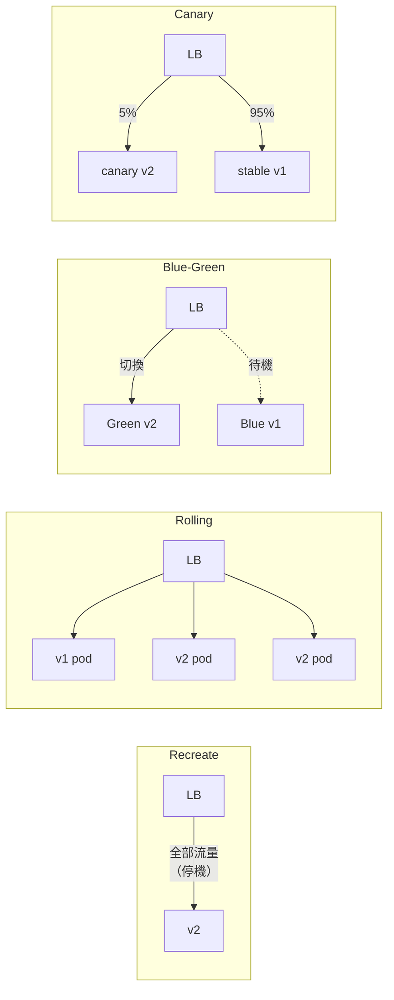

# [BEP-361] 部署策略

:::info
選擇正確的部署策略決定了你的爆炸半徑、回滾速度與發布期間的基礎設施成本。藍綠部署、金絲雀部署、滾動更新與重建各有不同的取捨。
:::

## 背景

每次生產環境部署都帶有風險。你選擇的策略決定了多少流量會暴露在新版本下、你能多快偵測到故障，以及你能多快恢復。沒有做出明確選擇——或選擇錯誤——都可能把一次例行發布變成事故。

後端部署有四種主流策略：**重建（Recreate）**、**滾動更新（Rolling Update）**、**藍綠部署（Blue-Green）** 與 **金絲雀部署（Canary）**。第五種模式 **A/B 部署** 常與金絲雀混淆，但目的不同。

**參考資料：**
- Martin Fowler，[Blue Green Deployment](https://martinfowler.com/bliki/BlueGreenDeployment.html)
- Martin Fowler，[Canary Release](https://martinfowler.com/bliki/CanaryRelease.html)
- Kubernetes，[Performing a Rolling Update](https://kubernetes.io/docs/tutorials/kubernetes-basics/update/update-intro/) 與 [Deployments](https://kubernetes.io/docs/concepts/workloads/controllers/deployment/)
- Google SRE Workbook，[Canarying Releases](https://sre.google/workbook/canarying-releases/)

## 原則

**根據你的風險承受度、基礎設施容量，以及所部署變更的性質，選擇對應的部署策略。** 沒有一種策略放諸四海皆準；選擇時必須考量：變更是否向後相容、你能多快偵測到不良發布，以及出問題時的回滾方案。

## 四種策略

### 1. 重建（Recreate / Big Bang）

停止所有舊版本實例，再啟動所有新版本實例。

**流程：**

1. 終止所有 v1 Pod / 實例。
2. 啟動所有 v2 Pod / 實例。
3. v2 健康後流量恢復。

**取捨：**

| | |
|---|---|
| 簡單度 | 最高——不需要流量分流邏輯 |
| 停機時間 | 有——停止與啟動之間不可避免的空窗 |
| 回滾 | 重新部署 v1（同樣有停機） |
| 適用場景 | 非關鍵服務、批次工作、開發 / 測試環境 |

除非可以接受計畫性維護視窗，否則不要對用戶端服務使用重建策略。

---

### 2. 滾動更新（Rolling Update）

實例逐一（或小批量）替換。過渡期間舊版與新版同時運行。

**流程（Kubernetes 預設）：**

```
v1 v1 v1 v1  →  v2 v1 v1 v1  →  v2 v2 v1 v1  →  v2 v2 v2 v1  →  v2 v2 v2 v2
```

Kubernetes 關鍵參數：
- `maxSurge`：超出期望數量最多可存在幾個額外 Pod
- `maxUnavailable`：更新期間最多允許幾個 Pod 不可用

**取捨：**

| | |
|---|---|
| 停機時間 | 無（需正確設定健康檢查） |
| 基礎設施成本 | 最低——僅有短暫的小量暴增 |
| 回滾 | `kubectl rollout undo`——快速且有版本紀錄 |
| 風險 | 舊版與新版同時對外服務流量 |

**關鍵限制：** 滾動更新要求 v1 與 v2 的 API 相容。若 v2 破壞了 v1 用戶端依賴的合約，打到 v1 Pod 的請求會成功，而打到 v2 Pod 的請求會失敗——這種腦裂故障（split-brain failure）難以診斷。

---

### 3. 藍綠部署（Blue-Green Deployment）

兩個完全相同的生產環境並存：**藍環境**（目前上線）與**綠環境**（新版本）。在負載均衡器（LB）層進行原子切換。

**流程：**

```
步驟 1：藍環境上線，綠環境閒置
  LB → Blue (v1)      Green (v1，閒置)

步驟 2：將 v2 部署至綠環境，執行冒煙測試
  LB → Blue (v1)      Green (v2，測試中)

步驟 3：將 LB 切換至綠環境
  LB → Green (v2)     Blue (v1，待機)

步驟 4：如需回滾——在數秒內將 LB 切回藍環境
  LB → Blue (v1)      Green (v2，閒置)
```

**取捨：**

| | |
|---|---|
| 停機時間 | 無——LB 切換即時完成 |
| 回滾 | 幾乎即時——將 LB 切回即可 |
| 基礎設施成本 | 切換視窗期間需 2 倍容量 |
| 爆炸半徑 | 切換後 100% 流量立即進入新版本 |

**資料庫考量：** 若 v2 包含 Schema 變更，綠環境必須使用 v1 也能讀取的 Schema（先擴充再收縮模式，expand-before-contract）。請參閱 [BEP-123](#) 了解資料庫遷移對齊方式。

---

### 4. 金絲雀部署（Canary Deployment）

將一小比例的流量路由至新版本，監控指標後再逐步提高比例。

**流程：**

```
階段 1：5% → v2，  95% → v1   （監控 30 分鐘）
階段 2：25% → v2，75% → v1   （監控 30 分鐘）
階段 3：50% → v2，50% → v1   （監控 30 分鐘）
階段 4：100% → v2             （舊實例終止）
```

**自動晉升閘門**——在確認以下條件前不得進入下一階段：
- 錯誤率：新版 <= 基準線
- P99 延遲：新版 <= 基準線 × 1.1
- 業務指標：轉換率、吞吐量無明顯變化

**取捨：**

| | |
|---|---|
| 停機時間 | 無 |
| 基礎設施成本 | 低於藍綠——僅部分機群 |
| 回滾 | 將金絲雀路由比例調至 0%；快速且影響局部 |
| 爆炸半徑 | 有限——僅金絲雀比例的流量受影響 |
| 複雜度 | 高——需要流量分流與指標比對 |

**不要只靠人工審查來執行金絲雀部署。** 必須採用自動化分析（錯誤率閾值、SLO 違規告警）；人工審查太慢，無法在大規模影響發生前阻止問題擴散。

---

### 5. A/B 部署（vs. 金絲雀）

A/B 部署根據**使用者或請求屬性**（Header 值、使用者分群、地理位置）路由流量，而非隨機比例。其目的是功能比較，而非降低發布風險。

| | 金絲雀 | A/B |
|---|---|---|
| 路由依據 | 隨機百分比 | 使用者分群或屬性 |
| 目標 | 降低不良發布的風險 | 衡量功能對特定分群的影響 |
| 流量控制 | 隨時間逐步增加 | 在量測期間維持穩定分流 |
| 相關 BEP | — | [BEP-363 Feature Flags](#) |

A/B 部署是功能管理關注點；金絲雀是發布安全關注點。兩者可在同一服務上同時執行。

---

## 四種策略一覽



| 策略 | 零停機 | 回滾速度 | 基礎設施成本 | 爆炸半徑 |
|---|---|---|---|---|
| 重建 | 否 | 分鐘級 | 1x | 100% |
| 滾動更新 | 是 | 快速（undo） | ~1.2x | 漸進式 |
| 藍綠部署 | 是 | 即時 | 2x | 切換時 100% |
| 金絲雀 | 是 | 快速（0% 路由） | ~1.1x | 有限百分比 |

---

## 實例演練：部署 API 服務 v2

**情境：** REST API 服務，生產環境 20 個 Pod，v2 新增回應欄位並更新資料庫欄位。

### 藍綠部署流程

1. 將 v2 部署至綠機群（20 個 Pod），藍機群持續上線。
2. 對綠環境執行冒煙測試（內部健康檢查端點、關鍵 API 路徑）。
3. 確認資料庫遷移與 v1 向後相容（新增欄位，無重新命名）。
4. 將 LB 從藍環境切換至綠環境。
5. 監控錯誤率 15 分鐘。
6. 若錯誤率飆升：在 30 秒內將 LB 切回藍環境。
7. 穩定運行 24 小時後：停用藍環境或改作下次部署使用。

### 金絲雀部署流程

1. 將 v2 部署至 1 個 Pod（機群的 5%）。
2. 將 5% 流量路由至 v2 Pod。
3. 執行自動化指標比對 30 分鐘：
   - 若 v2 P99 延遲 > v1 P99 的 110%，觸發告警。
   - 若 v2 錯誤率 > v1 錯誤率 + 0.1%，觸發告警。
4. 若閘門通過：擴展至 4 個 Pod（20%），等待 30 分鐘。
5. 擴展至 10 個 Pod（50%），等待 30 分鐘。
6. 擴展至 20 個 Pod（100%），終止 v1 Pod。
7. **任意階段的回滾：** 將金絲雀 Pod 縮減至 0，將所有流量導回 v1。

---

## 資料庫遷移與部署策略的互動

資料庫變更是回滾失敗最常見的原因。在過渡視窗期間，Schema 必須與**舊版和新版**應用程式同時相容。

| 變更類型 | 滾動更新安全？ | 藍綠部署安全？ | 金絲雀安全？ |
|---|---|---|---|
| 新增可為空（nullable）欄位 | 是 | 是 | 是 |
| 新增無預設值的非空欄位 | 否 | 否 | 否 |
| 重新命名欄位 | 否——v1 會壞掉 | 否——v1 會壞掉 | 否 |
| 刪除欄位 | 否——v1 會壞掉 | 否——v1 會壞掉 | 否 |
| 新增索引（concurrent） | 是 | 是 | 是 |

**原則：** 不向後相容的 Schema 變更必須分兩次獨立發布：
1. Release N：新增新欄位（nullable），遷移資料，程式碼雙寫。
2. Release N+1：所有舊程式碼下線後，刪除舊欄位。

完整的先擴充再收縮遷移模式請參閱 [BEP-123](#)。

---

## 零停機部署的必要條件

以下所有條件都必須滿足，零停機部署才能實現：

1. **健康檢查正確。** LB 在 Pod 的 readiness probe 通過前不得路由流量。
2. **優雅關閉已實作。** 應用程式在退出前完成進行中的請求（處理 `SIGTERM`，加入排水期）。
3. **資料庫變更在整個過渡視窗期間向後相容。**
4. **不透過滾動更新部署破壞性 API 變更**（v1 與 v2 用戶端會混合出現）。
5. **連線池與快取** 在流量切換前已預熱完成。

---

## 各部署類型的回滾策略

| 策略 | 回滾機制 | 回滾耗時 | 資料風險 |
|---|---|---|---|
| 重建 | 重新部署 v1 | 分鐘級 + 停機 | 低（單一版本） |
| 滾動更新 | `kubectl rollout undo` | ~30–90 秒 | 若變更為新增操作則低 |
| 藍綠部署 | 將 LB 切回藍環境 | < 30 秒 | 若 Schema 已變更則中等 |
| 金絲雀 | 將金絲雀權重設為 0% | < 60 秒 | 低——僅有部分流量受影響 |

---

## 常見錯誤

**1. 沒有回滾計畫。**
團隊定義了部署步驟，卻沒有定義回滾步驟。每次部署前，都應明確寫下回滾方式與執行人員。

**2. 資料庫變更不向後相容。**
若 v2 重新命名欄位，而 v1 程式碼仍在執行（滾動更新、金絲雀），v1 就會壞掉。過渡視窗期間 Schema 變更必須是新增性的。違反此原則會讓程式碼回滾在沒有獨立資料回滾的情況下無法執行。

**3. 金絲雀沒有自動化指標比對。**
手動執行金絲雀——每 30 分鐘手動查看儀表板——太慢了。緩慢上升的錯誤率或 P99 退化都會被漏掉。請自動化晉升閘門。

**4. 藍綠部署沒有足夠的 2 倍基礎設施容量。**
藍綠部署需要同時運行兩套完整的生產環境。在成本受限或突發容量環境中，綠機群可能沒有足夠的空間。請在部署視窗之前（而非之中）驗證容量。

**5. 滾動更新使用了破壞性 API 變更。**
滾動更新期間，舊版與新版 Pod 同時對外服務。若 v2 移除了 v1 消費者所需的欄位，或改變了錯誤格式，打到 v1 Pod 的消費者與打到 v2 Pod 的消費者會得到不同行為。破壞性變更請改用藍綠或金絲雀策略。

---

## 相關 BEPs

- [BEP-123：資料庫遷移](#) — 與部署策略對齊的 Schema 遷移模式；先擴充再收縮
- [BEP-345：生產環境測試](#) — 冒煙測試、合成流量與可觀測性要求，作為部署進程的閘門
- [BEP-360：持續整合](#) — 調用任何部署策略前必須通過的 CI Pipeline 閘門
- [BEP-363：Feature Flags](#) — 將程式碼部署與功能發布解耦；與金絲雀和 A/B 模式互補
