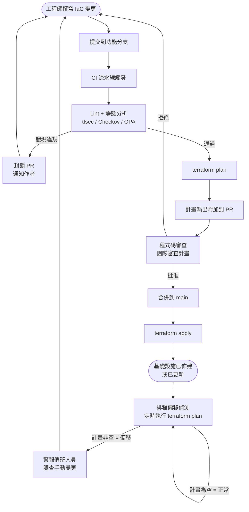

# [BEE-362] 基礎設施即程式碼

:::info
透過版本控制的程式碼管理每一個基礎設施資源。永遠不要手動設定基礎設施。程式碼就是系統；系統就是程式碼。
:::

## 背景

傳統的基礎設施管理依賴操作手冊：按照順序執行的手動步驟清單——在這裡點擊、輸入那個指令、SSH 進去執行這個命令。這種做法有一個根本性的缺陷：操作手冊和實際系統在第一個人在規定步驟之外做了任何變更後，就會立刻開始偏離。幾個月後，沒有人知道系統實際上運行的是什麼。從零開始重建環境變得不可能。

基礎設施即程式碼（IaC）徹底解決了這個問題。基礎設施資源——伺服器、資料庫、網路、負載平衡器、DNS 記錄——都以原始碼檔案來定義。這些檔案提交至版本控制系統，經過審查，並由自動化工具套用。程式碼描述了期望的狀態；工具負責計算差異並讓系統達到該狀態。

Kief Morris 在 [*Infrastructure as Code*（O'Reilly）](https://www.oreilly.com/library/view/infrastructure-as-code/9781098114664/)中闡述了根本前提：基礎設施必須從可以一致、可重複、無需人工介入地套用的定義中建構。目標不是為了自動化而自動化——而是可重現性、可稽核性，以及將環境視為可拋棄、可隨時重建的能力。

## 原則

### 1. 宣告式優於命令式

表達基礎設施應該存在什麼有兩種方式：

**命令式（程序式）：** 你撰寫步驟。你告訴工具*如何*達到期望狀態。

```bash
# 命令式：10 個有序命令，缺一不可，順序很重要
aws ec2 run-instances --image-id ami-0abc1234 --instance-type t3.medium
sleep 30
INSTANCE_ID=$(aws ec2 describe-instances ... | jq -r '.Reservations[0]...')
aws ec2 wait instance-running --instance-ids $INSTANCE_ID
aws rds create-db-instance --db-instance-identifier mydb --db-instance-class db.t3.micro ...
aws ec2 authorize-security-group-ingress --group-id sg-xyz --protocol tcp --port 5432 ...
# ... 還有 4 個命令，每個都依賴前一個成功執行
```

如果第 5 步失敗，你現在必須偵錯哪些基礎設施已存在、哪些還不存在。

**宣告式：** 你描述*應該存在什麼*。工具負責計算如何到達那裡。

```hcl
# 宣告式（Terraform）：描述期望狀態，工具處理差異
resource "aws_instance" "app_server" {
  ami           = "ami-0abc1234"
  instance_type = "t3.medium"
}

resource "aws_db_instance" "main" {
  identifier        = "mydb"
  instance_class    = "db.t3.micro"
  engine            = "postgres"
  engine_version    = "15.3"
  allocated_storage = 20
}
```

在空帳號上執行：兩個資源都被建立。再次執行：什麼都不變——它們已經存在了。新增一個讀取副本：

```hcl
resource "aws_db_instance" "replica" {
  identifier          = "mydb-replica"
  instance_class      = "db.t3.micro"
  replicate_source_db = aws_db_instance.main.id
}
```

新增一個區塊。Terraform 計算差異，新增副本，其他什麼都不動。命令式的等效做法將是另一系列有序的命令，充滿失敗和偏離的機會。

優先使用宣告式工具（Terraform、Pulumi、AWS CloudFormation、Bicep）進行基礎設施定義。命令式腳本僅用於引導程序或不代表常駐基礎設施的一次性操作任務。

### 2. 冪等性

IaC 定義必須可以安全地多次套用。套用相同的設定兩次必須產生與套用一次相同的結果。

這意味著：

- 在已經正確的環境上執行 `terraform apply` 會產生零變更。
- 在部分失敗後執行，會從失敗的地方繼續，而不是重新建立已建立的資源。
- 在手動變更後執行，會還原偏移並恢復宣告的狀態。

非冪等的 IaC 是危險的。如果重新套用你的設定會不必要地銷毀並重建資源，操作人員在事故後會猶豫是否執行它。結果：生產環境與程式碼的偏移越來越嚴重，而這正是 IaC 應該解決的問題。

### 3. 基礎設施版本控制

所有基礎設施程式碼都存放在 Git 儲存庫中。這不是選擇性的。

版本控制給你：

- **稽核歷史** — 誰在什麼時候改了什麼，以及為什麼（從提交訊息中）。
- **回滾** — 透過還原提交來回滾一個錯誤的基礎設施變更。
- **程式碼審查** — 基礎設施變更透過 Pull Request 審查，與應用程式程式碼相同。
- **變更關聯** — 將基礎設施變更與隨後發生的事故相關聯。

Git 儲存庫是應該存在什麼基礎設施的唯一真實來源。任何與已提交定義不對應的資源，要麼是未宣告的（應該加入 IaC），要麼是手動偏移（見下文）。

### 4. 偏移偵測

偏移（Drift）是程式碼中定義的基礎設施與生產環境中實際運行的基礎設施之間的差距。偏移在以下情況下累積：

- 操作人員 SSH 進入伺服器並修改設定檔。
- 有人在雲端控制台建立資源來「快速測試某些東西」。
- 一次性腳本修改了資料庫參數。
- 部署工具套用了 IaC 不知道的變更。

每一個手動變更都是一個潛在的等待中的事故。下次套用 IaC 時，它可能會覆蓋手動變更。或者手動變更可能掩蓋 IaC 中的一個 bug，直到你從零開始重建環境時才會浮現。

偏移偵測按排程執行 `terraform plan`（或等效指令），並在計畫非空時發出警報。非空計畫意味著實際狀態不再與宣告的狀態匹配。這必須被調查並解決——要麼更新 IaC 以反映有意為之的偏差，要麼還原手動變更。

### 5. 不可變基礎設施——替換，而非修補

可變基礎設施模型：伺服器被建立，然後在幾個月內就地修補。透過 SSH 更新套件。手動編輯設定檔。伺服器累積了沒有人能完全記住的變更歷史。它變成了一個雪花——獨特的、脆弱的、無法替代的。

不可變基礎設施模型：當需要變更時，建立一個包含變更的新映像檔並替換正在運行的實例。永遠不要修改正在運行的伺服器。

實際影響：

- 應用程式伺服器在每次部署時都被替換，而不是就地更新。
- 作業系統修補透過發布新的基礎映像檔並循環更換實例來套用。
- 設定變更產生一個新的產出物，而不是遠端設定檔編輯。
- 實例被視為可互換的——群組中的任何實例與其他任何實例完全相同。

不可變基礎設施在實例層級消除了偏移。它也使回滾變得簡單：重新部署前一個映像檔。

### 6. 環境即程式碼

開發、測試和生產環境不是三個分別設定的不同事物。它們是同一個 IaC 範本的三個實例化，由環境特定的值（實例大小、副本數量、域名）參數化。

```
environments/
  dev/
    terraform.tfvars   # instance_type = "t3.small", replica_count = 0
  staging/
    terraform.tfvars   # instance_type = "t3.medium", replica_count = 1
  prod/
    terraform.tfvars   # instance_type = "r6g.large", replica_count = 2
modules/
  app-stack/
    main.tf            # 單一定義，跨所有環境重用
```

這保證了測試環境演練與生產環境相同的基礎設施拓撲。在測試環境中發現的 bug 是在到達生產環境之前發現的 bug。測試環境和生產環境之間的差異不是測試環境問題——而是 IaC 設定問題，而且是可以修復的。

### 7. 機密不放在 IaC 檔案中

基礎設施程式碼將被提交到 Git 儲存庫。Git 儲存庫被共享、備份，且通常會被鏡像。**永遠不要將機密——密碼、API 金鑰、TLS 私鑰、資料庫憑證——提交到 IaC 檔案中。**

正確的模式：

```hcl
# 錯誤：機密硬編碼在 IaC 中
resource "aws_db_instance" "main" {
  password = "hunter2"    # 這個值現在永遠在 Git 歷史中了
}

# 正確：在套用時從密鑰管理器引用機密
resource "aws_db_instance" "main" {
  password = data.aws_secretsmanager_secret_version.db_password.secret_string
}

data "aws_secretsmanager_secret_version" "db_password" {
  secret_id = "prod/myapp/db-password"
}
```

機密存放在專用的密鑰存儲（AWS Secrets Manager、HashiCorp Vault、Azure Key Vault）中。IaC 在套用時按名稱引用它們；機密值永遠不會接觸 IaC 檔案或 Git 儲存庫。

參見 [BEE-32：機密管理](#) 了解完整的機密處理政策。

### 8. 套用前先計畫——絕不盲目套用

在任何 IaC 變更到達真實環境之前，先產生計畫（試運行）並審查它。

計畫輸出回答了：「如果我套用這個，什麼將被建立、變更或銷毀？」在套用前審查計畫等同於在提交前審查 `git diff`。它能發現：

- 意外的銷毀（在 Terraform 中重命名資源可能觸發銷毀 + 重建）。
- 比預期更大的影響範圍（模組變更傳播到 40 個資源而不是 4 個）。
- `tfsec`、`Checkov` 或 OPA 等工具在任何操作發生前浮現的政策違規。

在 IaC 的 CI/CD 中，計畫步驟是強制性的，其輸出會附加到 Pull Request 供審查者檢查。只有在計畫被審查且 PR 被批准後才執行套用。參見 [BEE-360：IaC 的 CI](#) 了解流水線模式。

### 9. 狀態管理

Terraform 和類似工具維護一個狀態檔：記錄哪些真實資源對應程式碼中的哪些宣告。狀態是工具知道程式碼中的 `aws_db_instance.main` 對應 AWS 中的 `arn:aws:rds:us-east-1:123456789:db:mydb-abc` 的方式。

狀態管理規則：

- **僅限遠端狀態。** 狀態檔必須存儲在遠端後端（Terraform 使用 S3 + DynamoDB，或 Terraform Cloud 等），絕不能在本地磁碟上。本地狀態無法在團隊成員或 CI 執行器之間共享。
- **狀態鎖定。** 後端必須支援鎖定，以防止兩個同時套用的操作損壞狀態。
- **狀態是敏感的。** 狀態檔包含資源 ID、ARN，有時還包含來自資料來源的機密值。對狀態存儲採用與生產憑證相同的安全態度。
- **永遠不要手動編輯狀態。** 如果狀態損壞或錯誤，使用 `terraform state` 子命令——不要手動編輯 JSON 檔案。

### 10. 模組化 IaC——避免單體式架構

一個定義所有服務的所有基礎設施的巨大 IaC 檔案是一個反模式。對一個服務的變更需要對所有基礎設施執行完整計畫，增加影響範圍和套用時間。

將 IaC 結構化為具有明確所有權邊界的模組：

```
modules/
  database/        # 由資料平台團隊擁有
  networking/      # 由基礎設施團隊擁有
  app-service/     # 由每個應用程式團隊擁有

services/
  payments-api/
    main.tf        # 組合與此服務相關的模組
  user-service/
    main.tf
```

每個模組都有一個定義好的介面（輸入和輸出）。模組有版本控制。對資料庫模組的變更不需要重新套用網路模組。團隊可以獨立變更其服務基礎設施，而不會影響其他團隊的資源。

## IaC 工作流程



## 實際範例：資料庫與應用程式伺服器

**情境：** 佈建一個 PostgreSQL 資料庫和一台應用程式伺服器。然後新增一個讀取副本。

### 命令式做法

```bash
# 步驟 1：建立安全群組
SG_ID=$(aws ec2 create-security-group --group-name myapp-sg --description "myapp" \
  --query 'GroupId' --output text)

# 步驟 2：新增入站規則
aws ec2 authorize-security-group-ingress --group-id $SG_ID \
  --protocol tcp --port 5432 --cidr 10.0.0.0/16

# 步驟 3：建立子網路群組
aws rds create-db-subnet-group --db-subnet-group-name myapp-subnets \
  --db-subnet-group-description "myapp" --subnet-ids subnet-aaa subnet-bbb

# 步驟 4：建立資料庫（需要 5-10 分鐘，輪詢狀態）
aws rds create-db-instance --db-instance-identifier myapp-db \
  --db-instance-class db.t3.micro --engine postgres --master-username admin \
  --master-user-password "$DB_PASS" --db-subnet-group-name myapp-subnets \
  --vpc-security-group-ids $SG_ID

aws rds wait db-instance-available --db-instance-identifier myapp-db

# 步驟 5：建立應用程式伺服器
aws ec2 run-instances --image-id ami-0abc1234 --instance-type t3.medium \
  --security-group-ids $SG_ID ...

# 新增副本：重複步驟 3-5，使用不同的識別碼，
# 新增 --source-db-instance-identifier，記得更新安全群組...
# 一個步驟順序錯誤，一個變數錯誤 → 部分狀態，需要手動清理
```

### 宣告式做法（Terraform）

```hcl
resource "aws_security_group" "myapp" {
  name   = "myapp-sg"
  vpc_id = var.vpc_id

  ingress {
    from_port   = 5432
    to_port     = 5432
    protocol    = "tcp"
    cidr_blocks = ["10.0.0.0/16"]
  }
}

resource "aws_db_instance" "primary" {
  identifier        = "myapp-db"
  instance_class    = "db.t3.micro"
  engine            = "postgres"
  engine_version    = "15.3"
  username          = "admin"
  password          = data.aws_secretsmanager_secret_version.db_pass.secret_string
  db_subnet_group_name   = aws_db_subnet_group.myapp.name
  vpc_security_group_ids = [aws_security_group.myapp.id]
}

resource "aws_instance" "app_server" {
  ami           = var.ami_id
  instance_type = "t3.medium"
  vpc_security_group_ids = [aws_security_group.myapp.id]
}
```

**新增讀取副本：** 在檔案中新增一個區塊，其他任何地方都不需要變更：

```hcl
resource "aws_db_instance" "replica" {
  identifier          = "myapp-db-replica"
  instance_class      = "db.t3.micro"
  replicate_source_db = aws_db_instance.primary.id
}
```

`terraform plan` 顯示確切一個要建立的資源。`terraform apply` 建立它。再次套用是空操作（no-op）。

## 常見錯誤

| 錯誤 | 為何有害 | 修正方式 |
|---|---|---|
| 在 IaC 檔案中硬編碼機密 | 憑證永久留在 Git 歷史中 | 在套用時從密鑰管理器引用機密 |
| 沒有遠端狀態 / 僅本地狀態 | 筆電資料遺失時狀態消失；團隊成員衝突；CI 執行器無法共享狀態 | 使用帶鎖定的遠端後端（S3+DynamoDB、Terraform Cloud） |
| IaC 套用後手動變更 | 偏移累積；下次套用覆蓋或與手動變更衝突 | 所有變更都透過 IaC 進行；啟用偏移偵測警報 |
| 套用前沒有計畫/預覽步驟 | 意外的銷毀和大範圍影響未被發現 | 在 CI 中強制計畫輸出；套用前要求審查計畫 |
| 所有服務使用一個單體 IaC 檔案 | 每次變更都執行完整計畫；一個團隊的重構可能銷毀另一個團隊的資源 | 按服務或領域模組化；對模組進行版本控制；分別擁有它們 |

## 相關 BEE

- [BEE-32：機密管理](#) — 密鑰存儲模式、輪換和執行時注入
- [BEE-360：IaC 的 CI](#) — 流水線結構：lint、計畫、政策檢查、套用閘道
- [BEE-361：部署策略](#) — 不可變基礎設施如何實現藍綠和金絲雀部署

## 參考資料

- [Infrastructure as Code, 3rd Edition — Kief Morris, O'Reilly](https://www.oreilly.com/library/view/infrastructure-as-code/9781098150341/)
- [Infrastructure as Code Security Cheat Sheet — OWASP](https://cheatsheetseries.owasp.org/cheatsheets/Infrastructure_as_Code_Security_Cheat_Sheet.html)
- [The Ultimate Guide to Terraform Drift Detection — env0](https://www.env0.com/blog/the-ultimate-guide-to-terraform-drift-detection-how-to-detect-prevent-and-remediate-infrastructure-drift)
- [Immutable Infrastructure: Why You Should Replace, Not Patch — Medium](https://lukasniessen.medium.com/immutable-infrastructure-devops-why-you-should-replace-not-patch-e9a2cf71785e)
- [Infrastructure as Code Best Practices — Harness DevOps Academy](https://www.harness.io/harness-devops-academy/infrastructure-as-code-best-practices)
- [Infrastructure as Code Standards — UK Home Office Engineering](https://engineering.homeoffice.gov.uk/standards/infrastructure-as-code/)
