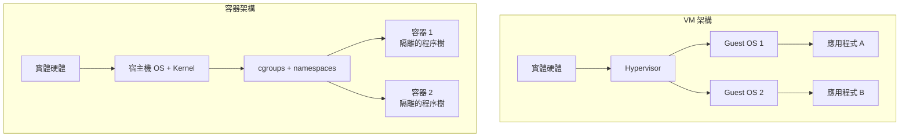

# [BEE-364] 容器基礎

## 背景

容器技術在現代後端工程中無所不在——從本機開發到正式環境的 Kubernetes 叢集皆是如此。然而，許多工程師把容器當成黑箱：「就是輕量化的虛擬機器吧。」這個錯誤的心智模型導致了各種可預期的問題：以 root 身份執行、使用 `:latest` 標籤、將狀態存在容器檔案系統，以及省略資源限制。

真正理解容器是什麼——隔離的 Linux 程序，而非輕量 VM——將改變你建置、保護與操作容器的方式。

**相關 BEE：**
- [BEE-240 程序](/zh-tw/OS%20and%20Linux%20Fundamentals/240) -- 容器本質上是程序
- [BEE-325 健康檢查](/zh-tw/CI%20CD%20and%20DevOps/325) -- 容器內的健康檢查
- [BEE-361 部署策略](/zh-tw/CI%20CD%20and%20DevOps/361) -- 容器作為部署單位

## 原則

**容器是在宿主機核心上執行的隔離程序，而非虛擬機器。打造精小的映像檔、以非 root 身份執行、強制設定資源限制，並且絕不將狀態儲存在容器檔案系統中。**

---

## 容器的本質

容器是一個普通的 Linux 程序（或程序樹），核心透過兩個原語為其建立了一個受限的系統視圖：

| 原語 | 職責 |
|---|---|
| **Namespaces（命名空間）** | 程序能*看見*什麼（檔案系統、網路、PID、使用者） |
| **cgroups（控制群組）** | 程序能*使用*多少資源（CPU、記憶體、I/O） |

沒有 Hypervisor，沒有 Guest Kernel。容器直接共用宿主機的核心。

### Namespaces — 隔離

Linux 有七種容器使用的命名空間類型：

| 命名空間 | 隔離內容 |
|---|---|
| `PID` | 程序 ID——容器內程序從 PID 1 開始 |
| `NET` | 網路介面、路由、防火牆規則、連接埠 |
| `MNT` | 檔案系統掛載點（容器的 `/`） |
| `UTS` | 主機名稱與網域名稱 |
| `IPC` | 行程間通訊（號誌、訊息佇列） |
| `USER` | UID/GID 對映（支援無 root 容器） |
| `CGROUP` | cgroup 層次結構的可見範圍 |

Docker 啟動容器時，會以適當的命名空間旗標呼叫 `clone()` 或 `unshare()`。程序真的無法看見其命名空間外的程序、網路介面或檔案路徑。

### cgroups — 資源限制

控制群組（cgroups）是 Linux 核心功能，用於將程序組織成層次結構並套用資源策略：

- **CPU**：限制 CPU 核心使用比例，或設定排程優先權的 CPU 份額
- **記憶體**：以位元組為單位的硬性上限；超出時核心會觸發 OOM Kill
- **Block I/O**：依裝置限制讀寫頻寬
- **網路**：透過 `tc` 分類並優先處理流量

若沒有 cgroup 限制，一個失控的容器可以耗盡宿主機上所有的 CPU 和記憶體，使其他工作負載完全無資源可用。

### 容器 vs. 虛擬機器



| | 容器 | 虛擬機器 |
|---|---|---|
| 核心 | 共用（宿主機） | 每台 VM 獨立 |
| 啟動時間 | 毫秒級 | 數秒到數分鐘 |
| 映像大小 | 數百 MB | 數 GB |
| 隔離層級 | 程序層級 | 硬體層級 |
| 額外開銷 | 極小 | Hypervisor + Guest OS |

當你需要強硬體層級隔離（多租戶主機、不同作業系統）時，VM 是正確選擇。當你需要在共用基礎設施上執行同一應用的大量實例時，容器是正確選擇。

---

## OCI：業界標準

**開放容器倡議（OCI）** 定義了可攜式標準，使容器跨執行環境（Docker、Podman、containerd、CRI-O）互通：

- **Image Spec**：定義映像清單（manifest）、檔案系統層格式（tar 壓縮檔）與映像設定 JSON
- **Runtime Spec**：定義符合規範的執行環境面對解壓後的映像 bundle 時必須執行的操作（建立 namespace、套用 cgroup、執行程序）
- **Distribution Spec**：定義推送與拉取映像至/自 Registry 的 HTTP API

因為 Docker、Kubernetes 與雲端 Registry 均實作了 OCI，以 `docker build` 建置的映像在任何符合 OCI 規範的執行環境上都能以完全相同的方式執行。

---

## 映像層與 Copy-on-Write

容器映像是一疊唯讀的層（layer）。Dockerfile 中每一條 `RUN`、`COPY`、`ADD` 指令都會建立一層。執行時，Docker 在最上方新增一個薄薄的可寫層——**容器層**。

```
[ 可寫容器層               ]   ← 變更存在這裡，容器停止後消失
[ COPY . /app             ]   ← 唯讀
[ RUN npm ci              ]   ← 唯讀
[ FROM node:20-alpine     ]   ← 唯讀基礎層
```

**Copy-on-Write (CoW)**：容器修改唯讀層的檔案時，儲存驅動程式會先將該檔案複製到可寫層。原始層不受影響，並由所有使用相同映像的容器共用。

**層快取**：Docker 對每條指令加上其上下文計算雜湊值。若無變更，則重複使用快取層並跳過該步驟。快取失效是連鎖的——變更第 N 層會使其下所有層失效。這對 Dockerfile 指令的排列順序有直接影響。

---

## Dockerfile：錯誤 vs. 正確

### 錯誤的 Dockerfile

```dockerfile
# 錯誤：大型基礎映像、以 root 執行、無多階段建置、層順序不佳
FROM node:20

WORKDIR /app

COPY . .
RUN npm install

EXPOSE 3000
CMD ["node", "src/server.js"]
```

問題：
- `node:20` 約 1 GB；內含 curl、git、編譯器等大量攻擊面
- 以 `root`（UID 0）執行——應用程式若遭入侵，攻擊者將取得容器內的 root 權限
- 在安裝相依套件之前複製原始碼——任何原始碼變更都會使 `npm install` 快取失效
- 映像內含 `node_modules`、`.git`、測試檔案

產生的映像大小：約 1.1 GB

### 正確的 Dockerfile

```dockerfile
# 正確：多階段建置、最小化基礎映像、非 root、快取最佳化層順序
# ---- 建置階段 ----
FROM node:20-alpine AS builder

WORKDIR /app

# 優先複製相依性清單——除非相依性變更，否則可使用快取
COPY package.json package-lock.json ./
RUN npm ci --omit=dev

# 相依性安裝完成後再複製原始碼
COPY src/ ./src/

# ---- 執行階段 ----
FROM node:20-alpine AS runtime

# 建立非 root 使用者
RUN addgroup -S appgroup && adduser -S appuser -G appgroup

WORKDIR /app

# 只複製執行期所需的產物
COPY --from=builder --chown=appuser:appgroup /app/node_modules ./node_modules
COPY --from=builder --chown=appuser:appgroup /app/src ./src
COPY package.json ./

USER appuser

EXPOSE 3000
CMD ["node", "src/server.js"]
```

**.dockerignore**（防止建置上下文膨脹與快取失效）：

```
node_modules
.git
*.test.js
.env
coverage/
```

產生的映像大小：約 180 MB——縮減了 83%。執行階段映像不含編譯器、建置工具，也沒有 root 存取權限。

---

## 容器網路基礎

Docker 預設建立一個虛擬網路橋接器（`docker0`）。每個容器會取得一對虛擬乙太網路介面——一端在容器的 NET namespace 中，另一端連接到橋接器。

常見的網路模式：

| 模式 | 使用情境 |
|---|---|
| `bridge`（預設） | 同主機上的容器可以用容器名稱互相連線 |
| `host` | 容器共用宿主機網路堆疊——無隔離，效能最佳 |
| `none` | 無網路存取 |
| `overlay` | Swarm / Kubernetes 的跨主機網路 |

在 Kubernetes 中，每個 Pod 都有自己的網路命名空間。CNI 外掛（Flannel、Calico、Cilium）負責 IP 指派與跨節點路由。

---

## 編排環境中的資源限制

務必設定資源請求（requests）與限制（limits）。以 Kubernetes 為例：

```yaml
resources:
  requests:
    cpu: "250m"      # 排程時保證的 0.25 核心
    memory: "256Mi"
  limits:
    cpu: "500m"      # 硬性上限——超出則被節流
    memory: "512Mi"  # 硬性上限——超出則被 OOM Kill
```

沒有 limits，單一 Pod 可能榨乾整個節點。沒有 requests，排程器無法正確進行 bin-packing，節點將因為過度承諾而不穩定。

---

## 映像安全掃描

容器映像會因基礎映像套件的漏洞而累積 CVE。在 CI 中整合掃描：

- **Trivy**（`trivy image myapp:1.2.3`）——快速、免費，可掃描 OS 套件與語言相依性
- **Docker Scout**——整合於 Docker Hub 與 Docker Desktop
- **Grype**——Trivy 的替代方案，與 GitHub Actions 整合良好

掃描規則：
1. 發現 CRITICAL 等級 CVE 時讓 CI Pipeline 失敗
2. 基礎映像有更新時重新建置並推送（使用 Renovate 或 Dependabot 管理基礎映像版本）
3. 將基礎映像釘定到摘要（digest）而非標籤：`FROM node:20-alpine@sha256:abc123...`

---

## 常見錯誤

### 1. 在容器中以 root 執行

```dockerfile
# 缺少 USER 指令——程序以 UID 0 執行
CMD ["node", "server.js"]
```

若攻擊者入侵你的應用程式，他們將在容器中取得 root 權限。若磁碟區掛載設定不當或使用了 privileged 模式，容器中的 root 可能成為宿主機上的 root。務必在 `CMD` 之前加上 `USER appuser`。

### 2. 在正式環境使用 `:latest`

```dockerfile
FROM node:latest   # 隨時間解析到不同的提交
```

`:latest` 不是版本號。維護者每次推送新映像時它就會改變。從同一個 Dockerfile 建置兩次可能產生不同的映像。請釘定到確切版本和摘要。

### 3. 使用大型基礎映像

`ubuntu:22.04` 包含套件管理器、Shell 工具以及數百個應用程式永遠不會呼叫的套件——全部都是潛在的 CVE 攻擊面。請優先使用 `alpine` 變體（busybox shell、最少套件）或 `distroless` 映像（完全沒有 shell）。

### 4. 不設定資源限制

沒有記憶體限制的容器在發生記憶體洩漏時，會消耗宿主機上所有可用記憶體，觸發核心的 OOM Killer，而它可能會殺掉不相關的程序——包括容器執行環境本身。

### 5. 將狀態存在容器檔案系統

```bash
# 在容器內執行
echo "important-data" > /app/data/results.json
# 容器重新啟動——/app/data/results.json 不見了
```

可寫容器層是暫時性的。容器被移除或替換時它就消失了。請透過磁碟區（`docker run -v /host/path:/app/data`）或外部儲存（資料庫、物件儲存）來持久化狀態。

---

## 總結

| 概念 | 重點 |
|---|---|
| 容器 vs. VM | 容器共用宿主機核心；VM 有獨立的 Guest Kernel |
| Namespaces | 隔離程序所能看見的內容：PID、NET、MNT、UTS、IPC、USER |
| cgroups | 限制程序能使用的資源：CPU、記憶體、I/O |
| 映像層 | 唯讀的堆疊 tar 封存；執行時在頂部新增可寫層 |
| CoW | 只有在修改時才將下層的檔案複製到上層 |
| 多階段建置 | 分離建置環境與執行環境；大幅縮小映像體積 |
| OCI | 可攜式的映像與執行標準；跨 Docker、containerd、CRI-O 互通 |
| 非 root 使用者 | 必要的安全衛生措施；在 Dockerfile 中建立專用使用者 |
| 資源限制 | 在編排環境中務必設定 requests 與 limits |
| 不存狀態於容器 | 使用磁碟區或外部儲存來持久化資料 |

## 參考資料

- [NGINX Blog: What Are Namespaces and cgroups, and How Do They Work?](https://blog.nginx.org/blog/what-are-namespaces-cgroups-how-do-they-work)
- [Datadog Security Labs: Container Security Fundamentals Part 2 -- Isolation & Namespaces](https://securitylabs.datadoghq.com/articles/container-security-fundamentals-part-2/)
- [Open Container Initiative](https://opencontainers.org/about/overview/)
- [OCI Image Spec](https://specs.opencontainers.org/image-spec/)
- [Docker Docs: Multi-stage builds](https://docs.docker.com/build/building/multi-stage/)
- [Docker Docs: Build cache](https://docs.docker.com/build/cache/)
- [Baeldung: Differences Between cgroups and Namespaces in Linux](https://www.baeldung.com/linux/cgroups-and-namespaces)
