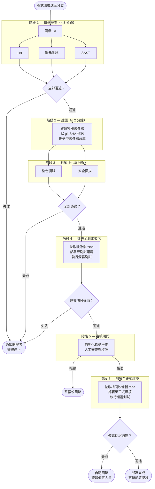

# [BEP-365] 管線設計

:::info
以快速回饋為優先設計管線：並行執行獨立階段、只建置一次產出物、逐環境推送晉升，並在正式環境前設置人工審核閘門。
:::

## 背景

CI/CD 管線是將一次程式碼推送轉化為正式環境部署的自動化流水線。大多數團隊都有管線，但真正設計良好的管線並不多見。常見的失敗模式如出一轍：開發者不再等待的 40 分鐘建置、在測試環境通過後重新建置才部署到正式環境的產出物、寫死在 YAML 裡的機密，以及完全不知道管線可靠性是否有在改善。

管線設計對開發者生產力有直接且可量化的影響。設計不良的管線帶來緩慢的回饋、難以發現的失敗，以及對自動化的不信任。設計良好的管線是團隊可以做的最高槓桿投資之一。

**參考資料：**
- [Codefresh: CI/CD Process Flow, Stages, and Critical Best Practices](https://codefresh.io/learn/ci-cd-pipelines/ci-cd-process-flow-stages-and-critical-best-practices/)
- [Harness: Best Practices for Awesome CI/CD](https://www.harness.io/blog/best-practices-for-awesome-ci-cd)
- [Octopus Deploy: Fast Track Code Promotion in Your CI/CD Pipeline](https://octopus.com/blog/fast-tracking-code-promotion-in-your-ci-cd-pipeline)
- [Splunk: The Complete Guide to CI/CD Pipeline Monitoring](https://www.splunk.com/en_us/blog/learn/monitoring-ci-cd.html)
- [Buildkite: Monorepo CI Best Practices](https://buildkite.com/resources/blog/monorepo-ci-best-practices/)

## 原則

### 1. 管線即程式碼

管線定義與應用程式碼一起存放在版本控制中。不存在「在 UI 介面設定管線」這回事——所有設定都在一個可被審查、版本化、回滾的 YAML 或等效檔案中。

好處：
- 管線的變更在生效前需要經過 Pull Request 審查。
- 任何開發者都可以理解並在本地重現管線。
- 管線歷史可透過 `git log` 稽核。
- 導入新服務意味著複製並調整既有的管線檔案。

常見 CI 系統與其管線即程式碼機制：GitHub Actions (`.github/workflows/*.yml`)、GitLab CI (`.gitlab-ci.yml`)、Jenkins (`Jenkinsfile`)、CircleCI (`.circleci/config.yml`)。

### 2. 階段排序：快速回饋優先

將最快、最便宜、最有效的檢查放在最前面執行。早期階段的失敗會立即停止管線，不需要等待後續更慢的階段才能得到回饋。

標準排序：

```
階段 1 — 快速檢查   (目標：< 3 分鐘)：
  lint + 單元測試 + 型別檢查  [並行執行]

階段 2 — 建置       (目標：< 2 分鐘)：
  建置容器映像檔，以 git SHA 標記，推送至映像檔倉庫

階段 3 — 測試       (目標：< 10 分鐘)：
  整合測試 + SAST 安全掃描  [並行執行]

階段 4 — 部署至測試環境：
  推送映像檔至測試環境，執行煙霧測試

階段 5 — 審核閘門：
  人工審查 + 自動化指標檢查

階段 6 — 部署至正式環境：
  推送相同映像檔至正式環境，執行煙霧測試
```

若階段 1 失敗——一個 lint 錯誤或一個失敗的單元測試——管線立即停止。不會浪費運算資源建置一個永遠不會部署的映像檔，開發者也不需要等待 30 分鐘才知道程式碼無法編譯。

### 3. 並行化獨立階段

在一個階段內，同時執行相互獨立的任務。Lint 不依賴單元測試。SAST 不依賴整合測試。循序執行浪費時鐘時間；並行執行將階段時間縮短至最慢任務的執行時間。

大多數 CI 系統原生支援此功能：

```yaml
# GitHub Actions 範例 — lint 和單元測試並行執行
jobs:
  lint:
    runs-on: ubuntu-latest
    steps: [...]

  unit-test:
    runs-on: ubuntu-latest
    steps: [...]

  build:
    needs: [lint, unit-test]   # 等待兩者完成；任一失敗則停止
    runs-on: ubuntu-latest
    steps: [...]
```

`needs` 指令建立了依賴關係圖。沒有 `needs` 約束的任務會自動並行執行。

### 4. 產出物晉升：建置一次，部署至所有環境

在階段 2 只建置一次部署產出物，然後將同一個不可變的產出物晉升至所有後續環境。永遠不要為測試環境或正式環境重新建置。

「只建置一次」規則確保被測試的程式碼就是被部署的程式碼。當你為每個環境從原始碼重新建置時，細微的差異（依賴項版本解析、建置時的環境變數、編譯器旗標）可能導致「在測試環境正常，在正式環境壞掉」的問題，這類問題極難診斷。

產出物標記：為每個產出物標記產生它的完整 git SHA。

```
payments-api:a3f9c21
payments-api:a3f9c21-build.847
```

git SHA 標記讓每次部署完全可追溯。給定正式環境中執行的容器，你可以還原出確切的原始碼提交、建置它的管線執行記錄，以及與其關聯的每個測試結果。

晉升流程：

```
建置  →  推送至映像檔倉庫，標記為 :sha
測試環境部署  →  拉取 :sha，執行煙霧測試
審核閘門
正式環境部署  →  拉取相同的 :sha（不重新建置）
```

### 5. 測試環境與正式環境之間的審核閘門

人工審核應位於測試環境與正式環境之間。閘門的作用：

- 讓工程師有時間確認煙霧測試結果、儀表板和近期錯誤率。
- 執行要求具名人員授權正式環境變更的合規要求。
- 建立刻意的暫停點，以便在發生事故時批次處理多個變更或暫緩部署。

自動化閘門可以補充人工審核：要求測試環境部署已穩定 N 分鐘、錯誤率低於閾值，且沒有進行中的事故。但除非有記錄在案的緊急應對手冊，否則不應繞過人工審核。

### 6. 管線快取

快取消除了跨管線執行的重複工作。三個快取層最為重要：

**依賴項快取** — 以依賴項清單雜湊（例如 `package-lock.json`、`go.sum`）為鍵，快取 `node_modules`、Maven 本地倉庫、pip 快取或 Go 模組快取。依賴項的快取命中通常每次執行節省 1–3 分鐘。

**建置產出物快取** — 以原始碼檔案雜湊為鍵，快取編譯產出物、轉譯輸出和產生的程式碼。Bazel 和 Nx 等工具原生支援此功能；其他系統可以使用從相關原始碼路徑的雜湊衍生的快取鍵來實現。

**映像層快取（Docker）** — 將 Dockerfile 指令從最少變動到最常變動排序。在複製原始碼之前複製依賴項清單並執行安裝。這確保昂貴的依賴項安裝層在大多數建置中都會被快取，且只在依賴項實際變更時才會失效。

```dockerfile
# 好的層次排序：依賴項的變動頻率低於原始碼
COPY package.json package-lock.json ./
RUN npm ci
COPY src/ ./src/
```

```dockerfile
# 不好的層次排序：任何原始碼變更都會使 npm ci 快取失效
COPY . .
RUN npm ci
```

目標：依賴項快取命中率超過 80%。

### 7. 機密注入——永遠不要寫在管線程式碼中

管線 YAML 檔案存在於版本控制中。寫死在 YAML 檔案中的機密就是已洩漏的機密。

正確的做法是在執行時從機密管理系統注入：

```yaml
# GitHub Actions — 從 GitHub Secrets 注入
steps:
  - name: Deploy
    env:
      DATABASE_URL: ${{ secrets.DATABASE_URL }}
      API_KEY: ${{ secrets.DEPLOY_API_KEY }}
    run: ./deploy.sh
```

機密管理系統：GitHub Secrets、GitLab CI/CD 變數（遮罩）、HashiCorp Vault、AWS Secrets Manager、GCP Secret Manager。

規則：
- 機密永遠不出現在 YAML、Dockerfile 或建置腳本中。
- 機密的範圍限制在所需的最小環境（測試環境機密不應可在正式環境任務中使用）。
- 立即輪換意外提交的機密；將舊值視為已洩漏。
- 將機密掃描（例如 truffleHog、gitleaks）作為管線階段加入，以捕捉意外提交。

### 8. 管線可觀測性

無法衡量的管線就無法改善。追蹤以下指標：

| 指標 | 代表的意義 | 目標 |
|---|---|---|
| 管線時長（P50、P95） | 開發者等待回饋的時間 | P50 < 10 分鐘 |
| 各階段時長 | 瓶頸在哪裡 | 識別異常值 |
| 各階段失敗率 | 哪個階段最不可靠 | 主幹 < 5% |
| 不穩定測試率 | 非確定性失敗的測試 | < 1% 執行次數 |
| 佇列等待時間 | 等待 Runner 的時間 | P95 < 1 分鐘 |
| 快取命中率 | 快取是否有效 | > 80% |
| 平均修復時間（MTTR） | 損壞建置的修復速度 | < 15 分鐘 |

建立儀表板。每月回顧。對退化設定警報。上一季是 8 分鐘、現在是 18 分鐘的管線是個問題，但只有在你持續追蹤時才能看見。

不穩定測試值得特別關注。一個在程式碼沒有任何變更的情況下有 5% 失敗率的測試，會侵蝕對整個管線的信任。團隊開始重新執行失敗的管線而不是調查原因。真正的失敗被合併進來。把不穩定測試當作程式錯誤處理：在 24 小時內修復，或隔離它（帶有追蹤 issue 的跳過）。

### 9. Monorepo 管線注意事項

在 monorepo 中，一個簡單的管線會在每次提交時觸發所有服務的完整重新建置。這既昂貴又緩慢。一個只更動 `services/payments` 的提交不應觸發 `services/identity` 或 `services/notifications` 的重新建置。

解決方案：

**路徑觸發** — 設定管線觸發條件，只在特定目錄中的檔案發生變更時啟動。

```yaml
# GitHub Actions — 只在相關變更時執行 payments 管線
on:
  push:
    paths:
      - 'services/payments/**'
      - 'shared/lib/common/**'  # 共用依賴 — 也觸發 payments
```

**受影響專案偵測** — Nx、Turborepo 和 Bazel 等工具了解依賴關係圖。當 `shared/lib/common` 發生變更時，它們會自動識別所有依賴它的服務並將其納入建置。

**共用函式庫處理** — 當共用函式庫發生變更時，所有依賴它的服務都必須重新建置。僅憑路徑篩選是不夠的；你需要依賴關係圖感知能力來捕捉傳遞性變更。

目標：每個服務管線只在相關程式碼發生變更時執行，而共用函式庫的變更會自動傳播至所有相依服務。

---

## 完整管線：參考架構



---

## 實際範例：後端服務管線

一個支付 API 服務。目標：在 10 分鐘內到達測試環境，人工核准後進入正式環境。

**階段 1 — 快速檢查（約 2 分鐘）**

Lint（`golangci-lint`）和單元測試（`go test ./...`）在不同 Runner 上並行執行。847 個單元測試。若任一失敗，開發者在推送後 2 分鐘內收到 Slack 通知。

**階段 2 — 建置（約 1 分鐘）**

```bash
docker build -t payments-api:a3f9c21 .
docker push registry.example.com/payments-api:a3f9c21
```

映像檔以完整 git SHA 標記。`go.sum` 下載的映像層快取命中（最近 30 天命中率 86%）。建置在 58 秒內完成。

**階段 3 — 測試（約 5 分鐘）**

整合測試針對真實的 PostgreSQL 容器和 Redis 執行個體執行（CI 環境中的 Docker Compose）。SAST 掃描（Semgrep，此服務的自訂規則）並行執行。兩者都必須通過。

**階段 4 — 部署至測試環境（約 1 分鐘）**

完全相同的 `:a3f9c21` 映像檔部署至測試用 Kubernetes 命名空間。執行煙霧測試套件（12 項健康和關鍵路徑檢查）。通過。

**到達測試環境的總時間：9 分鐘。**（2 + 1 + 5 + 1）

**階段 5 — 審核閘門**

自動化檢查：測試環境已穩定超過 10 分鐘、錯誤率 < 0.1%、無進行中事故。工程師審查差異後核准。

**階段 6 — 部署至正式環境（約 1 分鐘）**

相同的 `:a3f9c21` 映像檔被拉取並部署至正式環境 Kubernetes 命名空間。煙霧測試通過。部署完成。

---

## 常見錯誤

**1. 本可並行的階段卻循序執行**

依序執行 lint、單元測試、型別檢查浪費時間。若 lint 需要 90 秒，單元測試需要 90 秒，循序執行共需 3 分鐘；並行執行只需 90 秒——最慢任務的執行時間。這個錯誤單獨就可以讓管線時長翻倍或三倍。

**2. 多次建置相同的產出物**

```bash
# 錯誤：為每個環境重新建置
deploy-staging:   docker build && docker push :staging-latest && kubectl apply
deploy-prod:      docker build && docker push :prod-latest && kubectl apply
```

重新建置不是晉升——而是全新的產出物。若依賴項解析方式不同、若檔案在兩次建置之間有所變動、若建置參數不同，測試環境和正式環境執行的就是不同的程式碼。只建置一次，以 SHA 標記，推送晉升那個標記。

**3. 沒有快取**

每次管線執行都從頭下載 800 MB 的 npm 套件。本應 3 分鐘的執行變成 12 分鐘。團隊以重新執行來應對，而非調查問題。快取不是優化——在規模化場景中，它是可靠性的必要條件。無快取的管線在套件倉庫緩慢時會在負載下崩潰。

**4. 管線程式碼中存有機密**

```yaml
# 這個模式存在於真實的程式碼倉庫中
steps:
  - run: ./deploy.sh --api-key=prod-key-abc123-supersecret
```

這個機密現在永久存在於版本控制歷史中（即使刪除後也是如此）。它存在於 CI 日誌中。所有有倉庫存取權限的開發者都可以讀取它。在執行時從機密管理系統注入機密，並在每個管線中加入機密掃描。

**5. 沒有管線指標**

沒有管線指標的團隊在開發者抱怨速度慢之前，不知道他們的 P50 建置時間。那時，它已經慢了好幾個月。他們不知道不穩定測試率，直到有人手動計算重新執行嘗試的次數。他們無法為基礎設施投資提出論據，因為沒有基準線。從第一天起就為管線加入儀表化。數據收集成本低廉，事後重建則代價高昂。

---

## 相關 BEP

- **BEP-340** — 測試策略；哪些測試類型屬於哪個管線階段
- **BEP-360** — CI 原則；使管線設計有效運作的上游實踐
- **BEP-361** — 部署策略；管線晉升產出物後的後續步驟
- **BEP-364** — 容器即產出物；映像檔的建置、標記與儲存方式
