# [BEE-201] 快取失效策略

:::info
TTL、事件驅動失效、寫入穿透、版本化金鑰 -- 如何在不破壞快取效益的前提下，讓快取資料與來源資料保持一致。
:::

## 為什麼失效問題這麼難

1990 年代在 Netscape 擔任工程師的 Phil Karlton，留下了一句至今仍廣泛流傳的名言：

> "There are only two hard things in Computer Science: cache invalidation and naming things."
> （電腦科學只有兩件難事：快取失效與命名。）

這句話大約在 2005 年首度出現於網路上，但據信最早可追溯至 1990 年代中期。它之所以歷久彌新，是因為它說得很精確。命名困難，是因為語言本身充滿歧義；快取失效困難，是因為**分散式系統中的時間問題**。

當你寫入資料時，你知道它已經改變了。但這份資料的副本可能同時存在於 Redis 叢集、in-process LRU 快取、CDN 邊緣節點，以及下游服務的本地快取中 -- 每個節點都以自己的時鐘運作，沒有任何共享機制能得知寫入已發生。讓所有副本在正確時間收斂到新值，同時不造成陳舊讀取或快取完全失效，正是這個問題的核心。

最直觀的解法 -- 設定短 TTL 讓資料自然過期 -- 在某些情況下可行，但並不總是夠用。對於價格、權限、庫存等關鍵資料，「幾分鐘後終究會正確」是不夠的。對於高流量資料，過於激進的失效會造成快取雪崩（stampede）。正確的策略取決於：能接受多少程度的陳舊、資料的變動頻率，以及快取副本的數量。

## 核心方法

### TTL-Based 失效（時間到期）

每個快取項目都有時效（TTL）。TTL 到期後，該項目被驅逐。下一次讀取時觸發快取未命中，並從來源重新填充。

```
function set(key, value):
    cache.set(key, value, ttl=300)   // 5 分鐘後過期

function get(key):
    value = cache.get(key)
    if value is null:
        value = database.query(key)
        cache.set(key, value, ttl=300)
    return value
```

**特性：**

- 實作簡單。寫入方與快取之間不需要任何協調機制。
- 提供*最終一致性*。資料在最多 `TTL` 秒後將恢復正確。
- TTL 可作為任何其他失效機制失敗時的安全網。
- 無法即時回應資料變動 -- 快取項目不論資料是否已更新，都會存活至到期。

**失效情境：**

- 商品價格改變。使用者在 TTL 期間看到的仍是舊價格。TTL 若為 10 分鐘，所有命中快取的使用者會看到錯誤價格長達 10 分鐘。
- TTL 過短會降低快取命中率並增加來源負載。
- TTL 過長則允許陳舊資料存活更久。

**適用情境：** 變動頻率低的非關鍵資料，且可接受有界的陳舊時間窗口（例如：商品說明、公開個人頁面、排行榜）。

### 事件驅動失效（Event-Driven Invalidation）

寫入發生時，寫入方發布一個失效事件。訂閱者（快取層、其他服務）收到事件後，刪除或更新受影響的快取項目。

```
function updateProduct(id, newData):
    database.update(id, newData)                    // 寫入來源資料
    cache.delete("product:" + id)                  // 刪除自身快取
    messageBus.publish("product.updated", {id})    // 通知其他訂閱者

// 另一個服務或快取訂閱者：
messageBus.subscribe("product.updated", (event) => {
    cache.delete("product:" + event.id)
    cache.delete("product-list:*")                 // 刪除相關聯的快取鍵
})
```

**特性：**

- 近即時失效。快取在寫入後數毫秒內恢復一致。
- 解耦合：寫入方不需要知道哪些快取持有副本。
- 需要可靠的訊息傳遞。若事件遺失，快取在 TTL 到期前都會保持陳舊。
- 排序問題：若失效事件在寫入提交前到達，後續的快取填充可能會重新快取到陳舊資料。

**常見實作方式：**

- **應用層事件**：寫入路徑明確發布到訊息匯流排（Kafka、RabbitMQ、Redis Pub/Sub）。
- **變更資料擷取（CDC）**：一個 daemon 讀取資料庫 binlog（例如 MySQL binlog、Postgres WAL）並發布失效事件。這正是 Meta 的 `mcsqueal` daemon 所採用的方式 -- 每台資料庫主機部署一個實例，將失效訊息扇出至前端快取叢集。
- **資料庫觸發器**：在寫入操作上設置觸發器來發布事件。由於耦合性高且難以除錯，生產環境通常避免使用。

**適用情境：** 變動頻繁且陳舊會對使用者造成實際影響的資料（定價、庫存、權限、帳戶狀態）。

### 寫入穿透失效（Write-Through Invalidation）

每次寫入都同步更新快取。當資料寫入資料庫後，立即（在同一個 transaction 中或緊接著）將新值寫入快取。快取永遠不會陳舊，因為在寫入確認前就已更新。

```
function updateProduct(id, newData):
    database.update(id, newData)             // 寫入來源資料
    cache.set("product:" + id, newData,      // 同步更新快取
              ttl=3600)
    return success
```

**特性：**

- 強一致性。寫入後的讀取永遠看到新值。
- 寫入延遲增加 -- 每次寫入需要支付兩次寫入成本（DB + cache）。
- 即使資料寫入後不再被讀取，快取也會被填充（寫入放大風險）。
- 若 DB 寫入成功後快取寫入失敗，兩者將不一致。需要仔細的錯誤處理或重試機制。

**適用情境：** 寫入後立即被讀取的資料（例如：使用者 session 建立、設定更新、功能旗標），或任何讀後寫一致性不可妥協的場景。

### 版本化 / 標記金鑰（Versioned / Tagged Keys）

與其失效現有的金鑰，不如改變金鑰本身。舊版本的快取項目變得無法被存取（最終被驅逐），而第一個使用新金鑰的讀取請求會重新填充快取。

```
// 儲存資源的當前版本
function getCurrentVersion(entity, id):
    return versionStore.get(entity + ":" + id)  // 例如 "product:42" -> "v7"

function get(id):
    version = getCurrentVersion("product", id)
    key = "product:" + id + ":v" + version      // 例如 "product:42:v7"
    value = cache.get(key)
    if value is null:
        value = database.query(id)
        cache.set(key, value, ttl=3600)
    return value

function update(id, newData):
    database.update(id, newData)
    newVersion = versionStore.increment("product:" + id)  // 版本號遞增 -> v8
    // 舊金鑰 "product:42:v7" 實際上已失效
```

針對群組失效（同時失效某個類別或命名空間中的所有項目），可使用**快取標籤**：

```
// 所有商品快取項目以 "catalog-v{version}" 標記
// 遞增版本號即可一次性失效所有項目
function invalidateCatalog():
    versionStore.increment("catalog-version")   // 使用舊版本的所有金鑰都將未命中
```

**特性：**

- 不需要明確的刪除操作。更改版本後綴使舊項目無法被存取。
- 非常適合批量失效 -- 只需遞增一個版本計數器即可失效整個命名空間。
- 舊項目會在快取中累積，直到被驅逐。若版本頻繁遞增，可能浪費記憶體。
- 版本儲存本身成為依賴項 -- 若其不可用，快取讀取將失敗或需要降級處理。

**適用情境：** 相關資料的批量失效（例如：失效某個商品類別的所有快取回應）、CDN 快取版本控制，或不可變資源快取。

## 策略比較

```mermaid
flowchart TD
    subgraph TTL["TTL-Based"]
        A1["寫入 DB"] --> A2["快取不動"]
        A2 --> A3["TTL 在 N 秒後到期"]
        A3 --> A4["下次讀取：未命中，重新填充"]
    end

    subgraph EventDriven["Event-Driven"]
        B1["寫入 DB"] --> B2["發布失效事件"]
        B2 --> B3["快取訂閱者收到事件"]
        B3 --> B4["cache.delete(key) -- 毫秒內"]
        B4 --> B5["下次讀取：未命中，填充最新值"]
    end

    subgraph WriteThrough["Write-Through"]
        C1["寫入 DB"] --> C2["將新值寫入快取"]
        C2 --> C3["快取立即更新為最新值"]
        C3 --> C4["下次讀取：命中，回傳最新值"]
    end
```



| 策略 | 一致性 | 寫入負擔 | 所需基礎設施 | 失敗模式 |
|---|---|---|---|---|
| 僅 TTL | 最終一致性（以 TTL 為界） | 無 | 無 | 在 TTL 期間保持陳舊 |
| 事件驅動 | 近即時 | 低（非同步） | 訊息匯流排 / CDC | 事件遺失 = 永久陳舊 |
| 寫入穿透 | 強一致性 | 高（同步） | 快取以外無需額外基礎設施 | 快取寫入失敗 = 不一致 |
| 版本化金鑰 | 強一致性（金鑰變更） | 低 | 版本儲存 | 版本儲存中斷 |

## 具體範例：商品價格更新

假設有一個電商系統，商品資料儲存在資料庫中，並以 `product:42` 為金鑰快取在 Redis 中。

### 僅使用 TTL

```
// 初始狀態：cache["product:42"] = {price: 99.99, ttl: 剩餘 8 分鐘}
// 管理員在資料庫中將價格更新為 79.99

// 接下來的 8 分鐘：
cache.get("product:42")  // 回傳 {price: 99.99}  <-- 錯誤
// TTL 到期後：
cache.get("product:42")  // 未命中 -> 查詢 DB -> {price: 79.99}  <-- 正確
```

使用者看到錯誤價格長達 8 分鐘。在閃購情境中，這是嚴重的功能缺陷。

### 事件驅動

```
// 管理員將價格更新為 79.99
database.update(42, {price: 79.99})
messageBus.publish("product.updated", {id: 42})

// 快取訂閱者（約 50ms 內）：
cache.delete("product:42")

// 失效後的下一個使用者請求：
cache.get("product:42")  // 未命中 -> 查詢 DB -> {price: 79.99}  <-- 正確
```

價格在數毫秒內即可正確。代價：需要訊息匯流排基礎設施，以及一個必須持續運作且可靠的訂閱者。

### 寫入穿透

```
// 管理員將價格更新為 79.99
database.update(42, {price: 79.99})
cache.set("product:42", {price: 79.99}, ttl=3600)  // 同步更新

// 緊接著的使用者請求：
cache.get("product:42")  // 命中 -> {price: 79.99}  <-- 正確，不會有未命中
```

快取始終是最新的。代價：每次寫入需額外支付一次 Redis 寫入成本，且若快取寫入失敗，需要解決不一致問題。

### 取捨分析

| 情境 | 僅 TTL | 事件驅動 | 寫入穿透 |
|---|---|---|---|
| 閃購價格更新 | 不可接受 | 良好 | 最佳 |
| 商品說明編輯 | 可接受 | 過度設計 | 合理 |
| 高寫入量（1k/s） | 可行 | 需要佇列容量 | 成本高 |
| 訊息匯流排中斷 | 不受影響 | 降級為 TTL | 不受影響 |
| 快取節點宕機 | 未命中後自愈 | 未命中後自愈 | 重新寫入前不一致 |

## Purge 與 Ban

快取代理（Varnish、Nginx、CDN 服務商）通常區分兩種失效操作：

- **Purge（清除）**：依確切的 URL 或金鑰刪除特定物件。即時、精準且成本低。
- **Ban（封禁）**：將符合某個模式的物件標記為無效。所有符合模式的物件在下次請求時都被視為陳舊。Varnish 以 ban list 的形式實作，每次請求都會檢查該清單。

```
# Purge：刪除一個特定 URL
PURGE /products/42

# Ban：失效所有商品頁面（Varnish ban 表達式）
ban req.url ~ "^/products/"
```

Ban 適合批量失效，但有成本：ban list 在項目到期前會持續增長，每次快取命中都必須對照所有有效的 ban 進行檢查，這被稱為 **ban lurker** 開銷。大多數 CDN 以代理金鑰（Cloudflare Cache-Tag、Fastly Surrogate-Key header）作為更簡潔的替代方案。

## 分散式快取中的失效

當快取分散在多個節點（Redis Cluster、分片 Memcached），失效必須傳播至所有持有該金鑰副本的節點。

**常見情境：**

- **單一主快取**：失效指向單一節點。簡單，但該節點是單點故障。
- **複製快取**：寫入傳播至副本。失效必須傳至主節點並被複製。副本延遲代表短暫的不一致窗口。
- **分片快取**：每個金鑰只存在於一個分片中。正確的雜湊函數會自動將失效路由至正確的分片。
- **跨 region 快取**：Meta 的架構透過扇出管線，從儲存叢集將失效傳播至所有 region 的前端叢集。失效操作是冪等的（`delete` 可安全重試）-- 這個設計選擇消除了排序風險。

Meta 的 `mcsqueal` daemon（詳見其 [2013 NSDI 論文](https://www.usenix.org/system/files/conference/nsdi13/nsdi13-final170_update.pdf)）在每台 DB 主機上讀取 binlog，批次發送刪除操作至 mcrouter 伺服器，再扇出至所有快取節點。關鍵設計：他們選擇**刪除而非更新**，因為刪除是冪等的：重複執行刪除是安全的，而重複執行帶有陳舊資料的更新可能覆蓋更新的值。

## 失效過程中的競態條件

即使設計完善的失效機制，若寫入與失效之間發生競態條件，仍可能產生陳舊資料。最常見的模式：

```
執行緒 A：                              執行緒 B：
1. 讀取快取 -> 未命中
2.                                     將新資料寫入 DB
3.                                     刪除快取金鑰（失效）
4. 從 DB 讀取 -> 取得舊值
   （DB 寫入對 A 尚未可見）
5. 將舊值寫回快取
   快取現在持有陳舊資料且無 TTL 保護
```

這是**陳舊讀取競態**：失效事件在快取填充讀取到新值之前就已到達。緩解方案：

- **Lease 機制（Facebook 做法）**：快取未命中時，快取發放一個短效 token（lease）給讀取者。若在此期間發生寫入，lease 被取消，防止讀取者提交陳舊資料。
- **版本守衛**：寫入者遞增版本號。讀取者只有在取得的版本與當前版本相符時才快取結果。
- **短 TTL 作為後備**：即使競態導致陳舊資料被快取，短 TTL 也能確保它在有界時間窗口內到期。

## 失效引發的快取雪崩

當熱門快取項目被失效後，所有對該金鑰的進行中請求同時遭遇快取未命中，同時衝向資料庫。這就是**快取雪崩**（又稱 thundering herd）。

計劃性失效時的預防策略：

- **錯開失效**：若需失效大量金鑰，分批執行並在批次之間加入短暫延遲，以分散未命中負載。
- **背景刷新**：失效前先以新資料預先填充快取，再移除舊金鑰。
- **請求合併（mutex/lock）**：發生未命中時，在查詢資料庫前取得鎖。其他執行緒等待持鎖者填充快取，之後直接從快取讀取。
- **機率提前到期（XFetch）**：快取讀取者根據機率函數，在到期前偶爾提前刷新項目。項目始終「存活」，永遠不會形成突發性未命中。

完整的快取雪崩模式請參見 [BEE-201](201.md)。

## 常見錯誤

1. **沒有失效策略 -- 對關鍵資料僅依賴 TTL。** TTL 是安全網，不是一致性機制。對於陳舊資料會造成錯誤使用者行為的資料（價格、權限、庫存），必須實作明確的失效機制。

2. **失效過於激進。** 每次寫入就失效所有快取項目，會摧毀快取的效益。分析哪些金鑰實際上受到某次寫入影響，只失效那些金鑰。寫入商品 42 不應該失效商品 43。

3. **寫入與失效之間的競態條件。** 若在 DB 寫入提交前就失效快取，並行的讀取者可能從 DB 讀到舊值並重新快取。永遠在寫入提交且對所有讀取者可見後，才執行失效。

4. **不處理失效失敗。** 若訊息匯流排丟棄了失效事件，快取將永久提供陳舊資料。將事件驅動失效與 TTL 結合作為後備方案。監控失效管線的延遲並設置警報。

5. **級聯失效。** 一次寫入失效了一個金鑰，而該金鑰被聚合快取項目引用，聚合項目被失效，又進一步失效摘要快取項目。一次價格更新失效了所有類別列表、所有搜尋結果、所有推薦動態。設計失效範圍前，先完整梳理你的資料依賴圖。

## 相關 BEE

- [BEE-200](200.md) -- 快取基礎：快取模式（cache-aside、write-through、write-behind）與快取時機。
- [BEE-201](201.md) -- 快取驅逐策略：LRU、LFU 與容量限制如何與失效互動。
- [BEE-201](201.md) -- 快取雪崩與 Thundering Herd：處理失效後引發的大量未命中。
- [BEE-220](220.md) -- 訊息傳遞模式：驅動事件驅動失效的發布/訂閱基礎設施。

## 參考資料

- [Scaling Memcache at Facebook -- NSDI 2013 (USENIX)](https://www.usenix.org/system/files/conference/nsdi13/nsdi13-final170_update.pdf)
- [Cache Made Consistent -- Engineering at Meta (2022)](https://engineering.fb.com/2022/06/08/core-infra/cache-made-consistent/)
- [TwoHardThings -- Martin Fowler](https://martinfowler.com/bliki/TwoHardThings.html)
- [Cache Invalidation and the Methods to Invalidate Cache -- GeeksforGeeks](https://www.geeksforgeeks.org/system-design/cache-invalidation-and-the-methods-to-invalidate-cache/)
- [How to Build Cache Invalidation Strategies -- OneUptime Engineering Blog (2026)](https://oneuptime.com/blog/post/2026-01-30-cache-invalidation-strategies/view)
- [The Complete Guide to Cache Invalidation for System Design Interviews -- Design Gurus](https://designgurus.substack.com/p/the-complete-guide-to-cache-invalidation)
