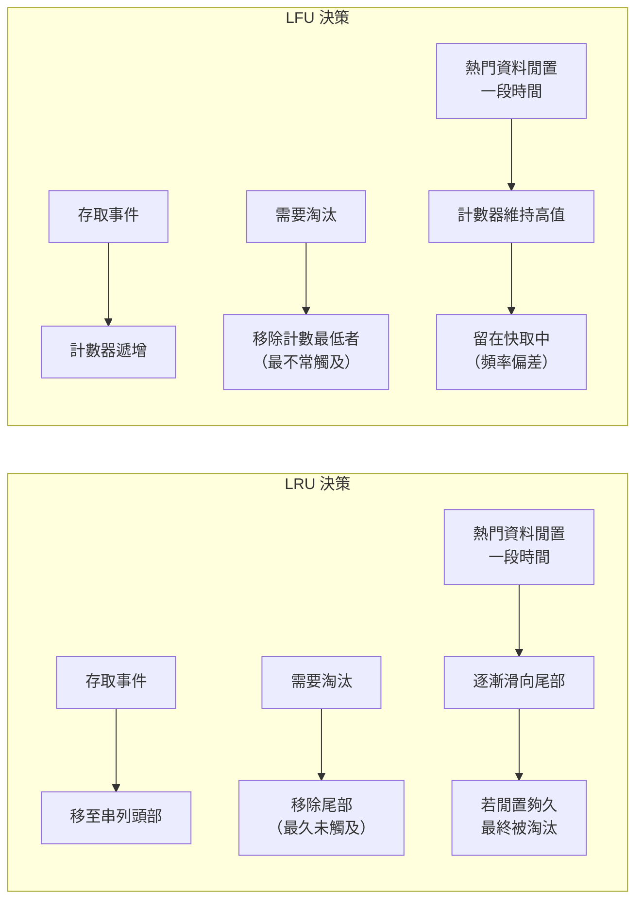
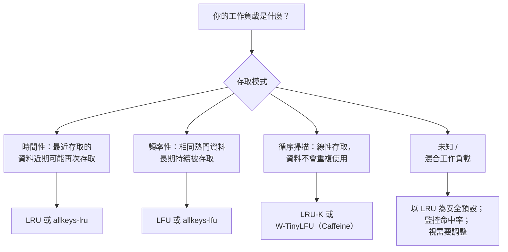

# [BEE-202] 快取淘汰策略

:::info
LRU、LFU、FIFO 與自適應策略 -- 快取在記憶體耗盡時如何決定要丟棄哪些資料，以及如何為你的工作負載選擇正確的策略。
:::

## 為什麼淘汰策略很重要

快取是有限資源。RAM 有成本上限；以磁碟為後端的快取雖然容量較大，但同樣有限制。當快取空間用完時，每新增一筆資料就必須丟棄一筆舊資料。問題是：要丟棄哪一筆？

錯誤的答案會悄悄摧毀快取的價值。若淘汰了熱門資料，下一次請求就會 miss，轉而查詢資料庫並重新填入快取 -- 然後可能再次被淘汰。在極端的存取模式下，一個行為不佳的淘汰策略即使搭配大型快取，**命中率也可能趨近於零**。

正確答案完全取決於你的工作負載。不存在放諸四海皆準的最佳策略。理解這些取捨，是讓快取能吸收 95% 讀取流量與僅僅增加延遲之間的差異所在。

:::warning 沒有淘汰策略不是選項
若你未設定淘汰策略且沒有記憶體限制，長時間執行的程序會讓快取無限增長，最終以 OOM 錯誤崩潰。務必設定明確的記憶體上限及對應的淘汰策略。
:::

## 核心策略

### LRU -- 最近最少使用（Least Recently Used）

LRU 會淘汰最久沒有被存取的資料。其依據是**時間局部性**：如果一段時間內都沒有存取某筆資料，近期可能也不會需要它。

**運作方式：** 維護一個以存取時間排序的鏈結串列。每次讀取或寫入時，將該筆資料移到串列頭部。需要淘汰時，從尾部移除。

```
快取狀態（頭部 = 最近存取，尾部 = 最久未存取）：
[D] -> [C] -> [B] -> [A]   （容量：4）

存取 E（新資料，快取已滿）：
  淘汰 A（尾部，最久未使用）
  將 E 插入頭部

新狀態：[E] -> [D] -> [C] -> [B]
```

**特性：**
- 使用雜湊表 + 雙向鏈結串列可達到 O(1) 存取與淘汰
- 能快速適應存取模式的變化
- 易受**掃描污染**影響：全表掃描會依序讀取數百萬筆資料，將熱門資料從快取中驅逐，即使掃描到的資料不會再被存取

**適合：** 通用快取、具時間局部性的工作負載、使用者 session 資料、最近瀏覽的內容。

### LFU -- 最不常使用（Least Frequently Used）

LFU 會淘汰存取次數最少的資料。其依據是**頻率局部性**：熱門資料會被頻繁存取，應保留；罕見資料應優先捨棄。

**運作方式：** 對每筆資料維護一個命中計數器。需要淘汰時，移除計數器最小的資料。計數相同時，以存取時間為輔助排序。

```
快取狀態（顯示 [鍵: 計數]）：
[A:5] [B:3] [C:2] [D:1]   （容量：4）

存取 E（新資料，E:1，快取已滿）：
  淘汰 D（計數最低）
  以計數 1 插入 E

新狀態：[A:5] [B:3] [C:2] [E:1]
```

**特性：**
- 即使某段時間未活躍，也能保留持續熱門的資料
- **適應緩慢**：過去熱門的資料即使已不再被存取，仍會保有高計數而不易被淘汰（頻率偏差）
- 新資料從計數 1 開始，很快就會被淘汰，即使它即將變得非常熱門
- 實作複雜度較高；未最佳化的版本為 O(log n)

**適合：** 穩定的工作負載分佈、媒體串流（熱門影片保留在快取）、公開 API 回應（相同內容被大量使用者請求）。

### FIFO -- 先進先出（First In, First Out）

FIFO 會淘汰在快取中存放最久的資料，無論其被存取的頻率或時間。其依據是簡單性：最老的資料先離開。

**運作方式：** 維護一個佇列。新資料插入尾部，淘汰時從頭部移除。

```
快取狀態（左側 = 最舊）：
[A] -> [B] -> [C] -> [D]   （容量：4）

存取 E（新資料，快取已滿）：
  淘汰 A（最老，不論存取次數）
  將 E 插入尾部

新狀態：[B] -> [C] -> [D] -> [E]

注意：A 可能已被存取過 100 次，但 FIFO 不在乎。
```

**特性：**
- 實作極為簡單，負擔極低
- **不感知存取模式**：大量存取的資料只因插入時間最早就被淘汰
- 在某些設定下會出現 **Belady 異常**：增加快取容量反而使命中率下降
- 鮮少用於生產環境的應用快取；適合串流管線與佇列

**適合：** 訊息佇列、日誌緩衝區、資料本身就有時間生命週期且越舊越無用的場景。

### 隨機淘汰（Random Eviction）

隨機選取一筆資料淘汰，不追蹤任何存取模式。

**特性：**
- 負擔趨近於零
- 對均勻存取分佈的工作負載，實際表現令人意外地接近 LRU
- 不具確定性：行為難以推理和測試
- Dan Luu 的基準測試（[Caches: LRU vs. random](https://danluu.com/2choices-eviction/)）顯示，在部分真實工作負載中，隨機淘汰的表現接近 LRU，實作卻簡單得多

**適合：** 記憶體嚴格受限的嵌入式系統、實作簡單性比多幾個百分點命中率更重要的場景。

### 基於 TTL 的過期（TTL-Based Expiry）

資料在設定的存活時間（TTL）後過期，無論存取頻率或時間。嚴格來說，這不是淘汰策略，而是**有效性策略** -- 資料不是因容量壓力被淘汰，而是因可能過時而過期。

實際上，TTL 與淘汰策略協同運作：TTL 資料過期時被清除（釋放空間），淘汰策略則處理未過期資料之間的容量壓力。

:::tip 淘汰 vs. 失效
基於 TTL 的過期是快取失效（參見 [BEE-201](201.md)）的一種形式，而非淘汰。淘汰由記憶體壓力驅動；失效由資料過時性驅動。兩者各自獨立運作。
:::

## 進階策略

### LRU-K

LRU-K 淘汰第 K 次最近存取時間最遠的資料。LRU 等價於 LRU-1；LRU-2 和 LRU-3 是常見選擇。

其核心概念是：資料必須被存取至少 K 次，才被視為「熱門」而不易被淘汰。單次存取（例如掃描）不會晉升資料；需要 K 次存取才能晉升。

這直接解決了掃描污染問題。全表掃描每筆資料只存取一次；當 K=2 時，這些資料不會被晉升，快取滿時會優先被淘汰。

### W-TinyLFU（Caffeine）

W-TinyLFU 是 [Caffeine](https://github.com/ben-manes/caffeine)（高效能 Java 快取函式庫）以及 Ristretto（Go）所使用的淘汰策略。它在多種工作負載下的表現持續優於 LRU 和 LFU。

**架構：**

快取分為兩個區域：

1. **視窗快取**（約佔容量 1%）：新資料先進入此區，採 LRU 方式運作。讓新資料有機會建立頻率，再決定晉升或拒絕。
2. **主快取**（約佔容量 99%）：已證明其價值的資料。進一步分為「受保護」LRU 段和「試用」LRU 段。

**准入過濾器（TinyLFU）：** 當資料從視窗快取晉升至主快取時，必須與主快取中即將被淘汰的資料競爭。一個緊湊的頻率草圖（Count-Min Sketch）追蹤近似的存取計數。只有當新資料的頻率更高時才能晉升。這可防止低頻資料污染快取。

**自適應大小：** 視窗區域與主區域的相對大小透過爬山演算法動態調整。若工作負載偏向時間性（如掃描），視窗會擴大；若偏向頻率性（如穩定的熱門分佈），主區域會擴大。

結果：W-TinyLFU 在頻率偏向和時間偏向的工作負載上都能獲得高命中率，包含純 LRU 或純 LFU 都難以應對的混合工作負載。詳見 [Caffeine 效能基準測試](https://github.com/ben-manes/caffeine/wiki/Efficiency)的多組追蹤資料集比較。

## 實際範例：LRU vs. LFU vs. FIFO

快取容量：4。存取序列：`A, B, C, D, A, E`。

逐步追蹤每次存取後的狀態，標記淘汰事件。

```
步驟 1：存取 A（miss，插入）
  LRU:  [A]
  LFU:  [A:1]
  FIFO: [A]

步驟 2：存取 B（miss，插入）
  LRU:  [B, A]
  LFU:  [A:1, B:1]
  FIFO: [A, B]

步驟 3：存取 C（miss，插入）
  LRU:  [C, B, A]
  LFU:  [A:1, B:1, C:1]
  FIFO: [A, B, C]

步驟 4：存取 D（miss，插入 -- 快取已滿）
  LRU:  [D, C, B, A]
  LFU:  [A:1, B:1, C:1, D:1]
  FIFO: [A, B, C, D]

步驟 5：存取 A（hit -- A 已在快取中）
  LRU:  A 移至頭部：[A, D, C, B]（A 最近被存取）
  LFU:  A 計數遞增：[A:2, B:1, C:1, D:1]
  FIFO: [A, B, C, D]（FIFO 不追蹤存取；順序不變）

步驟 6：存取 E（miss，插入 -- 必須淘汰）
  LRU:  淘汰 B（最久未使用），插入 E。
        結果：[E, A, D, C]

  LFU:  淘汰 B、C 或 D（計數均為 1；以時間為輔助 -> 淘汰 D）
        結果：[E:1, A:2, B:1, C:1]

  FIFO: 淘汰 A（最早插入），插入 E。
        結果：[B, C, D, E]
        注意：A 在步驟 5 被存取，但 FIFO 仍將其淘汰。
```

**結果摘要：**

| 策略 | 步驟 6 被淘汰 | 原因 |
|------|-------------|------|
| LRU  | B           | B 在步驟 2 後未再被存取 |
| LFU  | D（或 B 或 C）| D 只被存取一次，與 B、C 相同，但插入最晚 |
| FIFO | A           | A 最早插入，不論步驟 5 的命中 |

FIFO 淘汰 A 是最明顯的錯誤：A 就在一個步驟之前被存取，卻因為插入最早而第一個被淘汰。

LRU 和 LFU 的選擇都有其依據。LFU 因為 A 的計數更高而選擇保留它，若 A 持續熱門則是正確的。LRU 因為 A 最近被存取而保留它，若 A 最近的活躍度能預測未來活躍度則是正確的。

## LRU vs. LFU 行為示意圖



此圖顯示關鍵差異：LRU 回應**時間性**，停止被存取的資料最終會被淘汰。LFU 回應**累積頻率**，過去熱門的資料即使不再被存取也會留在快取中 -- 直到計數衰減或主動淘汰。

## Redis 淘汰策略

Redis 透過 `redis.conf` 中的 `maxmemory-policy` 或執行期設定來指定淘汰策略：

```
CONFIG SET maxmemory 2gb
CONFIG SET maxmemory-policy allkeys-lru
```

完整策略列表來自 [Redis 官方淘汰文件](https://redis.io/docs/latest/develop/reference/eviction/)：

| 策略 | 淘汰對象 | 演算法 |
|------|---------|--------|
| `noeviction` | 無 -- 快取滿時寫入回傳錯誤 | 無 |
| `allkeys-lru` | 所有鍵 | LRU |
| `volatile-lru` | 有設定 TTL 的鍵 | LRU |
| `allkeys-lfu` | 所有鍵 | LFU |
| `volatile-lfu` | 有設定 TTL 的鍵 | LFU |
| `allkeys-random` | 所有鍵 | 隨機 |
| `volatile-random` | 有設定 TTL 的鍵 | 隨機 |
| `volatile-ttl` | 有設定 TTL 的鍵 | 優先淘汰最快過期的 |

**關鍵差異：**

- `allkeys-*` 策略適用於資料庫中的所有鍵，包括未設 TTL 的鍵。
- `volatile-*` 策略只適用於有設定過期時間的鍵。若沒有這樣的鍵，則無資料被淘汰，記憶體達上限後新寫入會失敗。
- `noeviction` 只適合你寧願收到錯誤也不想遺失資料的情境（例如主要資料儲存，而非快取）。

**Redis 建議：**

> 當你預期請求的熱門度呈冪次分佈（即少部分資料被存取的頻率遠高於其他資料）時，使用 `allkeys-lru`。若不確定，這是安全的預設值。若存取模式穩定，想保留最一致熱門的資料，使用 `allkeys-lfu`。

注意：Redis 實作的 LRU 和 LFU 是**近似演算法**，而非精確算法。對於 LRU，Redis 會隨機取樣一定數量的鍵（`maxmemory-samples`，預設為 5），從中淘汰最久未使用的。這避免了維護完整排序串列的負擔，同時在實際效果上接近真正的 LRU。`allkeys-lfu` 使用帶有衰減的對數計數器，防止過時的高計數阻礙淘汰。

## 選擇正確策略



| 工作負載類型 | 建議策略 | 原因 |
|------------|---------|------|
| 一般 Web 應用程式、使用者 session | LRU | 最近活躍度能預測未來活躍度 |
| 穩定熱門內容（影片、新聞） | LFU | 持續熱門的資料應保留 |
| 資料庫查詢結果（多樣查詢） | LRU | 查詢的時間性與重複使用相關 |
| 掃描密集的分析工作 | LRU-K 或 W-TinyLFU | 防止掃描污染 |
| 混合 / 自適應 | W-TinyLFU（Caffeine） | 自適應；平均命中率最佳 |
| Redis 僅含 TTL 鍵 | volatile-lru | 只淘汰 TTL 鍵，保留不過期的資料 |
| Redis 作為主要儲存（非快取） | noeviction | 不要悄悄遺失資料 |

## 常見錯誤

**1. 未確認預設淘汰策略就直接使用。**
Redis 預設為 `noeviction`，記憶體滿時寫入會回傳錯誤。若用 Redis 作為快取，請明確設定 `maxmemory` 和 `maxmemory-policy`。在生產環境依賴預設值是一顆延時炸彈。

**2. 快取太小，無法容納工作集。**
若快取只能存放 10,000 筆資料，而活躍工作集有 500,000 筆，淘汰率會高到快取幾乎毫無助益。在決定快取大小前，先分析工作集的大小。命中率低於 80% 通常代表的是大小問題，而非策略問題。

**3. 完全沒有淘汰策略（OOM 崩潰）。**
無大小限制且無淘汰策略的程序內快取會隨時間無限增長。JVM heap 耗盡、Node.js heap 溢出、Linux OOM kill 是常見症狀。任何快取（包括程序內快取，例如 Caffeine 的 `maximumSize`、Guava Cache 的 `maximumWeight`）都請務必設定最大大小。

**4. 在掃描密集的工作負載中使用 LRU。**
全表掃描、批次 ETL 作業或逐夜報告讀取數百萬筆唯一資料，會以永遠不會再被存取的資料污染 LRU 快取。每次掃描的鍵都會替換熱門資料。掃描結束後，快取充滿冷資料，命中率暴跌直到快取重新預熱。針對掃描查詢，請使用 LRU-K、W-TinyLFU 或獨立的快取池。

**5. 未監控淘汰率。**
少量淘汰不是問題，這正是快取的工作方式。但淘汰率相對命中率過高，代表快取太小或策略不對。匯出並監控 `evicted_keys`（Redis `INFO stats`）或快取函式庫的對應指標，當淘汰率超過會影響命中率的閾值時發出警示。

## 相關 BEE

- [BEE-200](200.md) -- 快取基礎：快取模式（cache-aside、write-through、write-behind）以及何時加入快取層。
- [BEE-201](201.md) -- 快取失效策略：TTL、事件驅動失效、write-through。失效由資料過時性驅動；淘汰由記憶體壓力驅動。兩者相互影響，但各自獨立。
- [BEE-203](203.md) -- 分散式快取：叢集與分片快取中淘汰策略的行為，以及一致性雜湊對每節點容量的影響。

## 參考資料

- [Key eviction -- Redis 文件](https://redis.io/docs/latest/develop/reference/eviction/)
- [LFU vs. LRU: How to choose the right cache eviction policy -- Redis Blog](https://redis.io/blog/lfu-vs-lru-how-to-choose-the-right-cache-eviction-policy/)
- [Cache eviction strategies -- Redis Blog](https://redis.io/blog/cache-eviction-strategies/)
- [Cache replacement policies -- Wikipedia](https://en.wikipedia.org/wiki/Cache_replacement_policies)
- [TinyLFU: A Highly Efficient Cache Admission Policy -- Einziger et al., ACM TOS 2017](https://dl.acm.org/doi/10.1145/3149371)
- [Caffeine -- Efficiency benchmarks (GitHub Wiki)](https://github.com/ben-manes/caffeine/wiki/Efficiency)
- [Design of a Modern Cache -- High Scalability](https://highscalability.com/design-of-a-modern-cache/)
- [Caches: LRU vs. random -- Dan Luu](https://danluu.com/2choices-eviction/)
- [It's Time to Revisit LRU vs. FIFO -- Eytan et al., HotStorage 2020 (USENIX)](https://www.usenix.org/system/files/hotstorage20_paper_eytan.pdf)
