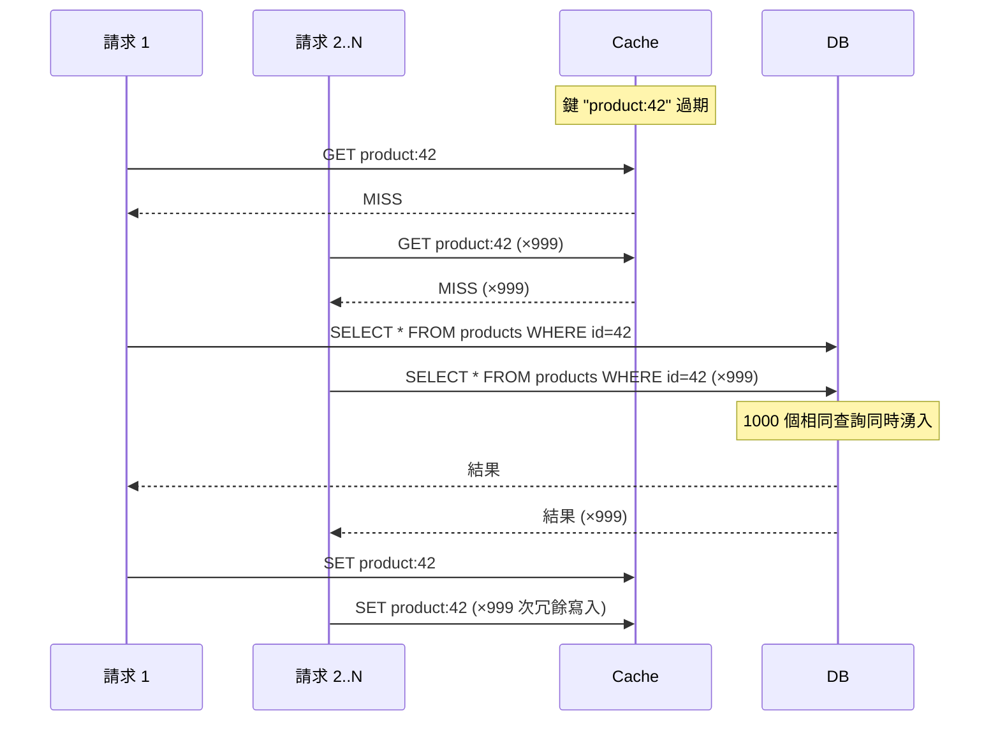
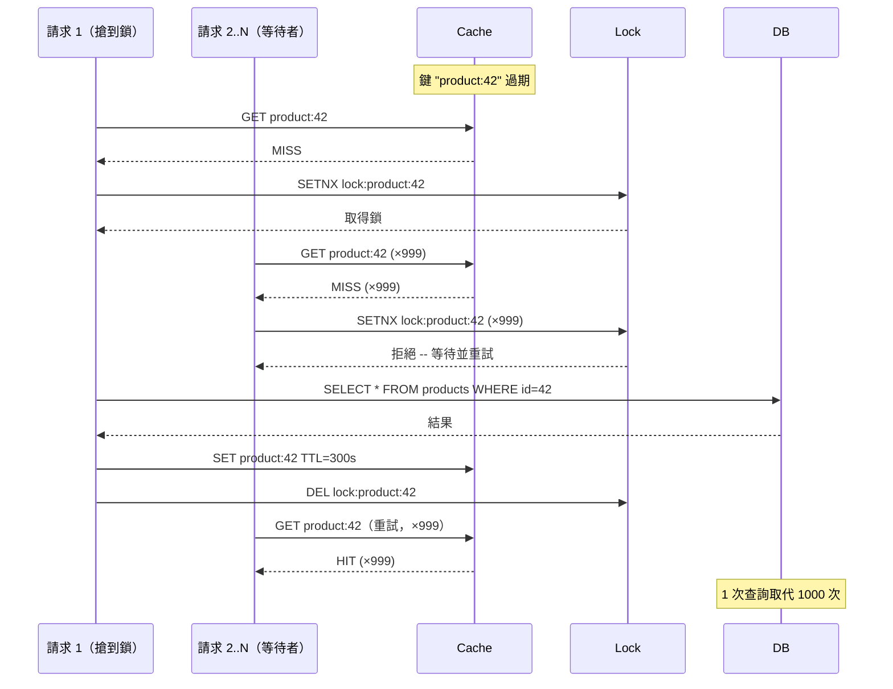

# [BEP-204] 快取踩踏與驚群效應

:::info
當快取鍵在高負載下過期，大量並行請求可能同時競相重新產生資料，進而癱瘓資料庫。本文定義此問題，並說明每位後端工程師應掌握的緩解策略。
:::

## 背景

快取之所以有價值，在於它能在流量抵達資料庫之前將其吸收。但一旦某個熱門快取鍵過期，快取瞬間變成負擔：第一個到達的請求找不到資料，便直接查詢資料庫；在該查詢回傳之前，數百乃至數千個相同的請求也如法炮製。這就是**快取踩踏**（cache stampede，也稱 cache miss storm）。

**驚群效應**（thundering herd）是此類問題的更廣義稱呼，涵蓋所有大量客戶端或工作者同時爭搶同一稀缺資源的情境，例如服務重啟後快取全部冷啟動、網路閃斷後的大規模連線重試，或一批工作者被同一事件同時喚醒。

兩者的結構相同：單一觸發事件導致 N 個獨立行為者同時競爭同一後端資源，N 往往大到足以讓資料庫過載或服務中斷。

### 踩踏情境



### 修正方案：只有一個請求負責重新產生



## 原則

**對每個熱門快取鍵實施並行重建保護。** 依流量規模選擇策略：互斥鎖（mutex）適合求簡；singleflight / 請求合併適合程序內並行；機率性提前過期（XFetch）適合無鎖高吞吐；stale-while-revalidate 適合零延遲容忍度的場景。

## 緩解策略

### 1. 互斥鎖 / 分散式鎖

最直觀的保護方式：只有搶到鎖的請求才能重建快取，其餘請求等待，鎖釋放後再從快取讀取。

```python
import time
import random

LOCK_TTL = 10  # 秒 -- 必須大於最糟情況的 DB 查詢時間

def get_product(product_id: str) -> dict:
    key = f"product:{product_id}"
    lock_key = f"lock:{key}"

    # 快速路徑：快取命中
    value = cache.get(key)
    if value:
        return value

    # 慢速路徑：搶鎖後重建
    acquired = cache.set(lock_key, "1", nx=True, ex=LOCK_TTL)  # 原子性 SETNX

    if acquired:
        try:
            value = db.query("SELECT * FROM products WHERE id = ?", product_id)
            cache.set(key, value, ex=300)
            return value
        finally:
            cache.delete(lock_key)  # 務必釋放鎖
    else:
        # 未搶到鎖 -- 等待勝出者填入快取
        for _ in range(20):
            time.sleep(0.1)
            value = cache.get(key)
            if value:
                return value
        # 降級：回傳舊資料或產生優雅錯誤
        return get_stale_or_default(product_id)
```

**權衡：** 邏輯簡單易理解。在極高並行情況下，等待者可能需要重試多次。鎖持有者若崩潰前未釋放鎖，其他請求將被阻塞至 TTL 到期，這也是鎖 TTL 不可省略的原因。

### 2. 請求合併（Singleflight）

將同一鍵的所有飛行中請求合併為單一後端呼叫。第一個呼叫者執行查詢，其後所有對同一鍵的呼叫者等待並共享結果。

這即是 Go 的 `singleflight` 模式，但概念適用於任何語言。

```go
// Go -- 使用 golang.org/x/sync/singleflight
var group singleflight.Group

func GetProduct(productID string) (*Product, error) {
    key := "product:" + productID

    // 同一鍵的所有並行呼叫共享一次 DB 查詢
    result, err, _ := group.Do(key, func() (interface{}, error) {
        cached, err := cache.Get(key)
        if err == nil {
            return cached, nil
        }
        product, err := db.QueryProduct(productID)
        if err != nil {
            return nil, err
        }
        cache.Set(key, product, 5*time.Minute)
        return product, nil
    })
    if err != nil {
        return nil, err
    }
    return result.(*Product), nil
}
```

```typescript
// TypeScript -- 手動合併 Map
const inFlight = new Map<string, Promise<Product>>();

async function getProduct(productId: string): Promise<Product> {
  const key = `product:${productId}`;

  if (inFlight.has(key)) {
    return inFlight.get(key)!; // 加入既有的飛行中請求
  }

  const promise = (async () => {
    const cached = await cache.get(key);
    if (cached) return cached;

    const product = await db.queryProduct(productId);
    await cache.set(key, product, { ttl: 300 });
    return product;
  })().finally(() => inFlight.delete(key));

  inFlight.set(key, promise);
  return promise;
}
```

**權衡：** 適用於單一程序內。在分散式系統中，每個節點各自合併本節點的流量，但仍可能每節點送出一次查詢。需要跨節點合併時，請搭配分散式鎖。

### 3. 機率性提前過期（XFetch）

在快取真正過期之前，以隨著到期時間逼近而增大的機率提前重建。無需加鎖 -- 每個程序根據隨機抽樣獨立決定是否刷新。

演算法來自 [Vattani et al. 2015](https://cseweb.ucsd.edu/~avattani/papers/cache_stampede.pdf)：

```
recompute = time.now() - (delta * beta * ln(random(0,1))) >= expiry
```

- `delta` -- 上次重建所花費的時間（秒）
- `beta` -- 調整參數（預設 1.0；增大可更早重建）
- `expiry` -- 鍵過期的 Unix 絕對時間戳

```python
import math
import random
import time

BETA = 1.0  # 1.0 對大多數工作負載為最優；可增大以更積極觸發

def get_product_xfetch(product_id: str) -> dict:
    key = f"product:{product_id}"
    entry = cache.get_with_metadata(key)  # 回傳 {value, expiry, delta}

    if entry:
        # 機率性決策：是否現在提前重建
        early_recompute = (
            time.time() - entry["delta"] * BETA * math.log(random.random())
            >= entry["expiry"]
        )
        if not early_recompute:
            return entry["value"]

    # 快取未命中或觸發提前重建
    start = time.time()
    value = db.query("SELECT * FROM products WHERE id = ?", product_id)
    delta = time.time() - start  # 記錄實際查詢時間

    expiry = time.time() + 300
    cache.set_with_metadata(key, value, expiry=expiry, delta=delta)
    return value
```

**權衡：** 無鎖，擴展性強。多個程序可能偶爾同時重建（這是設計上的刻意選擇，避免單點故障）。最適合查詢時間可量測的鍵。正式推導見 [Cache stampede -- Wikipedia](https://en.wikipedia.org/wiki/Cache_stampede)。

### 4. Stale-While-Revalidate

立即回傳舊的快取值，同時在背景刷新。從用戶視角完全無延遲。因只有一個背景工作負責刷新，踩踏無從發生。

```python
import threading

def get_product_swr(product_id: str) -> dict:
    key = f"product:{product_id}"
    stale_key = f"stale:{key}"

    value = cache.get(key)
    if value:
        return value  # 新鮮快取，直接回傳

    stale = cache.get(stale_key)
    if stale:
        # 回傳舊值，僅觸發一次背景刷新
        refresh_key = f"refresh:{key}"
        if cache.set(refresh_key, "1", nx=True, ex=30):
            threading.Thread(
                target=refresh_product, args=(product_id,), daemon=True
            ).start()
        return stale

    # 完全冷快取 -- 必須同步查詢
    return refresh_product(product_id)

def refresh_product(product_id: str) -> dict:
    key = f"product:{product_id}"
    value = db.query("SELECT * FROM products WHERE id = ?", product_id)
    cache.set(key, value, ex=300)             # 新鮮 TTL
    cache.set(f"stale:{key}", value, ex=600)  # 舊副本保留更長
    return value
```

**權衡：** 用戶體驗最佳，零額外延遲。需額外儲存一份 TTL 較長的舊副本。不適用於絕對不能提供舊資料的情境（如帳戶餘額、庫存數量）。

### 5. 加入 TTL 抖動

對所有 TTL 加入隨機抖動，防止大量鍵同時過期（例如快取預熱作業或部署時集中寫入）。

```python
import random

BASE_TTL = 300   # 5 分鐘
MAX_JITTER = 60  # ±60 秒

def set_product_cache(product_id: str, value: dict) -> None:
    ttl = BASE_TTL + random.randint(-MAX_JITTER, MAX_JITTER)
    cache.set(f"product:{product_id}", value, ex=ttl)
```

TTL 抖動應作為所有快取的基線實踐，而非主要的踩踏防護機制。

### 6. 部署時預熱快取

服務重啟後，所有快取均為冷啟動。在將流量切換至新實例前，先針對最關鍵的鍵預先填入快取。

```bash
# 部署腳本：切換負載平衡器前先預熱快取
./scripts/cache-warm.sh --keys product_catalog,homepage,featured_products
# 確認預熱完成後再切換流量
./scripts/lb-switch.sh
```

或在應用程式啟動時執行：

```python
def on_application_startup():
    top_products = db.query("SELECT id FROM products ORDER BY views DESC LIMIT 1000")
    for product in top_products:
        value = db.query("SELECT * FROM products WHERE id = ?", product.id)
        cache.set(f"product:{product.id}", value, ex=300)
    logger.info("快取預熱完成，準備接受流量。")
```

## 常見錯誤

### 1. 高流量鍵未設置踩踏保護

最常見的錯誤。任何在過期時承受並行流量的鍵都有風險。審視最熱門的鍵，確保至少有一種保護機制到位。

### 2. 鎖沒有設定 TTL（持有者崩潰導致死鎖）

```python
# 錯誤 -- 鎖永不過期，持有者崩潰將造成永久阻塞
cache.set(lock_key, "1", nx=True)  # 缺少 ex= 參數

# 正確 -- 鎖在最糟情況的重建時間後自動過期
cache.set(lock_key, "1", nx=True, ex=10)
```

### 3. 所有鍵使用相同 TTL（同步大規模過期）

若快取預熱作業將 50,000 個鍵全部設為 `TTL=300`，五分鐘後它們將在同一秒全部過期。務必加入抖動。

### 4. 部署後未預熱快取（冷啟動踩踏）

每次部署後，快取皆為冷啟動。若立即切換流量，每個節點上的每個請求都是快取未命中。務必在切換流量前先完成預熱。

### 5. 互斥鎖沒有降級方案

若搶鎖持續失敗（例如鎖持有者極度緩慢），請求將無限排隊或直接報錯。務必實作降級方案：回傳舊資料、預設回應或優雅降級，而非掛起或崩潰。

```python
# 降級層次
def get_product_safe(product_id: str) -> dict:
    try:
        return get_product_with_lock(product_id)
    except LockTimeoutError:
        stale = cache.get(f"stale:product:{product_id}")
        if stale:
            return stale  # 提供舊資料優於服務失敗
        return {"id": product_id, "error": "temporarily unavailable"}
```

## 策略比較

| 策略 | 複雜度 | 跨節點 | 用戶延遲 | 適用時機 |
|---|---|---|---|---|
| 互斥鎖 / 分散式鎖 | 低 | 是 | 非勝出者需等待 | 優先求簡；DB 查詢較慢 |
| Singleflight / 請求合併 | 低 | 否（單程序） | 共享第一次結果的等待 | 單一程序 / 節點內高並行 |
| XFetch（機率性） | 中 | 是（無鎖） | 無 | 高讀取吞吐；可接受偶發重複查詢 |
| Stale-while-revalidate | 中 | 是 | 無 | 可接受短暫舊資料；用戶延遲為第一優先 |
| TTL 抖動 | 極低 | 是 | 無 | 永遠作為基線實踐 |
| 快取預熱 | 中 | 是 | 無 | 部署與服務重啟 |

對大多數生產系統而言，建議全面套用 **TTL 抖動**，並在應用層加入 **Singleflight**。僅針對少數對資料庫造成不成比例負載的超熱鍵，才需要引入**分散式鎖**或 **XFetch**。

## 相關 BEP

- [BEP-200: Caching Fundamentals](./200.md) -- 基礎概念：TTL、淘汰策略、一致性
- [BEP-201: Cache Invalidation](./201.md) -- 快取失效事件是踩踏的主要觸發源
- [BEP-203: Distributed Cache](./203.md) -- 踩踏在快取節點間的擴散
- [BEP-266: Rate Limiting](../../Resilience/266.md) -- 踩踏發生時的最後一道 DB 保護

## 參考資料

- Vattani, A.; Chierichetti, F.; Lowenstein, K. (2015). "Optimal Probabilistic Cache Stampede Prevention." [cseweb.ucsd.edu](https://cseweb.ucsd.edu/~avattani/papers/cache_stampede.pdf)
- [Cache stampede -- Wikipedia](https://en.wikipedia.org/wiki/Cache_stampede)
- [Thundering herd problem -- Wikipedia](https://en.wikipedia.org/wiki/Thundering_herd_problem)
- [Solving Thundering Herds with Request Coalescing in Go -- Jaz's Blog](https://jazco.dev/2023/09/28/request-coalescing/)
- [How to Handle Cache Stampede in Redis -- OneUptime](https://oneuptime.com/blog/post/2026-01-21-redis-cache-stampede/view)
- [Avoiding Cache Stampede with XFetch](https://pjatk.in/avoiding-cache-stampede.html)
