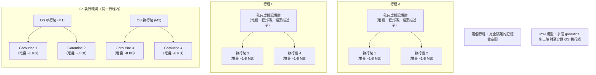

# [BEP-240] 執行緒 vs 行程 vs 協程

:::info
並行模型與資源取捨。選錯抽象層在大規模情境下會導致資源耗盡、資料競爭或 CPU 浪費——本文將各模型對應至適合的使用場景。
:::

## 背景

現代後端服務必須同時處理許多事情：進入的請求、資料庫查詢、背景工作、外部 API 呼叫。作業系統與語言執行環境提供三種基本抽象來組織這些工作：**行程（Process）**、**執行緒（Thread）** 與 **協程（Coroutine）**（此家族亦包含綠色執行緒與 goroutine）。

在大規模情境下選錯模型代價高昂。一個天真地為每個連線建立一條 OS 執行緒的 HTTP 伺服器，會在耗盡 CPU 之前先耗盡記憶體。一個從不使用多執行緒的非同步伺服器，面對 CPU 密集工作時將無法充分利用 32 核心的機器。正確選擇取決於工作負載的特性、隔離需求以及使用的語言執行環境。

### 並行 vs 平行

Rob Pike 的經典表述：**並行（Concurrency）是獨立執行程序的組合；平行（Parallelism）是運算的同時執行。** 並行是設計屬性——你把程式組織成獨立的片段。平行是執行屬性——這些片段實際上在同一時刻於多顆 CPU 上執行。

單核機器可以高度並行（多工交錯），但不可能真正平行。設計不良的多核程式可以在硬體上平行，卻在邏輯上仍然串行。並行的目標是良好的結構；平行是在多核硬體上執行並行設計所額外獲得的紅利。

參考：[go.dev/blog/waza-talk](https://go.dev/blog/waza-talk)

## 三種模型



### 行程（Process）

行程是 OS 的隔離單元。每個行程擁有：

- 私有虛擬位址空間（64 位元 Linux 最大可達 128 TB）
- 獨立的檔案描述子表、訊號處理器與身分憑證
- 一條以上的執行緒

**記憶體開銷：** 最少 10–100 MB，包含程式碼段、堆積、堆疊與核心後設資料。

**故障隔離：** 行程 A 的崩潰或記憶體損壞不會影響行程 B。核心透過 MMU（記憶體管理單元）在硬體層強制執行此隔離。

**通訊：** 行程間通訊（IPC）需要明確機制——管道（pipe）、socket、共享記憶體段或訊息佇列。這會增加延遲與複雜度。

**上下文切換成本：** 行程切換時 OS 必須清除 TLB（Translation Lookaside Buffer），比同行程的執行緒切換多出約 1,000–2,000 個 CPU 週期。

**建立成本：** 透過 `fork()` 建立行程需 1–10 ms。

### 執行緒（Thread）

執行緒是行程內的 OS 執行單元。同一行程的所有執行緒共享堆積與檔案描述子，但各自擁有：

- 堆疊（通常 1–8 MB，由 OS 預先分配）
- 暫存器集合與程式計數器

**記憶體開銷：** 每條執行緒 ~1–8 MB（主要是堆疊）。1,000 條執行緒 = 僅堆疊就耗費 1–8 GB。

**上下文切換成本：** 同行程內的執行緒切換可省略 TLB 清除，速度比行程切換快 2–5 倍。

**建立成本：** 10–100 µs。

**同步：** 共享記憶體方便但危險。任一執行緒都能讀取或覆寫堆積上的任何資料。正確的並行修改需要鎖、原子操作或無鎖資料結構。遺漏同步會造成資料競爭與未定義行為。

### 協程 / 綠色執行緒 / Goroutine

這些都是**使用者空間排程**的變體：由執行環境（而非 OS 核心）決定哪個邏輯工作單元在哪條 OS 執行緒上執行。

| 概念 | 說明 |
|---|---|
| 協程（Coroutine） | 語言層構造；在明確的 `yield`/`await` 點暫停（協作式） |
| 綠色執行緒（Green Thread） | 執行環境管理的執行緒；可能是協作式或搶占式 |
| Goroutine（Go） | 執行環境管理；使用工作竊取的 M:N 排程器；自 Go 1.14 起為搶占式 |
| async task（Python/JS/Rust） | 事件迴圈驅動；協作式；可在一條或多條 OS 執行緒上執行 |

**M:N 模型**將 M 個 goroutine（或綠色執行緒）映射至 N 條 OS 執行緒。Go 執行環境通常將 N 設為 `GOMAXPROCS`（預設為 CPU 核心數）。當某個 goroutine 在 I/O 上阻塞時，執行環境將其停泊並在同一條 OS 執行緒上排程另一個 goroutine，無需 OS 上下文切換。

**記憶體開銷：** Go goroutine 從 8 KB 堆疊開始，可動態增長。100,000 個 goroutine ≈ 800 MB——而同數量的 OS 執行緒（每條 1 MB）將耗費 100 GB。

**上下文切換成本：** 僅使用者空間；約數十奈秒，相較於 OS 執行緒切換的 ~1 µs 快得多。

**排程方式：** Go 排程器為搶占式（goroutine 可在任何安全點被暫停）。Python `asyncio` 與 JavaScript 為協作式（任務必須 `await` 或返回才能讓出控制權）。在協作式系統中，CPU 密集型協程會餓死事件迴圈上的所有其他任務。

參考：
- [adaskin.github.io — Green threads, goroutines, and coroutines](https://adaskin.github.io/hpc/2024/05/08/green-threads-goroutine-coroutine.html)
- [kushallabs.com — Understanding Concurrency in Go](https://kushallabs.com/understanding-concurrency-in-go-green-threads-os-threads-and-goroutines-b40a4ec14981)

## 記憶體與成本比較

| 維度 | 行程 | OS 執行緒 | Goroutine / 協程 |
|---|---|---|---|
| 堆疊記憶體 | 10–100 MB | 1–8 MB | 8 KB（Go）；按需增長 |
| 建立成本 | 1–10 ms | 10–100 µs | < 1 µs |
| 上下文切換 | ~10 µs（TLB 清除） | ~1–5 µs | ~100 ns（使用者空間） |
| 記憶體隔離 | 完整（核心強制） | 無（共享堆積） | 無（共享堆積） |
| 故障隔離 | 完整 | 無 | 無 |
| 真正平行 | 是（多核） | 是（多核） | 是，若 M:N 且 N > 1 |

## 原則

**根據工作負載選擇並行原語，而非依慣例選擇。**

1. **需要隔離的 CPU 密集工作** → 多行程（或行程池）。崩潰隔離與無共享狀態簡化了正確性。範例：資料處理管線、ML 推理工作者。

2. **信任邊界內的 CPU 密集工作** → OS 執行緒搭配執行緒池。為效能共享記憶體，但須謹慎同步存取。範例：圖片編碼、伺服器中的密碼學運算。

3. **高並行的 I/O 密集工作** → 協程 / async / goroutine。數千個並行 I/O 等待在使用者空間幾乎不耗資源；OS 執行緒會耗盡記憶體。範例：HTTP 伺服器、微服務代理、資料庫連線處理器。

4. **租戶間需要強隔離** → 行程。一個租戶請求處理器的錯誤不會損壞另一個的狀態。範例：多租戶程式碼執行、瀏覽器分頁隔離。

## 10,000 個連線的 HTTP 伺服器範例

考慮一個必須處理 10,000 個並行連線的伺服器，每個連線都在等待資料庫查詢（純 I/O 等待，無 CPU 工作）。

**模型一：每個請求一個行程**

```
10,000 個連線 × 每個行程 ~50 MB = ~500 GB RAM
```

在任何現實機器上都不可行。行程建立的開銷也使短命請求極其緩慢。

**模型二：每個請求一條執行緒（天真做法）**

```
10,000 個連線 × 每條執行緒 1 MB 堆疊 = ~10 GB RAM
```

在耗盡 CPU 之前就已耗盡標準伺服器的記憶體。此時 OS 排程器正在 10,000 條核心執行緒中顛簸，其中大多數都阻塞在 I/O 上。上下文切換開銷主導一切。

**模型三：每個請求一個協程 / async task**

```
10,000 個連線 × 8 KB goroutine 堆疊 = ~80 MB RAM
```

執行環境在等待 I/O 時停泊每個 goroutine（或 async task）。只有少數幾條 OS 執行緒保持活躍。CPU 與記憶體仍可用於實際運算。

這個數學算式說明了一切：對於大規模 I/O 密集型並行，使用者空間排程以數量級的差距勝出。

## GIL：Python 執行緒的注意事項

CPython 有一個**全域直譯器鎖（Global Interpreter Lock，GIL）**：即便在多核硬體上，同一時刻也只有一條執行緒在執行 Python 位元組碼。這意味著：

- Python 執行緒提供並行性（交錯執行），但對 CPU 密集型 Python 程式碼**不提供平行性**。
- 對於 I/O 密集型工作，系統呼叫期間 GIL 會被釋放，因此執行緒確實有幫助。
- 要在 Python 中實現 CPU 平行，請使用 `multiprocessing`（獨立行程，無 GIL）或委派給 C 擴展（NumPy 等），後者會釋放 GIL。

Python 3.13 引入了實驗性的無 GIL 建置（PEP 703），但目前尚非預設。

其他執行環境沒有這個問題：Go、Rust、Java 和 C# 的執行緒在多核硬體上都能真正平行執行，無需全域直譯器鎖。

## 常見錯誤

**1. 高並行時使用每請求一執行緒**

為每個連線分配一條 OS 執行緒固然易於理解，但在負載下會崩潰。在數千個並行連線時，記憶體與排程器開銷佔主導。請使用有固定上限的執行緒池，或切換至 async 模型。

**2. 未同步地共享可變狀態**

執行緒共享堆積記憶體。在沒有同步的情況下從多條執行緒寫入計數器、map 或列表是資料競爭——結果是未定義的，且在生產環境中可能不可重現。務必以互斥鎖保護共享狀態、使用原子操作，或設計訊息傳遞架構（CSP、Actor 模型）。

**3. 誤以為協程是平行的**

在單執行緒事件迴圈上的協程（Node.js、Python `asyncio`、多數瀏覽器 JS）是並行的，但不是平行的。兩個 `async` 函式無法在同一物理時刻執行。事件迴圈上的 CPU 密集型工作會阻塞所有其他任務。請對 CPU 工作使用工作執行緒或行程，搭配 async I/O 層。

**4. 在 CPU 密集型 Python 工作中忽略 GIL**

Python `threading` 看似增加了平行性，但 GIL 使位元組碼執行序列化。對 CPU 密集型 Python 工作負載使用 8 條執行緒進行效能分析，通常會發現比 1 條執行緒幾乎沒有改善。請使用 `multiprocessing`，或委派給 C/Rust 擴展。

**5. 無限制地生成 goroutine 或任務**

Goroutine 很便宜，但不是免費的。在沒有背壓機制的情況下為每個進入的請求生成一個 goroutine，在流量尖峰時將耗盡記憶體。務必以號誌、工作者池或速率限制器限制並行度。工作者池模式請參見 BEP-244。

## 決策指南

```
工作是 CPU 密集型嗎？
├── 是，且工作之間需要隔離？ → 行程 / 行程池
├── 是，共享狀態可接受？ → OS 執行緒池
└── 否，主要是等待 I/O？
    ├── 需要強烈的每請求隔離？ → 行程（少見）
    └── 一般 I/O 多工？ → 協程 / async / goroutine
```

## 相關 BEP

- **BEP-241** — 競爭條件：執行緒在未同步的情況下共享狀態時會發生什麼
- **BEP-242** — 鎖與互斥：互斥鎖模式、死鎖與鎖的排序
- **BEP-243** — Async I/O：事件迴圈、非阻塞系統呼叫與 Reactor 模式
- **BEP-244** — 工作者池：限制並行度、背壓與優雅關閉
