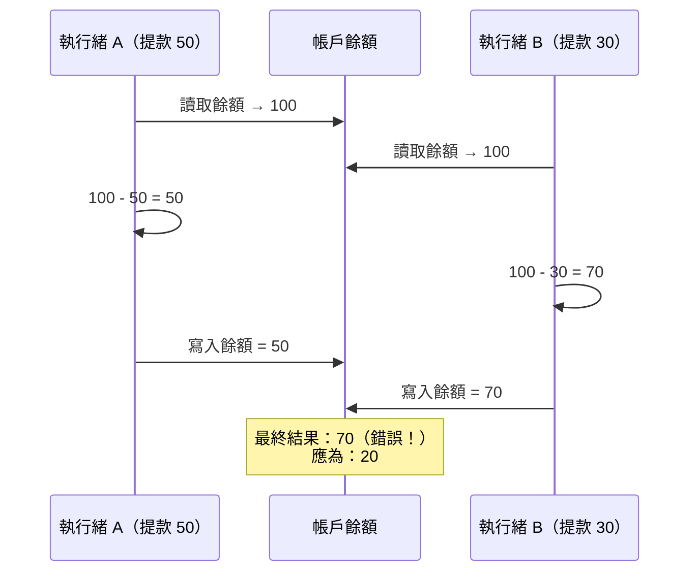

# [BEP-241] 競態條件與資料競爭

:::info
競態條件（race condition）與資料競爭（data race）是兩種不同的錯誤。混為一談往往導致修了其中一個，另一個卻仍殘留。兩者都要理解，才能寫出正確的並發程式。
:::

## 背景

並發系統——無論使用執行緒、goroutine、async/await，還是分散式程序——都容易出現依賴時序的錯誤。工程師最常遇到的兩個術語是**競態條件**和**資料競爭**，它們相關卻不相同。把兩者混用的工程師，往往修了一種錯誤，卻讓另一種繼續潛伏。

本文精確定義這兩個概念，說明其差異，涵蓋 TOCTOU 子類，並介紹偵測工具與預防策略。

## 定義

### 競態條件（Race Condition）

**競態條件**是一種邏輯錯誤：程式的正確性取決於並發操作的相對時序或執行順序。不同的執行順序會產生不同（且可能錯誤）的結果。

競態條件屬於**語義錯誤**——程式語法上可能完全合法，記憶體存取也可能有同步保護，但因為邏輯操作序列不是原子性的，仍會產生錯誤結果。

### 資料競爭（Data Race）

**資料競爭**是一種**記憶體安全錯誤**：兩個或更多執行緒同時存取同一個記憶體位置，其中至少一個是寫入，且沒有任何同步機制（鎖、原子操作、記憶體屏障）協調它們。

資料競爭在 C、C++ 等語言中屬於未定義行為（UB）。在 Go 中，記憶體模型將無同步的並發寫入視為資料競爭，可由競爭偵測器捕獲。即使在定義了資料競爭行為的語言（如 Java），實際結果仍然難以預測。

### 兩者的差異

| | 競態條件 | 資料競爭 |
|---|---|---|
| 本質 | 邏輯錯誤 | 記憶體安全錯誤 |
| 需要共享記憶體？ | 不需要（可發生於程序間、I/O、資料庫） | 需要（必須有共享可變狀態） |
| 需要缺少同步？ | 不需要（加了鎖也可能出現） | 需要（定義上即缺乏同步） |
| 競爭偵測器可偵測？ | 不一定 | 可以（Go `-race`、TSan） |
| 範例 | 對檔案做「檢查後行動」 | 兩個 goroutine 同時寫同一個 map |

**有競態條件但沒有資料競爭**：兩個程序各自讀取資料庫列後決定插入資料——讀寫都完全序列化，但邏輯上仍有競態。**有資料競爭但沒有競態條件**：兩個執行緒競相寫入相同的值——按定義是資料競爭，但無可觀察的邏輯錯誤。

## 原則

**每一個共享可變狀態的存取都必須明確同步，每一個對共享狀態的「檢查後行動」序列都必須視為單一原子操作。**

## TOCTOU 模式

**Time-of-Check to Time-of-Use（TOCTOU，從檢查到使用的時間差）** 是最典型的競態條件子類。它發生在程式：

1. 檢查某個條件（「check」）
2. 根據該條件採取行動（「use」）
3. 條件可能在步驟 1 和步驟 2 之間發生變化

檢查與使用不是原子性的，另一個執行緒或程序可以在使用之前讓檢查結果失效。

**檔案系統範例：**

```
if os.path.exists("/tmp/lockfile"):   # 檢查
    # 攻擊者在此建立 /tmp/lockfile
    open("/tmp/lockfile", "r")        # 使用 -- 檔案現在存在，行為已改變
```

**資料庫範例：**

```sql
-- 執行緒 A                           -- 執行緒 B
SELECT balance FROM accounts          SELECT balance FROM accounts
  WHERE id = 1;  -- 回傳 100            WHERE id = 1;  -- 回傳 100

-- 執行緒 A 以 100 為基礎計算         -- 執行緒 B 以 100 為基礎計算
UPDATE accounts SET balance = 50      UPDATE accounts SET balance = 70
  WHERE id = 1;                         WHERE id = 1;
-- 最終餘額：70，而非應有的 20。更新遺失。
```

TOCTOU 同樣適用於檔案系統操作、資料庫讀取、記憶體中的狀態，以及認證檢查。

## 經典範例：銀行帳戶提款

### 問題所在

```
function withdraw(account, amount):
    balance = account.read_balance()   # 讀取
    if balance >= amount:              # 檢查
        # <-- 另一個執行緒可能在此提款
        account.write_balance(balance - amount)  # 使用
```

若兩個執行緒同時對餘額為 100 的帳戶呼叫 `withdraw`，兩者都可能讀到 100，都通過檢查，都寫回減少後的餘額——最終狀態不正確。

### 競態條件時序圖



執行緒 B 的寫入覆蓋了執行緒 A 的寫入，執行緒 A 提領的 50 元完全遺失。

### 修法一：互斥鎖（Mutex）

將整個「讀取—檢查—寫入」序列包在同一個鎖內，讓序列對其他持有同一鎖的執行緒具有原子性。

```python
def withdraw(account, amount, lock):
    with lock:
        balance = account.read_balance()
        if balance >= amount:
            account.write_balance(balance - amount)
            return True
        return False
```

臨界區必須涵蓋完整的「讀取—檢查—寫入」。只鎖住寫入是不夠的——競態發生在讀取與寫入之間。

### 修法二：原子比較並交換（Compare-and-Swap，CAS）

對於簡單的數值狀態，硬體層級的 CAS 可實現無鎖更新。CAS 原子性地在寫入前確認當前值符合預期值。

```go
// Go 範例，使用 sync/atomic
func withdraw(balance *int64, amount int64) bool {
    for {
        current := atomic.LoadInt64(balance)
        if current < amount {
            return false
        }
        next := current - amount
        if atomic.CompareAndSwapInt64(balance, current, next) {
            return true
        }
        // CAS 失敗：另一個執行緒已修改餘額，重試
    }
}
```

CAS 迴圈有效，但須謹慎使用。在高競爭下可能造成自旋，而多變數的原子性仍需依賴鎖。

### 修法三：資料庫層級鎖定（SELECT FOR UPDATE）

對於存放在資料庫的狀態，應將原子性交由資料庫事務負責。`SELECT FOR UPDATE` 取得列層級鎖，阻止其他事務在當前事務提交前讀取或修改該列。

```sql
BEGIN;
SELECT balance FROM accounts
  WHERE id = $1
  FOR UPDATE;           -- 取得列鎖

-- 應用程式檢查 balance >= amount
UPDATE accounts
  SET balance = balance - $2
  WHERE id = $1;

COMMIT;                 -- 釋放鎖
```

這是關聯式資料庫中儲存金融或庫存狀態的正確做法。參見 [BEP-161](../Transactions%20and%20Isolation/161.md) 了解隔離層級，[BEP-245](245.md) 了解樂觀與悲觀並發控制策略。

## 偵測工具

### Go 競爭偵測器（`-race`）

Go 工具鏈內建以 ThreadSanitizer 為基礎的競爭偵測器，透過 `-race` 旗標啟用：

```bash
go test -race ./...
go run -race main.go
go build -race -o myapp
```

偵測器在編譯時對所有記憶體存取進行插樁，並在執行時追蹤存取記錄。一旦偵測到兩個無同步的並發存取，且至少一個是寫入，便會輸出包含 goroutine 堆疊追蹤的詳細報告。

- **效能代價**：慢 2-20 倍，記憶體增加 5-10 倍。
- **限制**：只能找到執行時發生的競爭，須在能觸發並發路徑的工作負載下執行。
- **CI 建議**：每個 Pull Request 都執行 `go test -race`。

參考：[go.dev/doc/articles/race_detector](https://go.dev/doc/articles/race_detector)

### ThreadSanitizer（TSan）

TSan 是底層引擎，同樣適用於 C、C++、Rust 程式。透過 Clang 或 GCC 啟用：

```bash
clang -fsanitize=thread -g -O1 -o myprogram myprogram.c
./myprogram
```

TSan 使用結合 happens-before 和 lockset 的混合演算法。典型額外開銷：慢 5-15 倍，記憶體增加 5-10 倍。

參考：[clang.llvm.org/docs/ThreadSanitizer.html](https://clang.llvm.org/docs/ThreadSanitizer.html)

### Helgrind（Valgrind）

Helgrind 是 Valgrind 的工具，用於偵測 C/C++ 程式中的 POSIX pthread API 誤用和資料競爭：

```bash
valgrind --tool=helgrind ./myprogram
```

Helgrind 比 TSan 慢（20-50 倍），但在沒有原始碼的情況下不需要重新編譯。

## 預防策略

**1. 不可變性（Immutability）** -- 優先使用不可變資料結構。無法被寫入的資料不會有競態問題。在實際可行的情況下傳遞副本而非參照。

**2. 所有權限制（Confinement）** -- 確保任意時刻每份資料只有單一擁有者。在 Go 中即「不要以共享記憶體來通訊；以通訊來共享記憶體」——使用 channel 在 goroutine 之間傳遞所有權。

**3. 同步（Synchronization）** -- 使用互斥鎖、讀寫鎖或信號量保護臨界區。臨界區必須涵蓋完整的邏輯操作（讀取 + 檢查 + 寫入），而不只是寫入。

**4. 原子操作（Atomic Operations）** -- 對單一變數的「讀取—修改—寫入」使用 `sync/atomic`（Go）、`std::atomic`（C++）或 `java.util.concurrent.atomic`。不要在沒有鎖的情況下嘗試多變數原子性。

**5. 資料庫事務（Database Transactions）** -- 對於資料庫中的狀態，使用適當隔離層級的事務。悲觀鎖定用 `SELECT FOR UPDATE`，低競爭場景用樂觀並發控制（版本欄位）。

**6. 在 CI 中執行競爭偵測** -- 每次 CI 建置都執行啟用競爭偵測的測試。在 CI 中發現的競爭，修復成本遠低於在生產環境中發現的。

## 常見錯誤

**1. 認為單執行緒程式碼不會有競態條件。**
JavaScript 和 Python 的 async/await 程式是單執行緒，但仍會出現競態條件。兩個協程可以在任何 `await` 點交錯執行。只要在檢查和使用之間有 await，就可能出現 TOCTOU 問題。

**2. 讀取—修改—寫入缺乏原子性。**
`counter++` 在大多數語言中會編譯為三個操作：載入、遞增、儲存。沒有原子性保護，並發遞增會導致更新遺失。共享計數器一律使用原子原語或鎖。

**3. 雙重檢查鎖定（Double-Checked Locking）實作錯誤。**
延遲初始化的常見模式：取得鎖、再次檢查、然後初始化。這只有在初始化旗標的寫入對所有執行緒可見、且早於被初始化物件的存取時才安全。在 Java 中，欄位必須宣告為 `volatile`；在 C++ 中，使用帶有適當記憶體順序的 `std::atomic`。沒有這些保護的雙重檢查鎖定是資料競爭。

**4. 假設雜湊映射（hash map）是執行緒安全的。**
Go 的 `map`、Java 的 `HashMap`、Python 的 `dict`——對並發寫入都不安全。請使用 `sync.Map`（Go）、`ConcurrentHashMap`（Java），或明確加鎖。並發的 map 寫入是資料競爭，而不只是邏輯錯誤。

**5. 未在 CI 中執行競爭偵測。**
競態條件依賴時序，在正常負載下往往靜默無聲。若 CI 中沒有 `-race` 或 TSan，資料競爭會無聲無息地積累，直到在生產環境造成資料損毀。

## 相關 BEP

- [BEP-240](240.md) -- 並發模型：執行緒、goroutine、async/await
- [BEP-241](241.md) -- 鎖與同步原語
- [BEP-245](245.md) -- 樂觀與悲觀並發控制
- [BEP-161](../Transactions%20and%20Isolation/161.md) -- 隔離層級：資料庫如何在儲存層防止競態條件

## 參考資料

- [Race Condition vs. Data Race -- Embedded in Academia](https://blog.regehr.org/archives/490)
- [Go Data Race Detector](https://go.dev/doc/articles/race_detector)
- [ThreadSanitizer -- Clang documentation](https://clang.llvm.org/docs/ThreadSanitizer.html)
- [Race condition -- Wikipedia](https://en.wikipedia.org/wiki/Race_condition)
- [Understanding TOCTOU: The Race Condition Hiding in Your Code](https://dev.to/codewithveek/understanding-toctou-the-race-condition-hiding-in-your-code-43nh)
