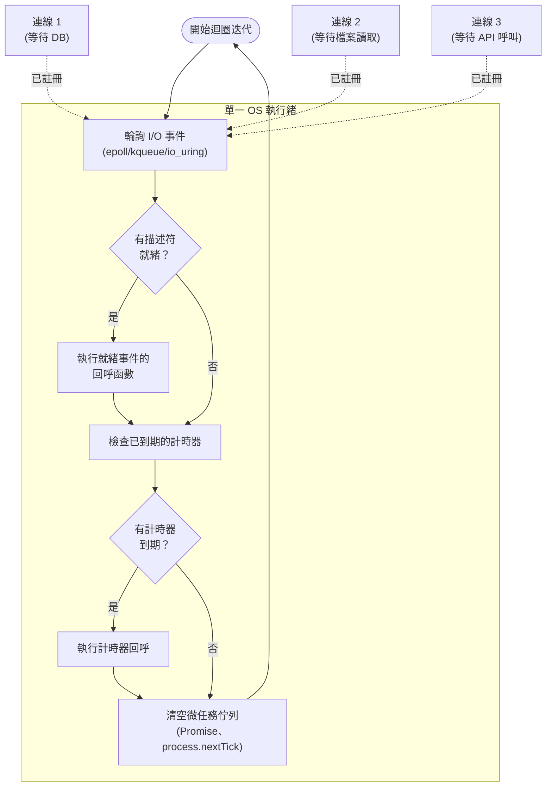

# [BEE-243] 非同步 I/O 與事件迴圈

:::info
非阻塞 I/O 與事件迴圈讓單一執行緒能同時服務數千個並行連線。理解這個模型——以及什麼會破壞它——是建構高吞吐量後端服務的基礎。
:::

## 背景

數十年來主流的 I/O 模型是**阻塞式**的：執行緒發出系統呼叫（`read()`、`accept()`、`connect()`），作業系統就將該執行緒暫停，直到操作完成為止。這個模型容易理解：一個執行緒一次處理一個請求——呼叫資料庫、等待、返回結果。

問題在規模化時浮現。隨著 1990 年代末期網路流量快速增長，伺服器工程師發現執行緒-連線一對一的模型，在網路介面或 CPU 成為瓶頸之前就已崩潰。1999 年，Dan Kegel 將此正式定義為 **C10K 問題**：如何讓單台伺服器有效率地同時處理 10,000 個連線？

要回答這個問題，必須從根本上重新思考執行緒與 I/O 之間的關係。

參考資料：
- [The C10K problem — Dan Kegel (1999)](https://www.kegel.com/c10k.html)
- [The Node.js Event Loop — nodejs.org](https://nodejs.org/learn/asynchronous-work/event-loop-timers-and-nexttick)
- [asyncio — Asynchronous I/O — Python docs](https://docs.python.org/3/library/asyncio.html)

### 阻塞式 vs. 非阻塞式 I/O

在**阻塞式 I/O** 中，呼叫執行緒會被核心排程出去，直到資料就緒。這個執行緒佔用一個堆疊（1–8 MB）、占用 OS 排程器中的一個位置，並在每次 I/O 完成時執行一次上下文切換。在 10,000 個並行連線的情況下，光是堆疊就需要 10 GB——還不包括任何應用程式資料。

在**非阻塞式 I/O** 中，若資料尚未就緒，系統呼叫會立刻回傳 `EAGAIN`。應用程式負責在 OS 發出就緒訊號時再回來檢查。用迴圈輪詢數千個檔案描述符會浪費資源；解決方案是 **I/O 多工（I/O multiplexing）**。

### I/O 多工：select、poll、epoll、kqueue、io_uring

**`select`**（POSIX，1983）：傳入一組檔案描述符，核心標記哪些已就緒。限制：預設最多支援 1,024 個描述符；每次呼叫都是 O(n)，核心掃描所有描述符。

**`poll`**（POSIX，1997）：移除了 1,024 的上限，但仍是 O(n) 複雜度。

**`epoll`**（Linux 2.5.46，2002）：核心維護一個興趣清單，只回傳已就緒的描述符，而不是掃描所有描述符。註冊為 O(1)，取回為 O(k)，k 是就緒事件數，而非監聽的總數。epoll 是 Node.js、nginx 及大多數現代 Linux 伺服器的底層機制。

**`kqueue`**（FreeBSD 4.1，2000；macOS）：功能上等同於 BSD 系統上的 epoll，提供統一介面監聽檔案描述符、訊號、計時器和行程事件。

**`io_uring`**（Linux 5.1，2019）：提交／完成佇列介面，可批次提交 I/O 操作並以最少的系統呼叫開銷取得結果。與 epoll 的就緒通知模式不同，io_uring 可讓核心直接完成資料傳輸，進一步減少系統呼叫的來回次數。

## 事件迴圈

事件迴圈是將非阻塞 I/O 與應用程式碼連結起來的執行期模式。單一執行緒持續運行，詢問 OS 哪些 I/O 操作已就緒，為這些操作派發回呼或恢復協程，再檢查計時器，然後重複。



關鍵洞察：當連線 1 等待其資料庫查詢時，執行緒並未被阻塞——它回到迴圈並可以服務連線 2 的 I/O 完成事件。單一執行緒透過在 I/O 邊界上交錯處理，並行處理數千個進行中的操作，而非同時執行它們。

Node.js 透過 **libuv** 實現這個機制，libuv 是一個跨平台的 C 函式庫，根據當前 OS 選擇最佳輪詢機制（Linux 用 epoll、macOS/BSD 用 kqueue、Windows 用 IOCP）。libuv 也維護一個執行緒池（預設 4 個執行緒），用於缺乏原生非同步 OS 支援的 I/O 操作，例如檔案系統讀取、DNS 解析和部分加密操作。

Python 的 `asyncio` 使用相同的概念模型。事件迴圈驅動 `Task` 物件，每個 Task 背後是一個協程。當協程執行 `await` 時，它暫停並將控制權交還給事件迴圈，由迴圈執行下一個就緒的任務。

## Reactor vs. Proactor 模式

兩種設計模式正式化了事件迴圈模型：

**Reactor 模式**：事件迴圈在檔案描述符*就緒*可讀寫時通知應用程式。應用程式自行執行 I/O（例如呼叫 `read()`）。epoll 和 kqueue 基於就緒通知；應用程式發起實際的系統呼叫。nginx 和 Node.js 使用 Reactor 模式。

**Proactor 模式**：應用程式向 OS 提交一個 I/O *操作*。OS 完成操作後，在資料*已經在緩衝區中*時通知應用程式。應用程式永遠不直接呼叫 `read()`。io_uring 和 Windows IOCP 基於完成通知，可避免額外的系統呼叫來回，在高效能系統中越來越普及。

## 並行時間軸：阻塞式 vs. 非同步

考慮一個 HTTP 伺服器處理三個並行請求，每個請求各需要一次需時 50 毫秒的資料庫查詢。

**阻塞式模型——3 個執行緒各自等待：**

```
時間 (ms)  執行緒 1           執行緒 2           執行緒 3
0          收到請求 1         收到請求 2         收到請求 3
0–50       [阻塞在 DB]        [阻塞在 DB]        [阻塞在 DB]
50         送出回應 1         送出回應 2         送出回應 3

總掛鐘時間：50 ms
執行緒秒數：3 × 50 ms = 150 ms 的執行緒時間
10,000 個並行請求時：10,000 個阻塞執行緒
```

**非同步模型——1 個執行緒，3 個非阻塞查詢：**

```
時間 (ms)  事件迴圈執行緒
0          收到請求 1 → 發出 DB 查詢 1（非阻塞）
0          收到請求 2 → 發出 DB 查詢 2（非阻塞）
0          收到請求 3 → 發出 DB 查詢 3（非阻塞）
0–50       [輪詢迴圈：檢查 epoll，執行其他回呼]
50         DB 查詢 1 就緒 → 送出回應 1
50         DB 查詢 2 就緒 → 送出回應 2
50         DB 查詢 3 就緒 → 送出回應 3

總掛鐘時間：50 ms
執行緒秒數：1 × 50 ms = 50 ms 的執行緒時間
10,000 個並行請求時：1 個執行緒 + 10,000 個進行中的 OS 操作
```

非同步模型在同一毫秒內發出所有三個資料庫查詢，並在它們完成時逐一處理。執行緒從不被掛起——它持續循環，只要有任何事件就緒就處理工作。

## Node.js 事件迴圈——標準範例

Node.js 是研究最廣泛的單執行緒事件迴圈執行期。其迴圈階段（來自 libuv）：

1. **timers**——執行 `setTimeout()` 和 `setInterval()` 排定的回呼
2. **pending callbacks**——執行上一次迭代中延遲的 I/O 回呼
3. **idle, prepare**——內部使用
4. **poll**——取得新的 I/O 事件；執行 I/O 相關回呼（當佇列為空且沒有計時器待處理時，這是主要的阻塞階段）
5. **check**——執行 `setImmediate()` 回呼
6. **close callbacks**——清理回呼（例如 `socket.on('close', ...)`）

每個階段之間，Node.js 清空**微任務佇列**：`Promise` 的 `.then()` 回呼與 `process.nextTick()` 回呼會在進入下一個迴圈階段前全部執行完畢。

實際影響：遞迴排定自身的 `process.nextTick()` 回呼會讓整個事件迴圈餓死——在微任務佇列清空前，不會有任何 I/O 事件、計時器或新連線被處理。

## Go 的做法：將非同步隱藏在同步 API 之後

Go 採取不同的哲學。Goroutine 使用阻塞式語法（`conn.Read()`、`http.Get()`），但 Go 執行期在底層將這些呼叫轉換為非阻塞系統呼叫。當 goroutine 阻塞在 I/O 時，執行期將其掛起，並在同一個 OS 執行緒上排程另一個 goroutine。程式設計師撰寫循序式程式碼；執行期提供非同步 I/O 的吞吐量。

這種 M:N 排程（見 [BEE-240](240.md)）意味著 Go 同時避免了 Node.js 的回呼／Promise 複雜性，以及執行緒-連線一對一模型的記憶體成本。其代價是 CPU 密集的 goroutine 仍可能在單一 P（邏輯處理器）上餓死 I/O 密集的 goroutine，不過 Go 的搶佔式排程器（自 Go 1.14 起）緩解了這個問題。

## 原則

**對 I/O 密集、高並行的工作負載，使用非阻塞 I/O 和事件迴圈。絕不阻塞事件迴圈。**

1. 對於 I/O 密集的服務（HTTP 伺服器、代理、資料庫客戶端），單執行緒事件迴圈能以執行緒-連線一對一模型所需記憶體的一小部分，處理數萬個並行連線。

2. 事件迴圈模型的吞吐量優勢，在任何操作阻塞迴圈執行緒超過幾毫秒時，就會消失——並且轉變為劣勢。

3. CPU 密集的工作必須離開事件迴圈：卸載到 worker 執行緒池、獨立行程，或專用的 CPU worker（見 [BEE-241](241.md)）。

4. 該模型是並行（concurrent），而非平行（parallel）：在任何時刻，單執行緒事件迴圈只執行一個回呼。吞吐量來自最小化等待時間，而非同時執行。

## 常見錯誤

**1. 用 CPU 密集的計算阻塞事件迴圈**

```javascript
// 錯誤：在執行期間阻塞事件迴圈
app.get('/report', (req, res) => {
  const result = generateHeavyReport(req.params); // 純 CPU，耗時 2 秒
  res.json(result); // 2 秒內沒有其他請求能被處理
});

// 正確：卸載到 worker 執行緒
app.get('/report', async (req, res) => {
  const result = await runInWorkerThread(generateHeavyReport, req.params);
  res.json(result);
});
```

任何在熱路徑上執行超過幾毫秒的同步 CPU 工作（大型 JSON 序列化、加密雜湊、圖片處理、對大字串的正則表達式）都會延遲該行程中的所有其他連線。

**2. 混用同步與非同步 I/O**

一個同步阻塞呼叫會污染整個事件迴圈。在熱路徑中出現一個 `fs.readFileSync()` 就會在其執行期間阻塞所有並行請求。請審查相依套件，確認初始化程式碼中不含可能在熱路徑上執行的同步 I/O。

**3. 使用非同步客戶端時未搭配連線池**

非同步 I/O 能同時發出許多 I/O 操作。若不使用連線池，每個並行請求可能各自開啟一個資料庫連線。在 1,000 個並行請求時，這會建立 1,000 個同時存在的資料庫連線——耗盡資料庫的連線限制。務必使用連線池，限制資料庫層的並行數。見 [BEE-301](301.md)。

**4. 回呼地獄——金字塔式縮排**

深層嵌套的回呼難以推理，且無法一致地處理錯誤：

```javascript
// 錯誤
getUser(id, (err, user) => {
  getOrders(user.id, (err, orders) => {
    getItems(orders[0].id, (err, items) => {
      // ... 深層嵌套，錯誤處理不一致
    });
  });
});

// 正確：async/await 拉平結構
async function getUserOrders(id) {
  const user = await getUser(id);
  const orders = await getOrders(user.id);
  const items = await getItems(orders[0].id);
  return items;
}
```

Promise 鏈（`.then().then()`）比回呼好，但 `async/await` 通常最清晰。

**5. 誤以為非同步 = 平行**

非同步 I/O 是在單一執行緒上的並行 I/O，而非平行的 CPU 執行。在 Node.js 或 Python `asyncio` 的單執行緒事件迴圈中，兩個 `async` 函數在同一微秒內無法真正同時執行；它們在 `await` 點上交錯。這一點很重要，因為：

- CPU 密集的程式碼仍然會阻塞（沒有 `await` 可以讓步）
- 兩個 `async` 函數之間的共享可變狀態，在 `await` 點之間是安全的，但在 `await` 點處可能有意外的值
- 要實現真正的平行，即使在非同步執行期中，也需要多個 OS 執行緒或行程

## 決策指南

```
工作負載是 I/O 密集型（網路、磁碟、外部服務）嗎？
├── 是，且需要高並行（數百到數千個連線）？
│   └── 使用事件迴圈／非同步 I/O（Node.js、asyncio、Go net/http）
│       ├── 熱路徑上有 CPU 密集的操作？
│       │   └── 有 → 卸載到 worker 池（見 [BEE-241](241.md)）
│       └── 有大量並行 DB 查詢？
│           └── 有 → 使用連線池（見 [BEE-301](301.md)）
└── 否，主要是 CPU 密集型？
    └── 使用執行緒池或行程池——事件迴圈在此沒有價值
        （見 [BEE-241](241.md)）
```

## 相關 BEE

- [BEE-240](240.md) — 執行緒 vs 行程 vs 協程：非同步執行期底層的並行原語
- [BEE-241](241.md) — Worker 池：從事件迴圈卸載 CPU 密集的工作
- [BEE-301](301.md) — 連線池：防止非同步服務中的連線耗盡
