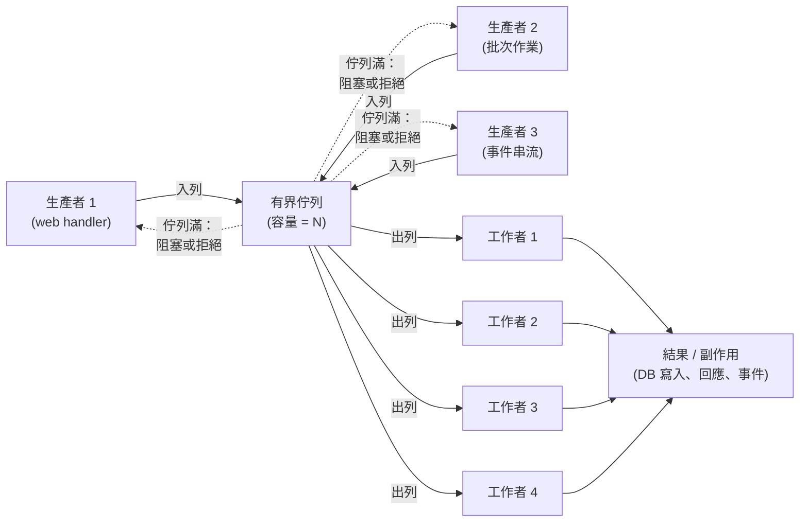

# [BEE-244] 生產者-消費者與工作池模式

:::info
透過有界共享佇列將生產者與消費者解耦，再以固定數量的工作者提供服務。這對模式為任何任務驅動的工作負載提供流量控制、有界資源使用與可預測的吞吐量。
:::

## 背景

每個後端服務終將面臨速率不匹配的問題：工作到達的速率與工作被處理的速率並不相同。一個每秒接收 500 張圖片上傳請求的 Web 伺服器無法立即完成縮圖——每次縮圖都需要 CPU 時間。若缺乏刻意的設計，你只剩兩個選擇：產生無限量的 goroutine/執行緒（冒 OOM 的風險），或丟棄請求（造成資料遺失）。

**生產者-消費者模式**透過在產生工作的程式碼與執行工作的程式碼之間放置共享佇列來解決此問題。佇列在時間、速率與資源分配上將生產與消費解耦。這是自 Dijkstra 1965 年號誌論文以來的基礎並行慣用語，廣泛出現在 OS 行程排程器到 Kafka 消費者群組的各種場景中。

**工作池模式**（又稱執行緒池）是天然的互補：不為每個任務產生新執行緒，而是由固定數量的工作者 goroutine/執行緒從佇列中拉取任務。工作者長期存活，跨多個任務重複使用，且上限為已知的數字。

兩者合在一起，構成了所有大規模處理離散工作單元之系統的骨幹。

參考資料：
- [Producer-Consumer Pattern — Low Level Design Mastery](https://www.lowleveldesignmastery.com/advanced-concurrency/core/04-producer-consumer/)
- [How to Implement Thread Pool Sizing — OneUptime Engineering](https://oneuptime.com/blog/post/2026-01-30-thread-pool-sizing/view)
- [How to Implement Worker Pools in Go — OneUptime Engineering](https://oneuptime.com/blog/post/2026-01-07-go-worker-pools/view)
- [How to Set an Ideal Thread Pool Size — Zalando Engineering](https://engineering.zalando.com/posts/2019/04/how-to-set-an-ideal-thread-pool-size.html)
- [Blocking Queues and Why We Need Them — Arpit Bhayani](https://arpitbhayani.me/blogs/blocking-queues/)

### 核心問題：速率不匹配

考慮一個圖片處理服務。Web 伺服器在尖峰時段接收的上傳請求遠超單一工作者的處理能力：

```
生產速率  →  每秒 100 個任務
處理速率  →  每個工作者每秒 25 個任務
```

沒有佇列的情況下，生產者必須等待（阻塞 HTTP 處理器），或為每個任務產生新的 goroutine（無限制的資源增長）。兩者在生產環境中都不可接受。

有了有界佇列與工作池，系統能在佇列容量範圍內吸收突發流量，以工作池的持續速率處理任務，並在佇列滿時發出背壓訊號——將流量控制的決策推回到生產者端，這也是最恰當的位置。

## 架構



有界佇列是中央控制點。它作為緩衝區吸收生產突發、在佇列滿時強制執行背壓，並提供自然的負載平衡——最先完成的工作者取下一個任務。

## 原則

**使用有界佇列與固定工作池，將任務生產與任務執行解耦、強制執行流量控制、並限制資源消耗。**

1. 佇列在時間上解耦生產者與消費者：生產者不需要等待特定工作者，工作者也不需要等待特定生產者。

2. 佇列的有界容量是背壓的主要控制旋鈕。當佇列滿時，生產者阻塞或收到拒絕訊號。這將卸載決策向上游傳播，而非讓無限制的記憶體消耗掩蓋系統過載。

3. 工作池限制資源使用。N 個工作者的工作池意味著最多同時執行 N 個任務，無論佇列中有多少任務，最多消耗 N × (每任務記憶體)。

4. 工作者被重複使用。執行緒和 goroutine 的建立有不可忽視的成本（堆疊分配、OS 排程）。工作池將該成本分攤到服務的整個生命週期中。

### 有界佇列 vs. 無界佇列

| 屬性 | 有界佇列 | 無界佇列 |
|---|---|---|
| 記憶體使用 | 上限為容量 × 任務大小 | 隨積壓量增長 |
| 背壓 | 自然：佇列滿時生產者阻塞 | 無：佇列靜默吸收所有工作 |
| 失敗模式 | 達到容量時受控拒絕 | 高負載下 OOM 崩潰 |
| 可觀測性 | 佇列深度是有意義的指標 | 佇列深度掩蓋過載 |

無界佇列在生產服務中幾乎從不正確。它將暫時性的過載轉換為漸進式記憶體耗盡，最終導致突然的 OOM 崩潰——這是最糟糕的失敗模式。

### 工作池大小選擇

選擇正確的工作者數量需要了解工作負載的 CPU 使用 vs. 等待比例。

**CPU 密集型任務**（圖片縮圖、影片轉碼、加密雜湊、大量計算）：

```
工作者數量 = CPU 核心數
```

超過核心數增加工作者不會增加吞吐量，只會增加上下文切換開銷與記憶體壓力。對於 CPU 密集型工作，執行緒數超過核心數嚴格來說更差。

**I/O 密集型任務**（資料庫查詢、HTTP 呼叫、檔案系統讀取）：

```
工作者數量 = 核心數 × (1 + 等待時間 / 運算時間)
```

如果工作者在資料庫上等待 90 毫秒，在 CPU 上花費 10 毫秒，等待/運算比為 9。以 4 個核心計算：`4 × (1 + 9) = 40 個工作者`。當工作者在 I/O 上阻塞時，其他工作者可以使用 CPU——因此更多工作者是有益的，直到上下文切換成本超過收益為止。

**混合工作負載**（既需要 CPU 又需要 I/O 的任務）：

對 CPU 密集型和 I/O 密集型工作使用獨立的工作池。單一共享工作池意味著 CPU 密集型任務激增時，會阻塞本應服務低延遲 I/O 操作的執行緒。請參閱常見錯誤章節。

這些公式是起點。務必在實際條件下進行壓力測試並據此調整。

### 任務分發策略

當多個工作者從共享佇列取任務時，預設為**工作竊取**：空閒的工作者取下一個可用任務。這是共享阻塞佇列的自然行為，在任務執行時間大致均勻時是最佳選擇。

**輪詢分配**適用於任務必須路由到特定工作者的情況——例如當同一個實體的任務必須按順序執行時（有序扇出）。每個生產者依路由鍵的雜湊值將任務分配給工作者槽位。

**扇出/扇入**：單一任務可拆分為 N 個子任務分發給 N 個工作者（扇出），由協調者收集結果並組裝最終輸出（扇入）。這是 MapReduce 風格管道的基礎。

## 具體範例：圖片處理管道

一個 Web 服務接受圖片上傳請求。每張上傳的圖片需要縮圖成三種輸出尺寸。業務需求是在不阻塞 HTTP 伺服器執行緒、不在突發負載下耗盡記憶體、且不在重啟時遺失任務的情況下處理圖片。

### 設計

```
HTTP handler（生產者）
    ↓ 入列 ResizeTask{imageID, targetSizes}
有界佇列，容量 = 200
    ↓ 出列
工作池，4 個工作者（CPU 密集型）
    ↓ 縮圖 + 寫入物件儲存
完成：更新 DB 記錄的輸出 URL
```

### 正常運作

```
時間     事件
0ms      100 個請求到達，100 個 ResizeTask 入列（佇列深度：100）
0ms      4 個工作者開始處理任務 1-4
80ms     任務 1 完成 → 工作者 1 取任務 5
         任務 2 完成 → 工作者 2 取任務 6
         ...
4000ms   100 個任務全部完成（100 個任務 ÷ 4 個工作者 × 80ms/任務）
```

### 突發：生產者快於消費者

當請求以每秒 50 個到達，而每個任務需要 200 毫秒，4 個工作者（吞吐量：每秒 20 個）：

```
第 1 秒：入列 50 個，處理 20 個 → 佇列深度：30
第 2 秒：入列 50 個，處理 20 個 → 佇列深度：60
第 3 秒：入列 50 個，處理 20 個 → 佇列深度：90
...
第 6 秒：入列 50 個，處理 20 個 → 佇列深度：180
第 7 秒：50 個請求到達，佇列在 200 中達到 180 → 30 個任務以 429 拒絕
```

拒絕是正確的行為。HTTP handler 收到「佇列已滿」的訊號，以 HTTP 429 Too Many Requests 回應用戶端。系統保持穩定；記憶體有界；用戶端可以帶退避重試。若沒有有界佇列，服務會靜默接受所有工作，直到 OOM 為止。

### 優雅關閉

關閉順序至關重要。滾動重啟或容器重啟在未排空佇列的情況下終止行程，是一個正確性錯誤。

```
1. 停止接受新任務
   ↳ HTTP 伺服器開始拒絕新的上傳請求（503）

2. 等待佇列排空
   ↳ 生產者已停止；工作者繼續出列

3. 等待進行中的任務完成
   ↳ 每個工作者在退出前完成當前任務

4. 關閉佇列
   ↳ 釋放資源、刷新指標

5. 退出
```

設置關閉逾時。若工作者未在逾時時間（例如 30 秒）內完成，則終止它們並記錄哪些任務 ID 被放棄，以便從持久儲存中重試。

```go
// Go 範例：優雅關閉
func (p *Pool) Shutdown(ctx context.Context) error {
    close(p.queue)          // 訊號：不再入列新任務
    done := make(chan struct{})
    go func() {
        p.wg.Wait()         // 等待所有工作者完成
        close(done)
    }()
    select {
    case <-done:
        return nil
    case <-ctx.Done():
        return fmt.Errorf("pool shutdown timed out: %w", ctx.Err())
    }
}
```

## 常見錯誤

**1. 無界佇列（OOM）**

```go
// 錯誤：沒有容量限制的 channel
tasks := make(chan Task) // 或 make(chan Task, 1_000_000)

// 正確：有界 channel 匹配可持續的吞吐量
tasks := make(chan Task, 200) // 佇列滿時拒絕，而非崩潰
```

無界佇列將過載轉換為記憶體洩漏。佇列靜默增長，直到行程被 OOM 殺死，沒有任何警告，也沒有優雅降級的機會。務必設定明確的容量。

**2. CPU 密集型工作的工作池過大**

```python
# 錯誤：8 核心機器上的 CPU 密集型圖片縮圖使用 100 個工作者
pool = ThreadPoolExecutor(max_workers=100)

# 正確：工作者數量匹配核心數
import os
pool = ThreadPoolExecutor(max_workers=os.cpu_count())
```

在 8 個核心上有 100 個 CPU 密集型執行緒，OS 在 8 個 CPU 上進行 100 個執行緒的上下文切換。每次切換耗費約 1–10 微秒加上快取失效成本。吞吐量下降；延遲上升；CPU 使用率顯示高系統時間。更多工作者並不總是更好。

**3. 無優雅關閉（重啟時任務遺失）**

```python
# 錯誤：行程立即退出，佇列被放棄
signal.signal(signal.SIGTERM, lambda *_: sys.exit(0))

# 正確：排空並完成
def handle_sigterm(*_):
    stop_accepting_new_tasks()
    pool.shutdown(wait=True)   # 等待進行中的任務
    sys.exit(0)
```

在未排空佇列的情況下終止行程的滾動部署或容器重啟，會靜默丟棄任務。每個生產環境的工作池都需要一個 SIGTERM 處理器，停止生產者並等待工作者完成。

**4. 忽略任務失敗（靜默丟棄）**

```go
// 錯誤：錯誤遺失
go func() {
    for task := range queue {
        process(task) // 錯誤被忽略
    }
}()

// 正確：每個任務的錯誤都被處理
go func() {
    for task := range queue {
        if err := process(task); err != nil {
            metrics.Increment("task.failure")
            if isRetryable(err) {
                retryQueue <- task
            } else {
                deadLetterQueue <- task
                log.Error("task failed permanently", "id", task.ID, "err", err)
            }
        }
    }
}()
```

被吞掉的任務失敗在呼叫者眼中看起來像成功。失敗的任務必須重試（帶退避和重試次數限制）或寫入死信佇列以供人工檢查。

**5. 混合工作負載使用單一全域工作池**

```java
// 錯誤：CPU 密集型和 I/O 密集型任務競爭同一個工作池
ExecutorService globalPool = Executors.newFixedThreadPool(8);
globalPool.submit(cpuHeavyTask);   // 佔用 500ms 的 CPU
globalPool.submit(dbQueryTask);    // 需要執行緒快速解除阻塞

// 正確：按工作負載類型分開工作池
ExecutorService cpuPool = Executors.newFixedThreadPool(Runtime.getRuntime().availableProcessors());
ExecutorService ioPool  = Executors.newFixedThreadPool(cpuCount * 10);
```

當 CPU 密集型任務填滿工作池時，I/O 密集型任務在佇列中等待執行緒，即使 CPU 忙碌且 I/O 任務本可立即完成。獨立工作池消除了這種干擾。

## 決策指南

```
你有以可變速率生產的離散工作單元嗎？
├── 是
│   ├── 消費速率可能慢於生產速率？
│   │   ├── 是 → 使用有界佇列（背壓、流量控制）
│   │   └── 否 → 簡單的 channel/佇列仍然解耦了關注點
│   │
│   ├── 工作是 CPU 密集型嗎（計算、編碼、雜湊）？
│   │   └── 工作池大小 = CPU 核心數
│   │
│   ├── 工作是 I/O 密集型嗎（DB、網路、儲存）？
│   │   └── 工作池大小 = 核心數 × (1 + 等待/運算)
│   │       或使用非同步 I/O（見 [BEE-243](243.md)）
│   │
│   └── 同一服務中有混合工作負載？
│       └── 每種工作負載類型使用獨立工作池
│
└── 沒有離散任務（串流、持續運算）？
    └── 考慮非同步 I/O（[BEE-243](243.md)）或響應式串流（[BEE-305](305.md)）
```

## 相關 BEPs

- [BEE-225](225.md) — 背壓：向上游傳播負載訊號的系統級策略
- [BEE-240](240.md) — 執行緒 vs 行程 vs 協程：工作池建立的基礎原語
- [BEE-243](243.md) — 非同步 I/O 與事件迴圈：I/O 密集型工作的執行緒池替代方案
- [BEE-305](305.md) — 非同步處理與作業佇列：跨服務任務分發的持久分散式佇列（Kafka、SQS）
