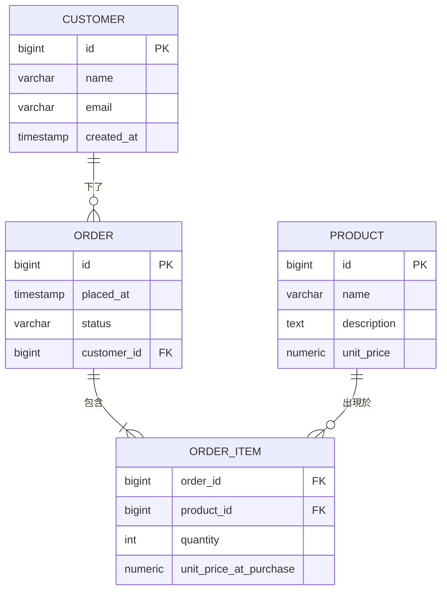

# [BEE-140] 實體關係建模

:::info
先對領域建模，再對資料表建模。ER 圖首先是溝通工具，其次才是實作藍圖。
:::

## 背景

1976 年，Peter Chen 在 ACM Transactions on Database Systems 發表了「The Entity-Relationship Model: Toward a Unified View of Data」([Chen 1976](https://dl.acm.org/doi/10.1145/320434.320440))。他的核心洞察是：一個統一的概念模型可以橋接人類對業務領域的思考方式與機器儲存資料的方式。將近五十年後，ER 模型依然是跨團隊溝通資料結構的標準語言，無論底層儲存技術為何。

Chen 當年要解決的失敗模式至今仍普遍存在：工程師從業務需求直接跳到 CREATE TABLE，跳過了明確對領域建模的步驟。最終的 schema 反映的是某位工程師某天下午對問題的個人理解，而非產品經理、領域專家與工程師共同建立的共識。

實體關係建模，正是在做出任何實體決策之前，建立並確認這種共同理解的工程紀律。

:::tip 深度閱讀
關於資料庫層級的關係實作細節，請參閱 [DEE-106: Relationships](https://alivedise.github.io/database-engineering-essentials/103)。
:::

## 原則

**以實體、屬性與關係描述領域，再將此模型轉換為實體 schema。**

概念層 ER 模型與技術無關，不包含主鍵、索引或儲存引擎。它回答的問題是：這個領域中存在哪些事物、我們對它們了解什麼、它們彼此如何關聯？

只有在概念模型達成共識之後，才應開始進行實體設計。

---

## 核心概念

### 實體 (Entity)

實體是業務上足夠關心、需要儲存相關資訊的可辨識事物。根據 Chen 的原始定義，實體可以是實體物件（產品、倉庫）、事件（購買、登入）或概念（帳戶、訂閱）。

判斷某事物是否應為實體的測試：它是否需要一個隨時間持續存在、可被多處引用的唯一識別身份？如果是，它就是一個實體。如果它只是對其他事物的描述，它很可能是一個屬性。

### 屬性 (Attribute)

屬性是描述實體或關係的性質。`Order` 實體有 `placed_at`（時間戳記）、`status` 和 `total_amount` 等屬性。屬性沒有獨立於其所屬實體之外的身份——你不會單獨查找 `placed_at`，你查找的是 `Order`。

實體與屬性的邊界決策至關重要：當每位客戶只有一個 email 且不需要獨立管理 email 地址時，`email` 是 `Customer` 的屬性。但如果客戶可以有多個 email，或 email 地址本身有其生命週期（已驗證、退信、主要、備用），它就成為獨立實體的候選。

### 關係 (Relationship)

關係捕捉實體之間的關聯方式。遵循 Chen 的定義，關係是動詞：Customer *下了* Order，Order *包含了* Product，Employee *報告給* Manager。

關係有三個必須明確建模的屬性：

**基數 (Cardinality)** — 每一側有多少實體實例參與：
- 一對一 (1:1)：一個實體實例與另一方的恰好一個實例相關
- 一對多 (1:N)：一個實體實例與另一方的多個實例相關
- 多對多 (M:N)：兩側各有多個實例

**參與性 (Participation)** — 是否每個實例都必須參與：
- 全部參與（強制）：該實體的每個實例都必須出現在至少一個關係實例中（Chen 符號中以雙線表示）
- 部分參與（可選）：部分實例可以不參與（以單線表示）

**識別性關係 vs. 非識別性關係**：識別性關係意味著子實體的存在依賴於父實體——其主鍵包含父實體的鍵。非識別性關係意味著子實體可以獨立存在。

### 弱實體 (Weak Entity)

弱實體無法僅憑自身屬性被唯一識別，它依賴於父實體。沒有父 `Order`，`OrderItem` 明細就沒有意義。弱實體的部分鍵（如 `line_number`）只有在與父實體的鍵結合時才有意義。弱實體始終與其所有者處於識別性關係中。

---

## ER 圖作為溝通工具

Martin Fowler 在一個重要軸線上區分領域模型與 ER 圖：領域模型同時捕捉*行為與結構*，而傳統 ER 圖以資料為中心（[Fowler, Analysis Patterns](https://martinfowler.com/books/ap.html)）。兩者在一個基礎觀點上一致：概念模型必須與領域專家協作建立，且必須對非工程師具可讀性。

在產品需求討論中畫在白板上的 ER 圖，比從完成的 schema 逆向工程出來的圖更有價值。它的目的是讓隱含的領域知識變得顯式，並在分歧被編碼進 migration 之前及早發現問題。

使用 ER 圖來：
- 讓產品、工程和 QA 在系統管理哪些「實體」上達成共識
- 及早識別 M:N 關係（它們需要影響 API 形態的 junction table）
- 針對有爭議的概念決定實體與屬性的邊界（`Address` 是屬性還是實體？）
- 記錄時間敏感的關係（「這個關係在何時存在？」）

---

## 實作範例：電商領域

### 步驟一 — 業務需求

> 一位客戶可以下多張訂單。每張訂單包含多個產品，每個明細有數量和當時的單價。一個產品可以出現在多張訂單中。

### 步驟二 — 識別實體與屬性

| 實體 | 主要屬性 |
|------|----------|
| Customer | id, name, email, created_at |
| Order | id, placed_at, status, customer_id |
| Product | id, name, description, unit_price |
| OrderItem | order_id, product_id, quantity, unit_price_at_purchase |

`OrderItem` 是一個弱實體（junction 實體），用來解析 `Order` 與 `Product` 之間的 M:N 關係。它同時承載了*關係本身的屬性*——數量和購買當時的價格。這些屬性無法單獨放在 `Order` 或 `Product` 上。

### 步驟三 — ER 圖



符號說明：
- `||--o{` : 一（強制）對零或多
- `||--|{` : 一（強制）對一或多（訂單至少必須有一個明細項目）

### 步驟四 — 轉換為 DDL

```sql
CREATE TABLE customers (
    id         BIGSERIAL PRIMARY KEY,
    name       VARCHAR(255) NOT NULL,
    email      VARCHAR(255) NOT NULL UNIQUE,
    created_at TIMESTAMPTZ  NOT NULL DEFAULT now()
);

CREATE TABLE orders (
    id          BIGSERIAL PRIMARY KEY,
    customer_id BIGINT      NOT NULL REFERENCES customers(id),
    placed_at   TIMESTAMPTZ NOT NULL DEFAULT now(),
    status      VARCHAR(50) NOT NULL DEFAULT 'pending'
);

CREATE TABLE products (
    id          BIGSERIAL PRIMARY KEY,
    name        VARCHAR(255)   NOT NULL,
    description TEXT,
    unit_price  NUMERIC(12, 2) NOT NULL
);

CREATE TABLE order_items (
    order_id              BIGINT         NOT NULL REFERENCES orders(id),
    product_id            BIGINT         NOT NULL REFERENCES products(id),
    quantity              INT            NOT NULL CHECK (quantity > 0),
    unit_price_at_purchase NUMERIC(12, 2) NOT NULL,
    PRIMARY KEY (order_id, product_id)
);
```

一旦 ER 模型清晰，轉換過程是機械性的：
1. 每個實體變成一張資料表。
2. 1:N 關係在「多」的那側加上外鍵。
3. M:N 關係變成 junction table，其複合主鍵為兩個外鍵（若每對不唯一則加代理鍵）。
4. 關係屬性（quantity、unit_price_at_purchase）放在 junction table 上，而非放在任一父表。

---

## 常見錯誤

### 1. 未先建模關係就直接建資料表

最常見的錯誤。開發者打開 SQL 編輯器就開始寫 CREATE TABLE，沒有畫任何圖。結果往往完全遺漏關係，或以不一致的方式建模，因為 M:N 結構從未被明確化。

**解法：** 先草擬 ER 圖，哪怕是非正式的。在寫任何 DDL 之前，先識別所有 M:N 關係。

### 2. 遺漏 M:N 關係（沒有 junction table）

一個有 `orders.product_id`（單一 FK）的 schema 每張訂單只能表示一個產品。開發者知道訂單有多個產品，卻不小心建模成了 1:N。

**解法：** 任何時候在業務需求中聽到「一個 X 可以有多個 Y，而一個 Y 可以屬於多個 X」，立即標記為 M:N，並規劃 junction table。

### 3. 混淆實體與屬性——以地址為典型範例

存在 `customers` 上的單一 VARCHAR `address` 欄位，在地址是不可變描述時是可行的。以下情況它就會出問題：
- 客戶可以有多個地址（帳單地址、送貨地址、歷史地址）
- 訂單必須記錄*下單當時*的送貨地址，而非目前的地址
- 需要依照城市或國家進行查詢

在那些情況下，`Address` 是一個有自己資料表的實體，而 `Order` 有一個指向購買時使用的地址快照的 FK。

**解法：** 詢問這個概念是否需要自己的身份、歷史記錄或多個實例。只要有一個答案是肯定的，就讓它成為實體。

### 4. 未對時間建模——這段關係何時存在？

一個只有 `customer_id` 和 `product_id` 的裸 M:N junction table 無法回答「這位客戶在 2024 年第三季訂閱了哪些產品？」在 junction table 上加入 `valid_from` 與 `valid_to`（或 `created_at` 與 `deleted_at`），可以將其從當前狀態快照轉變為時間性記錄。

**解法：** 對每一段關係，詢問歷史狀態是否重要。如果是，在 junction 或關係表上加入時間欄位。

### 5. 過度建模——每個名詞都變成實體

反向失敗：用一個只有一欄、五筆資料的 `StatusEntity` 資料表，取代簡單的 VARCHAR 加 CHECK 約束；或為永遠不會改變的兩字母 ISO 代碼建立 `CountryEntity` 資料表。過度建模產生 join 開銷，卻沒有語意上的好處。

**解法：** 嚴格套用身份測試。如果這個概念沒有獨立身份、除名稱外沒有其他屬性，且從未被多個地方引用，就保留它作為屬性或 enum。

---

## 相關 BEE

- [BEE-101: Domain-Driven Design](101.md) — 限界上下文 (Bounded Context) 與聚合 (Aggregate) 決定哪些實體屬於同一個模型。
- [BEE-120: SQL vs NoSQL](./120.md) — ER 模型適用於關聯式資料庫；文件型儲存需要不同的建模策略。
- [BEE-141: 正規化](./141.md) — 將 ER 轉換為資料表後，正規化規則進一步精化實體設計。
- [BEE-145: Schema 設計中的多型](./145.md) — 當實體有子類型時，ER 建模必須在每類型一表、每繼承層級一表等策略間做出決定。

---

## 參考資料

- Chen, P.P.S. (1976). [The Entity-Relationship Model — Toward a Unified View of Data.](https://dl.acm.org/doi/10.1145/320434.320440) *ACM Transactions on Database Systems*, 1(1), 9–36.
- Fowler, M. (1996). [Analysis Patterns: Reusable Object Models.](https://martinfowler.com/books/ap.html) Addison-Wesley.
- Fowler, M. [Domain Model.](https://martinfowler.com/eaaCatalog/domainModel.html) *Patterns of Enterprise Application Architecture* catalog.
- GeeksforGeeks. [Structural Constraints of Relationships in ER Model.](https://www.geeksforgeeks.org/dbms/structural-constraints-of-relationships-in-er-model/)
- Miro. [How to Represent Many-to-Many Relationships in ER Diagrams.](https://miro.com/diagramming/er-diagram-many-to-many-relationship/)
