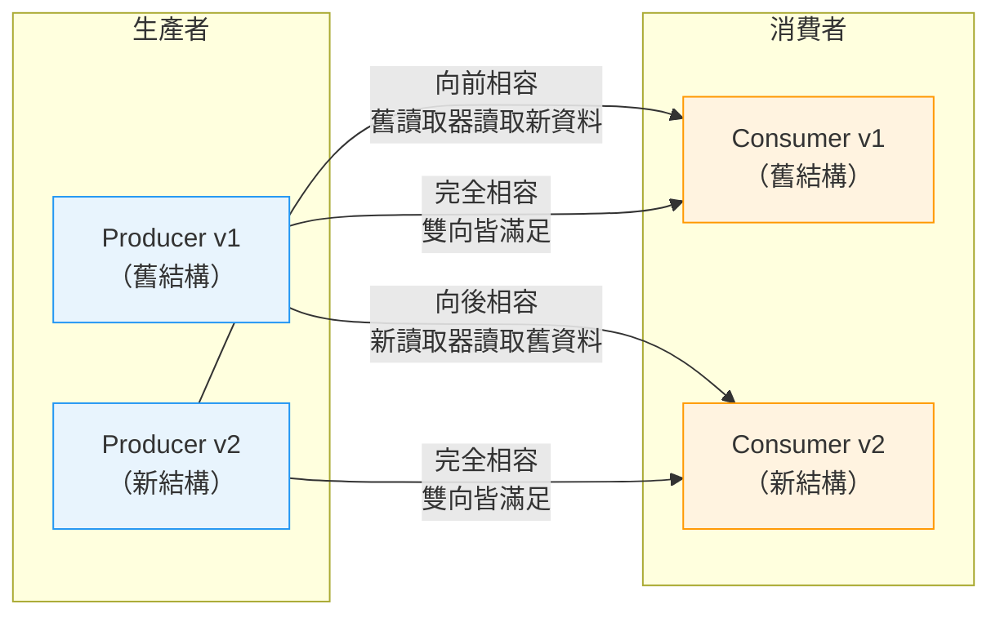

# [BEE-142] 結構演進與向後相容

:::info
設計能夠安全演進的結構。新增選填欄位；先棄用再移除；絕不在原地修改欄位型別或編號。
:::

## 背景

系統很少保持不變。業務需求改變、新功能持續新增、錯誤需要修正。描述訊息、API 負載與資料庫表格的資料結構也必須隨之演進。挑戰在於，在任何分散式系統中，資料的生產者與消費者不會在同一時刻更新。新版服務可能已開始寫入新格式的資料，而許多舊版消費者仍在運行中。若結構異動處理不當，舊版消費者將無法讀取新資料，或新版消費者將無法讀取尚未遷移的舊資料。

結構演進（Schema Evolution）是一門以受控方式進行這些變更的紀律，使系統在整個過渡期間都能正確運作。

**參考資料：**
- [Confluent: Schema Evolution and Compatibility](https://docs.confluent.io/platform/current/schema-registry/fundamentals/schema-evolution.html)
- [Earthly Blog: Protocol Buffers Best Practices for Backward and Forward Compatibility](https://earthly.dev/blog/backward-and-forward-compatibility/)
- [Creek Service: Evolving JSON Schemas — Part I](https://www.creekservice.org/articles/2024/01/08/json-schema-evolution-part-1.html)

## 原則

**每一次結構變更，在整個部署過渡期間，至少必須在一個方向上保持相容性。**

實務上這代表：

1. 優先採用向後相容的變更（新程式碼讀取舊資料）。
2. 若同時需要向前相容，只進行完全相容的變更。
3. 以審查 API 合約的相同嚴謹度審查結構變更，因為結構變更本身就是 API 合約的變更。

---

## 相容性定義

### 向後相容（Backward Compatibility）

新讀取器，舊資料。使用結構版本 N 的消費者能夠反序列化以結構版本 N-1 寫入的資料。

這是任何滾動部署的最低標準。消費者比生產者更早（或獨立地）更新，但傳輸中或儲存中的資料可能仍遵循舊格式。

### 向前相容（Forward Compatibility）

舊讀取器，新資料。使用結構版本 N-1 的消費者能夠反序列化以結構版本 N 寫入的資料。

當生產者先行更新，或同一資料流被無法同步更新的消費者讀取時（例如第三方整合、更新週期較慢的行動客戶端），此特性為必要條件。

### 完全相容（Full Compatibility）

雙向皆滿足。一項變更在同時滿足向後相容與向前相容時，稱為完全相容。

### 遞移相容（Transitive Compatibility）

更嚴格的變體：相容性檢查針對所有歷史版本，而非僅對照最近一個版本。對於消費者可能落後多個版本的長期事件串流，建議啟用遞移模式。

### 相容性矩陣



---

## 破壞性 vs. 非破壞性變更

### 非破壞性（安全）變更

| 變更 | 說明 |
|---|---|
| 新增含預設值的選填欄位 | 向後與向前皆相容 |
| 新增 enum 值（謹慎處理） | 僅向前相容；舊讀取器可能拒絕未知值 |
| 使用別名重新命名欄位 | 視結構格式而定；需要別名支援（Avro） |
| 放寬限制（必填 → 選填） | 對消費者安全；嚴格化則需分開處理 |
| 新增訊息型別或端點 | 不影響現有資料 |

### 破壞性變更

| 變更 | 破壞原因 |
|---|---|
| 未經棄用期直接移除欄位 | 舊消費者預期欄位存在；新資料卻省略了它 |
| 變更欄位型別（如 `string` → `integer`） | 傳輸格式或反序列化失敗 |
| 在無別名機制下直接重新命名欄位 | 以舊名稱存取的消費者收到 null 或報錯 |
| 將選填欄位改為必填 | 省略該欄位的舊生產者現在產生無效資料 |
| 變更欄位語義（同名，不同含義） | 靜默資料損毀；無格式錯誤，但業務邏輯出錯 |
| 重複使用已刪除的欄位編號（Protobuf） | 二進位解碼到錯誤的欄位 |

---

## 安全演進規則

### 規則一：只新增選填欄位

新增欄位時，一律標記為選填並提供預設值。接收舊資料的消費者會使用預設值；接收新資料的舊消費者會直接忽略該欄位（向前相容）。

```json
// v1 結構
{
  "type": "object",
  "properties": {
    "user_id": { "type": "string" },
    "email":   { "type": "string" }
  },
  "required": ["user_id", "email"]
}

// v2 結構 — 安全：新增含預設值的選填欄位
{
  "type": "object",
  "properties": {
    "user_id":      { "type": "string" },
    "email":        { "type": "string" },
    "display_name": { "type": "string", "default": "" }
  },
  "required": ["user_id", "email"]
}
```

### 規則二：先棄用再移除

絕不在單一步驟中移除欄位。遵循以下生命週期：

```
新增欄位 → 使用欄位 → 標記棄用 → 停止寫入 → 從結構中移除
   v1          v1-v2        v3           v4（過渡）     v5
```

過渡期必須足夠長，讓所有消費者完成更新並重新部署。對於內部服務，通常是一到兩個發布週期。對於公開 API 或具有持久儲存的事件串流，可能長達數個月。

### 規則三：絕不修改欄位型別

若業務需求改變使得欄位需要不同型別，請新增一個不同名稱的新欄位，並依照規則二棄用舊欄位。

```json
// 錯誤：原地修改型別，會破壞所有消費者
// "amount": { "type": "string" }  →  "amount": { "type": "number" }  ← 絕對禁止

// 正確：新增新欄位，棄用舊欄位
{
  "amount_str":   { "type": "string",  "deprecated": true },
  "amount_cents": { "type": "integer" }
}
```

### 規則四：絕不直接重新命名欄位

重新命名等同於刪除加新增。若必須重新命名，請使用別名機制（Avro aliases、Protobuf 欄位編號穩定性），或在過渡期間同時保留新舊名稱。

### 規則五：絕不將選填欄位改為必填

收緊限制是破壞性變更。若驗證需要更嚴格，請在應用層對新寫入強制執行；不要以會使現有資料無效的方式更新結構限制。

### 規則六：保留已移除的識別碼（Protobuf）

在 Protocol Buffers 中，移除欄位後，請將其編號和名稱標記為 `reserved`，以防止意外重複使用。

```protobuf
message Order {
  reserved 3, 5;
  reserved "legacy_amount", "discount_code";

  string order_id = 1;
  int64  amount_cents = 2;
  string currency = 4;
}
```

---

## 各格式如何處理演進

### Protocol Buffers

Protobuf 以整數欄位編號而非名稱識別欄位，天生具備強大的演進支援：

- 欄位編號是永久的。絕不重新編號欄位。
- 使用新編號新增欄位永遠安全。
- 移除欄位後：標記為 `reserved` 以防止重複使用。
- 欄位名稱可自由重新命名（相同編號在二進位中代表相同欄位）。
- 變更 wire type（如 `int32` 改為 `string`）是硬性破壞。
- proto3 預設保留未知欄位，支援向前相容。

### Avro

Avro 在讀取時透過匹配 writer schema 與 reader schema 的欄位名稱來解析結構。關鍵規則：

- 新增含預設值的欄位是向後相容的（讀取器為缺少該欄位的舊資料補充預設值）。
- 移除欄位僅在欄位具有預設值時才是向前相容的（讀取器在讀取包含該欄位的新資料時忽略它）。
- 可空安全性：使用聯合型別 `["null", "string"]` 並設定預設值 `null`，以完全相容的方式支援新增與移除。
- 重新命名需要在結構中新增 `aliases` 條目，讓解析器能夠匹配舊名稱。

### JSON / REST API

JSON 在傳輸層沒有內建的結構強制機制，需要額外的紀律：

- 舊版 JSON 消費者通常會忽略未知欄位（依慣例向前相容，而非規格保證）。
- 向後相容要求新版消費者能優雅地處理缺少的欄位——除非原始規格保證欄位一定存在，否則不要假設它永遠出現。
- 使用 JSON Schema 或 OpenAPI 正式描述並驗證合約。
- 維護 `$schema` 或版本標頭，讓消費者能夠偵測結構版本。

---

## API 合約演進

REST API 回應遵循與任何結構相同的相容性規則。JSON 回應就是與每個呼叫該端點的客戶端所簽訂的結構合約。

**安全變更——新增欄位：**

```json
// v1 回應
{ "id": "u123", "name": "Alice" }

// v2 回應 — 安全：新增欄位
{ "id": "u123", "name": "Alice", "avatar_url": "https://cdn.example.com/u123.jpg" }
```

舊客戶端忽略 `avatar_url`。這是向後相容的。

**不安全變更——移除欄位：**

```json
// v2 回應 — 不安全：未經棄用直接移除欄位
{ "id": "u123", "avatar_url": "https://cdn.example.com/u123.jpg" }
```

讀取 `name` 的舊客戶端現在收到 `null` 或反序列化錯誤。

**安全移除流程：**

1. 在 API 變更日誌和回應中宣告棄用（新增 `deprecated_fields` 元資料提示或 HTTP `Deprecation` 標頭）。
2. 繼續寫入該欄位至少一個主要版本或已定義的下線日期。
3. 監控消費者使用情況，確認所有客戶端已完成遷移。
4. 僅在下線日期過後才移除該欄位。

當結構演進已不足夠而必須進行版本切換時，請參閱 BEE-71（API 版本控制）。

---

## 資料庫結構演進

資料庫結構有額外的限制：資料是持久的，無法透過修正後的結構「重新傳送」。

最佳實踐：
- 所有結構變更必須透過遷移腳本套用（參見 BEE-126）。
- 在設定必填前，先新增具資料庫層級預設值的可空欄位。
- 移除欄位時，不要在同一次遷移中同時移除應用程式的參考程式碼——先部署應用程式變更，確認沒有活躍查詢參考該欄位後，再等待期過後刪除欄位。
- 重新命名採多步驟流程：新增新欄位、回填資料、更新應用程式程式碼、棄用舊欄位、等待期後刪除。

---

## 常見錯誤

**1. 未經棄用期直接移除欄位**

最常見的破壞模式。欄位在停止寫入的同一個 PR 中被刪除。依賴它的消費者在部署後立即中斷。

**2. 修改欄位型別**

`string` 改 `integer`、`integer` 改 `boolean`、`object` 改 `array`——全是破壞性變更。即使語義意圖相同，二進位編碼或 JSON 反序列化也會失敗或靜默損毀資料。

**3. 將選填欄位改為必填**

看似收緊合約，但現有資料和現有生產者可能未提供該欄位。驗證失敗在執行期才出現，而非在結構設計時被發現。

**4. 不對內部服務結構進行版本控制**

團隊往往將內部 gRPC 或 Kafka 結構視為非正式合約。但當內部結構破壞時，其破壞性不亞於公開 API 的中斷——更甚者，因為沒有版本標頭可協助消費者偵測不匹配。

**5. 假設所有消費者同步更新**

現實中，金絲雀部署、行動應用發布週期和第三方整合意味著多個結構版本可能共存數天乃至數個月。將每一次結構變更設計為能夠存活於這個重疊視窗。

---

## 上線前檢查清單

合併結構變更前：

- [ ] 變更是否僅為新增（只有新的選填欄位，無移除或型別變更）？
- [ ] 新欄位是否有明確的預設值？
- [ ] 若移除欄位，是否已棄用至少一個完整的發布週期？
- [ ] 在 Protobuf 中，已移除的欄位編號和名稱是否已標記為 `reserved`？
- [ ] 在 Avro 中，新欄位是否有設定 `default`？
- [ ] 是否已在結構登錄（Schema Registry）中驗證相容性類型（如適用）？
- [ ] 所有活躍消費者是否已知，且能夠處理此變更？
- [ ] 若部署後偵測到不相容變更，是否有回滾計畫？

---

## 相關 BEE

- **BEE-71** — API 版本控制：當結構演進已不足夠而需要進行版本切換時
- **BEE-126** — 資料庫遷移：安全地對持久儲存套用結構變更
- **BEE-143** — 編碼格式：在 Protobuf、Avro、JSON 和 MessagePack 之間做選擇
