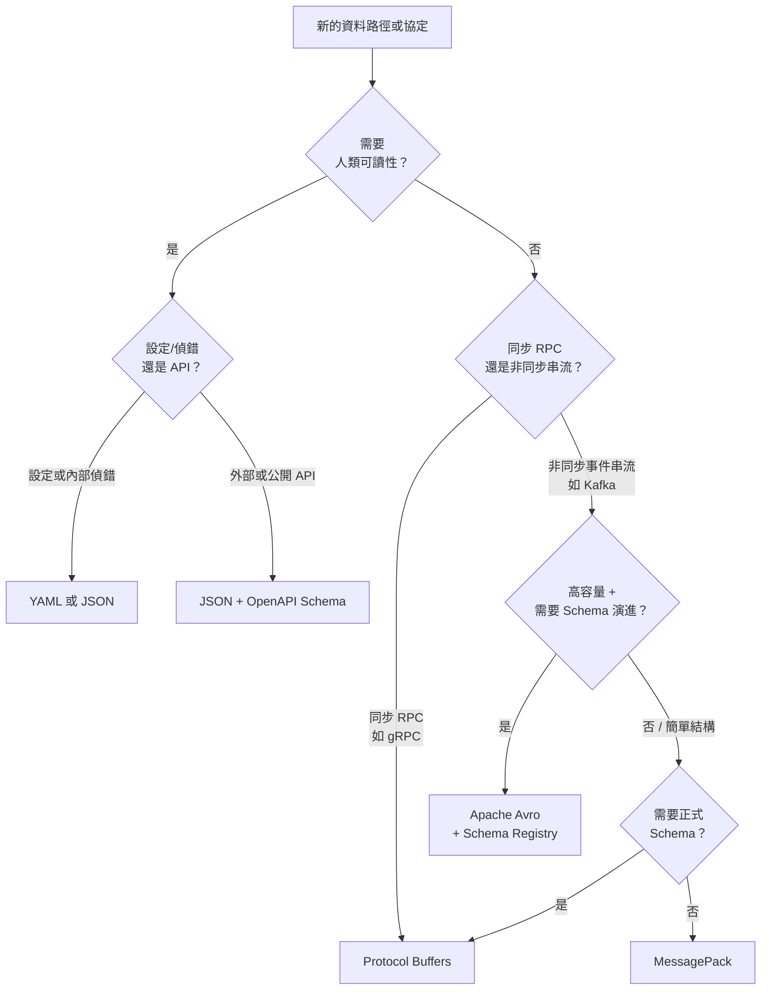

# [BEE-143] 編碼與序列化格式

:::info
根據資料的消費者、吞吐量需求及 Schema 演進要求來選擇編碼格式。JSON 用於公開 API 與人類可讀的設定；Protobuf 用於高效能 RPC；Avro 用於需要 Schema 演進的事件串流；MessagePack 用於需要二進位壓縮但不需 Schema 額外負擔的情境。
:::

## 背景

每當服務將資料寫入磁碟、透過網路傳送訊息，或將事件發布至佇列時，都必須決定如何對資料進行編碼。編碼格式決定了 wire 大小、序列化速度、Schema 強制性、可偵錯性，以及最關鍵的——格式隨著需求變化而安全演進的能力。

大多數團隊預設在所有地方使用 JSON，因為它熟悉且易於偵錯。這對於公開 API 和設定確實運作良好，但在規模上會帶來實際成本：JSON 相當冗長、需要剖析文字，且沒有原生的 Schema 強制機制。相反地，到處採用二進位格式的團隊，有時會因為 Payload 難以偵錯而造成問題，同時也讓外部消費者難以上手。

這個決策並非一刀切。理解每種格式的取捨——並擁有選擇格式的原則性框架——能有效避免這兩類錯誤。

**參考資料：**
- [Protocol Buffers 編碼文件](https://protobuf.dev/programming-guides/encoding/)
- [Apache Avro 規格書](https://avro.apache.org/docs/1.11.1/specification/)
- [DDIA 第 4 章 — 編碼與演進（O'Reilly）](https://www.oreilly.com/library/view/designing-data-intensive-applications/9781491903063/ch04.html)
- [MessagePack 規格書](https://msgpack.org/)

## 原則

**根據溝通邊界、吞吐量需求，以及特定資料路徑的 Schema 演進模型來選擇適當的編碼格式。**

實務上這意味著：

1. 在外部 API 邊界使用 JSON，因為可讀性與工具相容性至關重要。
2. 在內部同步 RPC（gRPC）使用 Protocol Buffers，以獲得吞吐量與強型別 Schema 合約。
3. 在非同步事件串流使用 Avro，同時滿足高容量下的 Schema 演進與壓縮需求。
4. 只在需要二進位壓縮且已有完整理解的結構、不需要正式 Schema 的情況下使用 MessagePack。
5. 不得在同一個邊界混用多種格式，除非有文件記錄原因並提供轉換工具。

---

## 格式分類

### 文字格式

文字格式具有人類可讀性，無需工具即可檢視。它們是外部 API、設定檔和偵錯的預設選擇。

| 格式 | Schema | 典型大小 | 備註 |
|------|--------|---------|------|
| JSON | 選用（JSON Schema / OpenAPI） | 基準值 | 應用廣泛；不支援原生二進位 |
| XML  | 選用（XSD） | ~JSON 的 2 倍 | 冗長；常見於傳統企業整合 |
| YAML | 選用 | ~JSON 的 1 倍 | 廣泛用於設定；解析規則存在歧義 |

文字格式的主要限制：
- **冗長**：欄位名稱在每則訊息中重複出現。
- **解析成本**：每次讀取都需要將文字 Tokenize 並轉換為原生型別。
- **沒有原生型別安全**：文件宣告為 `integer` 的欄位可能靜默地以字串形式傳送。
- **Schema 強制為選配**：除非明確加入驗證中介層，否則無法防止 Producer 省略必填欄位。

### 二進位格式

二進位格式將資料編碼為緊湊的位元組序列。欄位名稱或型別資訊要麼完全不存在於 Payload 中（Protobuf、Avro），要麼以緊湊方式編碼（MessagePack）。結果是訊息更小、序列化/反序列化更快，但代價是犧牲可讀性。

| 格式 | 需要 Schema | 自描述 | 典型大小 vs JSON | 備註 |
|------|------------|--------|-----------------|------|
| Protocol Buffers | 是（`.proto`） | 否 | ~小 3–10 倍 | Wire 格式使用欄位編號；具備強大演進規則 |
| Apache Avro | 是（`.avsc` JSON） | 否（Schema 嵌入於檔案/Registry） | ~小 2.5–4 倍 | 讀取時解析 Schema；優秀的演進支援 |
| Apache Thrift | 是（`.thrift` IDL） | 否 | ~小 2–4 倍 | 類似 Protobuf；新系統中較少採用 |
| MessagePack | 否 | 是 | ~小 1.5–2 倍 | 二進位版 JSON；值包含型別標籤；無 Schema |

---

## 格式深度介紹

### JSON

JSON 將每個值編碼為鍵值對，且欄位名稱出現在每則訊息中。這種自描述特性是它最大的優點：任何消費者無需 Schema 即可透過查看 Key 來讀取資料。

優點：
- 無需工具即可閱讀。
- 瀏覽器與 HTTP 生態系統的原生支援。
- 豐富的工具：Linter、驗證器、OpenAPI 產生器。
- 開發期間易於新增臨時欄位。

缺點：
- 欄位名稱在每個 Payload 中重複，在規模上顯著增加大小。
- 不支援原生二進位資料（Base64 編碼會增加約 33% 的負擔）。
- 沒有內建的 Schema 驗證；必須從外部強制執行紀律。
- 在高吞吐量下，解析的 CPU 消耗相比二進位格式更為密集。

**何時使用 JSON：** 外部 REST API、Webhook Payload、設定檔、日誌行，以及任何人類或不熟悉的工具可能需要讀取資料的情境。

---

### Protocol Buffers（Protobuf）

Protobuf 使用緊湊的整數欄位編號和 Wire 型別來表示每個欄位。欄位名稱不出現在編碼後的位元組中——需要 Schema（`.proto` 檔案）才能解讀 Payload。數字使用可變長度整數（varint）編碼，較小的數字佔用較少位元組。

```protobuf
// Proto3 的 User Schema
syntax = "proto3";

message User {
  string name  = 1;
  int32  age   = 2;
  string email = 3;
}
```

對於下方範例 Payload，編碼後的二進位約為 33 位元組，相比緊湊 JSON 的 55 位元組。

優點：
- 緊湊的 Wire 格式；Varint 能有效壓縮小整數。
- Schema 強制；在大多數語言中可產生程式碼。
- 強大的 Schema 演進：欄位以編號識別，而非名稱。
- gRPC 的第一級支援。

缺點：
- 不可讀；需要工具（如 `protoc`、grpcurl）才能檢視。
- Schema 必須在帶外共享（IDL 檔案或 Schema Registry）。
- 對動態或無 Schema 存取模式的支援有限。

**何時使用 Protobuf：** 內部 gRPC 服務、效能關鍵的內部 API、任何雙方都控制 Schema 的同步 RPC 路徑。請參閱 [BEE-74](74.md)。

---

### Apache Avro

Avro 使用 JSON 定義的 Schema，但以緊湊的二進位格式編碼資料，且完全省略欄位名稱。由於二進位只包含按 Schema 定義順序排列的值，讀取方必須能存取 Writer 的 Schema 才能正確解碼。Avro 在讀取時透過逐欄比對 Writer Schema 和 Reader Schema 來解析 Schema 差異。

```json
{
  "type": "record",
  "name": "User",
  "fields": [
    { "name": "name",  "type": "string" },
    { "name": "age",   "type": "int" },
    { "name": "email", "type": "string" }
  ]
}
```

相同的範例 Payload 編碼後約為 32 位元組——是常見格式中最緊湊的。

主要設計特點：Schema 演進是一等公民。新增帶有預設值的欄位具有向後相容性；讀取方在讀取缺少該欄位的舊資料時會使用預設值。移除帶有預設值的欄位具有向前相容性；舊讀取方在讀取包含該欄位的新資料時會略過該欄位。

優點：
- 對典型結構化資料最緊湊的二進位編碼。
- 設計上支援 Schema 演進；Writer/Reader Schema 解析內建其中。
- Schema 可與資料一同儲存（Avro 容器格式）或存放在 Schema Registry 中。
- 非常適合 Kafka 和其他事件串流平台。

缺點：
- 動態 Schema 解析在啟動時有額外負擔（Schema 比較）。
- 需要 Schema Registry 或嵌入的 Schema 才能跨服務解碼。
- JVM/資料工程生態系統之外較不常見。

**何時使用 Avro：** Kafka Topic、資料管線事件、批次資料格式（Hadoop、Spark），以及任何 Schema 演進和儲存效率都至關重要的高容量非同步串流。請參閱 [BEE-220](220.md)。

---

### MessagePack

MessagePack 是 JSON 資料模型的二進位編碼。它保留了 JSON 的自描述結構（每個值的型別標籤、物件中的 Key 名稱），但以緊湊的二進位表示取代了文字。不需要 Schema。

優點：
- 不需要 Schema；在許多情況下可直接替換 JSON。
- 比等效 JSON 小約 1.5–2 倍。
- 序列化/反序列化比 JSON 文字解析更快。
- 良好的跨語言支援。

缺點：
- 每則訊息仍包含欄位名稱（與 Protobuf/Avro 不同）。
- 沒有 Schema 意味著沒有編譯期型別檢查或正式的演進規則。
- 不如基於 Schema 的二進位格式緊湊。
- 偵錯需要支援 MessagePack 的工具。

**何時使用 MessagePack：** 內部快取（Redis 值）、Session 儲存，以及任何需要二進位壓縮、依賴慣例而非正式 Schema，且 Protobuf/Avro 的額外負擔不合理的情境。

---

## 實作範例：相同資料，四種編碼

考慮一個 `User` 物件：`name = "Alice"`、`age = 30`、`email = "alice@example.com"`。

### JSON（55 位元組，緊湊格式）

```json
{"name":"Alice","age":30,"email":"alice@example.com"}
```

欄位名稱 `name`、`age`、`email` 存在於 Payload 中。任何消費者無需外部 Schema 即可讀取。

### Protocol Buffers Schema 與 Wire 大小（約 33 位元組）

```protobuf
syntax = "proto3";
message User {
  string name  = 1;   // tag 0x0A
  int32  age   = 2;   // tag 0x10
  string email = 3;   // tag 0x1A
}
```

編碼後的 Payload 只包含：tag+length+`Alice`、tag+varint(30)、tag+length+`alice@example.com`。欄位名稱不存在。解碼需要 Schema 檔案。

### Avro Schema 與 Wire 大小（約 32 位元組）

```json
{
  "type": "record",
  "name": "User",
  "fields": [
    { "name": "name",  "type": "string" },
    { "name": "age",   "type": "int" },
    { "name": "email", "type": "string" }
  ]
}
```

二進位：長度前綴的 `Alice`、ZigZag 編碼的 30、長度前綴的 `alice@example.com`。完全沒有 Tag——值按 Schema 定義的順序排列。Writer 和 Reader 都必須擁有匹配（或相容）的 Schema。

### MessagePack（約 45 位元組）

不需要 Schema 定義。物件被編碼為包含 3 個條目的 fixmap；每個 Key 是緊湊的二進位字串（欄位名稱仍然存在）。值是型別標籤的整數和字串。

### 大小比較

| 格式 | 近似 Wire 大小 | 解碼需要 Schema |
|------|--------------|----------------|
| JSON | 55 位元組 | 否 |
| MessagePack | ~45 位元組 | 否 |
| Protobuf | ~33 位元組 | 是（`.proto`） |
| Avro | ~32 位元組 | 是（`.avsc` + Registry） |

這些數字隨訊息數量而擴大。以每秒 10,000 則訊息計算，僅對此 Payload 而言，JSON 與 Avro 之間的差異約為每個 Topic 每秒 230 KB。

---

## Schema 演進比較

| 屬性 | JSON | Protobuf | Avro | MessagePack |
|------|------|----------|------|-------------|
| 新增選填欄位 | 安全（慣例） | 安全（新欄位編號） | 安全（帶預設值） | 安全（慣例） |
| 移除欄位 | 安全（慣例） | 安全（標記 reserved） | 安全（帶預設值） | 安全（慣例） |
| 重新命名欄位 | 安全（慣例；會破壞消費者） | 安全（相同編號；名稱可自由更改） | 需要 `aliases` | 安全（慣例；會破壞消費者） |
| 更改欄位型別 | 破壞消費者 | 強制中斷（需要新欄位編號） | 強制中斷（除非是型別擴寬） | 破壞消費者 |
| 需要 Schema Registry | 建議 | 建議 | 必須（跨服務） | 否 |
| 演進正式化 | 否 | 是 | 是 | 否 |

無論選擇哪種格式，安全 Schema 演進的完整規則請參閱 [BEE-142](142.md)。

---

## 決策樹



---

## 常見錯誤

**1. 在高吞吐量內部通訊中使用 JSON**

JSON 不是高容量內部服務間呼叫的正確預設選擇。冗長的欄位名稱、文字解析成本，以及缺乏 Schema 強制機制三者結合，造成不必要的額外負擔。在每秒 50,000 個事件的情況下，從 JSON 切換到 Protobuf 或 Avro 通常可將 CPU 和頻寬使用量降低 60–80%。

**2. 在公開 API 中使用二進位格式**

二進位格式要求消費者在讀取單一位元組之前，必須擁有正確的 Schema 和工具。外部開發者、行動客戶端和第三方整合無法輕鬆使用 curl 或瀏覽器 DevTools 偵錯 Payload。請將二進位格式保留給您能控制雙端的內部或半內部路徑。

**3. 沒有為 JSON 定義 Schema**

「我們會在 README 中記錄欄位」不是一個 Schema。沒有正式的 JSON Schema 或 OpenAPI 合約，Producer 會在消費者不知情的情況下偏離，欄位型別會在沒有通知的情況下改變，而且沒有自動化的方式來驗證 Payload。請務必在 API 邊界正式定義和驗證 JSON 合約。

**4. 選擇格式時忽略 Schema 演進規則**

團隊經常因為格式的大小或速度特性而選擇它，卻到後來才發現他們的演進模型不相容。Avro 要求 Writer 和 Reader Schema 都已知且相容。Protobuf 欄位編號絕不能被重複使用。如果從第一天起就不遵守這些規則，演進就會中斷，遷移就會變得昂貴。

**5. 在沒有明確邊界的情況下混用格式**

在某些 Kafka Topic 使用 JSON 而其他使用 Avro，且沒有文件化政策的系統，會造成操作上的混亂。消費者必須檢視 Envelope Header 才能確定如何解碼，監控工具需要具備格式感知的解析器，新工程師的上手時間也會更長。為每種通訊類型建立明確的格式政策，並在程式碼審查中強制執行。

---

## 相關 BEE

- [BEE-74](74.md) — gRPC 與 Protocol Buffers：同步 RPC 情境中的 Protobuf
- [BEE-142](142.md) — Schema 演進與向後相容性：所有格式的安全變更規則
- [BEE-220](220.md) — 訊息傳遞與事件串流：Avro 作為 Kafka Topic 的標準格式
