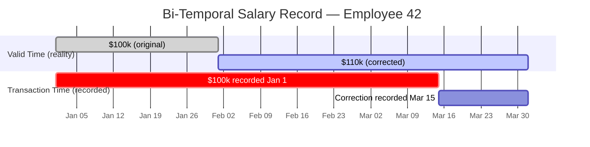

# [BEE-144] 時序與稽核資料設計

:::info
以附加寫入（append）而非覆蓋（overwrite）來記錄歷史。需同時追蹤「事實為真的時間」與「系統得知的時間」時，使用雙時態模型。所有時間戳記儲存為 UTC，依時間分區以提升效能，並在儲存空間無限膨脹之前執行保留政策。
:::

## 背景

大多數系統都需要某種形式的歷史記錄：誰修改了薪資、設定最後一次變更的時間、某個訂單在特定時刻的狀態為何。直覺的做法是用一個簡單的 `updated_at` 欄位，讓資料庫列反映「目前狀態」。但這種做法會悄悄地銷毀歷史——當你執行 `UPDATE employees SET salary = 120000` 的那一刻，之前的薪資就永久消失了。

這在三個面向上造成問題。第一，稽核與合規：主管機關和稽核人員需要可供查證的資料變更鏈。第二，除錯：「系統在週二表現異常」這類問題，若不知道週二的資料狀態，根本無從調查。第三，正確性：帳單、薪資和財務計算往往依賴於「某個特定歷史時刻的數值」，而非目前的值。

時序資料帶來另一個相關但不同的挑戰。感測器讀數、指標和事件日誌天生就是只附加寫入的——每筆量測都是新的事實，而非對舊有事實的取代。這類工作負載量大、以寫入為主，且幾乎總是以時間範圍過濾查詢。結構描述和儲存策略必須從一開始就圍繞這些存取模式設計。

**參考資料：**
- [Bitemporal History — Martin Fowler](https://martinfowler.com/articles/bitemporal-history.html)
- [Temporal Patterns — Martin Fowler](https://martinfowler.com/eaaDev/timeNarrative.html)
- [Event Sourcing Pattern — Microsoft Azure Architecture Center](https://learn.microsoft.com/en-us/azure/architecture/patterns/event-sourcing)
- [Database Design for Audit Logging — Red Gate](https://www.red-gate.com/blog/database-design-for-audit-logging/)
- [PostgreSQL Table Partitioning — Official Documentation](https://www.postgresql.org/docs/current/ddl-partitioning.html)

## 原則

**以資料來表示歷史，而非以覆蓋來更新。附加新事實；永不修改過去。**

具體而言：

1. 對任何需要進行時間點查詢的資料，使用只附加寫入的版本化列（含 `valid_from` / `valid_to`）。
2. 永不對可稽核記錄執行硬刪除；使用軟刪除（`deleted_at`）或移至封存資料表。
3. 所有時間戳記儲存為 UTC；僅在顯示層進行時區轉換。
4. 當修正歷史很重要時，採用雙時態模型：同時追蹤事實在現實中為真的時間（有效時間）與系統記錄該事實的時間（交易時間）。
5. 將事件溯源視為時態模式：每次狀態變更都是一筆新的事件記錄，當前狀態是由此衍生的投影。
6. 對時序資料表依時間分區，並定義保留政策；無限制地持續成長不是有效的設計。
7. 明確建立時間範圍欄位的索引；若沒有索引，時間點和範圍查詢將無法有效率地執行。

---

## 時態資料基礎

### 只附加寫入的版本化

保存歷史的核心技術是：每次變更時插入新列，而非更新現有列。每列都帶有 `valid_from` 時間戳記（事實成立的時間）和 `valid_to` 時間戳記（被取代的時間，當前列則為 `NULL`）。

```sql
-- 結構描述：員工薪資歷史
CREATE TABLE employee_salary_history (
  id            BIGSERIAL PRIMARY KEY,
  employee_id   BIGINT        NOT NULL,
  amount        NUMERIC(12,2) NOT NULL,
  currency      CHAR(3)       NOT NULL DEFAULT 'USD',
  valid_from    TIMESTAMPTZ   NOT NULL,
  valid_to      TIMESTAMPTZ,              -- NULL = 目前有效
  recorded_at   TIMESTAMPTZ   NOT NULL DEFAULT now(),
  recorded_by   TEXT          NOT NULL
);

-- 唯一性限制：每位員工同一時間只有一列有效記錄
CREATE UNIQUE INDEX uq_salary_current
  ON employee_salary_history (employee_id)
  WHERE valid_to IS NULL;
```

要套用薪資變更，關閉前一列並插入新列——永遠不要直接 `UPDATE` 金額：

```sql
BEGIN;

-- 關閉目前列
UPDATE employee_salary_history
   SET valid_to = '2025-03-01T00:00:00Z'
 WHERE employee_id = 42
   AND valid_to IS NULL;

-- 插入新版本
INSERT INTO employee_salary_history
       (employee_id, amount, currency, valid_from, valid_to, recorded_by)
VALUES (42, 105000.00, 'USD', '2025-03-01T00:00:00Z', NULL, 'hr-system');

COMMIT;
```

**查詢：特定日期的薪資為何？**

```sql
SELECT amount, currency, valid_from
  FROM employee_salary_history
 WHERE employee_id = 42
   AND valid_from  <= '2025-02-15T00:00:00Z'
   AND (valid_to IS NULL OR valid_to > '2025-02-15T00:00:00Z');
```

### 軟刪除

硬刪除會永久銷毀記錄。對任何屬於稽核軌跡的實體，應改用軟刪除：

```sql
ALTER TABLE employees ADD COLUMN deleted_at TIMESTAMPTZ;

-- 「刪除」
UPDATE employees
   SET deleted_at = now()
 WHERE id = 42;

-- 僅查詢有效記錄
SELECT * FROM employees WHERE deleted_at IS NULL;

-- 完整歷史，包含已刪除
SELECT * FROM employees;
```

記錄每次變更（包含最終刪除）的獨立 `employees_audit` 資料表是軟刪除的配套做法。軟刪除讓你能過濾有效記錄；稽核日誌則告訴你是誰刪除的、何時刪除的。

---

## 雙時態模型

### 兩個時間維度

Martin Fowler 的雙時態模型追蹤兩條獨立的時間軸：

- **有效時間（Valid time）** — 事實在現實中為真的時間（業務時間軸）。
- **交易時間（Transaction time）** — 事實被記錄到資料庫的時間（系統時間軸）。

當需要進行修正時，這個區別就很重要。假設薪資在 2 月 28 日以 $100,000 執行薪資計算。3 月 15 日，人資發現薪資自 2 月 1 日起應為 $110,000。系統需要記錄：

1. 原始登錄（當時記錄的）：$100,000，從 1 月 1 日起，系統於 1 月 1 日得知。
2. 修正內容：$110,000，自 2 月 1 日起有效，於 3 月 15 日記錄。

若沒有交易時間，就無法重建系統在 2 月 28 日執行薪資計算時所知的狀態。這項資訊在審計、對帳和爭議處理中不可或缺。



### 雙時態結構描述

```sql
CREATE TABLE employee_salary_bitemporal (
  id              BIGSERIAL PRIMARY KEY,
  employee_id     BIGINT        NOT NULL,
  amount          NUMERIC(12,2) NOT NULL,
  currency        CHAR(3)       NOT NULL DEFAULT 'USD',

  -- 有效時間：事實在現實世界中為真的時間
  valid_from      TIMESTAMPTZ   NOT NULL,
  valid_to        TIMESTAMPTZ,              -- NULL = 目前有效

  -- 交易時間：我們將此事實記錄到資料庫的時間
  recorded_at     TIMESTAMPTZ   NOT NULL DEFAULT now(),
  superseded_at   TIMESTAMPTZ,              -- NULL = 仍為我們目前的認知
  recorded_by     TEXT          NOT NULL
);
```

**查詢：以 3 月 14 日（修正前）的系統認知，2 月 28 日當時的薪資為何？**

```sql
SELECT amount, valid_from, valid_to
  FROM employee_salary_bitemporal
 WHERE employee_id   = 42
   -- 有效時間：2 月 28 日落在有效區間內
   AND valid_from   <= '2025-02-28T00:00:00Z'
   AND (valid_to IS NULL OR valid_to > '2025-02-28T00:00:00Z')
   -- 交易時間：以 3 月 14 日（修正前）為查詢基準
   AND recorded_at  <= '2025-03-14T23:59:59Z'
   AND (superseded_at IS NULL OR superseded_at > '2025-03-14T23:59:59Z');
```

**查詢：以目前已知的最新認知，2 月 1 日當時的薪資為何？**

```sql
SELECT amount, valid_from, valid_to
  FROM employee_salary_bitemporal
 WHERE employee_id   = 42
   AND valid_from   <= '2025-02-01T00:00:00Z'
   AND (valid_to IS NULL OR valid_to > '2025-02-01T00:00:00Z')
   AND superseded_at IS NULL;   -- 最新記錄的認知
```

---

## 稽核軌跡

### 最低稽核記錄欄位

每筆可稽核事件至少應記錄：

| 欄位 | 用途 |
|------|------|
| `entity_type` | 哪個資料表 / 領域物件發生變更 |
| `entity_id` | 被異動實體的主鍵 |
| `event_type` | `INSERT`、`UPDATE`、`DELETE` 或領域動詞 |
| `changed_by` | 執行變更的使用者或服務帳號 |
| `changed_at` | 變更的 UTC 時間戳記 |
| `before_state` | 變更前的列快照（JSONB） |
| `after_state` | 變更後的列快照（JSONB） |

```sql
CREATE TABLE audit_log (
  id           BIGSERIAL    PRIMARY KEY,
  entity_type  TEXT         NOT NULL,
  entity_id    TEXT         NOT NULL,
  event_type   TEXT         NOT NULL,
  changed_by   TEXT         NOT NULL,
  changed_at   TIMESTAMPTZ  NOT NULL DEFAULT now(),
  before_state JSONB,
  after_state  JSONB
);

-- 高流量系統依月份分區
CREATE INDEX idx_audit_entity ON audit_log (entity_type, entity_id, changed_at DESC);
CREATE INDEX idx_audit_time   ON audit_log (changed_at DESC);
```

### 強制不可變性

稽核日誌必須是只附加寫入的。應用程式層的約定是不夠的——必須在資料庫層強制執行：

```sql
-- 撤銷應用程式角色的 UPDATE 和 DELETE 權限
REVOKE UPDATE, DELETE ON audit_log FROM app_user;

-- 選用：以觸發器阻擋任何修改
CREATE OR REPLACE FUNCTION prevent_audit_modification()
RETURNS TRIGGER AS $$
BEGIN
  RAISE EXCEPTION 'audit_log rows are immutable';
END;
$$ LANGUAGE plpgsql;

CREATE TRIGGER trg_audit_immutable
  BEFORE UPDATE OR DELETE ON audit_log
  FOR EACH ROW EXECUTE FUNCTION prevent_audit_modification();
```

---

## 事件溯源作為時態模式

事件溯源將每次狀態變更記錄為不可變的事件。當前狀態從不直接儲存；它是透過從頭（或從快照）重播事件流來衍生的。這是最完整的時態資料形式——任何資訊都不會遺失。

```sql
-- 事件儲存資料表
CREATE TABLE order_events (
  event_id      BIGSERIAL    PRIMARY KEY,
  order_id      UUID         NOT NULL,
  event_type    TEXT         NOT NULL,   -- 'OrderPlaced', 'ItemAdded', 'OrderShipped'
  payload       JSONB        NOT NULL,
  occurred_at   TIMESTAMPTZ  NOT NULL DEFAULT now(),
  sequence_num  BIGINT       NOT NULL    -- 每個 order_id 單調遞增
);

CREATE UNIQUE INDEX uq_order_seq ON order_events (order_id, sequence_num);
CREATE INDEX idx_order_events_order ON order_events (order_id, sequence_num);
```

投影（當前狀態）維護在由事件流消費者更新的獨立資料表中。事件儲存本身永遠不會被修改。

事件溯源適合以歷史記錄為主要產出的領域（金融分類帳、合規系統、基於 CQRS 的微服務）。它帶來相當大的複雜性——完整重播時間、快照管理、投影一致性——不應輕率採用。詳見 BEE-223。

---

## 時序資料特性

時序資料（指標、感測器讀數、日誌）與一般關聯式資料在三個面向上有所不同：

1. **天生只附加寫入。** 讀數從不更新；它們是某個時刻不可變的事實。
2. **時間是主要查詢維度。** 幾乎每個查詢都以時間範圍進行過濾或分組。
3. **高流量且具有可預期的保留期限。** 資料持續累積，通常具有明確定義的使用壽命。

### 依時間分區

對時序資料表在時間戳記欄位上進行範圍分區是標準做法：

```sql
-- 父資料表
CREATE TABLE metrics (
  id          BIGSERIAL,
  service     TEXT        NOT NULL,
  metric_name TEXT        NOT NULL,
  value       DOUBLE PRECISION NOT NULL,
  recorded_at TIMESTAMPTZ NOT NULL
) PARTITION BY RANGE (recorded_at);

-- 月份分區
CREATE TABLE metrics_2025_01
  PARTITION OF metrics
  FOR VALUES FROM ('2025-01-01') TO ('2025-02-01');

CREATE TABLE metrics_2025_02
  PARTITION OF metrics
  FOR VALUES FROM ('2025-02-01') TO ('2025-03-01');
```

分區粒度應配合查詢模式和保留窗口：
- 日分區：非常高的寫入量（每日 >1000 萬列），或保留窗口小於一天。
- 週分區：中等流量，適合滾動 30/90 天的窗口。
- 月分區：較低流量，長期保留（1–3 年）。

當 `WHERE` 子句以分區鍵進行過濾時，PostgreSQL 的分區剪枝（partition pruning）將完全跳過無關的分區。只有當查詢一律包含時間戳記欄位的過濾條件時，這個效果才有用。

使用 `pg_partman` 或同等工具自動建立未來分區，並在保留政策執行時自動刪除過期分區。

### 時序資料的索引

```sql
-- 最常見查詢模式的覆蓋索引
CREATE INDEX idx_metrics_service_time
  ON metrics (service, metric_name, recorded_at DESC)
  INCLUDE (value);

-- 不帶 service 過濾的聚合查詢
CREATE INDEX idx_metrics_time
  ON metrics (recorded_at DESC);
```

若時間欄位沒有明確的索引，在大型分區上的範圍掃描將會是循序掃描。詳見 BEE-121。

---

## 保留政策

無限期保留是設計缺陷。每個時態或時序資料表都必須在設計階段就明確定義保留政策：

| 資料類型 | 典型保留期限 | 執行機制 |
|----------|------------|---------|
| 稽核日誌（合規） | 7 年 | 封存至冷儲存；不刪除 |
| 稽核日誌（維運） | 90 天 | 刪除舊分區 |
| 時序指標 | 熱儲存 30–90 天，冷儲存 1 年 | 分區刪除 + 物件儲存分層 |
| 軟刪除記錄 | 30 天 | 排程的硬刪除作業 |
| 事件儲存 | 無限期（含快照） | 快照與壓縮；永不截斷 |

保留政策的執行應透過排程的資料庫作業來實施，而非應用程式邏輯——應用程式邏輯在部署或中斷期間可能被跳過。

```sql
-- 刪除超過 90 天的分區（透過 pg_cron 或外部排程器執行）
DO $$
DECLARE
  partition_name TEXT;
BEGIN
  FOR partition_name IN
    SELECT child.relname
      FROM pg_inherits
      JOIN pg_class parent ON pg_inherits.inhparent = parent.oid
      JOIN pg_class child  ON pg_inherits.inhrelid  = child.oid
     WHERE parent.relname = 'metrics'
       AND child.relname  < 'metrics_' || to_char(now() - interval '90 days', 'YYYY_MM')
  LOOP
    EXECUTE format('DROP TABLE %I', partition_name);
  END LOOP;
END;
$$;
```

---

## 常見錯誤

**1. 對歷史資料使用 UPDATE 而非附加寫入**

執行 `UPDATE employees SET salary = 120000 WHERE id = 42` 會永久銷毀之前的薪資。之後再也無法回答「Alice 在一月的薪資是多少？」從一開始就使用帶有 `valid_from`/`valid_to` 的版本化列進行設計。事後將時態歷史改造到以可變列設計的系統中代價高昂。

**2. 對可稽核記錄執行硬刪除**

`DELETE FROM orders WHERE id = 99` 會移除訂單存在的所有證據。若客戶對費用提出異議或主管機關要求查閱交易記錄，資料就永遠消失了。使用軟刪除和獨立的稽核日誌。僅對明確有理由執行硬刪除的資料表，才授予應用程式角色 `DELETE` 權限。

**3. 未處理時區——使用不含時區的時間戳記**

以 `TIMESTAMP WITHOUT TIME ZONE`（或本地時間字串）儲存時間戳記，會導致歷史查詢在日光節約時間轉換和時區邊界上產生歧義。所有時間戳記應使用 `TIMESTAMPTZ`（標準化為 UTC），僅在展示層進行顯示時區轉換。這對 `valid_from`/`valid_to` 欄位尤為關鍵——相差一小時的錯誤會產生不正確的時間點查詢結果。

**4. 無限期保留**

在每個資料表加上 `recorded_at TIMESTAMPTZ DEFAULT now()` 卻沒有對應的保留政策，意味著儲存空間將永無止境地增長。每秒寫入 10,000 列的指標資料表，每天會累積 8.64 億列。在結構描述設計階段就定義保留窗口，而不是等到資料庫磁碟告警之後才處理。

**5. 時間範圍欄位沒有索引**

時態查詢幾乎都是範圍查詢：`WHERE recorded_at BETWEEN '2025-01-01' AND '2025-01-31'`。若時間欄位上沒有索引，每個查詢都是循序掃描。對於已分區的資料表，確保在每個分區上都有定義索引（或在父資料表上定義，PostgreSQL 會自動傳播至子分區）。詳見 BEE-121。

---

## 相關 BEE

- **BEE-121** — 索引策略：時間範圍查詢的索引建立與覆蓋索引
- **BEE-123** — 依時間分區：分區粒度與管理的詳細指引
- **BEE-223** — 事件溯源：完整的事件溯源架構與投影模式
