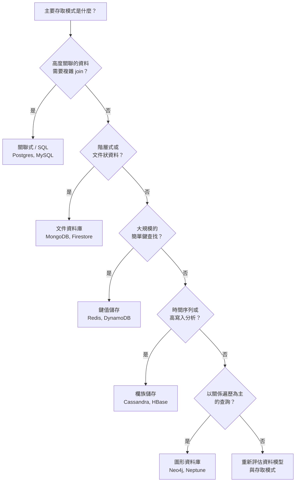

# [BEE-120] SQL vs NoSQL 的權衡

:::info
關聯式、文件、鍵值、欄族、圖形 — 根據資料形狀與存取模式選擇，而非流行趨勢。
:::

## 背景

每個應用程式都需要儲存資料，而資料庫的選擇會影響後續所有事項：查詢複雜度、一致性保證、維運負擔，以及資料模型與問題領域的契合程度。「NoSQL」一詞（源自 2009 年一場開源分散式資料庫聚會的 Twitter 標籤）涵蓋了廣泛的系統，這些系統以犧牲部分關聯式保證，換取結構彈性、水平擴展能力或特化的存取模式。

Martin Kleppmann 的 *Designing Data-Intensive Applications*（DDIA，第 2 章）與 Pramod Sadalage & Martin Fowler 的 *NoSQL Distilled* 的核心洞察是：沒有任何一種資料庫類型在所有情況下都是最佳選擇。每個資料庫家族都在特定的資料形狀上表現出色，真實系統越來越多地同時使用多種資料庫類型，這種做法稱為**多語言持久化（polyglot persistence）**。

**參考資料：**
- [DDIA Chapter 2 — Data Models and Query Languages](https://www.oreilly.com/library/view/designing-data-intensive-applications/9781491903063/ch02.html)
- [Martin Fowler: NoSQL Distilled](https://martinfowler.com/books/nosql.html)
- [AWS: MongoDB vs PostgreSQL](https://aws.amazon.com/compare/the-difference-between-mongodb-and-postgresql/)
- [Bytebase: Postgres vs MongoDB — a Complete Comparison](https://www.bytebase.com/blog/postgres-vs-mongodb/)

---

:::tip Deep Dive
For database-level implementation details on relational vs non-relational design, see [DEE-14: Relational vs Non-Relational](https://alivedise.github.io/database-engineering-essentials/12).
:::

---

## 原則

**根據資料模型與存取模式選擇資料庫，而非根據流行趨勢或個人熟悉度。**

選擇依據：
1. 資料的自然形狀（表格式、階層式、圖形、時間序列）。
2. 最常執行的查詢（複雜 join、鍵值查找、圖形遍歷、聚合）。
3. 一致性與持久性需求（ACID 交易 vs 最終一致性）。
4. 擴展需求與團隊的維運成熟度。

---

## 資料庫家族

### 關聯式資料庫（SQL）

關聯式資料庫（PostgreSQL、MySQL、Oracle、SQL Server）將資料儲存在透過外鍵關聯的正規化資料表中。它們在寫入時強制執行結構描述，並提供跨多張資料表的 ACID 交易。

**優勢：**
- ACID 交易 — 跨任意資料列與資料表的原子性、一致性、隔離性、持久性。
- 強大的 JOIN 語義 — 不需重複資料即可跨正規化資料表查詢。
- 結構描述強制執行，在邊界處攔截錯誤資料。
- 數十年的工具成熟度：遷移、備份、監控、複寫、ORM。
- SQL 是通用且廣為人知的查詢語言。

**弱點：**
- 結構描述變更需要遷移，在大型資料表上代價高昂。
- 物件-關聯式阻抗不匹配：階層式應用程式物件必須被「切碎」成多張資料表（DDIA 第 2 章）。
- 垂直擴展有上限；水平分片可行但增加複雜度（參見 BEE-123）。

**選用 SQL 的時機：** 資料具有天然的多對多關聯性、需要跨多列/多表的交易，或合規要求強一致性。

---

### 文件資料庫

文件資料庫（MongoDB、CouchDB、Firestore）儲存自包含的 JSON/BSON 文件。相關資料通常嵌入在文件中，而非跨資料表正規化。

**優勢：**
- 結構彈性 — 同一個集合中的文件可以有不同欄位（讀取時驗證結構描述）。
- 資料局部性 — 載入一份文件即可一次讀取所有嵌入的子物件。
- 非常適合階層式或樹狀資料。
- 初期迭代更容易；新增欄位不需要遷移。

**弱點：**
- 對 join 的支援薄弱。多對多關係需要應用層 join 或反正規化。
- 反正規化導致資料重複；更新必須觸及多份文件。
- 跨多個文件的交易在某些系統中有支援（MongoDB 4.0+），但有額外開銷。

**選用文件資料庫的時機：** 資料呈現樹狀的一對多關係，你每次都整棵樹一起載入，且頂層實體（例如含留言的部落格文章）是一個自然的聚合邊界。

---

### 鍵值儲存

鍵值資料庫（Redis、純 KV 模式的 DynamoDB、Memcached）儲存透過單一主鍵存取的不透明值。

**優勢：**
- 極快的讀寫 — O(1) 鍵查找。
- 簡單的心智模型；容易水平擴展。
- 非常適合快取、會話、頻率限制、功能旗標。

**弱點：**
- 純粹形式下沒有二級索引；以鍵以外的任何條件查詢需要全表掃描。
- 值對資料庫來說是不透明的 blob — 無法在伺服器端過濾。
- 交易支援有限。

**選用鍵值儲存的時機：** 存取幾乎都是高吞吐量的單鍵查找，或作為主資料庫前的快取層。

---

### 欄族儲存

欄族資料庫（Apache Cassandra、HBase、Google Bigtable）以寬列儲存資料，每列的欄可以不同。它們針對高吞吐量循序寫入與時間序列模式進行了最佳化。

**優勢：**
- 極高的寫入吞吐量 — 追加至不可變日誌。
- 資料在節點間自然分區與複製。
- 對排序列鍵的範圍掃描效率高（例如 `(user_id, timestamp)` 的時間序列）。

**弱點：**
- 查詢彈性嚴重受限；資料必須圍繞計畫執行的查詢來建模。
- 不支援 JOIN；反正規化是必要的。
- 許多配置下預設為最終一致性。

**選用欄族儲存的時機：** 高量寫入工作負載、時間序列資料，或查詢模式可預測且存取模式預先設計好的追加式事件日誌。

---

### 圖形資料庫

圖形資料庫（Neo4j、Amazon Neptune、ArangoDB）將資料建模為節點與邊。它們針對遍歷最佳化：「找出所有在同一家公司工作的朋友的朋友。」

**優勢：**
- 關係遍歷是一等運算 — 不需要代價高昂的 JOIN 鏈。
- 天然適合社群網路、推薦引擎、詐欺偵測和知識圖譜。
- 即使遍歷深度增加，查詢效能仍維持穩定。

**弱點：**
- 不適合聚合/大批次資料操作。
- 比關聯式資料庫生態系更小，維運選項更少。
- 除非關係遍歷是核心存取模式，否則大材小用。

**選用圖形資料庫的時機：** 主要查詢是「遍歷 N 層關係」，例如社群圖、相依性圖或存取控制階層。

---

## 決策樹



---

## 具體範例：用戶與訂單

同一個領域以兩種方式建模，清楚呈現核心取捨。

### 關聯式模型（正規化）

```sql
-- 兩張資料表，以外鍵關聯
CREATE TABLE users (
  id         SERIAL PRIMARY KEY,
  name       TEXT NOT NULL,
  email      TEXT UNIQUE NOT NULL
);

CREATE TABLE orders (
  id         SERIAL PRIMARY KEY,
  user_id    INTEGER REFERENCES users(id),
  total      NUMERIC(10,2),
  created_at TIMESTAMPTZ DEFAULT now()
);

-- 查詢：取得用戶及其最近 10 筆訂單
SELECT u.name, u.email, o.id, o.total, o.created_at
FROM   users u
JOIN   orders o ON o.user_id = u.id
WHERE  u.id = 42
ORDER  BY o.created_at DESC
LIMIT  10;
```

**取捨：** 資料不重複。在 `users` 新增欄位不需更動 `orders`。多列交易輕而易舉。但每個同時涉及兩張表的查詢都需要 JOIN。

### 文件模型（嵌入）

```json
// "users" 集合中的單一文件
{
  "_id": "usr_42",
  "name": "Alice",
  "email": "alice@example.com",
  "orders": [
    { "id": "ord_1", "total": 49.99, "created_at": "2025-03-01T10:00:00Z" },
    { "id": "ord_2", "total": 120.00, "created_at": "2025-03-15T14:30:00Z" }
  ]
}
```

```js
// 查詢：取得用戶及其最近 10 筆訂單 — 不需要 join
db.users.findOne(
  { _id: "usr_42" },
  { name: 1, email: 1, orders: { $slice: -10 } }
);
```

**取捨：** 單次往返，不需要 join。但如果 `orders` 也需要獨立查詢（例如「所有用戶中超過 $100 的訂單」），嵌入式模型就會很困難。共用訂單資料的更新必須觸及每份父文件。

**經驗法則：** 當你總是同時載入父項與子項，且子項資料為父項獨有時，使用嵌入。當子項有獨立的識別碼或在多個父項間共用時，使用參照（正規化）。

---

## 多語言持久化

真實的生產系統很少只用一種資料庫。一個成熟的架構可能結合：

| 儲存 | 職責 |
|---|---|
| PostgreSQL | 用戶、帳戶、帳單的資料真相（需要 ACID） |
| MongoDB | 內容管理、具有彈性結構的目錄資料 |
| Redis | 會話快取、頻率限制、即時排行榜 |
| Cassandra | 事件日誌、點擊流資料、IoT 遙測 |
| Neo4j | 推薦引擎、社群圖 |

多語言持久化的關鍵紀律是定義清晰的**聚合邊界** — 哪個系統擁有哪部分資料 — 並透過事件或背景作業跨儲存同步，而非跨資料庫 join。

---

## 常見錯誤

**1. 因為「SQL 無法擴展」而選擇 NoSQL**

SQL 資料庫確實可以擴展 — PostgreSQL 透過適當的索引、讀取副本和連線池可處理每秒數百萬次查詢。水平分片複雜但可行（參見 BEE-123）。在沒有對實際瓶頸進行基準測試的情況下選擇 NoSQL 來「避免擴展問題」是過早最佳化。

**2. 使用文件資料庫卻在應用程式碼中執行 join**

如果你發現自己在載入多份文件後用 Python 或 Java 組裝關係，你已經用資料庫最佳化的 JOIN 引擎換成了未最佳化的應用層 join。這通常更慢、更難推理，且無法受益於查詢規劃器的最佳化。考慮關聯式模型是否更合適。

**3. 根據流行趨勢而非資料存取模式選擇**

「我們是新創公司，大家都用 MongoDB」不是資料模型決策。評估你的資料實際上長什麼樣子，以及你最需要哪些查詢。錯誤的資料庫選擇代價昂貴且難以逆轉。

**4. 所有資料用一種資料庫（忽略多語言持久化）**

強迫所有資料進入單一資料庫類型導致建模尷尬。用戶會話資料不屬於關聯式資料表，就像金融交易不屬於沒有 ACID 保證的文件資料庫一樣。為每種資料類型使用正確的工具。

**5. 忽略維運成熟度**

你的團隊無法在生產環境中安全維運的資料庫是一種負債。考慮：你的團隊是否有經過測試的備份和還原程序？你能否監控慢查詢？你是否了解複寫延遲的特性？較新或冷門的資料庫往往缺乏 PostgreSQL 或 MySQL 數十年來積累的工具深度、文件和社群知識。

---

## 相關 BEE

- **BEE-121** — 索引深度探討：SQL 與 NoSQL 系統中索引的運作方式
- **BEE-122** — 複寫策略：主從複寫、多主複寫、最終一致性
- **BEE-123** — 分區與分片：大型資料集的水平擴展策略
- **BEE-140** — 資料建模：將領域概念轉換為資料庫結構
