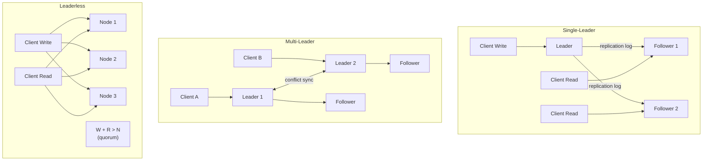

# [BEE-122] 複製策略

:::info
單一主節點、多主節點、無主節點複製 — 取捨、衝突解決、故障轉移與複製延遲。
:::

## 背景

現代系統很少只在單一資料庫節點上運行。資料會跨多個節點進行複製，以便在硬體故障時存活、降低地理分散使用者的讀取延遲，以及將讀取吞吐量擴展至超過單台機器的能力。但複製引入了分散式系統中的核心張力之一：每次寫入最終都必須到達每個副本，而中途可能出現任何問題。

本文涵蓋三種主要複製拓撲、其操作特性，以及工程師最常忽略的故障模式。

**參考資料：**
- [Designing Data-Intensive Applications, Chapter 5: Replication](https://www.oreilly.com/library/view/designing-data-intensive-applications/9781491903063/ch05.html) — Martin Kleppmann
- [PostgreSQL Streaming Replication](https://wiki.postgresql.org/wiki/Streaming_Replication) — PostgreSQL Wiki
- [MySQL 8.4 Replication](https://dev.mysql.com/doc/en/replication.html) — MySQL Reference Manual

## 為何要複製？

三個不同目標驅動複製決策：

**高可用性。** 若一個節點故障，另一個可以接管。沒有複製的話，單一節點故障即意味著停機。

**讀取擴展。** 讀取密集的工作負載可分散到各副本。寫入仍集中到一處，但讀取可分流。只有在讀取量遠大於寫入量時才有幫助。

**地理分散。** 從靠近使用者所在地區的副本提供服務，可降低延遲。新加坡的使用者不應該為了每次讀取都等待往返法蘭克福的延遲。

這些目標並非總是相容。同步複製最大化持久性，但限制了寫入吞吐量。無主節點複製最大化可用性，但使一致性變得複雜。

## 複製拓撲



### 單一主節點複製

一個節點被指定為主節點（leader，也稱為 primary 或 master）。所有寫入都送往主節點。主節點在本地套用寫入，然後將複製日誌轉發給從節點（replicas、standbys）。客戶端可以從任意從節點讀取，但讀取結果可能是舊的。

PostgreSQL 和 MySQL 都實現了此模型。PostgreSQL 透過串流複製協定將 WAL（Write-Ahead Log）記錄傳送到備援節點。MySQL 傳送 binlog 事件。在這兩種情況下，都有一個來源節點對寫入具有權威性。

這是最容易推理的拓撲。衝突解決是微不足道的：只有一個寫入者，因此不可能發生衝突。

**取捨：**
- 寫入受限於主節點的瓶頸
- 主節點故障需要故障轉移（見下文）
- 從節點可能提供舊的讀取結果

### 多主節點複製

多個節點接受寫入。每個主節點向其他主節點及自己的從節點進行複製。這在多資料中心部署中很常見，每個資料中心有一個本地主節點，主節點之間以非同步方式跨資料中心同步。

衝突解決成為一流的關注點。兩個主節點可以同時接受對同一行的衝突寫入。系統必須決定哪個寫入獲勝，或如何合併它們。

**取捨：**
- 每個資料中心有更高的寫入可用性和更低的寫入延遲
- 衝突是可能發生的，必須明確處理
- 設定複雜度顯著提高
- 循環複製錯誤和腦裂情況更難避免

MySQL Group Replication 和 CockroachDB 支援多主節點或多主寫入。除非有明確的地理分散需求並具備強大的衝突解決紀律，否則大多數應用程式應該避免多主節點。

### 無主節點複製

沒有單一節點對寫入具有權威性。客戶端同時向多個節點發送寫入。當 W 個節點確認時，寫入被視為成功。讀取被發送到多個節點，並從 R 個節點返回值。當 W + R > N（總節點數）時，每次讀取集中至少有一個節點見過最新寫入 — 這就是仲裁保證。

Dynamo（Amazon）、Cassandra 和 Riak 使用此模型。它可以在不進行故障轉移的情況下容忍節點故障：若節點不可用，客戶端繞過它路由。反熵過程（讀取修復、後台同步）負責協調分歧的資料。

**取捨：**
- 無單點故障，無需故障轉移
- W 和 R 參數讓操作員調整一致性與可用性的平衡
- 即使使用仲裁，仍存在返回舊資料的邊緣情況
- 衝突解決（版本向量、最後寫入獲勝）必須提前設計

## 同步與非同步複製

這主要適用於單一主節點和多主節點設置。

**非同步複製**（MySQL 預設）：主節點在本地提交並在從節點確認之前向客戶端返回成功。速度更快，但會產生一個視窗，在此期間已確認的寫入僅存在於主節點上。若主節點在複製完成前故障，這些寫入將遺失。

**同步複製**：主節點等待至少一個從節點確認收到後才返回成功。寫入在至少兩個節點上是持久的。取捨：寫入延遲包含到從節點的網路往返時間。緩慢或不可用的同步從節點會阻塞所有寫入。

**半同步**（MySQL 的實際中間方案）：一個從節點被指定為同步。其他的是非同步的。若同步從節點故障，其中一個非同步從節點被提升為同步。PostgreSQL 將類似配置稱為 `synchronous_commit = remote_write`。

對於大多數生產系統，具有一個同步從節點的半同步複製是推薦的預設值：一個持久性確認，而無需所有從節點都可用。

## 複製延遲

因為非同步從節點在主節點之後接收寫入，它們可能提供舊資料。這個差距就是複製延遲。在正常操作下，它是毫秒級的。在繁重的寫入負載或網路問題下，它可能增長到幾秒或幾分鐘。

由複製延遲引起的兩個具體問題值得精確理解：

**寫後讀不一致。** 使用者寫入資料（個人資料更新、評論），然後立即讀取回來。若讀取落在尚未收到寫入的從節點上，使用者會看到舊資料 — 或完全沒有資料。從他們的角度來看，寫入消失了。

緩解方案：將緊跟在寫入之後的讀取路由到主節點。追蹤使用者的最後寫入時間戳，只路由到已趕上該時間點之後的從節點。

**單調讀取違反。** 使用者進行兩次連續讀取。第一次落在延遲低的從節點。第二次落在延遲更高的從節點。使用者看到較新的狀態，然後看到較舊的狀態 — 時間似乎倒流。

緩解方案：將使用者會話固定到特定副本，或將所有讀取路由到主節點。

## 故障轉移

當主節點故障時，必須提升一個從節點。這可以是手動的（由操作員做決定），也可以是自動的（系統檢測到故障並選舉新的主節點）。

### 單一主節點故障轉移演練

**場景：非同步複製，主節點故障**

```
t=0   主節點收到寫入 W1，在本地套用
t=1   主節點將 W1 發送到從節點 1（非同步，尚未確認）
t=2   主節點故障（崩潰）
t=3   從節點 1 尚未收到 W1
t=4   故障轉移：從節點 1 被提升為新主節點
t=5   W1 遺失 — 它只存在於已故障的主節點上
```

當舊主節點恢復並以從節點身份重新加入時，它可能嘗試重放 W1。若新主節點已處理了衝突的寫入，這會導致不一致。自動故障轉移系統會丟棄舊主節點未複製的寫入，這意味著已確認的寫入可能永久遺失。

**場景：同步複製，主節點故障**

```
t=0   主節點收到寫入 W1
t=1   主節點將 W1 發送到從節點 1（同步）
t=2   從節點 1 確認
t=3   主節點向客戶端返回成功
t=4   主節點故障
t=5   故障轉移：從節點 1 被提升 — W1 存在，無資料遺失
```

代價：若從節點 1 在 t=1 時不可用，t=0 的寫入將阻塞，直到從節點 1 恢復或從同步集合中移除。

### 腦裂

自動故障轉移帶來一個特定危險：系統在舊主節點仍在運行時（網路分區，而非崩潰）提升新主節點。現在兩個節點都認為自己是主節點。兩者都接受寫入。寫入分歧並發生衝突。

防禦措施：STONITH（Shoot The Other Node In The Head）— 在提升之前強制關閉疑似的舊主節點電源。Fencing token — 在寫入中包含單調遞增的令牌；具有過時令牌的節點請求被拒絕。共識協定（Raft、Paxos）— 只有在獲得多數仲裁的情況下才選舉主節點，使同時存在雙主節點成為不可能。

## 衝突解決策略

在多主節點和無主節點系統中，同一個鍵可能收到衝突的並發寫入。系統必須解決它們。

**最後寫入獲勝（LWW）。** 每次寫入都帶有時間戳。時間戳最高的寫入獲勝。實現簡單。靜默地遺失資料 — 被丟棄的寫入永久消失。容易受到時鐘偏差影響：時鐘快的節點上的寫入始終勝過時鐘慢的節點上的寫入。

**應用程式層級的衝突解決。** 應用程式收到兩個衝突值並決定保留哪個。CouchDB 使用此方法（複製衝突作為文件修訂版本暴露）。需要應用程式定義合併邏輯。適合領域語義重要的場景（例如，購物車應該合併商品，而不是選擇一個）。

**CRDT（無衝突複製資料類型）。** 設計為無需應用程式邏輯即可確定性合併的資料結構。計數器、集合和映射都有 CRDT 實現。Riak 支援 CRDT 類型。取捨：可以表達為 CRDT 的操作集合是有限的。

**操作轉換。** 協作編輯系統（Google Docs）使用。追蹤轉換歷史，以任意順序套用編輯並得到相同結果。正確實現複雜度很高。

## 原則

根據主要限制選擇複製拓撲：

- **需要簡單寫入和讀取擴展**：單一主節點、非同步複製、從從節點讀取。
- **需要跨資料中心低寫入延遲**：多主節點，具有明確的衝突解決。
- **需要最大可用性且可以容忍最終一致性**：無主節點，調整仲裁參數。

在拓撲之上疊加同步性以符合持久性需求。對於大多數 OLTP 系統，具有一個同步從節點的半同步單一主節點複製是正確的預設值。

複製延遲不是邊緣情況 — 它是任何非同步副本的正常操作條件。在設計讀取時考慮延遲。在需要寫後讀一致性的地方，明確路由到主節點或使用會話追蹤邏輯。

不要在沒有腦裂保護的情況下依賴自動故障轉移。沒有 fencing 的快速故障轉移可能產生比原始中斷更難恢復的資料遺失和損壞。

## 常見錯誤

1. **假設副本始終是一致的。** 非同步複製意味著從節點在定義上是落後的。從從節點讀取就是讀取可能是舊的資料。這不是錯誤 — 這是合約。在應用程式中如此對待它。

2. **寫入後立即從副本讀取。** 寫入到達主節點；讀取可能落在尚未收到它的從節點上。這是寫後讀問題。修復方法是刻意路由，而不是靠運氣。

3. **在沒有腦裂保護的情況下啟用自動故障轉移。** 沒有 STONITH 或 fencing token 的自動提升會產生雙主節點情況。兩個主節點都接受寫入；分歧是靜默的，且可能難以偵測。始終將自動故障轉移與節點 fencing 配對。

4. **多主節點複製沒有衝突解決策略。** 部署多主節點並希望衝突不發生不是策略。衝突最終將發生。在部署之前設計解決邏輯，而不是在生產環境中發現損壞的資料之後。

5. **不監控複製延遲。** 落後主節點數小時的從節點對讀取幾乎沒用，且對故障轉移很危險（資料遺失視窗很大）。對 `pg_stat_replication`（PostgreSQL）或 `SHOW REPLICA STATUS`（MySQL）進行監控，並在延遲超過可接受閾值時發出警報。

## 相關 BEE

- [BEE-120: SQL vs NoSQL](./120.md) — 選擇會限制複製選項的儲存引擎
- [BEE-123: 分片](./123.md) — 跨節點分區資料，通常與每個分片的複製結合使用
- [BEE-160: ACID 交易](./160.md) — 複製如何與交易隔離互動
- [BEE-165: 最終一致性](./165.md) — 無主節點和非同步複製自然提供的一致性模型
