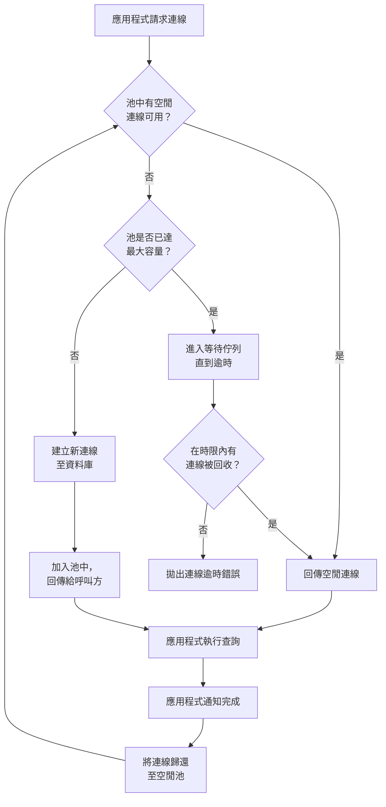

# [BEE-125] 連線池與查詢優化

:::info
透過連線重用降低資料庫開銷，並在進入生產環境前消除低效的查詢模式。
:::

## 背景

每一條資料庫連線都有真實的成本。PostgreSQL 為每個連線建立一個新的後端行程 —— 通常佔用 5–10 MB 記憶體，加上每次新 TCP 連線的驗證握手時間。在低流量時這幾乎感覺不到；在高流量時，它會成為一道硬性瓶頸。每秒接收 500 個請求、每個請求都建立新連線的服務，很快就會耗盡 `max_connections`（PostgreSQL 預設為 100），導致連線被拒絕。

查詢效率則進一步放大問題。一個應用程式用 101 次查詢來完成本可用 1 次搞定的事情，每個請求都在浪費 CPU、網路往返次數和連線佔用時間。這兩個問題 —— 連線開銷與查詢低效 —— 都有已知的解決模式，完全可以預防。

**參考資料：**
- [PgBouncer 官方文件](https://www.pgbouncer.org/features.html)
- [Use The Index, Luke — SQL 效能解說](https://use-the-index-luke.com/)
- [理解 N+1 資料庫查詢 — Scout APM](https://www.scoutapm.com/blog/understanding-n1-database-queries)

## 原則

> 透過連線池重用連線，池的大小應符合實際並發量；查詢設計應只做一件事，不多也不少。

---

## 連線池

### 為什麼需要連線池

建立一條資料庫連線需要：

1. TCP 三次握手
2. SSL/TLS 協商（如果啟用）
3. PostgreSQL 驗證（md5、scram-sha-256 等）
4. 伺服器端 fork 後端行程

這段開銷通常是 5–20 ms。在每秒 500 個請求的情況下，每個連線花費 10 ms，每秒就浪費 5 秒的延遲預算 —— 這還是在任何查詢執行之前。

連線池維護一組已建立的連線，按需分配給應用程式執行緒，在交易（或會話）完成後回收。

### 池大小：Little's Law

正確的池大小不是「越大越好」。池過大會讓資料庫被大量並發後端行程壓垮，這些行程互相競爭 CPU 和 shared buffer 鎖，反而降低吞吐量。

**Little's Law** 應用於連線池：

```
pool_size = 平均並發查詢數 * 平均查詢時間（秒）
```

範例：如果服務在任意時刻有 20 個進行中的查詢，每個查詢平均耗時 50 ms：

```
pool_size = 20 * 0.05 = 1 個連線
```

實際使用時需加上彈性空間以應對流量峰值。合理的起始公式：

```
pool_size = (CPU 核心數 * 2) + 有效磁碟軸數
```

這是 HikariCP（Java）所使用的指導方針，也是 PgBouncer 文件的建議。對大多數 Web 服務而言，每個應用程式實例 10–20 個連線的池已足夠。

### 連線池模式

PgBouncer（最廣泛部署的外部 PostgreSQL 連線池）支援三種模式：

| 模式 | 伺服器連線持有時間 | 適用場景 |
|---|---|---|
| **Session（會話）** | 整個客戶端連線期間 | 使用會話層級功能的應用（暫存資料表、advisory lock、`SET` 陳述式） |
| **Transaction（交易）** | 單次交易期間 | 大多數 Web 應用 — 連線重用率最高 |
| **Statement（陳述式）** | 單條陳述式期間 | 強制 autocommit；中斷多陳述式交易；極少使用 |

**Transaction 模式**是 HTTP 服務的最佳選擇。`COMMIT` 或 `ROLLBACK` 完成後立即釋放伺服器連線，因此 20 條伺服器連線的池可以服務數百條並發應用程式連線。

**注意：** Transaction 模式會破壞會話層級的 PostgreSQL 功能。不能使用跨交易持久的 `SET LOCAL`、具名的 prepared statement、跨交易持有的 advisory lock，或在 transaction 模式下使用 `LISTEN`/`NOTIFY`。

### 外部連線池 vs. 應用程式層級連線池

| | 應用程式層級連線池（如 HikariCP、pgx pool） | 外部連線池（PgBouncer） |
|---|---|---|
| 範圍 | 每個應用程式行程 | 跨所有行程/Pod 共享 |
| 開銷 | 低（同行程內） | 輕微的網路跳轉 |
| 連線數量 | `實例數 * pool_size` 條連線到 DB | 固定的伺服器端連線數，與實例數無關 |
| 最適合 | 單行程服務、實例數少的微服務 | 高實例數部署、Serverless、缺乏好連線池函式庫的語言 |

在有大量 Pod 副本的 Kubernetes 環境中，外部連線池通常是必要的。50 個 Pod，每個 Pod 有 10 條連線的池 = 500 條資料庫連線，可能超過 `max_connections` 而導致叢集不穩定。

### 連線池生命週期



---

## N+1 查詢問題

### 定義

N+1 問題發生在程式碼執行 1 次查詢取得 N 筆記錄，然後再對每筆記錄額外執行 N 次查詢以取得關聯資料 —— 合計 N+1 次資料庫往返。

### 具體範例

**場景：** 顯示 100 筆訂單及每筆訂單對應的客戶姓名。

**ORM 的懶載入寫法（虛擬碼）：**

```python
orders = db.query("SELECT id, customer_id, total FROM orders LIMIT 100")
# 1 次查詢

for order in orders:
    customer = db.query("SELECT name FROM customers WHERE id = ?", order.customer_id)
    # 1 次查詢 * 100 筆訂單 = 100 次查詢
    print(f"{order.id}: {customer.name} — ${order.total}")
```

**查詢次數：** 1 + 100 = **101 次查詢**

**修正方式一 — JOIN：**

```sql
SELECT o.id, o.total, c.name
FROM orders o
JOIN customers c ON c.id = o.customer_id
LIMIT 100;
```

**查詢次數：** **1 次查詢**

**修正方式二 — IN 子句批次載入：**

```sql
-- 第一步：取得訂單（1 次查詢）
SELECT id, customer_id, total FROM orders LIMIT 100;

-- 第二步：一次取得所有相關客戶（1 次查詢）
SELECT id, name FROM customers
WHERE id IN (42, 17, 88, ...);  -- 所有 100 個 customer_id
```

**查詢次數：** **2 次查詢**

IN 子句模式（有時稱為 DataLoader 模式，由 Facebook 的 GraphQL DataLoader 推廣）適用於無法使用 JOIN 的情境 —— 例如兩個實體來自不同服務或不同資料庫。

### 偵測方式

N+1 查詢在開發環境中通常是隱形的（資料量小、本地 DB 速度快），但在生產環境中是災難性的。偵測方法：

- **ORM 查詢日誌：** 啟用 SQL 日誌，掃描帶有遞增 ID 的重複查詢模式。
- **APM 工具：** Scout APM、Datadog APM、New Relic 會自動標記 N+1 模式。
- **慢查詢日誌：** 如果單次查詢很快但總次數很高，檢查是否有重複模式。
- **Bullet gem（Rails）：** 在開發環境中偵測到 N+1 或未使用的預載入時發出通知。

---

## 讀懂 EXPLAIN 計畫

優化查詢前，先讀取其執行計畫：

```sql
EXPLAIN ANALYZE
SELECT o.id, o.total, c.name
FROM orders o
JOIN customers c ON c.id = o.customer_id
WHERE o.created_at > NOW() - INTERVAL '30 days';
```

需要理解的關鍵節點：

| 節點類型 | 含義 |
|---|---|
| `Seq Scan` | 全資料表掃描 — 小資料表可接受，大資料表則需警惕 |
| `Index Scan` | 使用索引查找列；通常效率較高 |
| `Index Only Scan` | 所需欄位全在索引中；最快的讀取方式 |
| `Hash Join` / `Nested Loop` | JOIN 演算法；內層資料表有索引的 Nested Loop 通常最佳 |
| `Sort` | 需要排序；可透過對 ORDER BY 欄位建立索引來消除 |

注意 **rows**（預估值 vs. 實際值）和 **cost** 值。預估列數與實際列數差異過大，表示統計資訊過時 —— 對資料表執行 `ANALYZE`。

:::tip Deep Dive
關於資料庫層級的查詢優化與執行計畫分析，請參閱 [DDP 查詢與效能系列](https://alivedise.github.io/database-design-principles/200)。
:::

---

## 查詢優化策略

### 1. 避免 SELECT *

```sql
-- 不好：取得所有欄位，阻止 Index Only Scan，增加網路傳輸量
SELECT * FROM users WHERE id = 42;

-- 好：只取需要的欄位
SELECT id, email, display_name FROM users WHERE id = 42;
```

`SELECT *` 會阻止優化器使用覆蓋索引，也會透過網路傳輸不必要的資料到應用程式記憶體中。

### 2. 將過濾推送到資料庫

```sql
-- 不好：取出全部，在應用程式中過濾
orders = db.query("SELECT * FROM orders")
recent = [o for o in orders if o.created_at > thirty_days_ago]

-- 好：在 SQL 中過濾
SELECT id, total FROM orders
WHERE created_at > NOW() - INTERVAL '30 days';
```

資料庫可以對過濾欄位使用索引；應用程式層做不到。

### 3. 對過濾欄位與 JOIN 欄位建立索引

出現在 `WHERE`、`JOIN ON` 和 `ORDER BY` 子句中的欄位都是索引的候選。詳見 **BEE-121**。

### 4. 限制結果集大小

```sql
-- 大型結果集務必分頁
SELECT id, title FROM articles
ORDER BY published_at DESC
LIMIT 20 OFFSET 0;
```

對大型資料集使用 keyset 分頁（`WHERE id < last_seen_id`）而非 offset 分頁 —— `OFFSET 10000` 仍需要資料庫掃描 10,000 列後才丟棄它們。

### 5. 使用參數化查詢

```sql
-- 好：參數化查詢（執行計畫可快取）
SELECT * FROM users WHERE email = $1;

-- 不好：字串插值（每個唯一 email 都會產生新的計畫）
SELECT * FROM users WHERE email = 'user@example.com';
```

參數化查詢讓資料庫可以快取執行計畫，減少重複查詢的規劃開銷。

---

## 常見錯誤

| 錯誤 | 後果 | 修正方式 |
|---|---|---|
| 每個請求建立新連線（無連線池） | 連線開銷主導回應時間；資料庫耗盡連線數 | 新增應用程式層級連線池或外部連線池 |
| 池過大 | 資料庫被大量並發後端行程壓垮；鎖競爭加劇 | 用 Little's Law 計算池大小；以 `(核心數 * 2) + 磁碟軸數` 為起點 |
| 不將連線歸還連線池 | 連線洩漏；池耗盡；應用程式掛起 | 使用 try/finally 或連線上下文管理器；啟用池逾時警報 |
| ORM 程式碼中的 N+1 查詢 | 查詢次數比必要多 100–1000 倍 | 用 JOIN 預載入或用 IN 子句批次載入 |
| 只需要 2 個欄位卻用 `SELECT *` | 阻止覆蓋索引；資料傳輸過多 | 明確指定所需欄位 |

---

## 相關 BEE

- **BEE-121** — 資料庫索引策略：哪些欄位要建索引以及如何建
- **BEE-301** — 資源管理：連線生命週期與清理模式
- **BEE-303** — 效能分析與可觀測性：在生產環境中偵測慢查詢與 N+1
