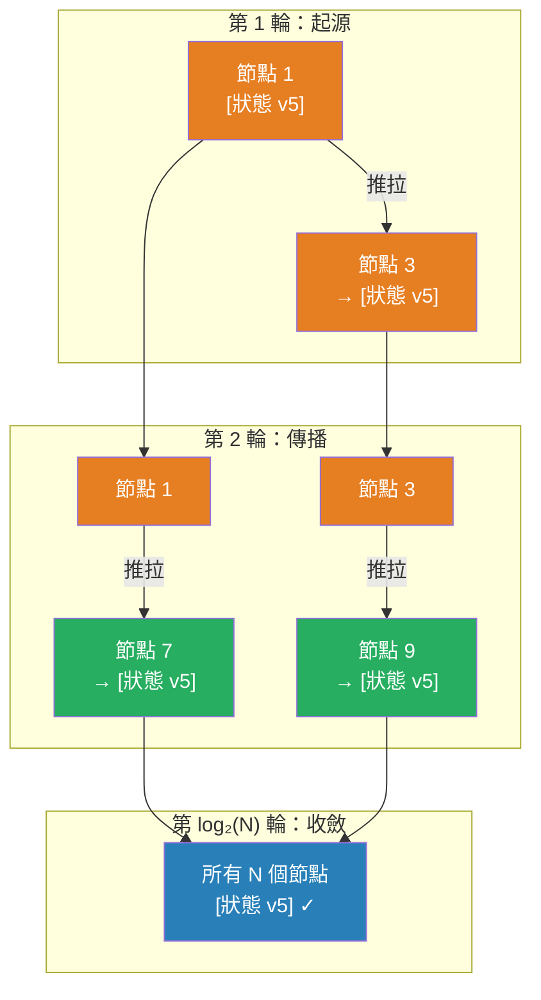

# [BEE-423] 流言協議

:::info
流言協議（Gossip Protocol）通過讓每個節點定期與隨機選擇的對等節點交換信息來在叢集中傳播狀態——以無中央協調器的方式對所有 N 個節點實現 O(log N) 收斂，使其成為大型分散式系統中叢集成員管理、故障檢測和配置傳播的主要機制。
:::

## Context

當分散式叢集需要每個節點了解其他所有節點——誰還活著、他們擁有什麼數據、他們運行什麼版本——時，最簡單的方法是廣播：每個更新同時發送到每個節點。廣播每個發送者需要 O(N) 條消息，而且單個不可達的接收者就會打破保證。更糟糕的是，全對全心跳（每個節點監控所有其他節點）需要 O(N²) 條消息，這將實際叢集大小限制在約 100 個節點。

Alan Demers 和 Xerox PARC 的同事在 1987 年提出了解決方案，論文題為「用於複製資料庫維護的流行病算法」（ACM PODC 1987）。關鍵洞察借鑒自流行病學：信息可以在種群中呈指數級傳播，而無需任何個體了解完整種群。每個感染的節點（擁有新狀態的節點）聯繫一個隨機對等節點並傳輸更新；現在被感染的對等節點也做同樣的事情。經過 O(log N) 輪後，所有 N 個節點都以趨近於 1 的概率收到了更新。論文作者稱這些為「流行病算法」——這個標籤後來被稱為流言協議。

流言輪次本身很簡單。每個節點維護一個本地的叢集狀態視圖——從節點標識符到版本化狀態記錄的映射。定期地（通常在生產系統中每 1 秒），節點選擇一個隨機對等節點，執行交換，並用對等節點中更新的內容更新其本地映射。存在三種交換變體：**推送**（發送方傳輸其狀態）、**拉取**（發送方請求對等節點的狀態）和**推拉**（雙向在單輪中完成）。推拉收斂最快，是 Cassandra、Consul 和 Redis Cluster 使用的變體。

數學特性是有利的。推拉流言在大約 O(log N) 輪內到達所有 N 個節點。1,000 個節點的叢集在大約 10 輪內收斂；1,000,000 個節點的叢集在大約 20 輪內收斂。每個傳播週期的總消息數為 O(N log N)——與叢集大小線性而非二次方成比例。這些特性無論哪個節點發起更新都成立，且除了聯繫隨機對等節點的能力之外不需要拓撲知識。

SWIM 協議（可擴展的弱一致性感染式成員資格），由 Das、Gupta 和 Motivala 在 IEEE DSN 2002 上發布，將基本流言擴展到專門用於故障檢測。標準心跳需要 O(N²) 條消息，並在網路延遲突增時產生假陽性。SWIM 分離了兩個關注點：檢測哪些節點宕機（使用直接和間接探測），以及傳播該信息（使用流言）。每輪，節點直接探測一個隨機對等節點；如果在超時內沒有收到響應，它會請求 k 個其他隨機節點探測同一個對等節點。只有直接和間接探測都失敗時，它才將節點標記為疑似——並且只有在進一步的疑似超時後才宣告失敗。HashiCorp 的 Lifeguard 增強（2018，arXiv:1707.00788）增加了自我感知（降級節點在對等節點檢測到之前報告自己的健康狀況），與普通 SWIM 相比，假陽性減少了約 20 倍。

Cassandra 使用流言進行叢集成員管理和令牌環信息，並與 Phi 累積故障檢測器（Hayashibara 等人，2004）集成。Phi 檢測器不是二進制的生死判斷，而是維護一個心跳到達間隔時間的滑動窗口，並計算連續的懷疑分數 φ。當 φ 超過可配置的閾值（默認為 8，對應約 99.5% 的置信度節點已宕機），節點被標記為失敗。連續分數自動適應緩慢的網路——高方差的心跳計時會提高檢測閾值，而不是觸發假陽性。

## Design Thinking

**流言是最終傳播的正確工具，而非強一致性的工具。** 它*最終*將狀態傳遞給所有節點——收斂是概率性的，需要 O(log N) 輪。在這些輪次中，節點持有不同的叢集狀態視圖。這對於成員資格信息（知道節點加入或離開可以滯後一秒）、故障檢測（在將節點標記為失敗之前有短暫的不確定窗口）和配置傳播（配置值的滾動更新）是可接受的。對於需要所有節點在同一時刻就一個值達成一致的協調決策，則不可接受——使用共識（BEE-421）。

**扇出和輪次間隔是主要的調整槓桿。** 扇出——每輪聯繫的隨機對等節點數量——直接控制信息傳播的速度，但也控制網路負載。扇出為 1 給出 O(log N) 收斂；更高的扇出以每輪更多消息為代價加速收斂。輪次間隔控制延遲與檢測的取捨：更短的間隔更快地檢測故障，但產生更多的背景流量。Cassandra 的默認值（扇出 1-3，輪次間隔 1 秒）在最多幾百個節點的叢集中平衡了這些因素。

**故障檢測需要區分暫時無響應和實際故障。** 對流言探測沒有響應的節點可能是：暫時過載、遇到暫時性網路事件、因垃圾收集而暫停，或實際崩潰。在單次錯過響應時立即宣告失敗會產生假陽性，這些假陽性會級聯成不必要的重新平衡。SWIM 方法（在宣告前疑似）和 Phi 方法（帶閾值的連續分數）都在「最近未聽到」和「宣告失敗」之間引入了緩衝。緩衝區大小在檢測延遲和假陽性率之間進行取捨。

## Visual



## Example

**流言狀態交換（推拉，三消息模式）：**

```
# Cassandra 風格的節點 A（發起者）和節點 B 之間的流言輪次

步驟 1 — Gossip Digest Syn（A → B，推送）：
  A 發送其已知所有節點的視圖及版本號：
  {
    "node_a": { generation: 1700000000, version: 47 },
    "node_b": { generation: 1700000000, version: 31 },
    "node_c": { generation: 1700000000, version: 12 },
  }

步驟 2 — Gossip Digest Ack（B → A，拉取響應）：
  B 將 A 的版本與自己的進行比較：
  - node_b：B 有版本 35（更新）→ B 向 A 發送 node_b 的完整狀態
  - node_c：B 有版本 12（相同）→ 無需發送
  - node_d：B 知道 node_d；A 不知道 → B 向 A 發送 node_d 的完整狀態
  B 也回復其自己的摘要，以便 A 可以填補空白：
  {
    "node_b": { 完整狀態, version: 35 },
    "node_d": { 完整狀態, version: 8 },
    "digest": { "node_a": 47, "node_b": 35, "node_c": 12, "node_d": 8 }
  }

步驟 3 — Gossip Digest Ack2（A → B，推送確認）：
  A 有 node_a version 47；B 的摘要顯示它有 node_a version 47 → 不需要更新
  A 不知道 node_d → A 用步驟 2 中 node_d 的完整狀態更新其本地狀態

結果：A 和 B 現在有相同的叢集狀態視圖。
下一輪，每個節點聯繫不同的隨機對等節點並進一步傳播合並後的狀態。

1000 個節點叢集的收斂：約 10 輪 × 1 秒間隔 = 約 10 秒。
```

## Related BEEs

- [BEE-421](421.md) -- 共識演算法：Raft 使用以領導者為中心的日誌複製模型，需要法定人數；流言是去中心化的，不需要法定人數——針對不同問題的互補工具
- [BEE-420](420.md) -- CAP 定理：基於流言的系統是 AP 的——它們在分區期間保持可用，但分區兩側的節點會分歧，直到分區癒合
- [BEE-122](122.md) -- 複製策略：流言傳播叢集元數據（誰擁有哪個分區）；複製策略本身是在此之上的獨立層
- [BEE-265](265.md) -- 混沌工程：向流言叢集注入隨機節點故障並測量檢測延遲，是對故障檢測調整的直接測試

## References

- [用於複製資料庫維護的流行病算法 -- Demers 等人, ACM PODC 1987](https://dl.acm.org/doi/10.1145/43921.43922)
- [SWIM：可擴展的弱一致性感染式進程組成員資格 -- Das, Gupta & Motivala, IEEE DSN 2002](https://www.cs.cornell.edu/projects/Quicksilver/public_pdfs/SWIM.pdf)
- [Lifeguard：用於更準確故障檢測的本地健康感知 -- arXiv:1707.00788](https://arxiv.org/pdf/1707.00788)
- [使用 Lifeguard 使流言更健壯 -- HashiCorp 工程博客](https://www.hashicorp.com/en/blog/making-gossip-more-robust-with-lifeguard)
- [節點間通信（流言）-- Apache Cassandra 文檔](https://docs.datastax.com/en/cassandra-oss/3.x/cassandra/architecture/archGossipAbout.html)
- [Redis 叢集規範 -- Redis 文檔](https://redis.io/docs/latest/operate/oss_and_stack/reference/cluster-spec/)
