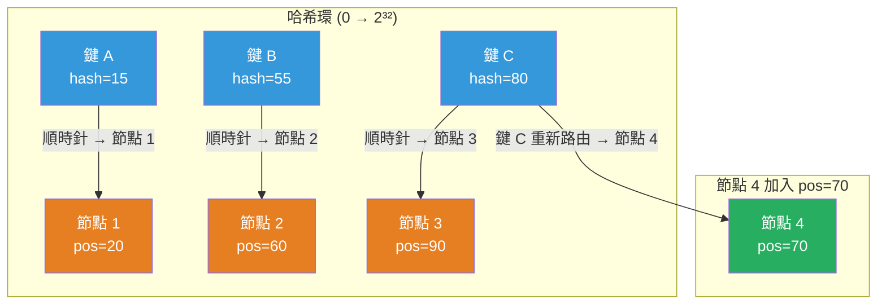

# [BEE-425] 一致性哈希

:::info
一致性哈希將節點和鍵都映射到環形哈希空間上，使得當節點增減時，只需重新映射 O(K/N) 個鍵——相較於模運算哈希的 O(K)——使其成為分散式快取、鍵值存儲和 CDN 請求路由的基礎分區算法。
:::

## Context

將 K 個鍵分散到 N 個節點的樸素方法是模運算哈希：`node = hash(key) % N`。這種方法快速且均勻，但當 N 變化時就會崩潰。添加單個節點會改變模數，導致幾乎所有鍵都哈希到不同的節點。在分散式快取中，這意味著大規模快取未命中事件；在分散式數據庫中，則意味著移動幾乎所有數據。

MIT 的 David Karger 和同事在 1997 年的「一致性哈希與隨機樹：減輕萬維網熱點的分散式快取協議」（ACM STOC 1997）中描述了解決方案。核心洞察：如果將節點和鍵都映射到同一個環形哈希空間——從 0 到 2³² 的環——那麼每個鍵屬於環上順時針方向最近的節點。當節點加入時，它只接管其前驅到自身之間的鍵；當它離開時，這些鍵移動到其後繼。在兩種情況下，只有 K/N 個鍵需要轉移，而不是幾乎全部的 K 個。

1997 年的論文還引入了**虛擬節點**（論文稱之為「每個站點的副本」）：每個物理節點不是佔用環上的一個位置，而是佔用多個位置。如果 N 個節點各自映射到 m 個位置，環上共有 N×m 個點。這降低了負載分配的方差：每個節點只有一個位置時，任何節點擁有的環比例遵循高方差分佈，這意味著某些節點會成為熱點。每個節點有 m 個位置時，方差縮小約 m 倍。在實踐中，每個物理節點 100–256 個虛擬節點可將負載標準差降低到 10% 以下。

Amazon Dynamo（DeCandia 等人，SOSP 2007）將一致性哈希大規模應用於服務 Amazon 購物車和訂單系統的生產鍵值存儲。Dynamo 為每個物理節點分配一組令牌（環上的位置），並將每個鍵複製到順時針方向的下 N-1 個唯一物理節點——跳過屬於同一物理主機的虛擬節點。這確保無論虛擬節點數量多少，副本都落在不同的機器上。

Apache Cassandra 繼承了 Dynamo 的環模型。每個節點被分配多個令牌；舊版本的默認值是 8 個虛擬節點，但 DataStax 現在推薦 256 個以實現更均勻的分配。Memcached 客戶端通過 **ketama** 庫（Last.fm，2007 年）採用了一致性哈希，該庫將每個服務器哈希到 100–200 個環上的點，並將快取鍵路由到最近的點。

**Redis Cluster 不是一致性哈希。** Redis 3.0 使用 16,384 個固定的**哈希槽**（`CRC16(key) % 16384`），由管理員明確分配給節點。重新映射是確定性且受控的，而非自動的——這種設計取捨更傾向於操作可預測性而非無縫彈性。

有兩種一致性哈希的替代方案值得了解。**集合點哈希**（Thaler 和 Ravishankar，密歇根大學，1996 年）將鍵分配給所有節點中 `hash(key, node_id)` 分數最高的節點。它實現了相同的 O(K/N) 重新映射特性，且不需要環數據結構，但每次鍵查找需要 O(N) 的工作量，隨集群大小增長。**跳躍一致性哈希**（Lamping 和 Veach，Google，arXiv:1406.2294，2014 年）在 O(1) 內存中生成均勻分佈，代碼約五行，但要求桶按順序編號——適合數據分片但不適合任意節點成員資格變更。

## Design Thinking

**一致性哈希解決的是彈性問題，而非熱點問題。** 無論使用何種環算法，熱門鍵仍然會衝擊擁有它的節點。一致性哈希在整體上均勻分配所有權，但單個爆款鍵是另一個問題，需通過更高層的快取或鍵分片來處理。

**虛擬節點數量是操作簡單性和負載均衡之間的校準。** 更多虛擬節點意味著更平滑的重新平衡——當節點加入時，它從許多前驅各取一小部分，而不是從一個前驅取一大部分。缺點是節點故障會將負載重新分配給許多不同的後繼，這可能產生許多難以觀察的小移動。Cassandra 推薦每個節點 256 個虛擬節點，以平衡典型工作負載中的這些因素。

**一致性哈希是有狀態的基礎設施——環必須一致地被複製。** 集群中的每個節點都需要對哪些虛擬節點存在有相同的視圖。對環成員資格的不同意見會導致腦裂鍵路由。生產系統使用流言協議（BEE-423）或共識（BEE-421）來傳播環狀態並檢測差異。

## Visual



## Example

**一致性哈希查找（偽代碼）：**

```
# 環：包含 (位置, 節點ID) 元組的有序列表，包括虛擬節點
# 每個物理節點 N 映射到位置：hash("N@0"), hash("N@1"), ..., hash("N@99")

ring = SortedList of (position, node_id)

# 用虛擬節點填充環
for each node in cluster:
    for i in 0..100:
        pos = hash(f"{node.id}@{i}")  # 例如 MD5 或 SHA1 截斷為 uint32
        ring.insert((pos, node.id))

# 路由一個鍵
def get_node(key):
    pos = hash(key)
    # 二分搜索第一個 >= pos 的環位置（如果超過末尾則回繞）
    idx = ring.bisect_left(pos)
    if idx == len(ring):
        idx = 0                         # 回繞：pos 超過了最後一個條目
    return ring[idx].node_id

# 節點 "cache-3" 加入：
for i in 0..100:
    pos = hash(f"cache-3@{i}")
    ring.insert((pos, "cache-3"))
# 只有 cache-3 的 100 個位置各自的 (前驅[pos], pos] 中的鍵需要移動。
# 預期移動的鍵的比例：100 / (N_old * 100 + 100) ≈ 1/(N_old + 1)

# 節點 "cache-1" 離開：
for i in 0..100:
    pos = hash(f"cache-1@{i}")
    ring.remove((pos, "cache-1"))
# 由 cache-1 位置所擁有的鍵現在路由到它們的後繼——其他鍵不移動。
```

**虛擬節點數量對負載方差的影響（源自 Cassandra 基準測試）：**

```
每節點虛擬節點數 | 負載標準差 | 99 百分位範圍
-----------------+------------+--------------------
       1         |   ~50%     | 0.10× – 2.50× 平均
      10         |   ~25%     | 0.40× – 1.80× 平均
     100         |   ~10%     | 0.76× – 1.28× 平均
     256         |   ~ 5%     | 0.88× – 1.12× 平均
    1000         |   ~ 3%     | 0.92× – 1.09× 平均
```

## Related BEEs

- [BEE-123](../Data%20Storage/123.md) -- 分區與分片：一致性哈希是決定哪個分片擁有某個鍵的一種策略；虛擬節點解決了基於範圍的分區的重新平衡開銷
- [BEE-203](../Caching/203.md) -- 分散式快取：Memcached 集群通過一致性哈希（ketama）路由快取鍵；替換快取節點只會導致 K/N 次快取未命中，而不是完整的冷快取事件
- [BEE-423](423.md) -- 流言協議：環成員資格變更必須在集群中傳播；Cassandra 和 Consul 使用流言來傳播令牌環更新
- [BEE-421](421.md) -- 共識演算法：etcd 和 ZooKeeper 將環元數據存儲在一致性日誌中，使所有節點看到相同的環狀態，避免腦裂路由

## References

- [一致性哈希與隨機樹 -- Karger 等人, ACM STOC 1997](https://dl.acm.org/doi/10.1145/258533.258660)
- [Dynamo：Amazon 的高可用鍵值存儲 -- DeCandia 等人, SOSP 2007](https://www.allthingsdistributed.com/files/amazon-dynamo-sosp2007.pdf)
- [快速、最小內存的一致性哈希算法 -- Lamping & Veach, arXiv:1406.2294, 2014](https://arxiv.org/abs/1406.2294)
- [集合點的命名映射方案 -- Thaler & Ravishankar, 密歇根大學, 1996](https://www.eecs.umich.edu/techreports/cse/96/CSE-TR-316-96.pdf)
- [libketama：Memcached 客戶端的一致性哈希 -- Richard Jones, Last.fm 工程, 2007](https://www.metabrew.com/article/libketama-consistent-hashing-algo-memcached-clients)
- [Redis Cluster 規範 -- Redis 文檔](https://redis.io/docs/latest/operate/oss_and_stack/reference/cluster-spec/)
- [數據分配：Cassandra 如何分配數據？-- DataStax 文檔](https://docs.datastax.com/en/cassandra-oss/3.0/cassandra/architecture/archDataDistributeHashing.html)
