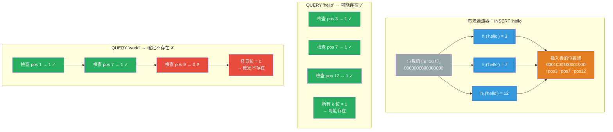

# [BEE-431] 布隆過濾器與概率數據結構

:::info
概率數據結構以有界的錯誤答案概率換取內存和時間的顯著減少——布隆過濾器完全消除假陰性，同時限制假陽性，使其成為 LSM 樹數據庫和 CDN 快取所依賴的「確定不存在」快速路徑的理想工具。
:::

## Context

標準哈希集合在 O(1) 時間內回答「X 是否在集合中？」，但需要與每個存儲元素大小成比例的內存。在十億個 URL 或百億個鍵的規模下，這變得不切實際。Burton H. Bloom 在「哈希編碼中允許錯誤的空間/時間取捨」（Communications of the ACM，1970 年 7 月）中描述了替代方案：用位數組表示集合，使用多個哈希函數設置和檢查位，接受可調的假陽性概率——當真實答案為「否」時回答「可能是」——以換取與元素大小無關的空間。

使布隆過濾器有用的關鍵不對稱性：**沒有假陰性**。如果過濾器說「確定不存在」，它 100% 正確。如果它說「可能存在」，它以（1 - 假陽性率）的概率正確。這種不對稱性正是數據庫點查找優化所需要的：在讀取磁盤上的 SSTable 文件以回答鍵查找之前，先檢查布隆過濾器。如果過濾器說鍵不存在，跳過該文件——節省了一次昂貴的 I/O。如果過濾器說鍵可能存在，就讀取文件。偶爾過濾器是錯誤的，文件並不包含該鍵（假陽性），浪費了一次讀取。在數百萬次查找中，淨 I/O 節省是巨大的。

Apache Cassandra 為每個 SSTable 存儲一個布隆過濾器，完全在堆外內存中。在讀取任何 SSTable 以服務分區鍵查找之前，Cassandra 都會檢查過濾器。RocksDB（Facebook，2012 年）同樣為每個 SSTable 級別放置一個布隆過濾器，默認每個鍵約 10 位，將點查找 I/O 減少了幾個數量級。Google 的 BigTable、LevelDB 和大多數 LSM 樹衍生物使用相同的模式。Akamai 的 CDN 使用布隆過濾器解決「一次訪問奇觀」問題：其快取中 75% 被只獲取一次的內容佔用。過濾器檢測 URL 是否之前已被請求——如果沒有，暫不快取；如果可能有，就快取——為真正重複的內容騰出快取空間（Maggs 和 Sitaraman，「內容分發中的算法精粹」）。

## Design Thinking

**當「確定不存在」是快速路徑時，使用布隆過濾器。** 布隆過濾器的價值在於消除可証明為「否」的情況下最昂貴的操作（磁盤讀取、網絡往返、數據庫查詢）。如果您的工作負載主要是能找到鍵的查找，布隆過濾器增加了開銷而沒有相應的收益——每次查找都需要支付過濾器檢查成本，但「跳過昂貴操作」分支很少被採用。

**假陽性率是一個調整旋鈕，而不是缺陷。** 假陽性概率是 p = (1 - e^(-kn/m))^k，其中 n 是插入元素的數量，m 是位數組的大小，k 是哈希函數的數量。最優 k = (m/n) × ln(2) ≈ 0.693(m/n)。在每個元素 10 位（m/n = 10）時，最優 k ≈ 7，假陽性率 ≈ 0.8%。翻倍到每個元素 20 位可將假陽性率降至約 0.004%——代價是兩倍的內存。Cassandra 將此公開為 `bloom_filter_fp_chance`：較低的值意味著更少的假 I/O 讀取但每個 SSTable 需要更多內存。

**概率數據結構形成一個工具包，而非單一工具。** 布隆過濾器回答成員資格；HyperLogLog 估計基數；Count-Min Sketch 估計頻率。每個適用於不同的查詢類型，每個都用不同種類的精度換取空間節省。選擇正確的工具需要知道您實際在問什麼問題。

## The Probabilistic Data Structure Toolkit

### 布隆過濾器 — 成員資格

**查詢：** 「X 是否在集合中？」→ 「確定不在」或「可能在」

**屬性：** 無假陰性。假陽性率可調。標準形式不支持刪除（計數布隆過濾器通過用計數器替換位添加了這個功能，代價是 4–16 倍的內存）。Cuckoo 過濾器（Fan 等人，CoNEXT 2014）支持刪除，具有比計數布隆過濾器更好的快取局部性和略好的空間效率。

**常見假陽性率的最優參數：**

| 假陽性率 | 每個元素的位數 (m/n) | 哈希函數數量 (k) |
|---|---|---|
| 10% | 4.8 | 3 |
| 1% | 9.6 | 7 |
| 0.1% | 14.4 | 10 |
| 0.01% | 19.2 | 13 |

### HyperLogLog — 基數估計

**查詢：** 「我見過多少不同的元素？」→ 以有界相對誤差估計

Flajolet、Fusy、Gandouet 和 Meunier 在 2007 年描述了 HyperLogLog。核心洞察：哈希值二進制表示中前導零的最大數量給出了哈希了多少不同值的概率估計。HyperLogLog 使用 m 個小寄存器（通常每個 4–6 位）實現約 1.04/√m 的標準誤差。使用 2,048 個寄存器（12 KB），誤差約 2.3%。

**生產使用：** Redis `PFCOUNT` 和 `PFADD` 命令實現了 HyperLogLog；12 KB 的草圖估計數十億元素的不同計數。PostgreSQL 的 `pg_stats` 使用 HyperLogLog 進行列基數估計（用於查詢規劃器）。Druid 在實時分析中使用它進行近似不同計數。

### Count-Min Sketch — 頻率估計

**查詢：** 「我見過 X 多少次？」→ 可能過度計數但永不少計的估計

Cormode 和 Muthukrishnan 在 2005 年描述了 Count-Min Sketch。該結構是一個 w×d 計數器的 2D 數組，有 d 個獨立的哈希函數。計數元素 X：在每個相應行中遞增位置 h₁(X), h₂(X), ..., hd(X) 的計數器。查詢 X：返回所有 d 行中的最小值。最小值始終 ≥ 真實頻率（由於哈希衝突只能過度計數，永不少計）。

**生產使用：** 網絡流量監控（識別重度使用者 IP 地址）、Apache Flink 的窗口頻率查詢、Redis 的近似排序集操作。

## Visual



## Example

**LSM 樹點查找中的布隆過濾器：**

```
# RocksDB / Cassandra SSTable 查找配合布隆過濾器
# 設置：10 個 SSTable 文件，每個帶有布隆過濾器（10 位/鍵，~0.8% FP 率）
# 查詢：GET key="user:42:profile"

for sstable in sstables_covering_key_range:
    # 首先檢查布隆過濾器——純內存位數組操作
    if not sstable.bloom_filter.probably_contains("user:42:profile"):
        continue   # 確定不存在——完全跳過磁盤讀取

    # 過濾器說「可能存在」——從磁盤讀取
    result = sstable.read_block("user:42:profile")
    if result is not None:
        return result  # 找到了

# 包含目標鍵的 1 個 SSTable 的典型結果：
# - 9 個 SSTable：布隆過濾器說「不存在」→ 0 次磁盤讀取
# - 1 個 SSTable：布隆過濾器說「存在」→ 1 次磁盤讀取（正確的那個）
# - 偶爾：1 個假陽性 SSTable 也被讀取 → 1 次額外磁盤讀取
# 淨效果：~1-2 次磁盤讀取而不是 10 次 → I/O 減少 5-10 倍
```

**HyperLogLog 基數估計：**

```
# 追踪流中的不同用戶 ID（例如，DAU 計數）
# Redis 實現：

PFADD daily_users:2026-04-14 user:1 user:2 user:3  # ... 數百萬次添加
PFCOUNT daily_users:2026-04-14                       # 返回帶 ±2% 誤差的估計值

# 內存：無論基數如何始終約 12 KB（1 百萬或 10 億不同用戶）
# 替代方案：存儲所有不同用戶 ID → 8 字節 × 10 億 = 8 GB
# 取捨：精確計數需要 8 GB；HyperLogLog 以 12 KB 提供 ±2% 誤差

# 多集合並集（任意 N 天中見過的用戶）：
PFMERGE weekly_users daily_users:2026-04-08 daily_users:2026-04-09 ...
PFCOUNT weekly_users   # 整周中的不同用戶
```

**Count-Min Sketch 用於 Top-K 項：**

```
# 在流中查找 Top-K 最頻繁的搜索查詢
# （追踪精確頻率需要一個包含所有不同查詢的哈希表）

# 參數：ε = 0.001（1‰ 誤差），δ = 0.01（1% 失敗概率）
# w = ceil(e / ε) = 2718 列
# d = ceil(ln(1/δ)) = 5 行
# 總計數器：2718 × 5 = 13,590（微不足道的內存）

def sketch_add(query):
    for row in range(d):
        col = hash_row[row](query) % w
        sketch[row][col] += 1

def sketch_count(query):
    return min(sketch[row][hash_row[row](query) % w] for row in range(d))

# "python tutorial" 的真實計數：50,000
# sketch_count("python tutorial")：50,000–50,050（略微偏高，永不偏低）
# 結合堆來維護已見過的 Top-K 項目的精確計數
```

## Related BEEs

- [BEE-124](../Data%20Storage/124.md) -- 存儲引擎：LSM 樹引擎（RocksDB、LevelDB、Cassandra）使用布隆過濾器作為 SSTable 點查找的核心優化——過濾器嵌入 SSTable 格式本身
- [BEE-430](430.md) -- 預寫日誌：RocksDB 的 LSM 架構同時使用 WAL（用於 MemTable 持久性）和布隆過濾器（用於跳過 SSTable 查找）；它們在同一個存儲引擎中解決不同的問題
- [BEE-200](../Caching/200.md) -- 快取基礎和快取層次：Akamai 在 CDN 邊緣使用布隆過濾器防止快取一次訪問奇觀，說明概率結構在快取層和存儲引擎中同樣有用
- [BEE-303](../Performance/303.md) -- 性能分析和瓶頸識別：生產布隆過濾器中的假陽性率在性能分析期間表現為意外的 I/O 讀取；理解過濾器的調整參數是解讀速率是否在規格範圍內所必需的

## References

- [哈希編碼中允許錯誤的空間/時間取捨 -- Burton H. Bloom, Communications of the ACM, 1970 年 7 月](https://dl.acm.org/doi/10.1145/362686.362692)
- [RocksDB 布隆過濾器 -- RocksDB Wiki](https://github.com/facebook/rocksdb/wiki/RocksDB-Bloom-Filter)
- [布隆過濾器 -- Apache Cassandra 文檔](https://cassandra.apache.org/doc/latest/cassandra/managing/operating/bloom_filters.html)
- [HyperLogLog：近最優基數估計算法的分析 -- Flajolet, Fusy, Gandouet & Meunier, AofA 2007](https://algo.inria.fr/flajolet/Publications/FlFuGaMe07.pdf)
- [改進的數據流摘要：Count-Min Sketch 及其應用 -- Cormode & Muthukrishnan, Journal of Algorithms, 2005](https://dimacs.rutgers.edu/~graham/pubs/papers/cm-full.pdf)
- [Cuckoo 過濾器：實際上優於布隆過濾器 -- Fan, Andersen, Kaminsky & Mitzenmacher, CoNEXT 2014](https://www.cs.cmu.edu/~dga/papers/cuckoo-conext2014.pdf)
- [內容分發中的算法精粹 -- Maggs & Sitaraman](https://people.cs.umass.edu/~ramesh/Site/PUBLICATIONS_files/CCRpaper_1.pdf)
