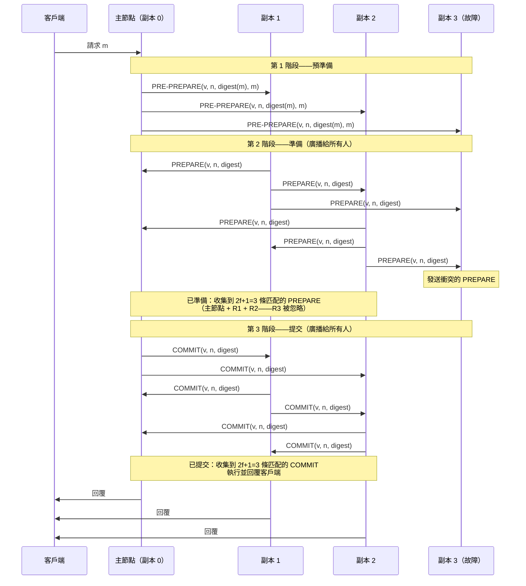

# [BEE-439] 拜占庭容錯

:::info
拜占庭容錯（BFT）將崩潰容錯擴展到節點可能表現任意行為的情況——向不同對等節點發送矛盾消息、共謀或說謊——而非僅僅停止運行；容忍 f 個拜占庭故障至少需要 3f+1 個節點，相比崩潰容錯的 2f+1 個，使 BFT 成為對抗性或多方環境中共識的必要基礎。
:::

## Context

拜占庭將軍問題由 Leslie Lamport、Robert Shostak 和 Marshall Pease 在「拜占庭將軍問題」（ACM 程式語言與系統學報，1982 年）中正式化。這個比喻描述了：一組拜占庭軍隊將軍，各自指揮一個師，MUST（必須）通過信使交換消息就共同計劃達成一致。一些將軍可能是叛徒，他們向不同的同伴發送相互矛盾的消息。核心結果——他們證明了既必要又充分的條件——是在僅使用**口頭消息**（未認證）時，如果超過三分之一的將軍是叛徒，共識就不可能實現：有 n 個將軍和 f 個叛徒，系統需要 **n ≥ 3f+1**。使用**簽名消息**（已認證、不可偽造），閾值降至 n ≥ 2f+1——與崩潰容錯要求相同——但實際系統仍使用 n ≥ 3f+1，因為僅消息認證不能防止串謀節點的模棱兩可行為。

關鍵區別在於假設何種故障模型。**崩潰容錯（CFT）**——Paxos（Lamport，1989 年）和 Raft（Ongaro 和 Ousterhout，2014 年）的模型——假設節點要麼正確運行，要麼完全停止響應。更簡單的故障模型使協議更簡單：Raft 每個提案以 O(n) 消息和 n = 2f+1 個節點實現共識。**拜占庭容錯**假設節點MAY（可以）表現任意行為：向不同對等節點發送不同消息（模棱兩可）、選擇性延遲消息，或與其他故障節點協調。任何未認證的消息都不可信任；每個協議步驟MUST（必須）考慮發送者可能在撒謊的可能性。

Miguel Castro 和 Barbara Liskov 的**實用拜占庭容錯**（PBFT，OSDI 1999）是第一個效率足夠高到可用于實際系統的 BFT 協議。在 PBFT 之前，BFT 協議主要停留在理論層面；PBFT 展示了對小型 f 而言性能在非複製系統兩倍以內的 BFT。PBFT 在一個視圖（任期）內分三個階段運行：**預準備**階段，主節點（領導者）提出請求並分配序列號；**準備**階段，副本廣播接受提案並收集 2f+1 條匹配的準備消息；以及**提交**階段，副本廣播並收集 2f+1 條匹配的提交消息後才執行。三個階段各有特定目的：準備確保 2f+1 個副本在當前視圖內就排序達成一致；提交確保 2f+1 個副本同意排序在視圖變更中是持久的。每個請求的消息複雜度為 O(n²)——每個副本向其他所有副本廣播。

BFT 通過區塊鏈系統獲得了工業相關性。比特幣（Nakamoto，2008 年）解決了一個不同版本的問題——具有匿名驗證者的開放成員——使用工作量證明作為 Sybil 抵抗機制而非認證身份，產生概率性最終確定性而非 PBFT 的即時最終確定性。Tendermint（Buchman、Kwon、Milosevic，2018 年）將 PBFT 風格的確定性最終確定性帶入了權益證明區塊鏈，使用已知的驗證者集合。HotStuff（Yin 等人，2019 年）通過引入經由領導者的線性投票協議，將 PBFT 的 O(n²) 消息複雜度降至 O(n)，使更大驗證者數量的 BFT 成為可能；它成為 Meta 的 LibraBFT（後來的 DiemBFT）和幾個其他鏈的基礎。

## Design Thinking

**當信任邊界跨越管理域時選擇 BFT；在單一信任域內使用 CFT。** 私有數據中心中的 Raft 集群——操作員可以審計每個節點——只需要容忍崩潰。多組織聯盟數據庫、具有外部驗證者的區塊鏈網絡，或任何單個節點操作員可以從撒謊中獲益的系統，都需要 BFT。故障模型假設是主要驅動因素；性能是次要的。如果 CFT 系統部署在具有拜占庭參與者的環境中，其安全保證就失效了。

**BFT 帶來 50% 的永久複製稅。** CFT 以 2f+1 個副本（多數仲裁）容忍 f 個故障。BFT 以 3f+1 個副本（三分之二仲裁）容忍 f 個拜占庭故障。容忍 1 個故障：CFT 需要 3 個節點，BFT 需要 4 個。容忍 2 個故障：CFT 需要 5 個，BFT 需要 7 個。這不是協議效率問題——這是信息理論的：少於 3f+1 個節點時，在一般情況下沒有協議能夠區分拜占庭少數派和誠實多數派。在選擇 BFT 之前，為這種開銷做好預算。

**PBFT 的 O(n²) 消息複雜度限制了實際規模。** n=4（f=1）時，PBFT 每個提案生成 12 條消息——可管理。n=100（f=33）時，PBFT 每個提案生成約 10,000 條消息。生產 BFT 系統要麼固定較小的驗證者集合（Tendermint：100–150 個驗證者；Hyperledger Fabric：類似的小規模），使用閾值簽名將 2f+1 票聚合為單一消息（降至每輪 O(n)），要麼採用 HotStuff 風格的線性協議。可擴展性上限是設計約束，而非調優參數。

**視圖變更是 BFT 最難的部分。** 像 Raft 一樣，PBFT MUST（必須）通過視圖變更協議處理領導者故障。在 PBFT 中，視圖變更需要 O(n²) 條消息，並攜帶所有進行中提案的證明——實現正確的難度很高，也是常見的錯誤來源。故障的主節點可以阻礙活性（但不能違反安全性），直到視圖變更超時觸發。相對於觀察到的網絡延遲保守地設置視圖變更超時；太激進會導致不必要的視圖變更，太保守會在拜占庭主節點下導致長時間停滯。

## Visual



## Example

**BFT 部署的容錯閾值計算：**

```
# 崩潰容錯（Raft/Paxos）：n = 2f + 1
#   f=1 個故障 → 3 個節點（仲裁：2）
#   f=2 個故障 → 5 個節點（仲裁：3）
#   f=3 個故障 → 7 個節點（仲裁：4）

# 拜占庭容錯（PBFT）：n = 3f + 1
#   f=1 個故障 → 4 個節點（仲裁：3——三分之二閾值）
#   f=2 個故障 → 7 個節點（仲裁：5）
#   f=3 個故障 → 10 個節點（仲裁：7）

# 為什麼需要 3f+1？安全性要求兩個仲裁在至少一個誠實節點上重疊。
# 仲裁大小 = 2f+1。在 3f+1 個節點中兩個大小為 2f+1 的仲裁重疊在
# 至少 (2f+1)+(2f+1)-(3f+1) = f+1 個節點上。有 f 個故障節點，至少 1 個是誠實的。
```

**簡化的 PBFT 狀態機（偽代碼）：**

```python
# 每個副本維護：
#   view：當前視圖號（領導者 = view % n）
#   log：序列號 → （請求、狀態）
#   prepare_cert[n]：序列號 n 的匹配 PREPARE 消息集合
#   commit_cert[n]：序列號 n 的匹配 COMMIT 消息集合

class PBFTReplica:
    def on_pre_prepare(self, view, seq, digest, request):
        if view != self.view:
            return  # 視圖錯誤，丟棄
        if seq in self.log:
            return  # 該序列號已有提案
        if digest != hash(request):
            return  # 摘要不匹配——故障的主節點
        self.log[seq] = request
        self.broadcast(PREPARE(view, seq, digest, self.id, self.sign(...)))

    def on_prepare(self, view, seq, digest, sender_id, sig):
        if not verify(sig, sender_id):
            return
        self.prepare_cert[seq].add((sender_id, digest))
        if len([d for _, d in self.prepare_cert[seq] if d == digest]) >= 2*f+1:
            # 已準備——在此視圖中安全提交此排序
            self.broadcast(COMMIT(view, seq, digest, self.id, self.sign(...)))

    def on_commit(self, view, seq, digest, sender_id, sig):
        if not verify(sig, sender_id):
            return
        self.commit_cert[seq].add(sender_id)
        if len(self.commit_cert[seq]) >= 2*f+1:
            # 已提交——無論視圖變更都可安全執行
            self.execute(self.log[seq])
            self.reply_to_client(self.log[seq])
```

**實踐中的 BFT——Tendermint 驗證者集合（CometBFT 配置）：**

```toml
# config.toml — Tendermint/CometBFT 節點配置
[consensus]
# 提案者被認為故障並觸發視圖變更前的超時
timeout_propose = "3s"
timeout_propose_delta = "500ms"

# 等待 2/3+ 預投票（準備等效）的超時
timeout_prevote = "1s"
timeout_prevote_delta = "500ms"

# 等待 2/3+ 預提交（提交等效）的超時
timeout_precommit = "1s"
timeout_precommit_delta = "500ms"

# 驗證者是固定集合；1/3 拜占庭容錯
# n 個驗證者：少於 n/3 個拜占庭驗證者時保持安全
```

```
# Tendermint 驗證者集合（genesis.json 片段）：
# 10 個驗證者 → 容忍 3 個拜占庭驗證者（n=10, f=3：3f+1=10 ✓）
# 4 個驗證者  → 容忍 1 個拜占庭驗證者  （n=4,  f=1：3f+1=4  ✓）

"validators": [
  {"address": "...", "pub_key": {...}, "power": "10"},  # 投票權重
  {"address": "...", "pub_key": {...}, "power": "10"},
  ...
]
# 提交需要在預提交中獲得超過 2/3 的總投票權
# 拜占庭驗證者不得超過總投票權的 1/3
```

## Related BEEs

- [BEE-421](421.md) -- 共識演算法：Paxos 和 Raft：Paxos 和 Raft 假設崩潰容錯（CFT）——節點通過停止故障；BFT 將共識擴展到更強的對抗性模型，節點MAY（可以）表現任意行為；複製成本從 2f+1 個節點翻倍到 3f+1 個節點
- [BEE-420](420.md) -- CAP 定理：BFT 協議以分區下的可用性為代價提供一致性（安全性），但具有比 CAP 的二元可用/不可用更嚴格的故障模型——拜占庭少數派可以強制活性停滯而不違反安全性
- [BEE-434](434.md) -- 故障檢測：BFT 視圖變更由超時觸發（懷疑主節點是拜占庭的或已崩潰）；與 CFT 故障檢測器不同，BFT 系統不能信任拜占庭節點自己的活性報告，因此檢測純粹基於超時
- [BEE-433](433.md) -- 仲裁系統與 NWR 一致性：BFT 使用三分之二仲裁（3f+1 中的 2f+1），而 CFT 使用多數仲裁（2f+1 中的 f+1）；更大的仲裁確保任意兩個仲裁在至少一個誠實節點上重疊

## References

- [拜占庭將軍問題 -- Lamport, Shostak, Pease, ACM TOPLAS 1982](https://dl.acm.org/doi/10.1145/357172.357176)
- [拜占庭將軍問題 PDF -- Lamport Archive](https://lamport.azurewebsites.net/pubs/byz.pdf)
- [實用拜占庭容錯 -- Castro and Liskov, OSDI 1999](https://www.usenix.org/conference/osdi-99/practical-byzantine-fault-tolerance)
- [實用拜占庭容錯 PDF -- MIT CSAIL](http://pmg.csail.mit.edu/papers/osdi99.pdf)
- [比特幣：點對點電子現金系統 -- Nakamoto, 2008](https://bitcoin.org/bitcoin.pdf)
- [BFT 共識的最新資訊（Tendermint）-- Buchman, Kwon, Milosevic, arXiv 2018](https://arxiv.org/abs/1807.04938)
- [HotStuff：具有線性性和響應性的 BFT 共識 -- Yin 等人, arXiv 2018](https://arxiv.org/abs/1803.05069)
