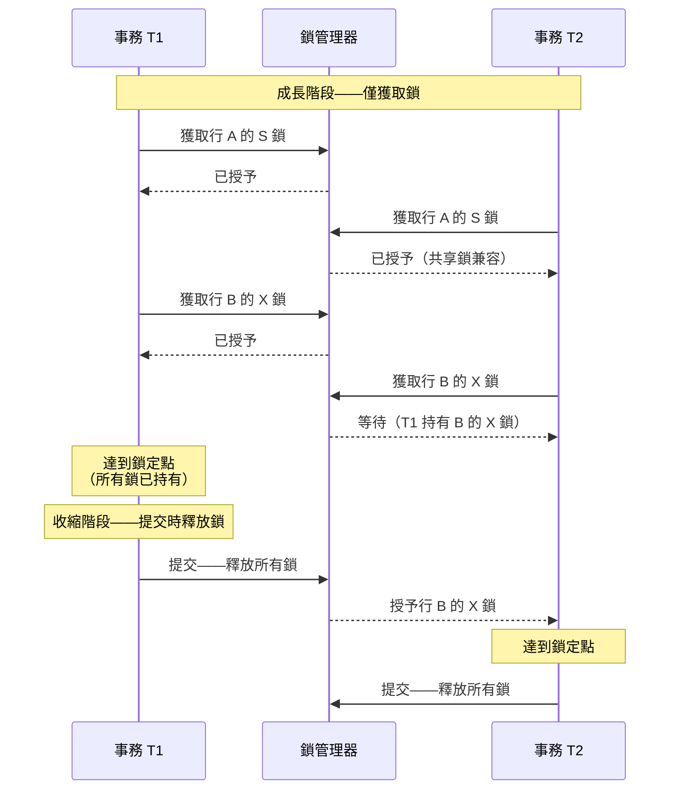

# [BEE-440] 兩階段鎖定

:::info
兩階段鎖定（2PL）通過強制執行一條簡單規則來保證可序列化：事務在釋放第一把鎖後不得再獲取任何新鎖——將執行分為成長階段（僅獲取鎖）和收縮階段（僅釋放鎖）——這使其成為悲觀並發控制可以產生正確並發調度的經典證明。
:::

## Context

數據庫鎖定的理論基礎由 Jim Gray、Raymond Lorie、Gianfranco Putzolu 和 Irving Traiger 在「共享數據庫中鎖的粒度和一致性程度」（IFIP 數據庫管理系統建模工作會議，1976 年）中確立。該論文引入了鎖層次結構（數據庫 → 表 → 頁 → 行 → 字段）、共享鎖和排他鎖的兼容性矩陣，以及可序列化性源於兩階段鎖定規則的觀察。Philip Bernstein、Vassos Hadzilacos 和 Nathan Goodman 在「數據庫系統中的並發控制與恢復」（Addison-Wesley，1987 年）——這本可從 Microsoft Research 免費獲取的權威教科書——中對此進行了形式化和擴展。Jim Gray 和 Andreas Reuter 的「事務處理：概念與技術」（Morgan Kaufmann，1992 年）將這一理論轉化為商業數據庫在整個 1990 年代和 2000 年代採用的工程實踐。

2PL 解決的核心問題是**寫-寫和讀-寫衝突排序**。當兩個事務並發訪問同一數據項時，它們的操作MUST（必須）按照等同於某個串行執行的方式排序。如果沒有強制排序的協議，事務可能讀取另一個尚未提交的事務所寫的數據（臟讀）、重新讀取兩次讀取之間已被修改的數據（不可重複讀），或在第二次執行時發現與查詢謂詞匹配的新行（幻讀）。2PL 通過強制衝突操作等待來防止這些異常：持有共享（讀）鎖的事務會阻塞寫入者；持有排他（寫）鎖的事務會同時阻塞讀取者和寫入者。

2PL 保證衝突可序列化性的證明源於**鎖定點**：事務同時持有所有鎖的時刻。調度中所有事務的鎖定點定義了一個串行順序——先到達鎖定點的事務定義了一個時間點優先級。如果鎖定點順序為 T1、T2、T3，則調度等同於先執行 T1，再執行 T2，最後執行 T3 的串行執行。因為 2PL 的兩階段規則在某個時間點強制每個事務同時持有其所有鎖，所以有效的鎖定點順序總是存在的，調度是可序列化的。

在實踐中，現代數據庫使用**嚴格 2PL**（也稱為強嚴格 2PL 或 SS2PL），它在事務提交或回滾前保持所有鎖。基本 2PL 可以在提交前釋放讀鎖，但這樣做允許級聯中止：如果 T1 釋放讀鎖，T2 然後更新並提交，如果 T1 隨後中止，T2 的已提交寫入就建立在 T1 的讀取之上——這是不一致的。嚴格 2PL 通過在事務結果確定之前保持所有鎖來防止這種情況。PostgreSQL、MySQL InnoDB、Oracle 和 SQL Server 都將嚴格 2PL 實現為其默認鎖定協議。

## Design Thinking

**2PL 和 MVCC 解決並發問題的不同方面。** 2PL 的讀鎖阻塞並發寫入者，寫鎖阻塞並發讀取者和寫入者。多版本並發控制（MVCC）通過維護每行的多個版本來消除讀-寫阻塞：讀取者看到從其事務開始時間起的一致快照，從不獲取鎖；寫入者創建新版本而不使舊版本失效。大多數生產數據庫（PostgreSQL、MySQL InnoDB、Oracle）對讀-寫衝突使用 MVCC，對寫-寫衝突僅使用 2PL 風格的鎖定。結果是 SELECT 語句永遠不會阻塞 INSERT/UPDATE/DELETE，反之亦然——這對讀密集型工作負載是一個關鍵的操作屬性。

**鎖粒度是吞吐量-隔離性的取捨。** 表級鎖獲取和持有成本低，但會序列化該表上的所有並發事務。行級鎖允許高並發，但需要更多內存和更多鎖管理器開銷。數據庫鎖層次結構允許混合粒度：事務MAY（可以）在表上持有意向鎖（宣告對其中行進行鎖定的意圖）並對其訪問的特定行持有行級鎖。當事務持有太多行鎖時，MAY（可以）發生從行鎖到表鎖的升級，以減少開銷為代價換取并發性。應用程序級鎖定（SELECT ... FOR UPDATE 與 LOCK TABLE）的粒度選擇SHOULD（應該）由爭用情況驅動：在少量行上的高爭用有利於行鎖；整個表的批量操作MAY（可以）通過表鎖更快，以避免每行開銷。

**死鎖對 2PL 是固有的，MUST（必須）設計應對策略，而非僅做處理。** 任何使用 2PL、具有多個事務和多個可鎖資源的系統都可能發生死鎖。實際的緩解措施——一致的鎖排序、短事務和明確的超時預算——可以降低頻率但無法消除。調用數據庫的應用程序代碼MUST（必須）處理事務回滾和重試。靜默重試死鎖的 ORM 框架可能掩蓋級聯重試風暴；重試邏輯SHOULD（應該）包含抖動和最大嘗試次數。

## Best Practices

**跨事務一致地排序鎖獲取以防止死鎖。** 最常見的死鎖模式是 T1 先鎖定 A 再鎖定 B，而 T2 先鎖定 B 再鎖定 A。如果訪問 A 和 B 的所有事務始終按字母或數字順序鎖定（A 在 B 之前），則無法形成循環等待。對於數據庫行，這意味著在事務中始終按主鍵順序更新行。對於應用程序級資源，定義全局排序並記錄它。

**保持事務短暫以最小化鎖持有時間。** 事務中獲取的鎖一直持有到提交或回滾。一個獲取行鎖然後在提交前調用外部 API 的事務，在整個網絡調用期間持有該鎖——可能是幾秒鐘。重構此類事務：首先完成外部調用，然後打開事務，執行寫入，立即提交。鎖持有時間從秒降至毫秒。

**使用 SELECT ... FOR UPDATE 顯式表示讀後寫的意圖。** 普通 SELECT 獲取共享鎖（或在 MVCC 下不獲取鎖）。如果應用程序打算讀取一行然後根據讀取的值更新它，普通 SELECT 後接 UPDATE 會創建另一個事務可以在讀取和寫入之間修改該行的窗口。SELECT ... FOR UPDATE 在讀取時獲取排他鎖，將 2PL 成長階段擴展到包含讀取，防止並發修改。

**設置鎖等待超時並在應用程序代碼中處理死鎖錯誤。** 每個數據庫都有可配置的鎖等待超時（PostgreSQL：`lock_timeout`，MySQL：`innodb_lock_wait_timeout`，默認 50 秒）。在爭用高峰期，將其保持為默認值可能導致長請求隊列。設置適合 SLA 的超時——交互式請求通常為 1–5 秒——並將由此產生的錯誤視為可重試條件，而非致命故障。死鎖錯誤（PostgreSQL 錯誤碼 40P01，MySQL 1213）與鎖超時錯誤不同，MUST（必須）也進行重試。

**MUST NOT（不得）在用戶交互或外部 I/O 期間持有鎖。** 在等待用戶輸入或應用程序渲染響應頁面時打開的事務，持有鎖的時間不受限制。這種模式（有時稱為框架在 HTTP 請求開始時打開事務的「無 MVCC 的樂觀鎖定」）是鎖爭用的常見來源。MUST NOT（不得）在外部服務的網絡調用、用戶提示或任何具有可變延遲的 I/O 期間保持數據庫事務打開。

## Deep Dive

**2PL 的三個變體具有不同的中止和隔離性質：**

*基本 2PL* 允許在提交前、一旦事務進入收縮階段後釋放鎖。這允許最高的並發性，但允許級聯中止：如果 T1 釋放讀鎖而 T2 在 T1 完成前更新並提交同一行，T1 的後續操作MAY（可以）建立在不再存在的狀態之上。如果 T1 然後中止，調度是不可恢復的。基本 2PL 理論上完整，但實際上未使用。

*嚴格 2PL* 在提交前持有寫（排他）鎖。讀鎖MAY（可以）在收縮階段提前釋放。持有到提交的寫鎖防止臟讀和級聯中止。這是生產系統實現的最低變體。

*嚴格 2PL*（也稱為強嚴格 2PL）在提交前持有所有鎖——讀鎖和寫鎖都持有。它是最安全的變體，也是實際中最常見的，因為它防止所有異常，包括由讀鎖提前釋放引起的異常。PostgreSQL 的行級鎖和 MySQL InnoDB 都在 SERIALIZABLE 隔離下實現嚴格 2PL。

**謂詞鎖解決幻讀問題。** 標準行鎖防止修改現有行。但選擇所有 WHERE salary > 100000 行的事務容易受到幻讀攻擊：並發事務可以插入一個 salary = 150000 的新行，在同一查詢的重新執行中出現。謂詞鎖覆蓋查詢謂詞的邏輯範圍，而非僅覆蓋當前匹配它的行。PostgreSQL 通過**可序列化快照隔離（SSI）**實現這一點：SSI 不是採取顯式謂詞鎖，而是跟蹤並發事務之間的讀-寫依賴關係，如果依賴關係圖包含危險環路（會產生不可序列化調度的反依賴對），則中止事務。MySQL InnoDB 通過**間隙鎖**近似謂詞鎖定：對索引值之間的間隙加鎖，防止向該範圍插入。

**鎖兼容性矩陣決定哪些操作可以並發進行：**

| 請求 \ 持有 | 無鎖 | 共享（S） | 排他（X） |
|---|---|---|---|
| 共享（S） | 授予 | 授予 | 等待 |
| 排他（X） | 授予 | 等待 | 等待 |

PostgreSQL 將其擴展為八種鎖模式，具有更細粒度的兼容性矩陣，允許 VACUUM 等操作（需要 SHARE UPDATE EXCLUSIVE）與讀取並發運行，但不能與模式更改並發運行。

## Visual



## Example

**PostgreSQL：讀後更新的行級鎖定：**

```sql
-- 場景：在賬戶之間轉移資金
-- 錯誤：SELECT 然後 UPDATE 創建競態窗口
BEGIN;
  SELECT balance FROM accounts WHERE id = 1;
  -- 另一個事務可以在此修改 id=1
  UPDATE accounts SET balance = balance - 100 WHERE id = 1;
COMMIT;

-- 正確：SELECT FOR UPDATE 在讀取時獲取 X 鎖
BEGIN;
  SELECT balance FROM accounts WHERE id = 1 FOR UPDATE;
  -- id=1 上持有 X 鎖；並發 UPDATE 必須等到此事務提交
  UPDATE accounts SET balance = balance - 100 WHERE id = 1;
  UPDATE accounts SET balance = balance + 100 WHERE id = 2;
COMMIT;

-- 死鎖預防：始終按主鍵順序鎖定行
BEGIN;
  -- 先鎖較小 ID，再鎖較大 ID——一致的順序防止死鎖
  SELECT * FROM accounts WHERE id IN (1, 2) ORDER BY id FOR UPDATE;
  UPDATE accounts SET balance = balance - 100 WHERE id = 1;
  UPDATE accounts SET balance = balance + 100 WHERE id = 2;
COMMIT;
```

**PostgreSQL：鎖超時和死鎖重試：**

```python
import psycopg2
from psycopg2 import OperationalError
import time
import random

DEADLOCK_ERRCODE = "40P01"
LOCK_TIMEOUT_ERRCODE = "55P03"

def transfer(conn, from_id, to_id, amount, max_retries=3):
    for attempt in range(max_retries):
        try:
            with conn.cursor() as cur:
                # 每個事務的鎖超時——不等待超過 2 秒
                cur.execute("SET LOCAL lock_timeout = '2s'")
                # 按 PK 順序鎖定行以防止死鎖
                ids = sorted([from_id, to_id])
                cur.execute(
                    "SELECT id, balance FROM accounts WHERE id = ANY(%s) ORDER BY id FOR UPDATE",
                    (ids,)
                )
                rows = {row[0]: row[1] for row in cur.fetchall()}
                if rows[from_id] < amount:
                    raise ValueError("資金不足")
                cur.execute(
                    "UPDATE accounts SET balance = balance - %s WHERE id = %s",
                    (amount, from_id)
                )
                cur.execute(
                    "UPDATE accounts SET balance = balance + %s WHERE id = %s",
                    (amount, to_id)
                )
            conn.commit()
            return
        except OperationalError as e:
            conn.rollback()
            if e.pgcode in (DEADLOCK_ERRCODE, LOCK_TIMEOUT_ERRCODE):
                if attempt < max_retries - 1:
                    # 重試前的抖動退避
                    time.sleep(0.05 * (2 ** attempt) + random.uniform(0, 0.05))
                    continue
            raise
```

**MySQL InnoDB：觀察間隙鎖（幻讀預防）：**

```sql
-- 會話 1：在範圍上獲取間隙鎖
SET TRANSACTION ISOLATION LEVEL SERIALIZABLE;
BEGIN;
SELECT * FROM orders WHERE amount > 1000 FOR UPDATE;
-- InnoDB 獲取：匹配行上的記錄鎖 + 該範圍上的間隙鎖

-- 會話 2（並發）：向鎖定範圍插入
INSERT INTO orders (amount) VALUES (1500);
-- 被阻塞：間隙鎖防止向 amount > 1000 範圍插入

-- 會話 1：重新執行相同查詢——不出現幻讀
SELECT * FROM orders WHERE amount > 1000 FOR UPDATE;
-- 返回與之前相同的行；間隙鎖阻止了插入
COMMIT;
-- 會話 2：現在允許繼續
```

## Implementation Notes

**PostgreSQL** 對 SERIALIZABLE 以下的所有隔離級別使用 MVCC，並為完整 SERIALIZABLE 添加可序列化快照隔離（SSI）。行鎖（由 SELECT FOR UPDATE、UPDATE、DELETE 獲取）記錄在行的元組頭中——行鎖無需單獨的鎖表。表級鎖在共享內存的共享鎖表中跟蹤。鎖信息可通過 `pg_locks` 查看。

**MySQL InnoDB** 對 REPEATABLE READ 和 SERIALIZABLE 使用下一鍵鎖定（記錄鎖 + 前一記錄之前間隙的間隙鎖）。在 READ COMMITTED 下，語句後釋放間隙鎖（降低幻讀保護，但提高并發性）。SERIALIZABLE 隔離對每個普通 SELECT 添加共享鎖，有效地將讀取轉換為 SELECT ... FOR SHARE。鎖信息可通過 `information_schema.INNODB_LOCKS` 和 `performance_schema.data_locks`（MySQL 8+）查看。

**應用程序 ORM** 通常隱式打開事務，MAY（可以）不直接暴露 SELECT FOR UPDATE。Django 的 `select_for_update()`、SQLAlchemy 的 `with_for_update()` 和 Hibernate 的 `LockModeType.PESSIMISTIC_WRITE` 各自映射到底層的 SELECT ... FOR UPDATE。使用 ORM 級鎖定時，SHOULD（應該）驗證生成的 SQL，以確保獲取了預期的鎖模式。

## Related BEEs

- [BEE-161](../Transactions/161.md) -- 隔離級別及其異常：2PL 的變體（基本、嚴格、嚴格 2PL）直接映射到隔離級別——SERIALIZABLE 需要嚴格 2PL 或 SSI；REPEATABLE READ 至少需要對寫鎖使用嚴格 2PL；READ COMMITTED 提前釋放讀鎖
- [BEE-245](../Concurrency/245.md) -- 樂觀與悲觀並發控制：2PL 是典型的悲觀協議；樂觀并發控制（OCC）和 MVCC 完全避免讀鎖，將衝突檢測推遲到提交時——選擇取決於爭用率和中止成本
- [BEE-162](../Transactions/162.md) -- 分散式事務與兩階段提交：分散式 2PL 將單節點 2PL 擴展到多個分片；分散式事務MUST（必須）在任何分片釋放鎖之前跨所有參與節點獲取所有鎖，將 2PL 與 2PC 結合以實現原子性
- [BEE-424](424.md) -- 分散式鎖：分散式鎖（Redis SETNX、etcd 租約）在應用程序層實現 2PL 語義——相同的成長階段/收縮階段規則適用，用分散式鎖管理器替代數據庫鎖管理器

## References

- [共享數據庫中鎖的粒度和一致性程度 -- Gray, Lorie, Putzolu, Traiger, 1976](https://www.cs.cmu.edu/~15721-f24/papers/Granularities_of_Locking.pdf)
- [數據庫系統中的並發控制與恢復 -- Bernstein, Hadzilacos, Goodman, Addison-Wesley 1987](https://www.microsoft.com/en-us/research/people/philbe/book/)
- [事務處理：概念與技術 -- Gray and Reuter, Morgan Kaufmann 1992](https://archive.org/details/transactionproce0000gray)
- [顯式鎖定 -- PostgreSQL 文檔](https://www.postgresql.org/docs/current/explicit-locking.html)
- [弱一致性：分散式事務的廣義理論與樂觀實現 -- Adya, MIT 博士論文 1999](https://dspace.mit.edu/handle/1721.1/149899)
- [ANSI SQL 隔離級別批判 -- Berenson, Bernstein, Gray 等人, SIGMOD 1995](https://dl.acm.org/doi/10.1145/223784.223785)
