# [BEE-444] 跳躍串列

:::info
跳躍串列（skip list）是一種機率性資料結構，透過在完整排序鏈結串列之上疊加「快速通道」鏈結串列，以 O(log n) 期望時間維護排序序列的搜尋、插入與刪除——比平衡樹更易實作、更易實現無鎖並行存取，並且是 Redis Sorted Sets 與 LSM-tree 記憶體表（memtable）的主要有序結構。
:::

## 背景

William Pugh 在〈Skip Lists: A Probabilistic Alternative to Balanced Trees〉（Communications of the ACM，1990）中提出跳躍串列，以回應自平衡樹結構的實作複雜性。平衡二元搜尋樹（AVL 樹、紅黑樹）提供 O(log n) 最壞情況效能，但其再平衡演算法——旋轉、色彩翻轉——難以正確實作，且出了名地難以實現執行緒安全。Pugh 的洞見在於：隨機化可以在不需要再平衡的前提下達到相同的期望效能：以概率 p（通常為 1/2 或 1/4）獨立地將每個節點提升到更高的「層級」，所產生的結構以壓倒性的概率給出所有操作 O(log n) 的期望成本。

使跳躍串列廣泛普及的關鍵實際優勢在於**並行修改**。平衡樹的插入或刪除可能觸發影響 O(log n) 個節點的再平衡——在樹中進行多節點細粒度加鎖需要謹慎的鎖定順序協定，並阻礙正在遍歷再平衡子樹的執行緒取得進展。跳躍串列的插入或刪除只修改各層級前驅節點的前向指標——每層上的本地操作，可以透過各指標上的比較並交換（CAS, compare-and-swap）完成，實現無鎖並行存取。Herlihy、Lev、Luchangco 與 Shavit 在〈A Simple Optimistic Skip-List Algorithm〉（Euro-Par，2007）中將並行變體形式化。

Redis 以跳躍串列作為 Sorted Sets 實作的其中一半（另一半是雜湊表，用於 O(1) 成員到分數的查詢）。Redis 選擇跳躍串列而非平衡 BST，依據的是 Antirez 在 2009 年的論述：跳躍串列更易實作與除錯、更易擴充（正向與反向迭代均天然支援），且在實務中效能相當——跳躍串列效能的機率性變異被同樣影響樹遍歷的快取效應所主導。Redis 的跳躍串列使用 p=1/4，最大高度上限為 32。

LevelDB 與 RocksDB 使用跳躍串列作為記憶體表——在新寫入刷新至 L0 SSTable 之前，用於累積寫入的記憶體寫入緩衝區。記憶體表必須支援多執行緒並行寫入，以及刷新時的有序順序迭代（以產生排序好的 SSTable）。跳躍串列兩者皆能滿足：LevelDB 的跳躍串列是無鎖的單寫者/多讀者結構，允許在寫入期間並行讀取；RocksDB 的 `InlineSkipList` 則利用前向指標陣列上的 CAS，進一步擴充為完全並行的多寫者存取。

## 設計思考

**跳躍串列佔據特定的應用場景：具有高寫入並行度的排序記憶體結構。** 紅黑樹提供 O(log n) 保證最壞情況，而跳躍串列提供 O(log n) 期望值——但實務上常數因子有利於跳躍串列，因為樹的再平衡頻繁觸及必須加鎖或可能快取失冷的父節點。當存取模式為多執行緒並行讀寫混合時，跳躍串列的本地更新特性（每層只需修改前驅節點）可實現更細粒度的加鎖或完全無鎖。當資料儲存在磁碟上或快取行密度至關重要時，B-tree 勝出，因為其密集節點佈局可將整個節點放入快取行，並分攤磁碟尋道成本。

**概率 p 控制記憶體與速度的取捨。** 較高的 p（例如 p=1/2）產生較高的節點（平均層數更多），透過提供更多快速通道來減少期望搜尋時間，但每個節點使用更多記憶體。較低的 p（例如 p=1/4）產生較短的節點，減少記憶體但增加每層平均存取節點數。實際工作負載中的交叉點有利於 p=1/4：較少的指標間接操作更能適應 CPU 快取，而每層多存取的節點數上限為 1/(1-p)。LevelDB 基於此原因使用 p=1/4。

**限制最大高度可在不影響期望效能的前提下控制記憶體。** Pugh 的原始分析表明期望層數為 O(log₁/p n)。對於 10 億筆記錄且 p=1/4 的資料集，約為 15 層。LevelDB 上限為 12，RocksDB 上限為 12，Redis 上限為 32。高度服從幾何分布；將上限設為 2 log₁/p n 層，只有在資料集天文數字大時才會影響效能。

## 視覺化

```mermaid
flowchart LR
    subgraph "第 3 層（快速通道）"
        H3["HEAD"]:::head --> N41_3["41"]:::node3 --> T3["TAIL"]:::tail
    end
    subgraph "第 2 層"
        H2["HEAD"]:::head --> N21_2["21"]:::node2 --> N41_2["41"]:::node2 --> N68_2["68"]:::node2 --> T2["TAIL"]:::tail
    end
    subgraph "第 1 層"
        H1["HEAD"]:::head --> N21_1["21"]:::node1 --> N41_1["41"]:::node1 --> N52_1["52"]:::node1 --> N68_1["68"]:::node1 --> T1["TAIL"]:::tail
    end
    subgraph "第 0 層（完整排序串列）"
        H0["HEAD"]:::head --> N1["1"]:::node0 --> N21_0["21"]:::node0 --> N41_0["41"]:::node0 --> N52_0["52"]:::node0 --> N68_0["68"]:::node0 --> N99["99"]:::node0 --> T0["TAIL"]:::tail
    end

    style H3 fill:#2c3e50,color:#fff
    style H2 fill:#2c3e50,color:#fff
    style H1 fill:#2c3e50,color:#fff
    style H0 fill:#2c3e50,color:#fff
    style T3 fill:#2c3e50,color:#fff
    style T2 fill:#2c3e50,color:#fff
    style T1 fill:#2c3e50,color:#fff
    style T0 fill:#2c3e50,color:#fff
    style N41_3 fill:#e74c3c,color:#fff
    style N21_2 fill:#e67e22,color:#fff
    style N41_2 fill:#e74c3c,color:#fff
    style N68_2 fill:#e67e22,color:#fff
    style N21_1 fill:#e67e22,color:#fff
    style N41_1 fill:#e74c3c,color:#fff
    style N52_1 fill:#27ae60,color:#fff
    style N68_1 fill:#e67e22,color:#fff
    style N1 fill:#3498db,color:#fff
    style N21_0 fill:#e67e22,color:#fff
    style N41_0 fill:#e74c3c,color:#fff
    style N52_0 fill:#27ae60,color:#fff
    style N68_0 fill:#e67e22,color:#fff
    style N99 fill:#3498db,color:#fff
```



*搜尋鍵值 52：從第 3 層 HEAD 開始 → 41 < 52，前進 → 到達 TAIL，降至第 2 層 → 41 < 52，前進 → 68 > 52，降至第 1 層 → 找到 52。比較次數：5 次，而非第 0 層的 7 次。*

## 最佳實務

**對通用記憶體跳躍串列使用 p=1/4。** 相較於 p=1/2，記憶體節省顯著（平均每節點 4/3 個指標 vs 2 個指標），且由於較短的節點陣列更能放入快取行，CPU 快取行為也有所改善。LevelDB、RocksDB 及大多數生產跳躍串列實作均使用 p=1/4。僅在效能剖析確認搜尋延遲為主要瓶頸且記憶體不受限時，才改用 p=1/2。

**將最大高度上限設為 ⌈log₁/p n⌉ 加上小常數。** 若不設高度上限，每個新節點隨機生成的高度服從無上界的幾何分布。實務上，對於最多 N = 2^32 個元素且 p = 1/4 的跳躍串列，設最大高度為 16 即已足夠。超過 2 log₁/p n 的高度分配幾乎沒有任何效益，卻浪費記憶體。

**對並行跳躍串列使用惰性（標記後清除）刪除。** 在並行存取下直接刪除需要跨多層原子更新所有前驅前向指標——這是一個非原生原子的多 CAS 操作。惰性刪除將邏輯刪除（在節點上設置 `deleted` 旗標，一次原子寫入）與物理移除（CAS 更新前驅指標，伺機執行）分離。讀者跳過標記節點；背景執行緒或下一個遍歷該區域的寫入者執行物理移除。這是 Java `ConcurrentSkipListMap` 和 Herlihy 等人演算法採用的方式。

**對跳躍串列節點使用競技場記憶體分配（arena allocation）。** 每個插入節點需要大小可變的堆積分配（取決於其高度）。在高吞吐量工作負載下（例如每秒接收 10 萬次寫入的記憶體表），malloc/free 的開銷佔主導地位。競技場分配器預先分配大塊記憶體，並用指標碰撞方式分配各節點——LevelDB 的記憶體表使用 `Arena` 類別，使所有分配為 O(1)，並在刷新時以一次操作釋放整個記憶體表。

**當需要支援雙向迭代與排名查詢時，優先選用跳躍串列而非 BST。** 跳躍串列支援 O(log n) 按分數排名（Redis 的 ZRANK）、O(log n) 範圍查詢（ZRANGEBYSCORE），以及透過第 0 層排序串列的 O(1) 順序前進/後退掃描。要讓平衡 BST 支援排名，需要在每個節點儲存子樹大小並在旋轉時傳播更新——跳躍串列透過每層指標的跨度計數器（span counter）達到相同效果，LevelDB 與 Redis 均已實作。

## 深入探討

**搜尋演算法。** 從最高層的 HEAD 節點開始。在每一層，當下一個節點的鍵值小於搜尋目標時，持續前進當前指標。當下一個鍵值將超過目標（或到達 TAIL）時，下降一層並重複。在第 0 層找到目標鍵值為命中；在第 0 層未找到目標鍵值為未命中。不變性為：在每一層，當前指標是該層中鍵值小於搜尋目標的最右節點。這保證下降時能從下層的正確位置恢復搜尋。

**插入演算法。** 執行搜尋，在 `update[]` 陣列中記錄每一層的前驅節點。為新節點隨機抽取高度 h。對每一層 0 到 h-1，將新節點插入 `update[level]` 與 `update[level]->forward[level]` 之間。在循序實作中，無需加鎖。在並行實作中，先對第 0 層連結使用 CAS；若成功，節點已邏輯存在，後續較高層的連結可使用重試迴圈安裝。在較高層連結安裝完成前觀察到該節點的並行讀者，直接使用第 0 層遍歷——正確性得以維護。

**期望成本分析。** 以 p=1/4 而言，搜尋期間檢查的節點期望數量，以任意給定層中相鄰兩節點間的期望節點數為界。根據隨機高度分布，第 k 層指標跨越期望 1/p^k = 4^k 個位置。從第 0 層升至第 h 層的總期望工作量為幾何級數：Σ (1/p^k)（k 從 0 到 h）以 O(1/(1-p)) = O(4/3) 每層為界，共有 O(log₄ n) 層，得出 O((4/3) log₄ n) = O(log n) 次比較。

**無鎖多寫者跳躍串列（RocksDB `InlineSkipList`）。** RocksDB 的 `InlineSkipList` 透過在插入節點前預先分配其前向指標陣列，並使用單一 CAS 在第 0 層將節點發布到串列，支援多個並行寫者。關鍵特性在於：節點高度（以及其前向陣列大小）在發布前已確定——一旦節點可見，讀者即可安全存取前向陣列。較高層的連結在第 0 層發布後循序安裝；這是安全的，因為正確性的唯一保證是所有透過第 0 層可到達的元素均存在，而這已由第 0 層的 CAS 建立。

## 範例

**最精簡的 Python 跳躍串列（演示演算法）：**

```python
import random

MAX_LEVEL = 16
P = 0.25  # 提升概率 (p = 1/4)

class SkipNode:
    def __init__(self, key, value, level):
        self.key = key
        self.value = value
        self.forward = [None] * (level + 1)  # forward[i] = 第 i 層的下一個節點

class SkipList:
    def __init__(self):
        self.head = SkipNode(float('-inf'), None, MAX_LEVEL)
        self.level = 0  # 目前使用的最大層數

    def _random_level(self) -> int:
        """以參數 P 的幾何分布抽取高度。"""
        h = 0
        while h < MAX_LEVEL and random.random() < P:
            h += 1
        return h

    def search(self, key) -> object | None:
        cur = self.head
        for i in range(self.level, -1, -1):          # 從頂層開始
            while cur.forward[i] and cur.forward[i].key < key:
                cur = cur.forward[i]                  # 向右前進
        cur = cur.forward[0]
        return cur.value if cur and cur.key == key else None

    def insert(self, key, value):
        update = [None] * (MAX_LEVEL + 1)
        cur = self.head
        for i in range(self.level, -1, -1):
            while cur.forward[i] and cur.forward[i].key < key:
                cur = cur.forward[i]
            update[i] = cur                           # 記錄每層的前驅節點

        h = self._random_level()
        if h > self.level:                            # 新的最高層——從 head 連結
            for i in range(self.level + 1, h + 1):
                update[i] = self.head
            self.level = h

        node = SkipNode(key, value, h)
        for i in range(h + 1):
            node.forward[i] = update[i].forward[i]   # 插入各層
            update[i].forward[i] = node

    def delete(self, key) -> bool:
        update = [None] * (MAX_LEVEL + 1)
        cur = self.head
        for i in range(self.level, -1, -1):
            while cur.forward[i] and cur.forward[i].key < key:
                cur = cur.forward[i]
            update[i] = cur

        target = cur.forward[0]
        if not target or target.key != key:
            return False

        for i in range(self.level + 1):
            if update[i].forward[i] != target:        # 此層不含目標節點
                break
            update[i].forward[i] = target.forward[i]  # 解除連結

        while self.level > 0 and self.head.forward[self.level] is None:
            self.level -= 1                           # 縮減未使用的頂層
        return True
```

**Redis Sorted Set：跳躍串列的實務應用：**

```redis
# Sorted sets 使用跳躍串列（用於範圍查詢）+ 雜湊表（用於 O(1) 成員查詢）

# 插入：O(log n)
ZADD leaderboard 1500 "alice"
ZADD leaderboard 2300 "bob"
ZADD leaderboard 1800 "carol"

# 點查詢：透過雜湊表一半 O(1)
ZSCORE leaderboard "alice"   # → "1500"

# 排名查詢：透過帶跨度計數器的跳躍串列 O(log n)
ZRANK leaderboard "alice"    # → 0（以 0 為起始，按分數升序）
ZREVRANK leaderboard "alice" # → 2（降序）

# 按分數範圍查詢：O(log n + k)，k 為結果數量
ZRANGEBYSCORE leaderboard 1500 2000 WITHSCORES
# → ["alice", "1500", "carol", "1800"]

# 按排名範圍查詢：O(log n + k) — 二元搜尋後遍歷第 0 層串列
ZRANGE leaderboard 0 -1 WITHSCORES  # 完整排序順序

# Sorted set 內部：當集合大小 > zset-max-listpack-entries（128）
# 或任一成員 > zset-max-listpack-value（64 位元組）時使用跳躍串列
CONFIG SET zset-max-listpack-entries 128
CONFIG SET zset-max-listpack-value 64
```

**LevelDB 跳躍串列常數（來自原始碼）：**

```cpp
// 來自 google/leveldb: db/skiplist.h
template <typename Key, class Comparator>
class SkipList {
 private:
  enum { kMaxHeight = 12 };  // 上限為 12，適用於最多 4^12 ≈ 1600 萬筆資料的資料集

  // 隨機高度：每個額外層以 1/4 的概率增加
  int RandomHeight() {
    static const unsigned int kBranching = 4;  // p = 1/4
    int height = 1;
    while (height < kMaxHeight && (rnd_.Next() % kBranching == 0)) {
      height++;
    }
    return height;
  }
};
// p=1/4、kMaxHeight=12 時的節點高度分布：
// height=1: 75% 的節點   ← 大多數節點只有第 0 層連結
// height=2: 18.75%
// height=3: 4.7%
// height=4: 1.2%
// ...
// 每節點平均指標數 = 1 / (1 - 0.25) = 4/3 ≈ 1.33 個前向指標/節點
```

## 相關 BEE

- [BEE-443](443.md) -- Log-Structured Merge Trees：LevelDB 與 RocksDB 的 LSM-tree 記憶體表以並行跳躍串列實作——跳躍串列提供刷新時產生排序 SSTable 所需的有序迭代，以及在不序列化全域鎖的前提下維持高寫入吞吐量所需的無鎖並行寫入存取
- [BEE-431](431.md) -- Bloom Filters and Probabilistic Data Structures：跳躍串列與布隆過濾器均為機率性的——跳躍串列使用隨機提升以達到期望 O(log n) 效能；布隆過濾器使用隨機雜湊以達到期望 O(1) 集合成員查詢；兩者同時出現在相同的系統中（LevelDB/RocksDB 跳躍串列記憶體表 + 每個 SSTable 的布隆過濾器）
- [BEE-242](../Concurrency/242.md) -- Locks, Mutexes, and Semaphores：並行跳躍串列是使用比較並交換而非互斥鎖的無鎖資料結構的典型範例；惰性刪除模式（標記後物理移除）展示了如何在不使用全域鎖的前提下實現線性化

## 參考資料

- [Skip Lists: A Probabilistic Alternative to Balanced Trees -- William Pugh, CACM 1990](https://dl.acm.org/doi/10.1145/78973.78977)
- [A Simple Optimistic Skip-List Algorithm -- Herlihy, Lev, Luchangco, Shavit, Euro-Par 2007](https://people.csail.mit.edu/shanir/publications/LazySkipList.pdf)
- [What Cannot be Skipped About the Skiplist: A Survey -- arXiv 2024](https://arxiv.org/abs/2403.04582)
- [Sorted Sets -- Redis Documentation](https://redis.io/docs/latest/develop/data-types/sorted-sets/)
- [Skip List Implementation -- LevelDB Source](https://github.com/google/leveldb/blob/main/db/skiplist.h)
- [InlineSkipList Implementation -- RocksDB Source](https://github.com/facebook/rocksdb/blob/main/memtable/inlineskiplist.h)
