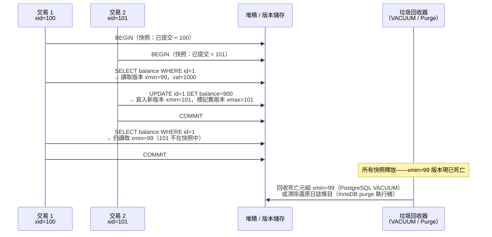

# [BEE-445] MVCC：多版本並行控制

:::info
MVCC（Multi-Version Concurrency Control，多版本並行控制）是一種並行方案，透過保留每列帶時間戳的多個版本，使讀者永不阻塞寫者、寫者永不阻塞讀者：每個交易看到資料庫在其開始時間的一致快照，而並行更新會建立新版本，而非就地覆寫資料。
:::

## 背景

David P. Reed 在其 1978 年 MIT 博士論文「Naming and Synchronization in a Decentralized Computer System」中描述了多版本化的基本原則——這是第一個嚴謹論述保留資料物件多個版本以讓讀者與寫者無需相互阻塞的研究。Philip Bernstein 與 Nathan Goodman 在〈Concurrency Control in Distributed Database Systems〉（ACM Computing Surveys，1981）中系統化了此理論，將多版本方案與單版本鎖定協定並列分類，並證明了其在可序列化下的等價性。

最早的商業實作出現在 1984 年，由 Digital Equipment Corporation 的 VAX Rdb/ELN 實現。Oracle Database 同年採用 MVCC，率先推出還原段（undo-segment）架構，MySQL InnoDB 後來加以推廣：當前已提交版本存放於主資料表，歷史版本則透過重播還原日誌條目重建。Michael Stonebraker 的 Postgres 專案（1985）選擇相反的設計：一列的所有版本按序寫入堆積（heap），不需要獨立的還原日誌，可支援時間點查詢，但需要定期垃圾回收（VACUUM）來回收空間。

Wu 等人發表了〈An Empirical Evaluation of In-Memory Multi-Version Concurrency Control〉（VLDB，2017）——對任何 MVCC 系統四個關鍵設計維度的系統性研究：(1) 版本儲存格式（僅附加堆積、差量儲存或時間旅行表）；(2) 垃圾回收策略（元組層級、交易層級或紀元層級）；(3) 索引管理（邏輯 vs 物理版本指標）；以及 (4) 交易 ID 分配。此分類法統一了原本被視為各資料庫實作細節的概念，形成了比較 MVCC 設計的概念框架。

## 設計思考

**MVCC 的根本取捨：讀取吞吐量換取寫入空間放大。** 在兩階段鎖定（2PL）下，寫者必須持有阻塞並行讀者的鎖。在 MVCC 下，寫者附加新版本，讀者存取對應的舊版本——讀者與寫者從不競爭同一資源。這消除了主導 OLTP 工作負載的讀寫鎖定瓶頸，代價是必須最終回收累積的舊列版本。

**版本儲存架構決定讀取路徑成本。** 有三種設計：(1) *僅附加*（PostgreSQL）：一列的所有版本以新堆積元組寫入，透過 ctid 鏈反向連結。讀者存取一列如果有一百次更新歷史，就需要遍歷一百個堆積元組。(2) *差量儲存*（InnoDB）：主資料表存放當前已提交版本；歷史版本以差量記錄存放於還原日誌，透過回滾指標連結。讀取當前版本的讀者零開銷；需要舊版本的讀者支付的重建成本與中間更新次數成正比。(3) *時間旅行表*：次要儲存存放舊版本，主資料表始終存放當前資料。此變體出現在某些分析引擎中。在實務中，對於 OLTP 而言差量儲存勝出，因為常見情況——讀取最新已提交版本——零成本。

**快照隔離（SI）不等於可序列化。** MVCC 天然提供快照隔離：每個交易從交易開始時取得的凍結快照讀取，因此不可重複讀和幻讀無法發生。然而，寫入偏斜異常仍可能發生（兩個交易讀取重疊資料，各自更新不相交的子集，產生完全可序列化執行下兩者均不允許的狀態）。可序列化隔離需要額外機制——謂詞鎖（2PL）或危險讀寫反依賴中止（可序列化快照隔離，BEE-442）。大多數 MVCC 資料庫預設為快照隔離而非可序列化隔離。

## 視覺化



## 最佳實務

**保持交易簡短以降低版本累積。** 每個活躍交易持有一個快照，並阻止對比其快照下限更新的任何版本進行垃圾回收。在寫入密集型資料表上長時間執行的讀取交易，會導致死亡元組累積（PostgreSQL）或還原日誌增長（InnoDB），增長量與寫入速率乘以交易持續時間成正比。在等待應用程式邏輯時，**不得（MUST NOT）** 保持閒置交易開啟狀態。

**對寫入密集的 PostgreSQL 資料表積極調整 autovacuum。** 預設的 autovacuum 閾值（當 20% 的列死亡時觸發）是為中等工作負載校準的。寫入密集的資料表**應該（SHOULD）** 使用每資料表覆寫設定：`autovacuum_vacuum_scale_factor = 0.01`（1%）和 `autovacuum_vacuum_cost_delay = 2ms`。監控 `pg_stat_user_tables.n_dead_tup` 和 `pg_stat_user_tables.last_autovacuum` 以確認 vacuum 能夠跟上進度。

**監控交易 ID 年齡以防止 XID 環繞。** PostgreSQL 使用 32 位元交易 ID，在環繞前最多約 20 億筆交易。當資料表最舊的未凍結 XID 超過 `autovacuum_freeze_max_age`（預設 2 億）時，autovacuum 會執行以凍結元組——但如果跟不上進度，PostgreSQL 會進入強制關閉模式。當 `pg_database` 中的 `age(datfrozenxid)` 超過 15 億時，**必須（MUST）** 發出警報。

**對於 InnoDB，監控還原日誌長度和清除延遲。** InnoDB 的 purge 執行緒在所有活躍讀取視圖釋放後回收還原日誌條目。在寫入密集的 MySQL 實例上長時間執行的交易，會導致還原日誌增長並降低所有查詢的效能（purge 執行緒無法跟上）。監控 `SHOW ENGINE INNODB STATUS` 中的 `History list length`；超過 10,000 表示存在清除延遲。

**不要假設快照隔離能防止所有異常。** 對於寫入偏斜會產生不正確結果的操作（例如「至少一位醫生值班」不變量、飯店預訂雙重分配），**應該（SHOULD）** 明確使用 `SERIALIZABLE` 隔離或應用程式層級約束。在快照隔離下，兩個交易均讀取一致狀態且均提交——只有 `SERIALIZABLE` 或明確鎖定才能防止此異常。

**使用 `SELECT ... FOR UPDATE` 對將被更新的讀取進行序列化。** 當交易基於讀取值來更新某列時，普通的 MVCC 讀取不會阻止其他交易並行更新同一列。`SELECT ... FOR UPDATE` 將讀取提升為更新鎖，阻塞該列的並行寫者——結合了 MVCC 的非阻塞讀取行為與針對特定被修改列的悲觀控制。

## 深入探討

**PostgreSQL 元組可見性演算法。** 每個堆積元組有兩個隱藏欄位：`xmin`（插入此版本的交易 XID）和 `xmax`（刪除或更新它的交易 XID，若仍存活則為 0）。在語句開始時（READ COMMITTED）或交易開始時（REPEATABLE READ / SERIALIZABLE），PostgreSQL 擷取一個快照：該時刻正在進行中的 XID 集合。元組版本對一個交易可見，若：(1) `xmin` 已提交且不在快照的進行中集合中（插入交易在快照建立前已提交），且 (2) `xmax` 為 0，或 `xmax` 在進行中集合中，或 `xmax` 是當前交易自身的 XID（刪除交易仍未提交）。PostgreSQL 將提交/中止狀態存放在 `pg_xact`（前身為 `pg_clog`）——以 XID 為索引的位元陣列——每次可見性檢查時查詢。

**InnoDB 讀取視圖與還原鏈。** 當 InnoDB 交易開始第一次一致性讀取時，它建立一個*讀取視圖*：擷取該時刻最小和最大活躍交易 ID，以及兩者之間所有活躍交易 ID 的列表。主資料表的每一列存放兩個隱藏欄位：`DB_TRX_ID`（寫入當前版本的交易）和 `DB_ROLL_PTR`（指向還原日誌中前一個版本的指標）。若 `DB_TRX_ID` 比讀取視圖的上限更新，InnoDB 跟隨 `DB_ROLL_PTR` 從還原日誌擷取前一個版本，重複直至找到對讀取視圖可見的版本或用盡歷史記錄。

**CockroachDB：帶混合邏輯時鐘的分散式 MVCC。** CockroachDB 在 RocksDB 之上實作 MVCC：每個鍵值對以時間戳後綴 `key@timestamp` 存放，所有版本在 LSM-tree 中按排序順序存放。時間戳是混合邏輯時鐘（HLC）——掛鐘時間與邏輯計數器的組合——即使在時鐘偏斜的情況下，也能在分散式節點間保持單調遞增。交易的讀取時間戳決定其看到哪個版本。垃圾回收作為每個範圍上的背景程序執行，壓縮 HLC 時間戳早於該範圍 GC TTL（預設 25 小時）且存在更新已提交版本的舊版本。

## 範例

**在 PostgreSQL 中觀察 MVCC 內部機制：**

```sql
-- 建立資料表並插入一列
CREATE TABLE accounts (id INT PRIMARY KEY, balance INT);
INSERT INTO accounts VALUES (1, 1000);

-- 查看元組的 xmin/xmax
SELECT xmin, xmax, * FROM accounts WHERE id = 1;
-- xmin=501, xmax=0, id=1, balance=1000

-- 工作階段 A：開始一個長時間執行的交易
BEGIN;  -- xid = 502
SELECT balance FROM accounts WHERE id = 1;
-- 看到 balance=1000（xmin=501 已提交，xmax=0）

-- 工作階段 B：更新列（立即提交）
UPDATE accounts SET balance = 900 WHERE id = 1;  -- xid = 503
-- PostgreSQL 寫入一個新元組：xmin=503, xmax=0, balance=900
-- 標記舊元組：xmin=501, xmax=503

-- 回到工作階段 A：仍看到原始值
SELECT balance FROM accounts WHERE id = 1;
-- 返回 1000 —— 快照在 xid=503 提交前建立

-- 檢查累積的死亡元組
SELECT relname, n_dead_tup, last_autovacuum
FROM pg_stat_user_tables WHERE relname = 'accounts';

-- 直接查看元組版本（需要 pageinspect 擴充）
CREATE EXTENSION IF NOT EXISTS pageinspect;
SELECT t_xmin, t_xmax, t_infomask, t_data
FROM heap_page_items(get_raw_page('accounts', 0));
-- 顯示舊元組（xmin=501, xmax=503）和新元組（xmin=503, xmax=0）
```

**監控 XID 年齡和 autovacuum 健康狀態：**

```sql
-- 警報閾值：年齡 > 15 億表示在 5 億筆交易內有環繞風險
SELECT datname,
       age(datfrozenxid)                   AS xid_age,
       2000000000 - age(datfrozenxid)      AS xids_until_wraparound
FROM pg_database
ORDER BY xid_age DESC;

-- 每資料表 vacuum 狀態
SELECT schemaname, relname,
       n_live_tup, n_dead_tup,
       round(n_dead_tup::numeric / NULLIF(n_live_tup + n_dead_tup, 0) * 100, 1) AS dead_pct,
       last_autovacuum,
       last_autoanalyze
FROM pg_stat_user_tables
WHERE n_dead_tup > 1000
ORDER BY dead_pct DESC;

-- 為寫入密集的資料表調整 autovacuum
ALTER TABLE accounts SET (
  autovacuum_vacuum_scale_factor = 0.01,   -- 以 1% 死亡元組觸發（vs 預設 20%）
  autovacuum_vacuum_cost_delay = 2,        -- 降低 I/O 節流延遲
  autovacuum_freeze_max_age = 150000000    -- 比預設 2 億更早凍結
);
```

**InnoDB 還原日誌監控：**

```sql
-- 監控清除延遲——History list length 應低於 10,000
SHOW ENGINE INNODB STATUS\G
-- 尋找：History list length 4523
-- 較大的值表示長時間執行的交易正在阻塞還原日誌清除

-- 找到阻塞的長時間執行交易
SELECT trx_id, trx_started, trx_state,
       TIMESTAMPDIFF(SECOND, trx_started, NOW()) AS duration_s,
       trx_query
FROM information_schema.INNODB_TRX
ORDER BY trx_started ASC
LIMIT 5;
```

## 相關 BEE

- [BEE-161](../Databases/161.md) -- Isolation Levels and Their Anomalies：隔離級別（READ COMMITTED、REPEATABLE READ、SERIALIZABLE）直接對應 MVCC 快照的建立時機和可見性規則的應用方式；MVCC 是在不加鎖的情況下實作快照隔離的機制
- [BEE-440](440.md) -- Two-Phase Locking：2PL 與 MVCC 是兩種主要的並行控制系列；MVCC 以版本累積和 GC 開銷為代價消除讀寫阻塞，而 2PL 以阻塞為代價消除版本開銷；大多數現代資料庫使用混合方式（MVCC 用於讀取，2PL 或 CAS 用於寫寫衝突偵測）
- [BEE-442](442.md) -- Serializable Snapshot Isolation：SSI 是 PostgreSQL 用於將 MVCC 快照隔離提升為完全可序列化的機制，透過追蹤並行交易之間的讀寫反依賴，並中止形成危險結構的交易
- [BEE-160](../Databases/160.md) -- ACID Properties：MVCC 的版本化讀取是實作 ACID 隔離性和一致性屬性的機制——持久性由 WAL 處理，原子性由還原日誌或回滾段處理，而並行交易看到一致快照的隔離保證則由 MVCC 提供

## 參考資料

- [Naming and Synchronization in a Decentralized Computer System -- David P. Reed, MIT PhD Dissertation, 1978](https://dspace.mit.edu/handle/1721.1/16279)
- [Concurrency Control in Distributed Database Systems -- Bernstein and Goodman, ACM Computing Surveys, 1981](https://dl.acm.org/doi/10.1145/356842.356846)
- [An Empirical Evaluation of In-Memory Multi-Version Concurrency Control -- Wu et al., VLDB 2017](https://www.vldb.org/pvldb/vol10/p781-Wu.pdf)
- [Routine Vacuuming -- PostgreSQL Documentation](https://www.postgresql.org/docs/current/routine-vacuuming.html)
- [InnoDB Multi-Versioning -- MySQL Documentation](https://dev.mysql.com/doc/refman/8.4/en/innodb-multi-versioning.html)
- [Storage Layer -- CockroachDB Architecture Documentation](https://www.cockroachlabs.com/docs/stable/architecture/storage-layer)
