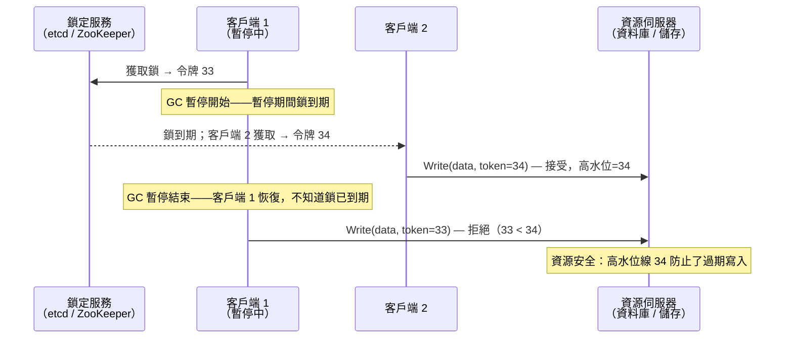

# [BEE-447] 隔離令牌

:::info
隔離令牌（fencing token）是鎖定服務在每次授予鎖時發出的單調遞增數字；被保護的資源會拒絕任何令牌低於已接受最高令牌的寫入請求，從而防止過期的鎖定持有者在租約靜默到期後破壞共享狀態。
:::

## 背景

分散式鎖和租約看似能防止對共享資源的並行修改，但它們帶有一個微妙且危險的假設：鎖定持有者持續知道自己是否仍持有鎖。實際上，持有租約的程序可能被暫停任意長的時間——停止世界的垃圾回收暫停、作業系統排程器強占、虛擬機即時遷移，或暫時隔離節點的網路分割。在此暫停期間，租約可能到期並重新發放給另一個客戶端；當暫停的程序恢復時，它並不知道這件事發生了。它繼續向共享資源寫入，與新的合法鎖定持有者競爭。

Martin Kleppmann 在其 2016 年博客文章〈How to do distributed locking〉中精確地闡明了這個失敗模式，並提出了隔離令牌作為解決方案。機制很簡單：每次客戶端獲取鎖時，鎖定服務發出一個嚴格大於所有先前發出的令牌的整數。對被保護資源的每次寫入都包含當前令牌。資源伺服器記錄已處理的最高令牌；它拒絕任何令牌低於此高水位線的寫入。令牌為 33 的暫停客戶端恢復後會被拒絕，因為資源已接受了新鎖定持有者令牌為 34 的寫入。

"隔離"（fencing）這個詞在高可用叢集管理中也以相關但不同的含義出現。在那個語境中，隔離是指強制將疑似故障的節點從共享資源的存取中排除，可透過切斷其電源（STONITH："Shoot The Other Node In The Head"，擊斃另一個節點）、撤銷其 SAN 分區，或傳送封鎖節點磁碟存取的 SCSI-3 永久預留來實現。兩種用法共享相同的不變性：資源（儲存、叢集服務）主動執行排除，而非信任鎖定持有者自我管控。

## 設計思考

**鎖本身是不夠的——資源必須參與。** 在 ZooKeeper、etcd 或 Redis 中實作的分散式鎖提供客戶端協調的集合點，但它們無法物理阻止客戶端在租約到期後向資料庫或文件系統寫入。被保護的資源必須了解鎖的當前世代，並主動對其進行寫入控制。這是隔離令牌模式的核心：安全性由資源提供，而非由鎖定服務提供。

**程序暫停是無界的，且對暫停的程序不可見。** JVM 中的垃圾回收暫停可能持續數百毫秒至數秒（在 major GC 期間）；記憶體壓力下的容器可能被 CPU 節流數秒；虛擬機快照可能凍結執行數十秒。正在經歷暫停的程序無法知道被暫停了多久——`System.currentTimeMillis()` 或掛鐘時間無法從暫停的程序內部偵測到到期。隔離令牌將鎖的"世代"外部化到資源伺服器，後者未被暫停，可以客觀地評估令牌。

**令牌來源必須是可線性化的。** 如果鎖定服務從複製狀態機（ZooKeeper、etcd/Raft）發出令牌，令牌就是可線性化的：令牌 34 是在令牌 33 被授予並釋放後可被驗證地發出的。如果令牌來源是非線性化系統（非 WAIT 配置的 Redis、Redlock 中的多個 Redis 主節點），令牌可能在領導者故障轉移期間亂序發出或重複——違反隔離所依賴的單調性不變量。Kleppmann 對 Redlock 的批評核心正在於此：Redlock 不產生單調遞增的令牌，無法支援隔離。

## 視覺化



## 最佳實務

**必須（MUST）在對被保護資源的每次寫入中包含隔離令牌。** 一次不含令牌檢查的寫入就足以破壞狀態。令牌必須從鎖定獲取流向每一個接觸共享狀態的操作——作為請求標頭、資料庫欄位或訊息屬性傳遞。如果無法包含（例如，下游系統沒有條件寫入的概念），需明確記錄此缺口，並將系統視為僅提供盡力排除。

**資源伺服器必須（MUST）維護單調高水位線並拒絕過期令牌。** 資源端的檢查為：`if incoming_token < high_water_mark: reject`。高水位線本身必須耐久儲存（或在可線性化儲存中），以便在資源伺服器重啟後存活。只在記憶體中檢查令牌的資源伺服器，在重啟時會遺失高水位線，允許過期客戶端在資源伺服器重啟後立即成功。

**選擇具有可驗證線性化的隔離令牌來源。** 對於 ZooKeeper 支援的鎖，使用 zxid 或鎖 znode 的 cversion——兩者都是由 ZooKeeper 法定群組維護的單調遞增全域計數器。對於 etcd 支援的鎖，使用鎖鍵的建立版本號（在鎖定響應的 `header.revision` 中提供）——etcd 的 Raft 日誌保證這是全域有序的。**不得（MUST NOT）** 使用掛鐘時間戳、隨機 UUID 或來自非線性化來源的任何值作為隔離令牌。

**不得（MUST NOT）僅依賴租約 TTL 作為唯一保護。** 租約可能在鎖定服務的時鐘上到期，而持有者正在暫停；在到期時刻，持有者和資源都不知道這件事。隔離令牌將排除執行與鎖定服務的及時性解耦——即使鎖定服務本身被分割或緩慢，資源伺服器也可以僅根據令牌排序拒絕過期的寫入。

**對於高可用叢集節點隔離，在啟用自動故障轉移前必須（MUST）配置隔離。** 沒有工作隔離設備（電源控制器、IPMI、SAN 分區或 SBD）的叢集，**不得（MUST NOT）** 配置自動故障轉移。若沒有隔離，假設故障節點已關閉的叢集管理器可能在主節點仍在寫入時晉升備節點，產生腦裂資料損壞。Pacemaker 叢集管理器拒絕在配置隔離設備前啟動資源。

**將隔離令牌驗證實作為條件寫入。** 許多儲存系統原生支援可作為隔離執行點的條件寫入：PostgreSQL `UPDATE ... WHERE version = $expected AND version >= $min_token`，DynamoDB `ConditionExpression: "version = :v"`，etcd `txn(compare, success, failure)`。這些原子的比較並設定操作將令牌檢查和寫入合併在單一交易中，防止檢查和寫入之間的 TOCTOU（時間檢查至時間使用）競態條件。

## 深入探討

**ZooKeeper 作為隔離令牌來源。** ZooKeeper 維護一個全域交易 ID（zxid），對整個集群中任意 znode 的每次寫入都會遞增。當客戶端建立一個臨時循序 znode 來獲取鎖時，建立時的 zxid 就是鎖的世代令牌。zxid 透過任何成功的監視或資料操作所返回的 `Stat` 結構公開。因為 zxid 由 Zab 共識協定（ZooKeeper Atomic Broadcast）維護，它是可線性化的：如果鎖定服務發出 zxid=1042，未來任何領導者選舉或故障轉移都不能重新發出 zxid=1042 或更低的值。

**etcd 作為隔離令牌來源。** etcd 鎖定操作（透過並行套件的 `Mutex` 實作）建立一個帶有 TTL 租約的鍵。`LeaseGrant` 或 `Lock` 響應中的 `header.revision` 欄位是鎖定授予時的 Raft 日誌索引——一個跨所有 etcd 操作全域單調遞增的整數。這個版本號就是隔離令牌。在資源端，使用帶有比較條件的 etcd 交易（`version > last_seen`）在單個 Raft 提交操作中原子地驗證令牌並應用更新。

**STONITH 和基礎設施層級隔離。** 在高可用資料庫叢集（帶 Patroni 的 PostgreSQL、MySQL Group Replication）中，故障的主節點必須在備節點晉升前被隔離——否則兩者可能同時向同一儲存寫入。按可靠性排序的隔離方法：(1) *電源隔離*：IPMI/BMC 發送關機命令——節點被明確終止，但如果 BMC 也無法連線，命令可能失敗。(2) *SAN/磁碟隔離*：SCSI-3 永久預留（PR）允許存活節點注冊一個預留，在儲存層面阻止被隔離節點的 HBA 進行 I/O——即使節點的 OS 仍在運行也有效。(3) *SBD（基於儲存的終結）*：一個專用的小型塊設備存放毒藥訊息；節點監視 SBD 設備，如果看到自己的名字在毒藥訊息中，就自我隔離（重啟）。

**為什麼 Redlock 不能提供隔離令牌。** Redlock 透過向 N 個 Redis 主節點寫入帶 TTL 的隨機 UUID 來獲取鎖，然後驗證多數節點在時間內響應。UUID 是不透明的——它不攜帶排序資訊。如果客戶端 1 獲取鎖，被延遲，鎖到期，客戶端 2 以不同的 UUID 獲取鎖，當客戶端 1 恢復並向資源呈現其 UUID 時，資源無法確定 UUID-A 或 UUID-B 哪個更新，因為它們沒有排序關係。Kleppmann 的結論是，Redlock 只應用於效率目的（減少重複工作），而非正確性（防止資料損壞），因為它無法支援隔離。

## 範例

**etcd 支援的鎖帶隔離令牌，資源端驗證（Python 虛擬碼）：**

```python
import etcd3

etcd = etcd3.client(host='localhost', port=2379)

def acquire_lock_with_token(resource_name: str, ttl: int = 10):
    """獲取分散式鎖並返回隔離令牌（etcd 版本號）。"""
    lease = etcd.lease(ttl)
    # 鎖鍵：每次只有一個客戶端可以持有此鍵
    lock_key = f"/locks/{resource_name}"
    # 嘗試帶租約放置鍵；只有鍵不存在時才成功
    success, responses = etcd.transaction(
        compare=[etcd.transactions.version(lock_key) == 0],
        success=[etcd.transactions.put(lock_key, "locked", lease=lease)],
        failure=[],
    )
    if not success:
        raise RuntimeError("Lock already held")
    # 響應標頭版本號就是隔離令牌
    fencing_token = responses[0].header.revision
    return lease, fencing_token

def write_to_resource(resource_id: str, data: dict, fencing_token: int):
    """向被保護的資源寫入，包含隔離令牌。"""
    # 資源伺服器驗證：fencing_token > last_accepted_token
    response = resource_client.update(
        resource_id=resource_id,
        data=data,
        fencing_token=fencing_token,  # 每次寫入均包含
    )
    if response.status == "TOKEN_TOO_OLD":
        raise StaleTokenError(f"Token {fencing_token} rejected; another client has higher token")

# ── 資源伺服器端 ──────────────────────────────────────────────────────────────

# PostgreSQL：原子令牌檢查 + 寫入作為單一語句
UPDATE shared_resources
SET    data          = $1,
       fencing_token = $2
WHERE  resource_id   = $3
  AND  fencing_token < $2;   -- 如果傳入令牌不更新則拒絕
-- 0 列更新 → 過期令牌 → 應用程式引發 StaleTokenError
```

**DynamoDB 條件寫入（隔離令牌作為版本屬性）：**

```python
import boto3
from botocore.exceptions import ClientError

dynamodb = boto3.resource('dynamodb')
table = dynamodb.Table('shared_resources')

def write_with_fencing(resource_id: str, data: dict, fencing_token: int):
    """僅在存儲的 fencing_token 小於傳入值時寫入。"""
    try:
        table.update_item(
            Key={'resource_id': resource_id},
            UpdateExpression='SET #d = :data, fencing_token = :token',
            ConditionExpression='attribute_not_exists(fencing_token) OR fencing_token < :token',
            ExpressionAttributeNames={'#d': 'data'},
            ExpressionAttributeValues={
                ':data': data,
                ':token': fencing_token,
            },
        )
    except ClientError as e:
        if e.response['Error']['Code'] == 'ConditionalCheckFailedException':
            raise StaleTokenError(f"Write rejected: fencing token {fencing_token} is stale")
        raise
```

## 相關 BEE

- [BEE-424](424.md) -- Distributed Locking：隔離令牌解決了分散式鎖的根本安全缺口——鎖提供協調，但只有資源執行的隔離令牌才能在鎖定持有者暫停時提供安全性
- [BEE-436](436.md) -- Lease-Based Coordination：租約是分散式鎖到期的機制；隔離令牌是使租約到期安全的機制——若沒有令牌，超過租約的持有者仍可損壞資源
- [BEE-245](../Concurrency/245.md) -- Optimistic vs Pessimistic Concurrency Control：資源端的隔離令牌執行是樂觀並行控制的一種形式——資源樂觀地接受寫入，但如果令牌揭示過期的視圖則拒絕，類似於版本號 OCC
- [BEE-421](421.md) -- Consensus Algorithms: Paxos and Raft：隔離令牌作為安全機制的可靠性完全取決於令牌來源的線性化；基於共識的系統（ZooKeeper/Zab、etcd/Raft）提供此保證，而非共識系統（Redis）則無法

## 參考資料

- [How to do distributed locking -- Martin Kleppmann, 2016](https://martin.kleppmann.com/2016/02/08/how-to-do-distributed-locking.html)
- [Is Redlock safe? -- antirez (Salvatore Sanfilippo), 2016](https://antirez.com/news/101)
- [Designing Data-Intensive Applications, Chapter 8: The Trouble with Distributed Systems -- Martin Kleppmann, O'Reilly, 2017](https://dataintensive.net/)
- [Fencing and STONITH -- Pacemaker Cluster Documentation](https://clusterlabs.org/projects/pacemaker/doc/2.1/Pacemaker_Explained/html/fencing.html)
- [etcd Distributed Locking -- etcd Documentation](https://etcd.io/docs/v3.5/learning/why/)
- [Leader Election and Fencing in Real Systems (ZooKeeper, Kubernetes, etcd) -- Arvind Kumar, 2024](https://codefarm0.medium.com/leader-election-fencing-in-real-systems-zookeeper-kubernetes-etcd-245075c53455)
