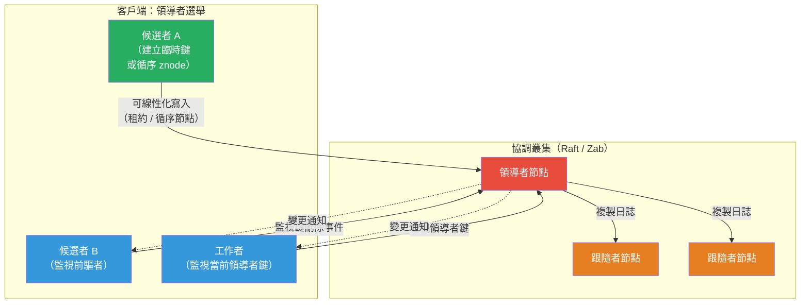

# [BEE-448] 協調服務

:::info
協調服務是一種容錯、強一致性的小型元資料儲存，提供構建模塊——監視（watch）、臨時節點或租約、原子交易——讓分散式應用程式能夠組合出更高層次的原語，如領導者選舉、分散式鎖、服務發現和配置分發，而無需每個應用程式重新實作共識演算法。
:::

## 背景

協調是構建分散式系統中最困難的部分。每個生產系統最終都需要：領導者選舉（讓一個實例扮演主節點）、分散式鎖（確保只有一個工作者處理任務），以及分散式配置（讓變更原子地傳播到所有服務實例）。最直覺的方法是在關聯式資料庫或訊息佇列上從頭構建每個原語——但這些方法效果不佳，因為它們將協調語義（監視變更、工作階段到期即釋放）與儲存語義（持久性、大型值、批次寫入）混在一起。

Patrick Hunt、Mahadev Konar、Flavio Junqueira 和 Benjamin Reed 在雅虎描述了這種設計理念，發表在〈ZooKeeper: Wait-free Coordination for Internet-scale Systems〉（USENIX ATC，2010）中。他們的洞見是：協調服務不應實作特定演算法——而應公開客戶端用來組合演算法的原語。ZooKeeper 的三個核心原語（層次化 znode 命名空間、一次性監視，以及客戶端工作階段結束時消失的臨時節點）足以實作任意協調配方，而無需在服務本身嵌入任何單一演算法。該論文報告了 ZooKeeper 在雅虎發表時達到每秒 70 萬次操作。

etcd 由 Brandon Philips 和 CoreOS 團隊於 2013 年建立，作為一個更簡單、基於 Raft 的替代方案，使用扁平的鍵值 API 和 gRPC 傳輸。2014 年 Kubernetes 選擇它作為控制平面的唯一後端儲存後，其採用率大幅增長。每個 Kubernetes 物件——Pod、部署、節點、端點——都以鍵值條目的形式存放在 etcd 中；每個控制器監視一個鍵前綴以感知變更並做出反應。etcd 的 MVCC 架構（每次寫入建立新的全域版本號而非覆寫）意味著 Kubernetes 控制器可以在連線中斷後可靠地恢復監視，不會遺漏事件——透過從上次看到的版本號訂閱，而非從當前狀態。

## 設計思考

**協調服務不是資料庫。** 它們是為小型、頻繁讀取的元資料（服務地址、領導者身份、鎖令牌、功能旗標）專門設計的，優先考慮低延遲讀取、可線性化寫入和事件驅動監視，而非吞吐量、大型值或複雜查詢。ZooKeeper 建議每個 znode 最多存放 1 MB；etcd 每個鍵有 1.5 MB 的硬限制，叢集總資料大小目標為 8 GB。在協調服務中存放應用程式資料會導致壓縮風暴、效能下降和最終叢集耗盡。

**每次寫入都是一輪共識。** 在 ZooKeeper（Zab 協定）和 etcd（Raft）中，所有修改操作都透過領導者序列化。寫入需要法定數量的節點確認日誌條目，然後領導者應用並響應客戶端。這使得寫入具有持久性和可線性化，但代價是相對較高（3-10 毫秒），相比鍵值快取而言。讀取吞吐量可以透過添加跟隨者（用於過時讀取）來擴充，但可線性化讀取始終需要一次領導者往返。將協調叢集大小設為 3 或 5 個節點（永遠不要使用偶數）分別提供容忍 1 或 2 個節點故障的能力，而更大的叢集會增加寫入延遲而不改善容錯能力。

**臨時節點和租約是存活機制。** 使資源所有權與工作階段健康狀態掛鉤，這一關鍵洞見讓領導者選舉和分散式鎖成為可能。在 ZooKeeper 中，臨時 znode 在建立它的客戶端工作階段到期時自動刪除——工作階段到期是崩潰的鎖定持有者釋放鎖的機制。在 etcd 中，租約是客戶端必須定期續期的有效期令牌；附加到租約的鍵在租約未續期時到期。兩種機制都要求應用程式處理工作階段遺失或租約到期事件，並可能重新獲取協調原語。

## 視覺化



## 最佳實務

**不得（MUST NOT）將協調服務用作通用快取或資料庫。** 只存放協調元資料：鎖令牌、領導者身份、服務端點、功能旗標。如果你發現自己存放多千位元組的值或累積數百萬個鍵，資料應該放在資料庫中，協調服務只持有參考。

**必須（MUST）在應用程式程式碼中處理工作階段到期和租約到期。** 臨時節點/租約機制是鎖定持有者崩潰時釋放鎖的唯一方式——但這也意味著，網路短暫分割的活躍應用程式可能會失去其工作階段或租約，即使它仍在運行。應用程式**必須（MUST）** 偵測工作階段遺失事件並重建協調狀態（重新建立臨時節點、重新獲取鎖），而非假設協調狀態是永久的。

**當正確性需要最新資料時，使用可線性化讀取。** ZooKeeper 跟隨者從本地狀態提供讀取，可能落後於領導者；過時的讀取可能顯示已更改的領導者身份。在讀取前使用 `sync()` 以保證跟隨者已同步。在 etcd 中，預設的 `Get` 是可線性化的（路由到領導者）；當新鮮度不重要時，可以使用 `WithSerializable()` 選擇過時讀取以降低延遲。

**將監視範圍限制在所需的最窄鍵範圍內。** 每個監視是伺服器端資源。在 ZooKeeper 中，監視是一次性的，在每次通知後必須重新註冊——如果在處理通知之前未完成重新註冊，這是遺漏事件的常見來源。在 etcd 中，單個監視流在一個連線上多路複用並按順序傳遞所有事件；對具有高修改率的大型鍵範圍的監視可能會讓客戶端的事件處理迴圈不堪重負。將監視範圍限制在客戶端關心的特定鍵或前綴上。

**設定工作階段超時和租約 TTL 以匹配故障偵測視窗。** ZooKeeper 工作階段超時為 2 秒意味著崩潰的客戶端在 2 秒內釋放其臨時節點——對於大多數領導者選舉場景可以接受，但對於延遲敏感的故障轉移太慢。設定過短的超時（< 1 秒）在短暫網路抖動下有誤觸工作階段到期的風險。etcd 中的租約 TTL 具有相同的作用；客戶端**應該（SHOULD）** 以 TTL 一半的間隔續期租約以提供續期安全餘量。

**以 3 或 5 個節點運行協調叢集，永遠不要 4 或 2 個。** 3 節點叢集容忍 1 次故障（法定 = 2）；5 節點叢集容忍 2 次故障（法定 = 3）。4 節點叢集同樣只容忍 1 次故障（法定 = 3）——相比 3 節點沒有提供額外的容錯能力，卻增加了寫入延遲的節點。切勿以 2 個節點運行：任一節點的損失都會使法定失效，讓叢集不可用。

## 深入探討

**ZooKeeper 的 znode 類型和循序臨時節點配方。** ZooKeeper 有四種 znode 類型：*持久*（工作階段後存活）、*臨時*（工作階段到期時刪除）、*持久循序*（持久 + 附加單調序列號）和*臨時循序*。最後一種類型是所有無等待配方的基礎。實作分散式鎖：每個候選者在父路徑下建立臨時循序 znode（例如 `/locks/my_lock_0000000017`）。序列號最小的候選者持有鎖。其他候選者只監視緊鄰前驅序列號的 znode——而非鎖的父節點——這樣當鎖持有者釋放（或其工作階段到期）時，只有下一個候選者收到通知，避免羊群效應。領導者選舉的工作方式完全相同：序列號最小的節點是領導者。

**etcd 的 MVCC 監視歷史。** etcd 為每次寫入分配一個全域*版本號*——一個跨叢集中所有鍵單調遞增的 64 位整數。當客戶端訂閱監視時，可以指定起始版本號：`Watch(key, WithRev(lastSeenRevision))`。etcd 存放歷史版本號的壓縮視窗（可配置，Kubernetes 預設為 5 分鐘）。斷線時間少於壓縮視窗的客戶端可以恢復監視並按順序接收所有遺漏的事件。這與 ZooKeeper 的一次性監視根本不同，後者只傳遞變更的存在，而非排隊的遺漏事件。

**etcd 交易作為條件多鍵操作。** etcd 交易（`Txn`）將一組比較操作和兩個分支（成功/失敗）組合在一起，全部在單個 Raft 日誌條目中原子地應用：`if (key A version == X AND key B value == Y) then { put C, delete D } else { put E }`。這是基於 CAS 的鎖的構建模塊：僅在鍵不存在時建立（`version == 0`），在值中存放鎖身份，並為鍵附加租約以便自動到期。etcd 並行套件正是使用此模式實作了分散式互斥鎖和領導者選舉。

**Kubernetes 和 etcd：每個物件都是監視目標。** Kubernetes 將每個 API 物件存放在結構化鍵下，如 `/registry/pods/default/nginx`。Controller-manager 實例使用 etcd 的範圍監視（例如 `/registry/pods/`）監視鍵前綴。當新 Pod 建立時，被分配節點上的 kubelet 收到其主機名稱前綴的監視通知，拉取 Pod 規格並啟動容器。每個 Kubernetes 物件上的 `resourceVersion` 欄位就是上次寫入時的 etcd 版本號——返回給 `kubectl` 客戶端並用於偵測並行修改。

## 範例

**ZooKeeper 領導者選舉（Python with Kazoo）：**

```python
from kazoo.client import KazooClient
from kazoo.recipe.election import Election

zk = KazooClient(hosts='zk1:2181,zk2:2181,zk3:2181')
zk.start()

# KazooClient.Election 封裝了循序臨時 znode 配方
election = Election(zk, "/services/my-worker/election")

def on_elected():
    """當此實例成為領導者時呼叫。"""
    print("I am the leader — starting primary work")
    # ... 執行領導者工作；函式返回時選舉釋放鎖

election.run(on_elected)  # 阻塞直到當選，呼叫 on_elected，然後釋放

# 手動循序臨時 znode（說明配方）：
leader_path = zk.create(
    "/locks/election-",
    ephemeral=True,
    sequence=True,      # 產生 /locks/election-0000000017
)
children = sorted(zk.get_children("/locks"))
if children[0] == leader_path.split("/")[-1]:
    print("This node is the leader")
else:
    # 監視前驅節點——而非父節點——以避免羊群效應
    predecessor = children[children.index(leader_path.split("/")[-1]) - 1]
    @zk.DataWatch(f"/locks/{predecessor}")
    def watch_predecessor(data, stat, event=None):
        if event and event.type == "DELETED":
            # 前驅者釋放——重新檢查領導者資格
            pass
```

**etcd 領導者選舉（Go with concurrency 套件）：**

```go
import (
    "context"
    clientv3 "go.etcd.io/etcd/client/v3"
    "go.etcd.io/etcd/client/v3/concurrency"
)

func runLeaderElection(ctx context.Context, client *clientv3.Client) error {
    // 建立帶有 10 秒 TTL 的工作階段（租約由工作階段自動續期）
    session, err := concurrency.NewSession(client, concurrency.WithTTL(10))
    if err != nil {
        return err
    }
    defer session.Close()

    election := concurrency.NewElection(session, "/services/my-worker/leader")

    // Campaign 阻塞直到此實例成為領導者
    // 返回時，此實例持有領導者鍵；鍵帶有租約
    if err := election.Campaign(ctx, "instance-id-abc"); err != nil {
        return err
    }

    // 取得隔離令牌：成為領導者時的版本號
    resp, _ := election.Leader(ctx)
    fencingToken := resp.Kvs[0].CreateRevision
    _ = fencingToken  // 傳遞給受保護的資源（見 BEE-447）

    // 執行領導者工作；完成或關閉前呼叫 Resign
    defer election.Resign(ctx)
    doLeaderWork(ctx)
    return nil
}

// 觀察當前領導者（跟隨者端）：
func observeLeader(ctx context.Context, client *clientv3.Client) {
    session, _ := concurrency.NewSession(client, concurrency.WithTTL(10))
    election := concurrency.NewElection(session, "/services/my-worker/leader")

    ch := election.Observe(ctx)
    for resp := range ch {
        leaderID := string(resp.Kvs[0].Value)
        leaderRevision := resp.Kvs[0].CreateRevision
        _ = leaderID; _ = leaderRevision
    }
}
```

**etcd 從歷史版本號監視（可恢復監視）：**

```go
// 啟動時從持久儲存載入上次處理的版本號
lastRevision := loadLastRevision()  // 例如從本地文件或資料庫

watchCh := client.Watch(ctx, "/config/", clientv3.WithPrefix(),
    clientv3.WithRev(lastRevision+1))  // 從上次看到的事件開始重播

for watchResp := range watchCh {
    for _, event := range watchResp.Events {
        processEvent(event)
        // 持久化版本號，以便重啟後可以從此恢復
        saveLastRevision(event.Kv.ModRevision)
    }
}
```

## 相關 BEE

- [BEE-421](421.md) -- Consensus Algorithms: Paxos and Raft：協調服務是共識狀態機——ZooKeeper 使用 Zab（Paxos 的變體），etcd 使用 Raft；協調服務的可線性化保證完全來自底層的共識協定
- [BEE-424](424.md) -- Distributed Locking：分散式鎖是在協調服務原語之上構建的核心配方之一（ZooKeeper 中的循序臨時 znode，etcd 中的租約支援鍵）；協調服務提供原始 Redis 或資料庫鎖所無法提供的持久性和故障偵測
- [BEE-436](436.md) -- Lease-Based Coordination：租約是 etcd 的臨時狀態主要機制；理解租約續期、TTL 選擇和租約到期處理是在 etcd 上構建可靠原語的前提
- [BEE-426](426.md) -- Service Discovery：服務實例將其地址以臨時 znode 或租約支援鍵的形式在協調服務中註冊；協調服務故障會使服務發現暫時不可用，將它們的可用性耦合在一起
- [BEE-447](447.md) -- Fencing Tokens：etcd 鎖定獲取時返回的版本號，或 ZooKeeper 的 zxid，作為下游資源用來拒絕過期鎖定持有者的隔離令牌

## 參考資料

- [ZooKeeper: Wait-free Coordination for Internet-scale Systems -- Hunt, Konar, Junqueira, Reed, USENIX ATC 2010](https://www.usenix.org/conference/usenix-atc-10/zookeeper-wait-free-coordination-internet-scale-systems)
- [ZooKeeper Recipes and Solutions -- Apache ZooKeeper Documentation](https://zookeeper.apache.org/doc/r3.6.2/recipes.html)
- [etcd versus other key-value stores -- etcd Documentation](https://etcd.io/docs/v3.5/learning/why/)
- [Leases -- Kubernetes Documentation](https://kubernetes.io/docs/concepts/architecture/leases/)
- [In Search of an Understandable Consensus Algorithm -- Ongaro and Ousterhout, USENIX ATC 2014](https://raft.github.io/raft.pdf)
