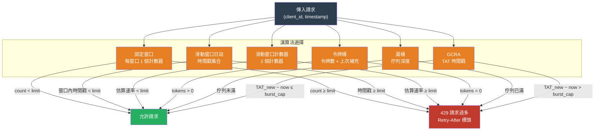

# [BEE-449] 分散式速率限制演算法

:::info
速率限制透過限制客戶端在時間窗口內可發出的請求數量來保護服務。五種標準演算法——固定窗口（fixed window）、滑動窗口日誌（sliding window log）、滑動窗口計數器（sliding window counter）、令牌桶（token bucket）和漏桶（leaky bucket）——在容許突發流量（burst）、記憶體消耗及邊界攻擊的抵抗力上各有差異。選擇正確的演算法需要理解這些權衡；選擇正確的實作方式則需要理解為什麼樸素的 Redis 腳本存在競態條件（race condition）。
:::

## 背景

速率限制作為網路概念，早於 Web 時代。**漏桶**演算法由 Turner（1986）正式提出，後由 Tanenbaum 在網路教科書中作為流量整形（traffic shaping）的基本原語加以闡述——概念上像一個以固定速率排水的桶，將突發輸入平滑為穩定的輸出流。令牌桶變體（同樣源自 ATM/網路時代）則反轉了這個比喻：令牌隨時間積累至最大容量，每個請求消耗一個令牌。

隨著 REST API 在 2000 年代的普及，針對 Web 規模的應用程式速率限制成為一個獨立的工程問題。Twitter 的 API 節流、Stripe 的重試安全扣款端點以及 AWS 服務配額，都需要能在毫秒內對分散式狀態進行評估的演算法。Redis 於 2009 年發布後，成為主要的後端存儲，因為其單執行緒命令執行和 Lua 腳本（2.6 版於 2012 年加入）提供了速率限制所需的原子多步驟操作。Salvatore Sanfilippo 最初的 Redis 有序集合滑動窗口和基於 Lua 的令牌桶實作方案廣泛流傳，構成了大多數生產環境實作的基礎。

**GCRA**（Generic Cell Rate Algorithm，通用信元速率演算法）源自 ATM Forum 的流量管理規格（1996），在 Stripe 發布 Evan Miller 的分析後重新作為實際的 Web 速率限制器出現。分析顯示它在數學上等同於連續令牌桶，但每個客戶端僅需存儲一個值——**理論到達時間**（Theoretical Arrival Time，TAT）——使其成為記憶體效率最高的選項。

## 設計思維

所有速率限制演算法回答的是同一個問題：「根據此客戶端的請求歷史，是否應允許本次請求？」它們的差異在於維護什麼狀態，以及允許什麼形態的流量。

### 演算法比較

| 演算法 | 每客戶端狀態 | 突發行為 | 邊界漏洞 | 適合場景 |
|---|---|---|---|---|
| 固定窗口 | 1 個計數器 + 重置時間 | 允許邊界處 2 倍突發 | 有 | 簡單配額、內部服務 |
| 滑動窗口日誌 | 窗口內所有時間戳 | 無突發尖峰 | 無 | 精確執行、低流量 |
| 滑動窗口計數器 | 2 個計數器 | 近似平滑 | 部分 | 精確度與成本的良好平衡 |
| 令牌桶 | 令牌數量 + 上次補充時間 | 可突發至桶容量 | 無 | 公開 API、可變工作負載 |
| 漏桶 | 佇列深度 | 無突發（固定排水） | 無 | 流量整形、串流 |
| GCRA | 1 個 TAT 時間戳 | 可突發至突發上限 | 無 | 需要令牌桶語義且狀態最小化的 API |

**固定窗口邊界攻擊。** 每分鐘允許 100 個請求的客戶端可以在 00:59 發出 100 個請求，在 01:01 再發出 100 個請求——在兩秒內共 200 個請求——而不違反每窗口限制。固定窗口適用於配額是粗粒度使用上限（計費、每日配額）而非流量調節器的情況。

**滑動窗口計數器近似。** 與其存儲每個時間戳（每客戶端 O(n) 記憶體），滑動窗口計數器存儲兩個固定窗口計數器——當前窗口計數 `C_current` 和前一窗口計數 `C_prev`——並估算當前速率為：

```
rate = C_prev × (1 − elapsed_fraction) + C_current
```

此近似最多高估每個窗口期一個請求的有效速率，對大多數生產用例而言是可接受的。

**令牌桶 vs. 漏桶。** 令牌桶允許突發至桶容量：閒置的客戶端積累令牌後可以集中使用。漏桶則不允許：請求排隊並以固定服務速率排出，無論客戶端閒置多久。令牌桶是公開 REST API 的正確預設選擇，因為偶爾的突發是合理的。漏桶適用於向有固定處理速率的下游系統進行流量整形的場景。

**GCRA：只需一個值的令牌桶。** GCRA 對每個客戶端追蹤單一 TAT（理論到達時間）。對於每個請求：

```
TAT_new = max(TAT_stored, now) + (1 / rate)
如果 TAT_new − now > burst_cap：拒絕
否則：存儲 TAT_new，允許
```

TAT 代表「如果客戶端以精確的速率限制持續消耗，下一個令牌何時到達」。如果 TAT 在未來很遠的地方，說明客戶端消耗速度超過了限制。GCRA 通過突發上限的選擇涵蓋了固定窗口、滑動和令牌桶語義，並且無論流量大小，在 Redis 中只需要一個值。

## 視覺圖



## 最佳實踐

**MUST（必須）以原子方式實作 Redis 速率限制操作。** 樸素的兩命令序列 `INCR key; EXPIRE key 60` 存在競態條件：若進程在兩條命令之間崩潰，鍵永遠不會過期，客戶端將被永久封鎖。使用 Lua 腳本或帶有 `SET key 0 EX 60 NX` 的 Redis 管道，在首次使用時原子性地初始化計數器。對於滑動窗口日誌實作，在單個 Lua 腳本中使用 `ZADD`、`ZREMRANGEBYSCORE` 和 `ZCARD`。

**MUST（必須）在 429 響應中包含 `Retry-After` 標頭。** 收到速率限制錯誤但沒有 `Retry-After` 值的客戶端將立即重試，造成驚群效應（thundering herd）。對於令牌桶和 GCRA，重試時間是確定性的：`retry_after = (tokens_needed − tokens_available) / refill_rate`。對於固定和滑動窗口，則是到窗口重置的時間。

**SHOULD（應該）對公開 API 速率限制使用 GCRA 或令牌桶。** 固定窗口容易受到邊界攻擊，應限制於粗粒度配額（例如每月 API 調用上限）。滑動窗口日誌每個客戶端需要 O(請求數) 的記憶體，不適合高流量端點。

**SHOULD（應該）同時按多個鍵劃定速率限制範圍。** 單個端點可能需要每用戶限制（100 請求/分鐘）和全局限制（10,000 請求/分鐘）兩者。對每個請求同時檢查兩個限制，若任一超出則返回 429。`Retry-After` 標頭 SHOULD（應該）反映兩者中較長的重置時間。

**MUST NOT（必須不）依賴時鐘同步來確保分散式速率限制器的正確性。** 將請求時間戳與 `now − window_duration` 比較的滑動窗口日誌實作，假設伺服器時鐘已同步。在具有多個 Redis 副本或多個速率限制節點的分散式部署中，使用綁定到單一權威來源的單調計數器（單個 Redis 主節點，或集中式時間戳服務），而非本地掛鐘比較。

## 範例

**Lua 中的令牌桶（原子化，單次 Redis 調用）：**

```lua
-- KEYS[1] = 速率限制鍵（例如 "rl:user:42"）
-- ARGV[1] = 當前時間戳（秒，浮點數）
-- ARGV[2] = 最大令牌數（突發容量）
-- ARGV[3] = 補充速率（每秒令牌數）
-- 返回：{allowed (0/1), remaining_tokens}

local key = KEYS[1]
local now = tonumber(ARGV[1])
local max_tokens = tonumber(ARGV[2])
local refill_rate = tonumber(ARGV[3])

local data = redis.call("HMGET", key, "tokens", "last_refill")
local tokens = tonumber(data[1]) or max_tokens
local last_refill = tonumber(data[2]) or now

-- 為自上次補充以來的經過時間增加令牌
local elapsed = now - last_refill
tokens = math.min(max_tokens, tokens + elapsed * refill_rate)

local allowed = 0
if tokens >= 1 then
    tokens = tokens - 1
    allowed = 1
end

-- 存儲更新後的狀態；TTL 為從空填滿時間的 2 倍
local ttl = math.ceil(max_tokens / refill_rate) * 2
redis.call("HMSET", key, "tokens", tokens, "last_refill", now)
redis.call("EXPIRE", key, ttl)

return {allowed, math.floor(tokens)}
```

**GCRA 實作（每客戶端一個值）：**

```python
import time
import redis

def gcra_check(r: redis.Redis, key: str, rate: float, burst: int) -> tuple[bool, float]:
    """
    返回 (allowed, retry_after_seconds)。
    rate: 每秒請求數
    burst: 穩態速率之上的最大突發大小
    """
    period = 1.0 / rate          # 每個令牌的秒數
    burst_offset = period * burst  # TAT 可以超前的最大量

    now = time.time()

    script = """
    local key = KEYS[1]
    local now = tonumber(ARGV[1])
    local period = tonumber(ARGV[2])
    local burst_offset = tonumber(ARGV[3])

    local tat = tonumber(redis.call("GET", key)) or now

    -- 每個請求 TAT 向前移動一個周期
    local new_tat = math.max(tat, now) + period

    -- 如果 TAT 比突發偏移允許的更遠，則拒絕
    if new_tat - now > burst_offset then
        local retry_after = tat - burst_offset - now
        return {0, retry_after}
    end

    -- 允許：存儲新 TAT，TTL 與突發容量成比例
    redis.call("SET", key, new_tat, "EX", math.ceil(burst_offset + period))
    return {1, 0}
    """

    result = r.eval(script, 1, key, now, period, burst_offset)
    allowed = result[0] == 1
    retry_after = float(result[1])
    return allowed, retry_after
```

**滑動窗口計數器（固定窗口對）：**

```python
import math
import time
import redis

def sliding_window_counter(r: redis.Redis, key: str, limit: int, window: int) -> bool:
    """
    如果請求被允許，返回 True。
    window: 窗口大小（秒）
    """
    now = time.time()
    window_start = math.floor(now / window) * window
    elapsed_fraction = (now - window_start) / window

    current_key = f"{key}:{int(window_start)}"
    prev_key = f"{key}:{int(window_start - window)}"

    pipe = r.pipeline()
    pipe.get(current_key)
    pipe.get(prev_key)
    current_count, prev_count = pipe.execute()

    current_count = int(current_count or 0)
    prev_count = int(prev_count or 0)

    # 當前滑動窗口內請求的加權估算
    estimated = prev_count * (1 - elapsed_fraction) + current_count

    if estimated >= limit:
        return False

    # 遞增當前窗口計數器，2 個完整窗口後過期
    pipe = r.pipeline()
    pipe.incr(current_key)
    pipe.expire(current_key, window * 2)
    pipe.execute()
    return True
```

## 相關 BEE

- [BEE-266](../Resilience and Reliability/266.md) -- 速率限制與節流：涵蓋操作決策（限制什麼、在哪裡執行、如何向客戶端傳達限制）；本文聚焦於內部演算法機制和實作正確性
- [BEE-204](../Caching/204.md) -- 緩存雪崩與驚群效應：遺漏 `Retry-After` 的速率限制器設定錯誤會導致客戶端同步大量重試，產生與緩存雪崩相同的驚群效應
- [BEE-164](../Transactions and Consistency/164.md) -- 冪等性與精確一次語義：速率限制和冪等鍵都使用 Redis 原子操作來防止重複計數；Lua 原子性要求同樣適用於兩者
- [BEE-203](../Caching/203.md) -- 分散式緩存：作為速率限制後端存儲的 Redis 繼承了分散式緩存的所有一致性權衡；Redis Cluster 分片意味著給定客戶端的鍵必須始終路由到同一個分片

## 參考資料

- [An Analysis of Rate Limiting Algorithms -- Figma Engineering (2021)](https://www.figma.com/blog/an-analysis-of-rate-limiting-algorithms/)
- [Better Rate Limiting With Redis Sorted Sets -- Devops.com (Srisaila)](https://devops.com/better-rate-limiting-redis-sorted-sets/)
- [GCRA and the Theoretical Arrival Time -- Stripe Engineering (Evan Miller)](https://brandur.org/rate-limiting)
- [Redis Rate Limiting -- Redis Documentation](https://redis.io/glossary/rate-limiting/)
- [How Cloudflare Uses Token Bucket for Rate Limiting -- Cloudflare Blog (2021)](https://blog.cloudflare.com/counting-things-a-lot-of-different-things/)
- [ATM Traffic Management Specification -- ATM Forum, af-tm-0056.000 (1996)](https://www.broadband-forum.org/technical/download/af-tm-0056.000.pdf)
