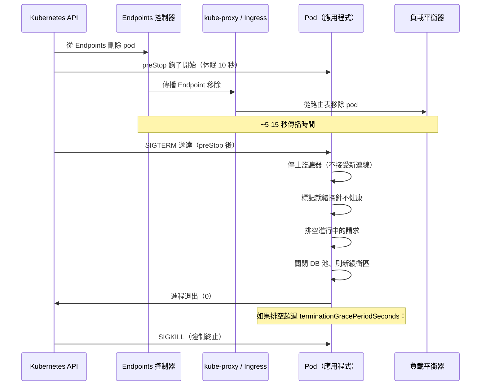

# [BEE-453] 優雅關閉與連線排空

:::info
優雅關閉（graceful shutdown）是在不丟棄進行中請求的情況下停止服務的過程：完成正在進行的工作、拒絕新工作、乾淨地關閉連線，然後退出。在 Kubernetes 中，正確實作這一過程需要理解平台工作方式中一個根本性的競態條件——並使用 preStop 休眠來修補它。
:::

## 背景

在容器編排出現之前，優雅關閉是一個簡單的 UNIX 訊號處理問題：捕獲 `SIGTERM`，完成開放的請求，退出。在 Kubernetes 叢集中，這個問題更加困難，因為刪除 pod 時有兩個獨立的進程同時發生：API 伺服器向 pod 發送 `SIGTERM`，Endpoints 控制器開始從 kube-proxy 和 Ingress 控制器用於路由流量的 `Endpoints` 物件中刪除該 pod。這兩個動作是並行且不協調的。

其後果是一個**競態條件**：一個 pod 可能已完成讀取 `SIGTERM`、停止接受新連線並開始關閉，而多個節點上的 kube-proxy 仍在主動向它路由流量——因為 Endpoint 移除通知尚未傳播。在此窗口期間到達的請求落在不再接受連線的 pod 上，並收到連線重置。從使用者的角度看，請求失敗了。從 pod 的角度看，它的行為是正確的。

這個競態不是 Kubernetes 中的錯誤；它是分散式系統中最終一致性的根本結果。Kubernetes 文件承認這一點，並推薦 `preStop` 生命週期鉤子作為緩解措施：在應用程式關閉前延遲幾秒鐘，以允許負載平衡器表在應用程式停止接受連線之前收斂。

這個問題存在於所有 HTTP 伺服器和 gRPC 服務中，但機制不同。HTTP/1.1 使用每請求連線，可以在每個請求完成後關閉它們。HTTP/2 在一個連線上多路複用許多串流，需要發送 `GOAWAY` 幀來向對端發出訊號，不要在此連線上開啟新串流，同時現有串流繼續完成。gRPC 建立在 HTTP/2 之上，提供 `GracefulStop()`，它發送 `GOAWAY`，等待活躍的 RPC 完成，然後關閉連線。每種協定都需要明確的、協定感知的關閉邏輯。

## 設計思維

優雅關閉有三個必須以嚴格順序進行的不同階段：

1. **停止接受新工作。** 將就緒探針（readiness probe）標記為不健康（或停止監聽器），以便不向此實例路由新流量。這必須在排空（drain）開始之前發生。如果在排空期間新請求繼續到達，排空將永遠無法完成。

2. **排空進行中的工作。** 允許現有的請求和連線完成。設定截止時間（`terminationGracePeriodSeconds`），超過後放棄剩餘工作並退出進程。

3. **釋放資源。** 關閉資料庫連線池、刷新緩衝區、關閉開放的檔案、從服務發現中登出。資源釋放最後發生——在請求仍在運行時關閉資料庫池將導致這些請求失敗。

關閉順序是啟動順序的反向。如果服務在啟動時向服務登錄（registry）登記，則在關閉時先登出。如果它先開啟資料庫池然後啟動 HTTP 監聽器，則先關閉 HTTP 監聽器，最後關閉資料庫池。

**preStop 窗口。** 在 Kubernetes 中，在 pod 進入 `Terminating` 狀態（endpoint 移除開始時）和應用程式收到 `SIGTERM`（應用程式的關閉程式碼開始時）之間插入 5-15 秒的 `preStop` 休眠。這個窗口讓 kube-proxy 和 Ingress 控制器有時間在應用程式停止接受連線之前從路由表中移除該 pod。沒有這個窗口，背景中描述的競態條件會導致丟棄連線。

**terminationGracePeriodSeconds 大小設定。** 這是 Kubernetes 從 `SIGTERM` 到 `SIGKILL` 允許的總時間。它必須大於：`preStop_sleep + 最大請求持續時間 + 排空開銷`。Web 服務的典型值是 30-60 秒。長期運行的作業（批次處理器、串流消費者）可能需要幾分鐘。設定太短意味著 Kubernetes 將在請求仍在進行時 `SIGKILL` 進程，使優雅關閉失去意義。

## 最佳實踐

**MUST（必須）在 Kubernetes 部署中新增 preStop 休眠。** 帶有 `sleep 10` 的 `preStop` 鉤子將 `SIGTERM` 延遲 10 秒，讓 kube-proxy 和 Ingress 控制器有時間從路由表中移除 pod。確切的值應根據叢集中觀察到的 Endpoint 傳播延遲進行調整——通常是 5-15 秒。沒有這個，在每次滾動更新和每次 pod 刪除時都會丟棄連線。

```yaml
lifecycle:
  preStop:
    exec:
      command: ["sh", "-c", "sleep 10"]
```

**MUST（必須）將 `terminationGracePeriodSeconds` 設定為大於 preStop 持續時間加上最大預期請求持續時間。** 如果 `preStop` 休眠 10 秒，且最慢的預期請求需要 20 秒，則 `terminationGracePeriodSeconds` 必須至少為 35 秒（10 + 20 + 5 開銷）。預設值為 30 秒，對於具有緩慢資料庫查詢或大型文件上傳的服務通常太低。

**MUST（必須）在應用程式中明確處理 `SIGTERM`。** 大多數 Web 框架不會透過排空連線然後退出來響應 `SIGTERM`——它們會立即終止。註冊一個訊號處理器：（1）停止 HTTP 監聽器接受新連線，（2）等待進行中的請求完成或截止時間到期，（3）關閉連線池並刷新緩衝區。在 Go 中，`http.Server.Shutdown(ctx)` 執行步驟 1 和 2；在 Node.js 中，`server.close(callback)` 停止接受但不排空 keep-alive 連線（需要額外邏輯）；在 Python/Gunicorn 中，`SIGWINCH` 啟動 worker 的優雅關閉。

**SHOULD（應該）在開始排空之前將就緒探針標記為不健康。** 如果應用程式的就緒探針在關閉期間繼續返回 HTTP 200，在某些配置中負載平衡器可能會在 `preStop` 結束和 `SIGTERM` 觸發後繼續向終止中的 pod 發送新請求——因為負載平衡器尊重就緒探針而非 Endpoint 狀態。在關閉處理器開始時、在呼叫 `server.Shutdown()` 之前，明確設定一個就緒端點檢查的標誌，將其翻轉為不健康。

**MUST（必須）為排空階段設定截止時間。** 沒有截止時間的排空可能無限期阻塞，如果客戶端保持長期連線開啟（WebSocket、gRPC 串流呼叫、大型多部分上傳）。在 Go 中使用 `context.WithTimeout`，在 Node.js 中在超時後使用 `server.closeAllConnections()`，或將 `terminationGracePeriodSeconds` 作為硬性限制。超過 `terminationGracePeriodSeconds` 的排空會導致 `SIGKILL`，這與崩潰無法區分。

**MUST（必須）對 gRPC 伺服器使用 `GracefulStop()`（而非 `Stop()`）。** `Stop()` 立即關閉所有連線，丟棄進行中的 RPC。`GracefulStop()` 在所有活躍的 HTTP/2 連線上發送 `GOAWAY` 幀，指示客戶端不要在此連線上開啟新串流，然後等待所有現有 RPC 完成後再關閉連線。但是，如果任何 RPC 未完成，`GracefulStop()` 將無限期阻塞；將其包裝在 goroutine 中並在截止時間後呼叫 `Stop()`：

```go
go s.GracefulStop()
time.Sleep(drainTimeout)
s.Stop() // 強制關閉任何剩餘的連線
```

**SHOULD（應該）以啟動順序的反向關閉資源。** 如果啟動順序是：連接資料庫 → 開啟 Redis → 啟動 HTTP 伺服器 → 在服務發現中登記，則關閉順序是：從服務發現中登出 → 停止 HTTP 伺服器 → 關閉 Redis → 關閉資料庫。這確保了資源不會在依賴它們的系統其他部分仍在運行時關閉。

## 視覺圖



## 範例

**Go：帶 HTTP 排空和截止時間的 SIGTERM 處理器：**

```go
package main

import (
    "context"
    "log"
    "net/http"
    "os"
    "os/signal"
    "sync/atomic"
    "syscall"
    "time"
)

var isReady atomic.Bool

func main() {
    mux := http.NewServeMux()
    mux.HandleFunc("/health/ready", func(w http.ResponseWriter, r *http.Request) {
        if !isReady.Load() {
            http.Error(w, "shutting down", http.StatusServiceUnavailable)
            return
        }
        w.WriteHeader(http.StatusOK)
    })
    mux.HandleFunc("/api/work", doWork)

    srv := &http.Server{Addr: ":8080", Handler: mux}

    // 伺服器開始監聽後標記為就緒
    isReady.Store(true)

    // 捕獲 SIGTERM（Kubernetes）和 SIGINT（本地開發）
    quit := make(chan os.Signal, 1)
    signal.Notify(quit, syscall.SIGTERM, syscall.SIGINT)

    go func() {
        if err := srv.ListenAndServe(); err != http.ErrServerClosed {
            log.Fatalf("server error: %v", err)
        }
    }()

    <-quit
    log.Println("收到 SIGTERM — 開始優雅關閉")

    // 步驟 1：標記為不就緒，讓負載平衡器停止發送新請求
    isReady.Store(false)

    // 步驟 2：用 25 秒截止時間排空進行中的請求
    // （terminationGracePeriodSeconds 應 ≥ preStop(10s) + 此值(25s)）
    ctx, cancel := context.WithTimeout(context.Background(), 25*time.Second)
    defer cancel()

    if err := srv.Shutdown(ctx); err != nil {
        log.Printf("關閉截止時間超過，強制關閉：%v", err)
    }

    // 步驟 3：關閉下游資源（啟動順序的反向）
    closeRedis()
    closeDBPool()
    log.Println("關閉完成")
}
```

**帶 preStop 和優雅期的 Kubernetes 部署清單：**

```yaml
spec:
  template:
    spec:
      terminationGracePeriodSeconds: 40  # preStop(10) + 排空(25) + 開銷(5)
      containers:
        - name: api
          image: my-service:latest
          readinessProbe:
            httpGet:
              path: /health/ready
              port: 8080
            periodSeconds: 5
            failureThreshold: 1  # 第一次失敗時立即停止路由
          lifecycle:
            preStop:
              exec:
                # 在 SIGTERM 之前休眠，讓 kube-proxy 先移除 Endpoint
                command: ["sh", "-c", "sleep 10"]
```

**gRPC 伺服器：帶硬截止時間的 GracefulStop：**

```go
grpcServer := grpc.NewServer()
pb.RegisterMyServiceServer(grpcServer, &myServiceImpl{})

go grpcServer.ListenAndServe(lis)

<-quit
log.Println("開始 gRPC 優雅停止")

stopped := make(chan struct{})
go func() {
    grpcServer.GracefulStop() // 發送 GOAWAY，等待活躍 RPC
    close(stopped)
}()

select {
case <-stopped:
    log.Println("gRPC 伺服器乾淨地停止")
case <-time.After(20 * time.Second):
    log.Println("gRPC 排空超時 — 強制停止")
    grpcServer.Stop() // 強制關閉剩餘連線
}
```

## 實作注意事項

**Go。** `http.Server.Shutdown(ctx)` 停止監聽器並等待活躍的連線變為閒置（無活躍請求），然後關閉它們。它不等待 WebSocket 連線或已劫持（hijacked）的連線——這些必須單獨追蹤和關閉。傳入的 context 控制等待時間；過期時，開放的連線被中止。

**Node.js。** `server.close(callback)` 停止接受新連線但不關閉現有的 keep-alive 連線——這些可能無限期保持開放。Node.js 18.2+ 新增了 `server.closeAllConnections()` 和 `server.closeIdleConnections()` 來解決這個問題。對於較舊的 Node.js，使用 `server.on('connection', ...)` 手動追蹤活躍連線，並在關閉期間銷毀它們。

**Python/Gunicorn。** 向 Gunicorn 發送 `SIGWINCH` 以優雅地停止所有 worker（它們完成當前請求然後退出），而不停止主進程。`--graceful-timeout` 標誌（預設 30 秒）控制 worker 完成的時間。Gunicorn 還支援 `SIGUSR2` + `SIGWINCH` 用於零停機時間滾動重啟。

**Java/Spring Boot。** Spring Boot 2.3+ 透過 `application.properties` 中的 `server.shutdown=graceful` 支援優雅關閉。超時透過 `spring.lifecycle.timeout-per-shutdown-phase`（預設 30 秒）配置。這對大多數 HTTP 工作負載已足夠，但仍需要 Kubernetes `preStop` 鉤子。

## 相關 BEE

- [BEE-262](../Resilience and Reliability/262.md) -- 逾時與截止時間：優雅關閉中的排空截止時間是截止時間的一個特例——沒有它，一個長期連線可以無限期阻塞關閉
- [BEE-325](../Observability/325.md) -- 健康檢查與就緒探針：就緒探針是關閉期間發出「我未準備好接受流量」訊號的主要機制——必須在排空開始之前設定為失敗
- [BEE-361](../CI CD and DevOps/361.md) -- 部署策略：滾動更新依賴優雅關閉來實現零停機時間部署；沒有它，被替換的 pod 會丟棄連線
- [BEE-451](451.md) -- 尾延遲與對沖請求：排空截止時間太短而關閉緩慢的 pod，可能在部署期間表現為 P99 尖峰——正確的排空大小設定可以防止這種情況

## 參考資料

- [Pod Lifecycle -- Kubernetes 文件](https://kubernetes.io/docs/concepts/workloads/pods/pod-lifecycle/)
- [Container Lifecycle Hooks -- Kubernetes 文件](https://kubernetes.io/docs/concepts/containers/container-lifecycle-hooks/)
- [Kubernetes best practices: terminating with grace -- Google Cloud Blog](https://cloud.google.com/blog/products/containers-kubernetes/kubernetes-best-practices-terminating-with-grace)
- [Server Graceful Stop -- gRPC 文件](https://grpc.io/docs/guides/server-graceful-stop/)
- [Graceful upgrades in Go -- Cloudflare Blog](https://blog.cloudflare.com/graceful-upgrades-in-go/)
- [Graceful shutdown in Kubernetes -- RisingStack Engineering](https://blog.risingstack.com/graceful-shutdown-node-js-kubernetes/)
- [Importance of Graceful Shutdown in Kubernetes -- Criteo Engineering](https://medium.com/criteo-engineering/importance-of-graceful-shutdown-in-kubernetes-605f0669d6ae)
