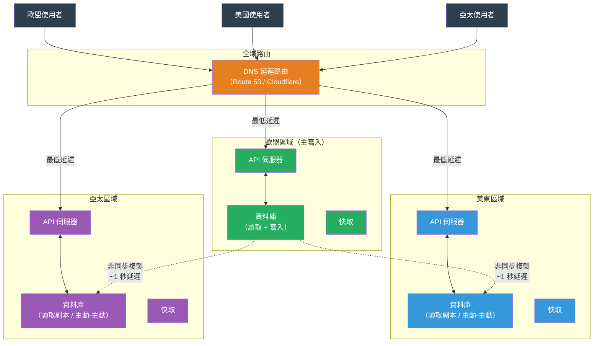

# [BEE-454] 多區域架構

:::info
多區域架構將系統部署在地理上分離的資料中心，以降低遠端使用者的延遲、承受區域性故障，並符合資料存放地點法規——但每個設計決策都必須面對光速這一不可消除的跨區域寫入延遲下限。
:::

## 背景

採用多區域的理由通常基於三個不同的出發點，所產生的架構取決於哪個出發點是主要的。

**延遲。** 光在光纖中的速度約為 200,000 km/s，從紐約到倫敦（6,800 km）的單程傳輸時間約為 35ms，從紐約到東京（11,000 km）約為 70ms。往返時間是兩倍。需要遠端區域網路往返以確認複製的資料庫寫入，每次同步操作都增加了 70-140ms 不可消除的延遲——還不包括任何排隊、處理或複製開銷。這是物理限制，不是工程問題，無法優化掉。從靠近使用者的區域提供服務可以消除這種延遲。

**可用性。** 單區域系統在該區域不可用時會失敗——由於雲端供應商中斷、自然災害或設施事件。Netflix 的「Chaos Monkey」和後來的「Chaos Kong」計畫（Basiri 等，2016）對區域故障場景進行了壓力測試，促使 Netflix 在三個 AWS 區域中運行主動-主動（active-active），每個區域都能獨立處理 100% 的流量。2011 年 AWS 美東中斷事件讓許多網際網路服務停擺數小時，成為許多大型服務轉向多區域部署的轉折點。

**合規性。** 歐盟 GDPR（2018 年 5 月生效）要求關於歐盟居民的個人資料在歐盟境內處理和存儲，或在適當的資料保護協議下處理。中國（PIPL，2021）、俄羅斯（聯邦法律 152-FZ）等地也有類似法規。這些法規強制要求將使用者資料存放在特定區域，無論服務總部位於何處——這是純粹的延遲或可用性設計不需要解決的問題。

Google Spanner 論文（Corbett 等，OSDI 2012）證明，使用 **TrueTime**——GPS 和原子鐘衍生的有界不確定性時間戳——可以在多個資料中心之間建立全域一致的可序列化資料庫。Spanner 實現了跨區域的外部一致性，但代價是在每次提交時故意等待 TrueTime 不確定性區間（每次提交約 7ms，根據時鐘不確定性校準）。Spanner 表明全域一致性是可能的；它同時也展示了代價：每次提交至少要支付一個 RTT 加上不確定性區間，使得亞 100ms 的全域寫入只在地理上相近的區域之間才可能實現。

## 設計思維

### 主動-被動 vs. 主動-主動

根本選擇是有多少個區域接受寫入。

在**主動-被動**中，一個區域（主節點）接受所有寫入。其他區域（副本）僅提供讀取流量。當主要區域不可用時，故障轉移將副本提升為主節點。優點：衝突解決簡單（不可能有衝突，只有一個寫入者）、熟悉的複製模型（主-從）以及現有工具（Aurora Global Database、PostgreSQL 串流複製）。缺點：寫入延遲由主要區域與寫入者的距離決定——在東京的使用者向美東主節點寫入時，每次寫入至少等待 140ms。

在**主動-主動**中，多個區域同時接受寫入。任何區域都可以為任何使用者提供讀取和寫入服務。優點：寫入總是去往附近的區域。缺點：來自不同區域同時對同一記錄的寫入會造成**衝突**，系統必須偵測和解決。衝突解決是主動-主動架構的核心工程挑戰。

### 衝突解決方案的光譜

衝突解決策略從近似到精確各有不同：

| 策略 | 一致性 | 複雜度 | 使用場景 |
|---|---|---|---|
| 最後寫入勝（LWW） | 最終一致 | 低 | 使用者個人資料設定、偏好、社交媒體按讚 |
| CRDT 合併 | 強最終一致 | 中 | 計數器、集合、協作文件 |
| 應用層定義合併 | 可配置 | 高 | 購物車、協作編輯、庫存 |
| 同步全域提交 | 線性化 | 非常高 | 金融交易、庫存預留 |

**最後寫入勝（LWW）** 為每次寫入分配時間戳，在衝突時保留時間戳較高的寫入。實現簡單且無需協調，但會丟失資料：如果兩個使用者同時從不同區域更新同一文件，其中一個更新將被靜默丟棄。當丟失的更新可以接受時（使用者更新頭像），LWW 是合適的；當不可接受時（訂單系統），則不適合。

**基於 CRDT 的合併**對特定資料類型可以正確收斂：G-counter（只增計數器）、OR-Set（觀察-刪除集合）和 LWW-register。當資料模型符合 CRDT 時，主動-主動無需應用層衝突邏輯即可安全運作。

**同步全域提交**（如 Google Spanner）透過全域序列化所有寫入來消除衝突，代價是每次寫入都要付出跨區域往返延遲。適合金融交易，但不適合面向使用者的互動式應用。

### 資料存放地點與路由

GDPR 和類似法規引入了一個路由約束，它凌駕於延遲優化之上：無論請求從哪裡發起，歐盟使用者資料必須留在歐盟。這要求系統：

1. 將每個使用者（或租戶）與其歸屬區域關聯。
2. 將該使用者的所有寫入路由到其歸屬區域，即使使用者暫時在另一個區域。
3. 切勿將其資料複製到不合規的區域，除非在適當的轉移機制下。

這種「跟隨使用者」的路由與「跟隨流量」的延遲優化相衝突。當受 GDPR 保護的歐盟使用者前往日本時，其寫入仍然去往歐盟區域——增加了跨區域延遲而非消除它。架構必須選擇哪個約束優先。

## 最佳實踐

**MUST（必須）在選擇主動-主動之前量化跨區域寫入的延遲預算。** 測量計劃區域之間的實際 RTT。如果一次寫入需要一次跨區域往返來確認複製，且 RTT 為 70ms，則每次寫入需要 ≥70ms。對於互動式 UI，這對背景操作可能是可接受的，但對關鍵路徑則不可接受。同步跨區域寫入 MUST（必須）在非關鍵路徑上，或替換為具有最終一致性的非同步複製。

**MUST（必須）在寫入第一個主動-主動副本之前定義衝突解決策略。** 「之後我們再處理衝突」不是策略。列舉每種可以從多個區域寫入的實體類型，並分配衝突解決策略。對於 LWW 不可接受的實體，設計資料模型以使用 CRDT，或將該實體類型的寫入路由到單一權威區域（每實體區域親和性），接受這些寫入具有較高延遲。

**SHOULD（應該）對 LWW 不可接受的可變狀態實作每實體區域親和性。** 與其讓整個系統都是主動-主動，不如按區域分割實體：歐盟使用者始終在歐盟區域寫入，美國使用者在美國區域寫入。這消除了這些實體的衝突，同時保持真正全域讀取的主動-主動行為。代價：在美國工作的管理員編輯歐盟使用者的記錄時需要付出跨區域延遲。

**MUST（必須）設計跨區域的讀取自己的寫入路徑。** 在歐盟寫入然後立即從美東讀取的使用者，除非複製已完成（非同步複製需要幾秒鐘），否則看不到自己的寫入。解決方案：(a) 使用粘性會話 cookie 將同一會話的讀取路由回寫入區域；(b) 使用版本令牌（因果令牌），客戶端在讀取時提供，其他區域只有在應用了該版本後才提供讀取；(c) 接受最終一致性，並將 UI 設計為樂觀地顯示本地狀態。

**SHOULD（應該）使用基於 DNS 的延遲路由作為全域負載平衡的入口。** AWS Route 53 延遲路由、Google Cloud Traffic Director 和 Cloudflare 的負載平衡器都根據 DNS 查詢來源將使用者路由到最低延遲的區域。這是最簡單的全域流量管理形式，不需要應用層更改。延遲路由的 DNS TTL SHOULD（應該）為 60-300 秒——足夠短以快速故障轉移，足夠長以避免過多的 DNS 流量。Anycast（在網路層將同一 IP 路由到多個區域 PoP）適合 UDP 工作負載和 DDoS 緩解，但對應用層路由不太常見。

**MUST（必須）實施區域感知的健康檢查和故障轉移。** 每個區域 SHOULD（應該）有一個獨立的健康檢查，評估該區域是否能夠處理流量——包括資料庫複製延遲、連線池耗盡和應用程式錯誤。向次要區域的故障轉移 SHOULD（應該）是自動的並定期測試。在真實負載下測試故障轉移，而非僅在維護窗口期間：10% 流量下的區域故障轉移與 90% 流量下的故障轉移大相徑庭。

**SHOULD（應該）對主動-被動使用非同步複製並接受 RPO。** Aurora Global Database 以通常低於 1 秒的延遲跨區域複製。DynamoDB Global Tables 對小型項目的複製延遲通常低於 1 秒。這些延遲定義了**恢復點目標（RPO）**：區域故障中的最大資料丟失。如果 1 秒的資料丟失不可接受（金融系統、支付記錄），則需要同步複製或全域提交協議——以及相應的延遲成本。

## 視覺圖



## 範例

**帶有因果令牌的讀取自己的寫入：**

```python
# 寫入時：返回客戶端在後續讀取時必須提供的版本令牌
def update_user_profile(user_id: str, patch: dict) -> dict:
    # 寫入去往使用者的歸屬區域資料庫
    result = primary_db.update("users", user_id, patch)

    # 將寫入的 LSN（日誌序列號）或時間戳編碼為令牌
    token = encode_causality_token(result.lsn, region="eu-west-1")
    return {"success": True, "causality_token": token}

# 讀取時：遵守因果令牌
def get_user_profile(user_id: str, causality_token: str | None) -> dict:
    if causality_token:
        required_lsn, write_region = decode_causality_token(causality_token)

        if current_region != write_region:
            # 檢查此副本是否已追趕到所需的 LSN
            if not replica_db.has_applied_lsn(required_lsn):
                # 選項 A：將讀取代理到寫入區域（增加延遲）
                return proxy_to_region(write_region, user_id)
                # 選項 B：短暫等待複製追趕
                # replica_db.wait_for_lsn(required_lsn, timeout_ms=200)

    return replica_db.get("users", user_id)
```

**GDPR 合規的每實體區域親和性：**

```python
# 將使用者的寫入路由到其歸屬區域，無論請求從哪裡到達
def get_home_region(user_id: str) -> str:
    """返回使用者的權威寫入區域。"""
    # 可以存儲在全域路由表（Redis、DynamoDB 全域表）中
    # 或直接從 user_id 推導
    return user_region_cache.get(user_id) or routing_table.lookup(user_id)

def write_user_data(user_id: str, data: dict) -> dict:
    home_region = get_home_region(user_id)

    if home_region == CURRENT_REGION:
        return local_db.write("users", user_id, data)
    else:
        # 跨區域寫入：轉發到權威區域
        # 增加 RTT 延遲，但確保合規並避免衝突
        return forward_to_region(home_region, "write_user_data", user_id, data)
```

**衝突解決：帶 Lamport 時間戳的最後寫入勝：**

```python
from dataclasses import dataclass
from typing import Any

@dataclass
class VersionedRecord:
    value: Any
    timestamp: float      # 掛鐘時間，盡力而為
    region: str           # 決勝位：字典序較高的區域獲勝

    def __lt__(self, other: "VersionedRecord") -> bool:
        """如果 self 應在 LWW 衝突解決中輸給 other，則為 True。"""
        if self.timestamp != other.timestamp:
            return self.timestamp < other.timestamp
        # 確定性決勝位：避免非確定性地丟棄更新
        return self.region < other.region

def resolve_conflict(local: VersionedRecord, remote: VersionedRecord) -> VersionedRecord:
    """返回在 LWW 下獲勝的記錄。失敗記錄的更新將被靜默丟棄。"""
    return remote if local < remote else local
```

## 相關 BEE

- [BEE-420](420.md) -- CAP 定理與一致性-可用性權衡：多區域主動-主動從根本上是選擇偏好可用性和分區容錯性而非強一致性
- [BEE-429](429.md) -- CRDT：LWW 資料丟失不可接受的主動-主動寫入模式的正確無衝突資料結構
- [BEE-437](437.md) -- 變更資料捕獲：Aurora Global Database、DynamoDB Global Tables 等系統用於跨區域非同步複製寫入的機制
- [BEE-422](422.md) -- 向量時鐘與邏輯時間戳：讀取自己的寫入一致性的因果令牌是向量時鐘概念的實際應用
- [BEE-165](../Transactions and Consistency/165.md) -- 最終一致性模式：帶非同步延遲的主動-被動複製是實踐中主要的最終一致性模式之一

## 參考資料

- [Spanner: Google's Globally-Distributed Database -- Corbett 等，OSDI 2012](https://research.google.com/archive/spanner-osdi2012.pdf)
- [Using Amazon Aurora Global Database -- AWS 文件](https://docs.aws.amazon.com/AmazonRDS/latest/AuroraUserGuide/aurora-global-database.html)
- [Amazon DynamoDB Global Tables -- AWS 文件](https://docs.aws.amazon.com/amazondynamodb/latest/developerguide/GlobalTables.html)
- [Multi-Region Capabilities Overview -- CockroachDB 文件](https://www.cockroachlabs.com/docs/stable/multiregion-overview)
- [Disaster Recovery Architecture on AWS, Part IV: Multi-site Active/Active -- AWS 架構部落格](https://aws.amazon.com/blogs/architecture/disaster-recovery-dr-architecture-on-aws-part-iv-multi-site-active-active/)
- [Understanding Architectures for Multi-Region Data Residency -- InfoQ](https://www.infoq.com/articles/understanding-architectures-multiregion-data-residency/)
- [Latency-based routing -- AWS Route 53 文件](https://docs.aws.amazon.com/Route53/latest/DeveloperGuide/routing-policy-latency.html)
