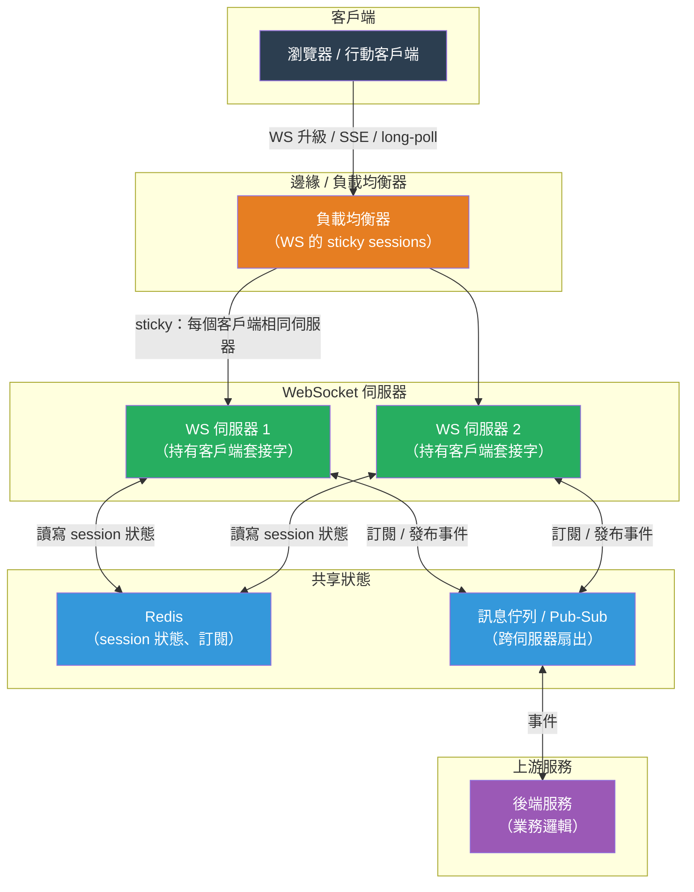

# [BEE-456] Long-Polling、SSE 與 WebSocket 架構

:::info
客戶端與伺服器之間的即時通訊需要在三種持久化模型中做出選擇——long-polling、Server-Sent Events 和 WebSocket——每種都有根本不同的連線生命週期、方向性和擴展特性。這個選擇決定了負載均衡器是否需要 sticky sessions、graceful shutdown 如何運作，以及伺服器能同時保持多少客戶端連線。
:::

## 背景

早期的 Web 應用程式純粹是請求-回應模式：客戶端請求，伺服器回答，連線關閉。傳遞伺服器發起的事件——新的聊天訊息、股票價格更新、建置狀態變更——需要客戶端反覆輪詢。以短間隔輪詢會耗費伺服器資源，並增加等於輪詢週期的延遲；以長間隔輪詢則會錯過事件。

**Comet**（Alex Russell 於 2006 年命名）是在原生 API 出現之前，模擬伺服器推送的瀏覽器技巧的統稱。最常見的技術是 **long-polling**：客戶端發送 HTTP 請求，伺服器保持請求開啟直到事件發生（或逾時），然後回應。客戶端立即發出下一個請求。每次往返都會產生 HTTP 開銷——標頭、TCP 握手（或重用）和 TLS 開銷——但事件傳遞延遲降至 RTT 而不是輪詢間隔。

**Server-Sent Events（SSE）** 標準化了單向伺服器推送模式。客戶端使用 `Accept: text/event-stream` 開啟單一 HTTP 連線；伺服器無限期地串流 `data:` 行。瀏覽器的 `EventSource` API 使用 `Last-Event-ID` 標頭自動處理重新連線——如果連線中斷，瀏覽器重新連線，伺服器從中斷處繼續。在 HTTP/1.1 下，瀏覽器每個來源限制六個連線，這將 SSE 限制為每個標籤頁六個同時串流。HTTP/2 多路復用消除了此限制，允許在一個 TCP 連線上建立數百個 SSE 串流。

**WebSocket**（RFC 6455，2011 年標準化）完全取代了 HTTP 連線模型。HTTP/1.1 的 `Upgrade: websocket` 握手將 TCP 連線轉換為雙向、全雙工通道。握手後，雙方可以獨立發送框架化訊息——無需在回應前等待請求。每條訊息的延遲降至單一 RTT；沒有每條訊息的 HTTP 開銷。代價是 WebSocket 連線是有狀態且長期存在的，這使水平擴展、負載均衡和部署變得複雜。

**gRPC streaming**（在持久連線上的 HTTP/2 串流）是後端到後端即時通訊的主流選擇：二進制 protobuf 編碼、多路復用串流、雙向串流，以及所有主要 RPC 框架的原生支援。對瀏覽器客戶端的適用性較低，因為原生 gRPC-Web 需要代理。

## 設計思維

### 選擇正確的模型

主要問題是方向性和延遲需求：

| 機制 | 方向 | 延遲 | 瀏覽器支援 | 連線模型 |
|---|---|---|---|---|
| 短輪詢 | 客戶端→伺服器（重複） | 最多輪詢間隔 | 通用 | 無狀態 HTTP |
| Long-polling | 伺服器→客戶端（模擬） | ~1 RTT | 通用 | 無狀態 HTTP |
| SSE | 僅伺服器→客戶端 | ~1 RTT | 所有現代瀏覽器 | 持久 HTTP |
| WebSocket | 雙向 | ~1 RTT | 所有現代瀏覽器 | 有狀態升級 |
| gRPC streaming | 雙向 | ~1 RTT | 僅後端（原生） | 有狀態 HTTP/2 |

**使用 SSE 的時機：**
- 通訊是單向的伺服器到客戶端（即時動態、通知、進度條）
- 你需要帶有最後事件重播的自動重新連線
- 簡單性很重要——SSE 在大多數 HTTP 代理中無需配置即可運作
- 你已經在運行 HTTP/2（消除六連線限制）

**使用 WebSocket 的時機：**
- 通訊是低延遲的雙向（聊天、協作編輯、多人遊戲）
- 客戶端頻繁發送訊息（不僅是偶爾的確認）
- 你控制基礎設施並可以為 sticky sessions 配置負載均衡器

**使用 long-polling 的時機：**
- WebSocket 支援不確定（移除 Upgrade 標頭的企業代理）
- 事件頻率低（每隔幾分鐘一個事件）——輪詢開銷可接受
- 你需要使用不支援持久連線的基礎設施

### 擴展有狀態連線

HTTP 是無狀態的：任何伺服器都可以處理任何請求。WebSocket 連線打破了這個不變式——客戶端永久附著到持有其連線的伺服器。這有三個後果：

**負載均衡需要 Session Affinity（粘性會話）。** 標準的輪詢負載均衡將新連線發送到任何後端。如果 WebSocket 重新連線落在不同的伺服器上，連線上下文就會丟失。解決方案是 **sticky sessions**：基於 IP hash 或 cookie 的 affinity 將每個客戶端路由到相同的後端。風險：IP hash 在產生熱伺服器時負載分配不均；基於 cookie 的 affinity 在 NAT 重新平衡時表現更好。

**水平擴展需要從 WebSocket 伺服器程序中外部化連線狀態。** 如果客戶端的訂閱列表、已驗證的使用者身份或進行中的訊息只存在於伺服器的程序記憶體中，當伺服器重啟或流量重新平衡時，該狀態就會丟失。模式是將 session 狀態存儲在共享存儲中（Redis、資料庫），並將每個伺服器視為對連線元數據無狀態的。伺服器擁有 TCP 套接字，但不擁有業務狀態。

**Slack 的架構**在規模上說明了這一點。Slack 的 Channel Servers（2016 年設計，後來的 Flannel 架構）保持數百萬個 WebSocket 連線，但通過共享訊息層路由事件。當訊息到達頻道時，伺服器將其扇出到該頻道中所有已連線的客戶端，從共享狀態而不是程序本地記憶體中查找頻道成員資格。一致性哈希將頻道分配給 Channel Servers，因此大多數訊息是本地的；跨伺服器扇出處理其餘部分。

### 長期連線的 Graceful Shutdown

HTTP 請求通常是次秒級的；graceful shutdown 等待進行中的請求然後退出。WebSocket 連線可能持續數小時。Graceful shutdown 必須處理兩類情況：

1. **空閒連線**：沒有進行中工作的閒置 WebSocket 連線。這些可以立即用 `1001 Going Away` 關閉框架關閉。
2. **活躍連線**：有進行中操作的連線（正在傳遞的訊息、正在應用的協作編輯）。這些需要更長的 drain 窗口。

關閉序列：
1. 將伺服器標記為「draining」——負載均衡器健康檢查返回不健康，因此沒有新連線到達。
2. 向空閒連線發送 `Connection: close` 或 WebSocket 關閉框架。
3. 等待活躍操作完成，受最大 drain 逾時限制（WebSocket 通常為 60–300 秒，遠長於 HTTP API 的 25–35 秒）。
4. 在逾時後強制關閉剩餘連線。

Kubernetes 的 `terminationGracePeriodSeconds` 必須設置為適應 WebSocket drain 窗口，而不僅僅是 HTTP 請求 drain 窗口。同時提供 HTTP API 和 WebSocket 連線的服務需要兩個值中較大的那個。

## 最佳實踐

**必須（MUST）只在真正需要雙向通訊時才使用 WebSocket 而非 SSE。** SSE 實作更簡單、對代理友好，並且原生支援自動重新連線。如果客戶端只接收事件，從不發送訊息（或通過單獨的 REST API 發送訊息），SSE 在不犧牲延遲的情況下降低了複雜性。

**必須（MUST）在使用 WebSocket 時在負載均衡器配置 sticky sessions。** 基於 IP hash 的 affinity 是最簡單的選項；基於 cookie 的 affinity（`AWSALB`、`NginxSticky` 或自訂）在 CGNAT 和 IPv6 轉換中表現更好。應該（SHOULD）在生產部署中優先選擇基於 cookie 的 affinity，客戶端可能共享 IP（行動網路、企業代理）。

**應該（SHOULD）從 WebSocket 伺服器程序中外部化連線狀態。** 將訂閱列表、已驗證的使用者身份和頻道成員資格存儲在共享存儲中（Redis）。伺服器程序擁有 TCP 套接字，但應該是可替換的：如果它死亡，客戶端重新連線並從共享存儲重建狀態。這使滾動部署成為可能而不會丟失會話。

**必須（MUST）實作應用層心跳（ping/pong）。** TCP keep-alive 是不足的：企業防火牆和雲端 NAT 閘道在 30–900 秒後靜默地丟棄閒置的 TCP 連線。WebSocket 協定提供 ping/pong 控制框架（RFC 6455 第 5.5 節）。伺服器應該（SHOULD）每 25–55 秒發送一次 ping；客戶端必須（MUST）用 pong 回應。在可配置的逾時後（兩次未收到 pong）表示連線死亡，應該（SHOULD）觸發伺服器端關閉和清理。

**必須（MUST）在服務 WebSocket 連線時增加 `terminationGracePeriodSeconds`。** 對於 HTTP API，30–40 秒通常足夠。對於 WebSocket 伺服器，grace period 必須涵蓋預期的最大連線生命週期或 drain 窗口，取較大者。對於大多數應用程式，120–300 秒是合適的。preStop hook 應在處理 SIGTERM 之前將伺服器標記為 draining。

**應該（SHOULD）使用 HTTP/2 的 SSE 來消除每個來源六連線限制。** 在 HTTP/1.1 下，單個瀏覽器標籤頁最多可以開啟到同一來源的六個連線；SSE 每個串流消耗一個。在 HTTP/2 下，單個 TCP 連線多路復用所有 SSE 串流，消除了此限制。驗證伺服器和任何中間代理（nginx、Envoy、CDN）都支援 SSE 連線的 HTTP/2。

**應該（SHOULD）為 SSE 串流實作最後事件重播。** 在每個 SSE 事件中包含 `id:` 欄位。當客戶端重新連線時，瀏覽器在請求標頭中發送 `Last-Event-ID`。伺服器應該（SHOULD）使用此 ID 從短暫的事件日誌（Redis 列表、資料庫表）重播錯過的事件。這在重新連線時提供至少一次傳遞，而不需要客戶端側輪詢邏輯。

## 視覺說明



## 範例

**帶有 ping/pong 心跳和 graceful shutdown 的 WebSocket 伺服器（Python asyncio）：**

```python
import asyncio
import signal
import websockets
from websockets.exceptions import ConnectionClosedOK, ConnectionClosedError

PING_INTERVAL = 30   # 伺服器發起 ping 之間的秒數
PING_TIMEOUT  = 10   # 關閉前等待 pong 的秒數

active_connections: set[websockets.WebSocketServerProtocol] = set()
draining = False

async def handle_connection(ws: websockets.WebSocketServerProtocol):
    if draining:
        await ws.close(1001, "伺服器正在 draining")
        return

    active_connections.add(ws)
    try:
        async for message in ws:
            # 將訊息路由到業務邏輯；回應通過同一套接字發送
            response = await process_message(message)
            await ws.send(response)
    except (ConnectionClosedOK, ConnectionClosedError):
        pass
    finally:
        active_connections.discard(ws)

async def drain_and_shutdown(server: websockets.WebSocketServer):
    global draining
    draining = True  # 健康檢查現在返回不健康；LB 停止發送新連線

    # 立即關閉空閒連線
    await asyncio.gather(
        *[ws.close(1001, "伺服器正在關閉") for ws in list(active_connections)],
        return_exceptions=True
    )

    # 等待最多 120 秒讓活躍連線完成
    deadline = asyncio.get_event_loop().time() + 120
    while active_connections and asyncio.get_event_loop().time() < deadline:
        await asyncio.sleep(1)

    server.close()
    await server.wait_closed()

async def main():
    server = await websockets.serve(
        handle_connection,
        "0.0.0.0",
        8765,
        ping_interval=PING_INTERVAL,
        ping_timeout=PING_TIMEOUT,
    )

    loop = asyncio.get_running_loop()
    loop.add_signal_handler(signal.SIGTERM, lambda: asyncio.create_task(drain_and_shutdown(server)))

    await server.wait_closed()
```

**帶有最後事件重播的 SSE 端點（Python/FastAPI）：**

```python
import asyncio
from fastapi import FastAPI, Request
from fastapi.responses import StreamingResponse
import redis.asyncio as redis

app = FastAPI()
r = redis.Redis()

async def event_stream(channel: str, last_event_id: str | None):
    # 如果客戶端帶著 Last-Event-ID 重新連線，從 Redis 列表重播錯過的事件
    if last_event_id:
        missed = await r.lrange(f"events:{channel}", 0, -1)
        for event in missed:
            event_id, data = event.decode().split(":", 1)
            if event_id > last_event_id:          # 只播放最後看到的之後的事件
                yield f"id: {event_id}\ndata: {data}\n\n"

    # 訂閱新事件
    pubsub = r.pubsub()
    await pubsub.subscribe(channel)
    async for message in pubsub.listen():
        if message["type"] == "message":
            event_id = generate_event_id()        # 單調遞增的 ID
            data = message["data"].decode()
            await r.rpush(f"events:{channel}", f"{event_id}:{data}")
            await r.expire(f"events:{channel}", 300)  # 保留 5 分鐘
            yield f"id: {event_id}\ndata: {data}\n\n"

@app.get("/events/{channel}")
async def sse_endpoint(channel: str, request: Request):
    last_event_id = request.headers.get("Last-Event-ID")
    return StreamingResponse(
        event_stream(channel, last_event_id),
        media_type="text/event-stream",
        headers={
            "Cache-Control": "no-cache",
            "X-Accel-Buffering": "no",   # 停用 nginx 對 SSE 的緩衝
        },
    )
```

**用於 WebSocket 代理的 Nginx 配置（帶 sticky sessions）：**

```nginx
upstream websocket_backends {
    ip_hash;                          # sticky sessions：相同客戶端 IP → 相同後端
    server ws-server-1:8765;
    server ws-server-2:8765;
    server ws-server-3:8765;
    keepalive 300;                    # 保持到後端的連線活躍
}

server {
    listen 443 ssl http2;

    location /ws/ {
        proxy_pass http://websocket_backends;
        proxy_http_version 1.1;
        proxy_set_header Upgrade $http_upgrade;
        proxy_set_header Connection "upgrade";
        proxy_set_header Host $host;
        proxy_read_timeout 3600s;     # 1 小時；防止 nginx 關閉空閒的 WS 連線
        proxy_send_timeout 3600s;
    }

    location /events/ {              # SSE 端點
        proxy_pass http://websocket_backends;
        proxy_http_version 1.1;
        proxy_set_header Connection "";    # 保持連線活躍（不需要升級）
        proxy_buffering off;               # 關鍵：停用串流的緩衝
        proxy_read_timeout 3600s;
    }
}
```

## 相關 BEE

- [BEE-453](453.md) -- Graceful Shutdown 與連線 Draining：WebSocket 連線需要比 HTTP 請求更長的 drain 窗口；BEE-453 中的關閉排序直接適用，但需要更高的 `terminationGracePeriodSeconds`
- [BEE-243](../Concurrency/243.md) -- 非同步 I/O 與事件迴圈：WebSocket 伺服器是 I/O 密集型，受益於非同步事件迴圈；只有使用非阻塞 I/O 才能保持數千個空閒連線
- [BEE-244](../Concurrency/244.md) -- 生產者-消費者與 Worker Pool 模式：從 pub/sub broker 到 WebSocket 連線的訊息扇出是一個生產者-消費者問題
- [BEE-455](455.md) -- API Gateway 模式：WebSocket 連線通常通過 API Gateway，Gateway 必須配置為傳遞升級握手並支援長期連線
- [BEE-266](../Resilience and Reliability/266.md) -- 速率限制與節流：速率限制 WebSocket 連線需要每連線或每使用者的訊息速率限制，而不僅僅是基於 IP 的每請求限制

## 參考資料

- [RFC 6455 -- The WebSocket Protocol (IETF)](https://datatracker.ietf.org/doc/html/rfc6455)
- [Server-Sent Events -- WHATWG HTML Living Standard](https://html.spec.whatwg.org/multipage/server-sent-events.html)
- [Using Server-Sent Events -- MDN Web Docs](https://developer.mozilla.org/en-US/docs/Web/API/Server-sent_events/Using_server-sent_events)
- [Real-Time Messaging at Slack -- Slack Engineering](https://slack.engineering/real-time-messaging/)
- [The Challenge of Scaling WebSockets -- Ably](https://ably.com/topic/the-challenge-of-scaling-websockets)
- [gRPC Core Concepts -- gRPC Documentation](https://grpc.io/docs/what-is-grpc/core-concepts/)
