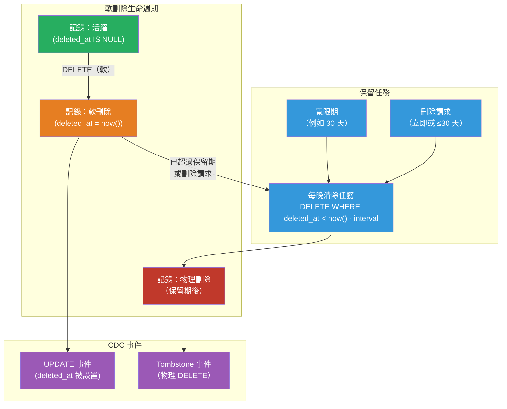

# [BEE-460] 軟刪除與資料保留

:::info
軟刪除使用時間戳記標誌將記錄標記為已刪除，而不是從資料庫中移除它們，保留了審計追蹤並實現了還原——但這個模式在查詢複雜性、索引膨脹、唯一約束破壞和 GDPR 合規性方面存在隱藏成本，必須明確管理。
:::

## 背景

刪除資料庫記錄最簡單的方式是 `DELETE FROM table WHERE id = ?`。記錄消失了，儲存空間被回收，`ON DELETE CASCADE` 或 `ON DELETE RESTRICT` 的參照完整性約束按預期觸發。對許多系統來說，這是正確的做法。

替代方案——**軟刪除**——添加一個 `deleted_at` timestamptz 欄位（或一個布林值 `is_deleted` 標誌，雖然時間戳記更有用）。刪除操作變為 `UPDATE table SET deleted_at = now() WHERE id = ?`。記錄仍然留在資料表中；應用程式查詢添加 `WHERE deleted_at IS NULL` 來排除它。從使用者的角度，記錄消失了。從資料庫的角度，什麼都沒有被移除。

隨著系統增長需要審計追蹤（什麼發生了變化、何時、由誰）、還原功能（不小心刪除了記錄——可以恢復嗎？）和跨服務的軟參照（對不再物理存在的記錄的外鍵），這個模式變得流行。Rails 的 `acts_as_paranoid` 函式庫（及其後繼者 Paranoia gem）在 2000 年代末期在 Ruby 生態系統中標準化了這種方法。Django 有 `django-safedelete`；Hibernate 有 `@Where` 和 `@SQLDelete` 注釋。

這個模式並非沒有批評者。Brandur Leach 廣泛閱讀的 2021 年文章「Soft Deletion Probably Isn't Worth It」（brandur.org）認為，複雜性成本——污染的索引、遺漏的過濾子句導致資料洩露、GDPR 衝突、儲存增長——對大多數應用程式來說通常超過了好處。他的建議：使用明確的審計日誌資料表記錄歷史，並物理刪除主記錄。這個立場是合理的，值得在預設使用軟刪除之前內化。

## 設計思維

### 軟刪除是正確工具的時機

以下情況軟刪除是合理的：
- **還原是產品需求**：使用者可以在寬限期內還原已刪除的文件、訊息或記錄。
- **必須跨時間保持參照完整性**：發票明細項目引用一個產品；如果產品被刪除，發票仍然應該可讀。
- **刪除是一個狀態轉換，而不是真正的移除**：「已歸檔」的文件、「已取消」的訂閱和「已暫停」的帳戶並不是真正被刪除——它們已轉移到終端狀態。一個 `status` 枚舉（以 `deleted` 作為值）或 `deleted_at` 可以清晰地捕獲這一點。

以下情況軟刪除是錯誤的工具：
- **GDPR/CCPA 刪除權適用**且資料表包含個人資料。軟刪除的個人資料仍然是個人資料；必須在法定期限內物理清除。
- **記錄沒有歷史價值**：臨時令牌、session 記錄、短暫事件。物理刪除更簡單。
- **資料表是寫入密集型且很大**：軟刪除積累了使索引膨脹的死記錄，需要明確的 VACUUM 注意。

### 審計日誌替代方案

對於主要動機是歷史記錄的使用案例，考慮使用明確的審計日誌資料表而不是軟刪除：

```sql
-- 主資料表：記錄消失時物理刪除
-- 審計資料表：只追加，捕獲每個狀態轉換
CREATE TABLE orders_audit (
    id          BIGSERIAL PRIMARY KEY,
    order_id    BIGINT NOT NULL,          -- 不是 FK：訂單可能已不存在
    action      TEXT NOT NULL,            -- 'created' | 'updated' | 'deleted'
    actor_id    BIGINT,
    occurred_at TIMESTAMPTZ NOT NULL DEFAULT now(),
    snapshot    JSONB NOT NULL            -- 變更時的完整行快照
);
```

這清晰地分離了關注點：主資料表小且快速；審計日誌是只追加的，可以存儲在冷存儲或單獨的資料庫中。

## 最佳實踐

**必須（MUST）對每個過濾活躍記錄的查詢在 `deleted_at IS NULL` 上添加部分索引。** 沒有部分索引，帶有 `WHERE deleted_at IS NULL` 的查詢會掃描包括軟刪除的所有行。在 90% 的行都是軟刪除的資料表上，這使全資料表掃描成為有效的查詢計畫。部分索引完全排除了刪除的行：

```sql
-- 只索引 deleted_at IS NULL 的行（活躍記錄）
CREATE INDEX idx_users_email_active ON users (email) WHERE deleted_at IS NULL;
CREATE INDEX idx_orders_user_active ON orders (user_id, created_at DESC) WHERE deleted_at IS NULL;
```

**必須（MUST）在使用軟刪除時明確處理唯一約束。** `email` 上的唯一索引防止用戶在軟刪除帳戶後重新註冊——舊行仍然存在並違反了約束。三種解決方案：

1. **部分唯一索引**（PostgreSQL 首選）：
```sql
CREATE UNIQUE INDEX idx_users_email_unique ON users (email) WHERE deleted_at IS NULL;
```
這允許多個具有相同 email 的軟刪除行，只在活躍行中強制唯一性。

2. **軟刪除時清空唯一欄位**：設置 `email = NULL`（或將其移到單獨的 `deleted_email` 欄位）。原始值消失了；重新註冊成為可能。

3. **包含 `deleted_at` 的複合唯一索引**：`UNIQUE (email, deleted_at)` 無法完全解決問題，因為在 SQL 中 `NULL != NULL`——在大多數資料庫中，帶有 `deleted_at = NULL` 的兩行都被允許，因為資料庫將每個 NULL 視為不同的。

**必須（MUST）為包含個人資料的資料表實現物理清除程序。** 根據 GDPR 第 17 條和 CCPA，軟刪除的個人資料仍然是個人資料。後台任務必須（MUST）按計劃（通常每晚）物理刪除以下行：
- `deleted_at` 早於保留期的行（例如 30 天）
- 或被刪除請求特別標記的行（無寬限期）

對於刪除請求，在 GDPR 下物理刪除或匿名化必須在 30 天內完成。

**應該（SHOULD）使用 `deleted_at` 時間戳記而非布林值 `is_deleted` 標誌。** 時間戳記攜帶了布林值無法攜帶的三條資訊：記錄被刪除了、何時被刪除，以及（通過相關的 `deleted_by` 欄位）誰刪除了它。時間戳記還允許基於時間的保留查詢。唯一的成本是每行 8 字節。

**必須（MUST）在每個查詢位置過濾軟刪除的記錄，而不僅僅在 ORM 預設作用域中。** 常見的故障模式是依賴 ORM 全局作用域（Rails 中的 `default_scope { where(deleted_at: nil) }`），但編寫繞過作用域的原始 SQL 或直接資料庫客戶端查詢。這會將軟刪除的記錄洩露到 API 回應或管理員儀表板中。更好的做法是在每個查詢位置明確進行軟刪除過濾，或使用預先應用過濾器的資料庫視圖：

```sql
-- 視圖僅呈現活躍記錄；針對此視圖的原始查詢是安全的
CREATE VIEW active_users AS
  SELECT * FROM users WHERE deleted_at IS NULL;
```

**應該（SHOULD）在物理清除軟刪除的記錄時發出硬刪除事件（tombstone）**，如果其他系統通過 CDC 訂閱變更事件。Debezium 和類似的 CDC 工具在物理刪除行時發出 tombstone 事件（一個具有 `null` 值和已刪除行的鍵的訊息）。下游 Kafka 消費者必須處理此 tombstone 以從其物化視圖中移除記錄。軟刪除後跟延遲物理清除會產生兩個事件：設置 `deleted_at` 的 `UPDATE`，然後是清除時的 tombstone。

**應該（SHOULD）對具有高軟刪除流量的資料表更積極地執行 `VACUUM`。** 物理刪除和軟刪除更新都會產生死元組。在許多行被軟刪除然後清除的資料表上，autovacuum 的預設閾值（20% + 50 行）可能導致膨脹在 vacuum 觸發之前增長。調整每個資料表的 autovacuum 設置：

```sql
ALTER TABLE orders SET (
    autovacuum_vacuum_scale_factor = 0.01,   -- 當 1% 的行為死行時進行 vacuum（vs 預設的 20%）
    autovacuum_vacuum_threshold = 100
);
```

## 視覺說明



## 範例

**帶有部分索引和部分唯一約束的 Schema：**

```sql
CREATE TABLE users (
    id          BIGSERIAL PRIMARY KEY,
    email       TEXT NOT NULL,
    name        TEXT NOT NULL,
    deleted_at  TIMESTAMPTZ,
    deleted_by  BIGINT REFERENCES users(id),
    created_at  TIMESTAMPTZ NOT NULL DEFAULT now()
);

-- 僅在活躍用戶中唯一 email；允許軟刪除後重新註冊
CREATE UNIQUE INDEX idx_users_email_active
    ON users (email)
    WHERE deleted_at IS NULL;

-- 按創建日期列出活躍用戶的索引（排除已刪除的行）
CREATE INDEX idx_users_created_active
    ON users (created_at DESC)
    WHERE deleted_at IS NULL;
```

**軟刪除和還原操作：**

```python
from datetime import datetime, timezone
import psycopg2

def soft_delete_user(conn, user_id: int, deleted_by: int):
    """將用戶標記為已刪除；不移除行。"""
    with conn.cursor() as cur:
        cur.execute(
            "UPDATE users SET deleted_at = now(), deleted_by = %s WHERE id = %s AND deleted_at IS NULL",
            (deleted_by, user_id)
        )
        if cur.rowcount == 0:
            raise ValueError(f"用戶 {user_id} 未找到或已刪除")
    conn.commit()


def restore_user(conn, user_id: int):
    """在寬限期內撤銷軟刪除。"""
    with conn.cursor() as cur:
        cur.execute(
            "UPDATE users SET deleted_at = NULL, deleted_by = NULL WHERE id = %s AND deleted_at IS NOT NULL",
            (user_id,)
        )
        if cur.rowcount == 0:
            raise ValueError(f"用戶 {user_id} 未找到或未被刪除")
    conn.commit()


def purge_expired_users(conn, retention_days: int = 30):
    """
    物理刪除軟刪除時間超過 retention_days 的用戶。
    作為每晚任務運行。為每個刪除的行產生 tombstone CDC 事件。
    """
    with conn.cursor() as cur:
        cur.execute(
            """DELETE FROM users
               WHERE deleted_at IS NOT NULL
                 AND deleted_at < now() - (%s || ' days')::INTERVAL
               RETURNING id""",
            (retention_days,)
        )
        purged_ids = [row[0] for row in cur.fetchall()]
    conn.commit()
    return purged_ids


def erasure_request(conn, user_id: int):
    """
    GDPR 刪除權：立即匿名化或物理刪除。
    匿名化保留了彙總統計；物理刪除移除了所有痕跡。
    """
    with conn.cursor() as cur:
        # 選項 A：匿名化（保留行以保持參照完整性，清除個人識別資訊）
        cur.execute(
            """UPDATE users
               SET email = 'anonymized-' || id || '@deleted.invalid',
                   name  = 'Deleted User',
                   deleted_at = COALESCE(deleted_at, now())
               WHERE id = %s""",
            (user_id,)
        )
        # 選項 B：物理刪除（如果參照完整性允許，取消注釋）
        # cur.execute("DELETE FROM users WHERE id = %s", (user_id,))
    conn.commit()
```

## 相關 BEE

- [BEE-144](../Data Modeling and Schema Design/144.md) -- 時序與審計資料設計：軟刪除的審計日誌替代方案使用具有相同設計原則的只追加事件資料表
- [BEE-437](437.md) -- 變更資料擷取：軟刪除在 CDC 管道中產生 UPDATE 事件；物理清除產生 tombstone 事件；下游消費者必須處理兩者
- [BEE-457](457.md) -- 分散式任務排程：每晚清除任務和刪除請求履行任務是需要冪等性和死信處理的計劃後台任務的典型例子
- [BEE-126](../Data Storage and Database Fundamentals/126.md) -- 資料庫遷移：向現有資料表添加 `deleted_at` 欄位是一個零停機相容的遷移（可空欄位，無預設值——在所有主要資料庫中都是安全的）
- [BEE-458](458.md) -- 零停機 Schema 遷移：在大型生產資料表上將硬刪除資料表轉換為軟刪除時，展開-收縮模式適用

## 參考資料

- [Soft Deletion Probably Isn't Worth It -- Brandur Leach (2021)](https://brandur.org/soft-deletion)
- [Partial Indexes -- PostgreSQL Documentation](https://www.postgresql.org/docs/current/indexes-partial.html)
- [Article 17: Right to Erasure -- GDPR (EU) 2016/679](https://gdpr-info.eu/art-17-gdpr/)
- [Paranoia: Rails Soft Delete -- GitHub (rubysherpas)](https://github.com/rubysherpas/paranoia)
- [Tombstone Events -- Debezium Documentation](https://debezium.io/documentation/reference/stable/transformations/event-changes.html)
- [django-safedelete -- Read the Docs](https://django-safedelete.readthedocs.io/)
